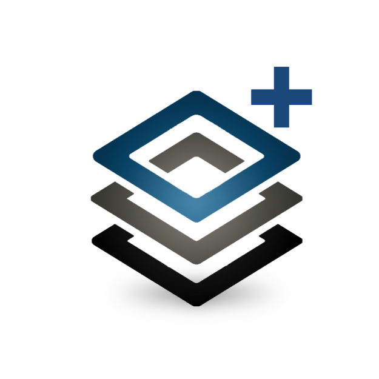

# HyP3: ASF's On Demand Processing Platform

The Alaska Satellite Facility's Hybrid Pluggable Processing Pipeline, or HyP3 (pronounced *"hype"*), is a cloud-native 
processing platform developed to efficiently process Synthetic Aperture Radar (SAR) imagery. 

Through HyP3, ASF offers a family of cloud-native, scalable product generation services that 
make its data holdings more accessible. HyP3 primarily runs compute-heavy workflows, which take tens of minutes to 
hours of compute time, to create products that are easier to use, GIS-ready, and customized to a user’s needs.

## How it Works

HyP3 was designed to address many common issues for users of SAR data:

* Most SAR datasets require at least some processing to remove distortions before they are analysis-ready
* SAR processing is computing-intensive
* Software for SAR processing is complicated to use and/or prohibitively expensive
* Producing analysis-ready SAR data has a steep learning curve that acts as a barrier to entry

HyP3 solves these problems by providing an interface where users can request SAR processing on demand. These
processing requests are picked up by automated systems, which handle the complexity of SAR processing on behalf of the
user. Refer to our [Architecture](how_it_works.md "Jump to Architecture Documentation") page to learn more about the 
structure of the HyP3 platform.

HyP3 doesn't require users to have a lot of knowledge of SAR processing before getting started; they only need to
submit the input data and set a few optional parameters if desired. With HyP3, analysis-ready products are just a few
clicks away.

## The HyP3 Service Family
<!-- FIXME: Change the URL to the HyP3+ logo to the main branch once content is available -->

!!! tip "HyP3+ is now available!"
 
    { width="100";  style="float: left;" }

    For users who need more processing than the 10,000 credit limit allows, ASF now hosts 
    [HyP3+](about/hyp3_plus.md "Jump to the HyP3+ Landing Page"), a user-supported 
    version of HyP3 that allows you to purchase as many credits as you need. 

    [Get to know HyP3+!](news/hyp3_plus_introduction.md "Jump to the HyP3+ Introduction")

Explore HyP3 at no cost using [HyP3 Basic](about/hyp3_basic.md "Jump to HyP3 Basic Documentation"), 
our NASA-supported On Demand processing service, or purchase credits 
for use with [HyP3+](about/hyp3_plus.md "Jump to HyP3+ Documentation"), 
our user-supported service that lets you take your application global. Need help scaling your own, in-house workflows? 
[Contact us](contact.md)!

<table class="tg">
  <thead>
    <tr>
      <th class="tg-fymr">
          <a href="/about/hyp3_basic/" title="HyP3 Basic"><b>HyP3 Basic</b></a> <em>Supported by NASA Earthdata</em>
      </th>
      <th class="tg-fymr">
          <a href="/about/hyp3_plus/" title="HyP3+"><b>HyP3+</b></a> <em>User-supported Deployment</em>
      </th>
    </tr>
  </thead>
  <tbody>
    <tr>
      <td class="tg-0pky">
        <a href="https://hyp3-api.asf.alaska.edu" title="HyP3 API" target="_blank">hyp3-api.asf.alaska.edu</a>  Products expire after 14 days  Round-robin processing queue   Products distributed via CloudFront
      </td>
      <td class="tg-0pky">
        <a href="https://hyp3-plus.asf.alaska.edu" title="HyP3 Plus API" target="_blank">hyp3-plus.asf.alaska.edu</a>  Products expire after 30 days  Smaller user-queue with higher throughput. Get your products faster!  Products provided in a public AWS S3 Bucket 
      </td>
    </tr>
    <tr>
      <td class="tg-0pky">10,000 <a href="/using/credits" title="Jump to Credits Documentation">Credits</a> per month free*</td>
      <td class="tg-0pky">1 Credit = $0.05</td>
    </tr>
  </tbody>
</table>

*More available by request, as our budget allows. Send requests to ASF User Services: 
[uso@asf.alaska.edu](mailto:uso@asf.alaska.edu)

## Getting started



## What's New

Follow [@ASFHyP3](https://twitter.com/ASFHyP3 "https://twitter.com/ASFHyP3" ){target=_blank} on Twitter, or check our
[What's New](whats_new.md "HyP3 What's New" ){target=_blank} page to keep up to date on all things HyP3!

## Contact Us


