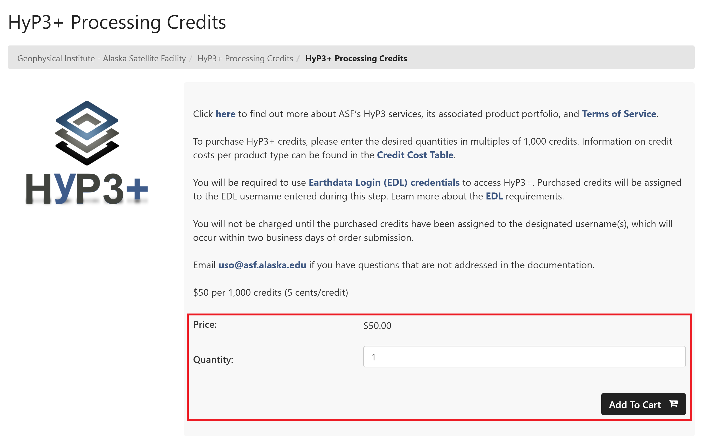
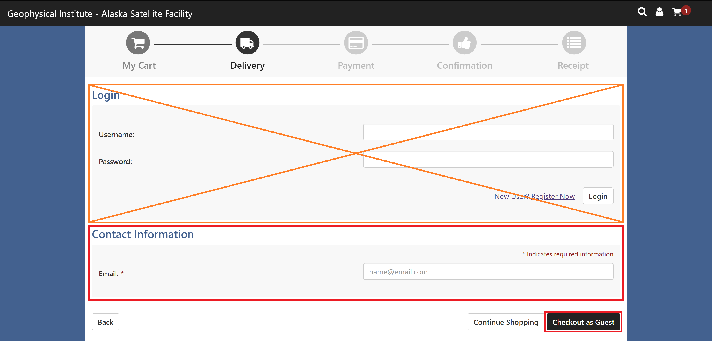

# HyP3+

For users who need to process more
[On Demand products](../products.md "Jump to the Products landing page of the documentation") than their
[HyP3 Basic credit limit](../using/credits.md "Jump to the Credits page of the documentation")
allows, ASF provides HyP3+, a separate
[HyP3 deployment](../about.md) where users can purchase additional credits.

HyP3+ offers the same
[On Demand products](../products.md "Jump to the Products landing page of the documentation")
as [HyP3 Basic](hyp3_basic.md "Jump to HyP3 Basic Documentation"), 
and users access their purchased credits by logging in with the same 
[Earthdata Login Credentials](../using/authentication.md#earthdata-login-edl)
used for ordering free On Demand products from HyP3 Basic.

## HyP3+ API Endpoint

HyP3+ has a different API Endpoint than the standard HyP3 Basic deployment: 
<https://hyp3-plus.asf.alaska.edu>

Users can interact with HyP3+ using the same methods as HyP3 Basic, but will need to change the API URL. 
See the [Using HyP3](../using.md) section for more information on how to request On Demand products with HyP3+ using 
[Vertex](../using/vertex.md#1-select-your-hyp3-api-optional "Jump to Using Vertex Documentation"), the 
[HyP3 Python SDK](https://hyp3-docs.asf.alaska.edu/using/sdk/#connect-to-the-hyp3-api "Jump to Using SDK Documentation"), 
or by using the [HyP3 API](../using/api.md "Jump to Using API Documentation") directly.

## Purchasing Credits

Credits can be purchased at
[ASF's Web Store](https://epay.alaska.edu/C21563_ustores/web/store_cat.jsp?STOREID=141&CATID=410&SINGLESTORE=true "https://epay.alaska.edu" ){target=_blank}.
Credit purchases will be processed within two business days, and purchased credits expire 1 year from last date of purchase.

- Credits are sold in multiples of 1000. 
- An individual credit costs $0.05, so each 1000-credit bundle costs $50.

<!-- FIXME: Check on walkthrough -->
{target=_blank}
{target=_blank}

1. Enter the desired quantity of 1000-credit bundles, and click the **Add to Cart** icon. 
   
   Refer to the
   [credit cost table](../using/credits.md#credit-cost-table)
   to calculate the number of credits you will need to process the products you require.

2. Enter your
   [Earthdata Login (EDL)](../using/authentication.md#earthdata-login-edl) username. 
   **It is very important to enter your username correctly**, as the credits you purchase will be associated with 
   this username. Type `yes` in the **terms of service field** to indicate that you accept the HyP3+ 
   [Terms of Service](hyp3_plus_terms.md "Jump to HyP3+ Terms of Service page"), then click **Continue**.
   

    - You can purchase credits for multiple EDL usernames in one order. To add additional credits linked to a
      different username, click the **Continue Shopping** button after adding the first credit amount to your cart,
      then add another amount of credits to your cart. You will again be prompted for an EDL username, and you can
      enter a different username.
   
    

3. When you are ready to check out, click the **Checkout** button. You do not need to Login on the Checkout page.
   Simply enter your email in the *Contact Information* section, and click the **Checkout as Guest** button.
   

    - **It is very important to enter an email address at which you can be reached**, as this will be used to send the
      confirmation emails indicating when the order was received and processed, and if there are any issues that
      need to be resolved.

4. Enter your payment information, and click the **Continue** button.

5. Review your order details, and click the **Submit Order** button if everything is correct.

6. An order summary will be displayed, which you can print if desired. It will also be sent to the email you
   entered during checkout.

### Order Confirmation

An email is sent to you when your order is successfully submitted. It includes the details about your purchase,
including the EDL username(s) to which the credits will be assigned. If you notice any errors, send an email to
uso@asf.alaska.edu describing the issue.

### Order Completion

Once we receive your order, we will add the number of purchased credits to the specified username(s). ***This process
will be completed within two business days of the order confirmation.*** You will receive an email confirming that the
credits have been assigned to your username, at which point they are available for use.

Credits expire 1 year from last date of purchase. We do not currently offer a service for automatic credit replenishment, so you will need to
place additional orders as necessary when your credit balance is depleted.

### Refunds

If you purchase credits in error or need to assign purchased credits to a different username, email
ASF User Services, [uso@asf.alaska.edu](mailto:uso@asf.alaska.edu "uso@asf.alaska.edu"), and we will work with 
you to understand and resolve the issue. Any refunds granted will be credited to the original method of payment.

## Contact Us

If you have any questions or concerns about using HyP3+, or have any suggestions about how
we might improve this service, email ASF User Services: [uso@asf.alaska.edu](mailto:uso@asf.alaska.edu "uso@asf.alaska.edu").
