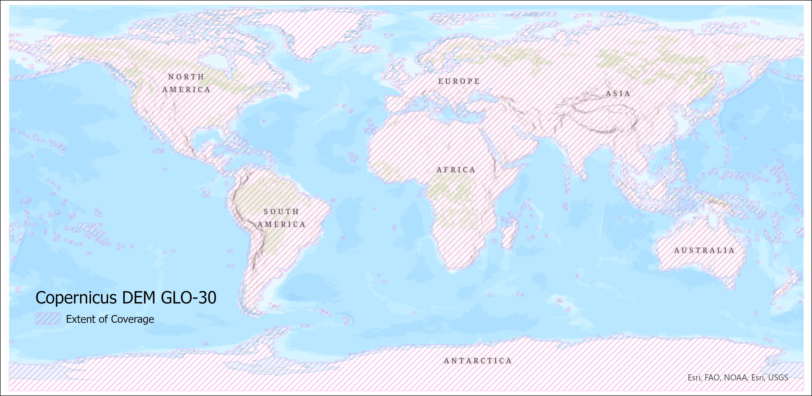
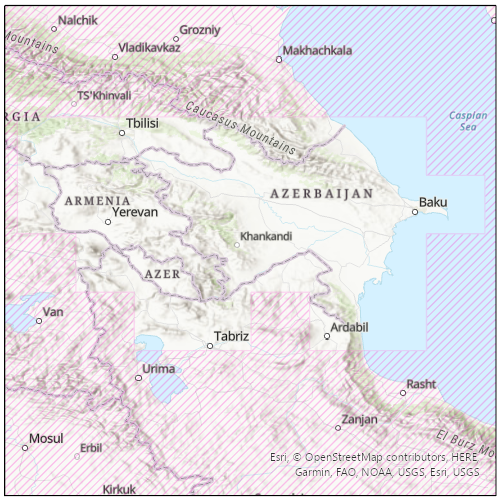
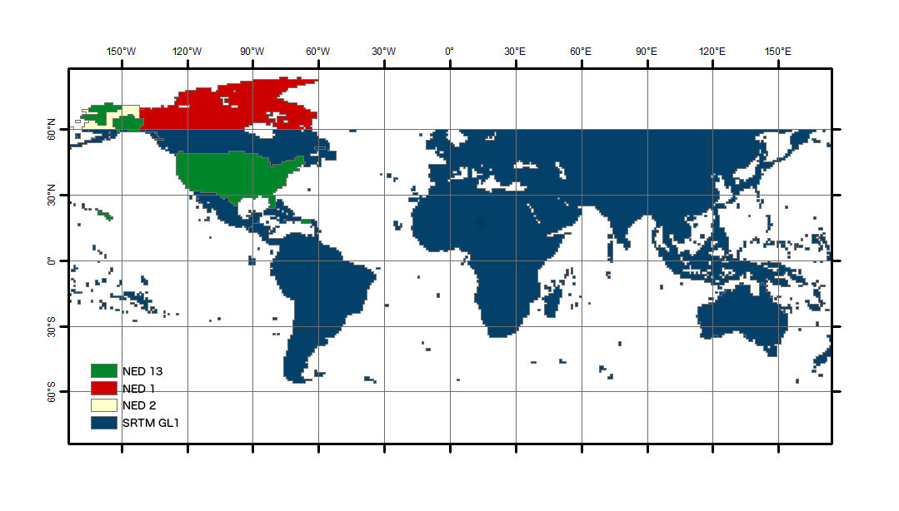

## Digital Elevation Models

The quality of the terrain corrections are directly related to the quality of the digital elevation models (DEMs) used in the process of geometrically and radiometrically correcting the SAR imagery. We use DEMs that are publicly available and have wide-ranging coverage. 

In the past, ASF maintained a collection of DEMs that were pre-processed as appropriate for SAR workflows, and applied a preference hierarchy so that the best available DEM in any given area would be automatically selected for processing. With the public release of the GLO-30 Copernicus DEM, we are changing our default DEM strategy to leverage a cloud-hosted copy of the global Copernicus DEM. 

Table 1 summarizes ASF's DEM sources. Note that in each case, the DEM is resampled to RTC spacing and reprojected to a UTM Zone (WGS84), and a geoid correction is applied before being used for RTC processing.

| Resolution | DEM | Vertical Datum | Area | Posting | Priority |
|------------|-------|--------|------|---------|----------|
| Medium | GLO-30 | EGM2008 | Global | 1 arc second | Default |
| High | NED13 | NAVD88 | CONUS, Hawaii, parts of Alaska | 1/3 arc seconds | 1 |
| Medium | SRTMGL1 | EGM96 | 60 N to 57 S latitude | 1 arc second | 2 |
| Medium | NED1 | NAVD88 | Canada | 1 arc second | 3 |
| Low | NED2 | NAVD88 | Parts of Alaska | 2 arc seconds | 4 |

*Table 1: DEMs used for RTC processing. Note that the Copernicus 30 m DEM is the default, while the other four DEMs are only used if the legacy option is invoked.*

When ordering On-Demand RTC products, you can choose to include a copy of the DEM used for RTC processing in the RTC product package. This DEM copy is converted to 16-bit signed integer format, but is otherwise the same as the DEM used in the RTC process. Note that the height values will differ from the original source DEM in all cases, due to the geoid correction applied to prepare the DEM for use in RTC processing.

### Copernicus DEM : Coming Soon

The [GLO-30 Copernicus DEM](https://spacedata.copernicus.eu/fr/dataset-details?articleId=394198) provides global coverage (with the current exception of an area covering Armenia and Azerbaijan, see Figure 3) at 30-m pixel spacing. When an RTC job is requested, we download the required DEM tiles from the Copernicus Digital Elevation Model (DEM) GLO-30 Public dataset available in the [Registry of Open Data on AWS](https://registry.opendata.aws/copernicus-dem/), managed by [Sinergise](https://www.sinergise.com/). We mosaic the tiles and reproject them to the appropriate UTM Zone for the location of the SAR granule to be processed, resampling them to match the pixel spacing and alignment of the RTC product. A geoid correction is applied before it is used for RTC processing.

Figure 1 shows the coverage of the Copernicus DEM GLO-30 Public dataset, and figure 2 details the land area currently not covered.

*Figure 1: Copernicus DEM GLO-30 coverage map*

*Figure 2: Detail of area currently not covered by Copernicus DEM GLO-30*

### Legacy DEMs

The legacy DEMs were pre-processed by ASF to a consistent raster format (GeoTIFF) from the original source formats: height (\*.hgt), ESRI ArcGrid (\*.adf), etc. Many of the NASA-provided DEMs were provided as orthometric heights with EGM96 vertical datum. These were converted by ASF to ellipsoid heights using the ASF [MapReady](https://asf.alaska.edu/how-to/data-tools/data-tools/#mapready) tool named *geoid_adjust*. The pixel reference varied from the center (pixel as point) to a corner (pixel as area). The GAMMA software, used to generate the terrain corrected products, uses pixel as area and adjusts DEM coordinates as needed. 

These processed DEM collections are stored by ASF in AWS. When an RTC job is requested, the best-available DEM covering the SAR granule is selected, and the necessary tiles are reprojected to a mosaic in the UTM Zone appropriate for the granule location.

If legacy DEM processing is selected, one of the following DEMs will be used:

1. The [National Elevation Dataset (NED)](https://pubs.er.usgs.gov/publication/70201572) ⅓ arc second (about 10 m resolution) DEM covers the continental U.S. (CONUS), Hawaii, and parts of Alaska.
2. [Shuttle Radar Topography Mission (SRTM)](https://www.usgs.gov/centers/eros/science/usgs-eros-archive-digital-elevation-shuttle-radar-topography-mission-srtm-1-arc?qt-science_center_objects=0#qt-science_center_objects) GL1 data at 30 m resolution is used where NED 13 is not available.  
3. 1 arc second NED gives coverage of Canada at about 30 m resolution. 
4. 2 arc second NED (about 60 m) covers the remaining parts of Alaska above 60 degrees northern latitude.

Since  more than one DEM may be available in legacy processing, DEMs are selected in priority order as listed in Table 1.  DEM coverage of at least 20% from a single DEM source is required for legacy processing to proceed.  In no case will the DEM selected be from more than one source; only the single best source of terrain height values is used for a given scene.  

Figure 3 shows the coverage of the various legacy DEM sources. 

*Figure 3: Coverage of the various legacy DEM sources used for terrain correction*

## Special Use DEMs

[AutoRIFT](products.md#autorift-sdk-api-only), a process developed by the [NASA MEaSUREs ITS_LIVE](https://its-live.jpl.nasa.gov/){target=_blank}
project, processes use a custom Greenland and Antarctica DEM with a 240 m resolution. The DEM,
associated process input files, and their details are available on the ITS_LIVE project website. 
