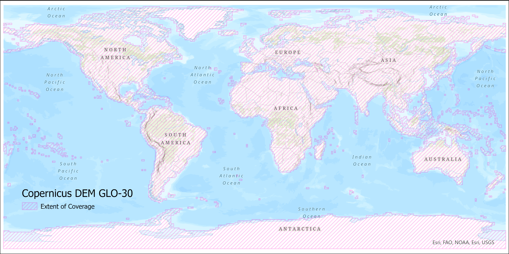

# Digital Elevation Models
Digital Elevation Models are required when processing SAR data to higher-level products, such as the [Radiometric Terrain Correction (RTC)](products.md#rtc "RTC Products" ){target=_blank} and [Interferometric SAR (InSAR)](products.md#insar "InSAR Products" ){target=_blank} products available [On Demand](https://search.asf.alaska.edu/#/?topic=onDemand "Vertex On Demand Documentation" ){target=_blank} from ASF. 

ASF uses DEMs that are publicly available and have wide-ranging coverage. In the past, ASF maintained a collection of DEMs that were pre-processed as appropriate for SAR workflows, and applied a preference hierarchy so that the best available DEM in any given area would be automatically selected for processing. 

With the public release of the [GLO-30 Copernicus DEM](https://spacedata.copernicus.eu/collections/copernicus-digital-elevation-model "Copernicus DEM" ){target=_blank}, we have changed our default DEM strategy to leverage a [cloud-hosted copy](https://registry.opendata.aws/copernicus-dem/ "https://registry.opendata.aws/copernicus-dem" ){target=_blank} of the global Copernicus DEM. This is now the default DEM for processing RTC products, and the only option available for processing InSAR products.

Users still have the option to use the legacy DEMs when processing RTC jobs [On Demand in Vertex](https://search.asf.alaska.edu/#/?topic=onDemand "Vertex On Demand Documentation" ){target=_blank} and when using the [API](https://hyp3-docs.asf.alaska.edu/using/api/ "https://hyp3-docs.asf.alaska.edu/using/api" ){target=_blank} or [SDK](https://hyp3-docs.asf.alaska.edu/using/sdk/ "https://hyp3-docs.asf.alaska.edu/using/sdk" ){target=_blank}, but we recommend using the Copernicus DEM whenever possible.

!!! important "Deprecation of Legacy DEMs for RTC Processing"

    We are considering eliminating the option to use our legacy DEM dataset (NED/SRTM) as a HyP3 processing option for RTC. We would value your feedback as we decide if we will make this change. How would you be impacted if the NED/SRTM DEM option was no longer available? Would it affect your current workflows? 

    Please send your feedback to [uso@asf.alaska.edu](mailto:uso@asf.alaska.edu).

We use the 2022 Release of the [Copernicus GLO-30 Public DEM](https://spacedata.copernicus.eu/collections/copernicus-digital-elevation-model "Copernicus DEM" ){target=_blank}, [available on AWS](https://registry.opendata.aws/copernicus-dem/ "Registry of Open Data on AWS - Copernicus DEM" ){target=_blank}. For more information, see the 'Releases' section of [this article](https://spacedata.copernicus.eu/collections/copernicus-digital-elevation-model "Copernicus DEM" ){target=_blank}.

!!! important "Coverage gaps in Copernicus DEM GLO-30 filled using GLO-90" 

    The Copernicus DEM GLO-30 dataset does not provide coverage over Armenia and Azerbaijan. In the past, we have not supported On Demand product generation over those areas, due to the lack of DEM coverage. We now use the Copernicus DEM GLO-90 to fill those gaps. 

    The GLO-90 dataset has a pixel spacing of 90 meters, which is not as detailed as the 30-m pixel spacing in the GLO-30 DEM, but it does allow us to provide On Demand products in these regions, where they were previously unavailable. 

Table 1 summarizes ASF's DEM sources. Note that in all cases the DEM is reprojected to the UTM Zone (WGS84) appropriate for the granule location, and a geoid correction is applied before being used for processing. For RTC processing, the DEM is resampled to the pixel spacing of the output product. The Copernicus DEM is the only option available for InSAR processing, and the DEM is resampled to twice the pixel spacing of the output InSAR product (160 m for 20x4 looks, 80 m for 10x2 looks).

| Resolution | DEM     | Vertical Datum | Area                           | Posting         | Priority |
|------------|---------|----------------|--------------------------------|-----------------|----------|
| Medium     | GLO-30  | EGM2008        | Global                         | 1 arc second    | Default  |
| High       | NED13   | NAVD88         | CONUS, Hawaii, parts of Alaska | 1/3 arc seconds | 1        |
| Medium     | SRTMGL1 | EGM96          | 60 N to 57 S latitude          | 1 arc second    | 2        |
| Medium     | NED1    | NAVD88         | Canada                         | 1 arc second    | 3        |
| Low        | NED2    | NAVD88         | Parts of Alaska                | 2 arc seconds   | 4        |

*Table 1: DEMs used for On Demand processing. For RTC products, the Copernicus 30 m DEM is the default, while the other four DEMs are only used if the legacy option is invoked. The Copernicus DEM is the only option available when processing InSAR products.*

When ordering On-Demand products, you can choose to include a copy of the DEM used for processing in the output product package. For RTC products, this DEM copy is converted to 16-bit signed integer format, but is otherwise the same as the DEM used in the RTC process. For InSAR products, the DEM copy is output in 32-bit float format, and is upsampled from the DEM resolution used for processing to match the pixel spacing of the output InSAR products.

Note that the height values will differ from the original source DEM in all cases, due to the geoid correction applied to prepare the DEM for use in SAR processing.

## Copernicus DEM

The [GLO-30 Copernicus DEM](https://spacedata.copernicus.eu/collections/copernicus-digital-elevation-model "Copernicus DEM" ){target=_blank} provides global coverage at 30-m pixel spacing (with the current exception of an area covering Armenia and Azerbaijan, see Figure 2). 

When an On Demand job is requested, we download the required DEM tiles from the Copernicus Digital Elevation Model (DEM) GLO-30 Public dataset available in the [Registry of Open Data on AWS](https://registry.opendata.aws/copernicus-dem/ "https://registry.opendata.aws/copernicus-dem" ){target=_blank}, managed by [Sinergise](https://www.sinergise.com/ "https://www.sinergise.com" ){target=_blank}. We mosaic the tiles and reproject them to the appropriate UTM Zone for the location of the SAR granule to be processed, resampling them as required for processing. A geoid correction is applied before it is used for On Demand processing.

For the area that does not have coverage with the GLO-30 DEM, we use the Copernicus DEM GLO-90 dataset, which provides elevation data at 90-meter pixel spacing. Users ordering products over this area should be aware that a lower-resolution DEM is used for processing. 

Figure 1 shows the coverage of the Copernicus DEM GLO-30 Public dataset, and Figure 2 details the land area currently only covered by the GLO-30 DEM at 90-m pixel spacing.

*Figure 1: Copernicus DEM GLO-30 coverage map*

*Figure 2: Detail of area currently not covered by Copernicus DEM GLO-30. On Demand jobs requested over this area will use the Copernicus DEM GLO-90.*

## Legacy DEMs

!!! important "Deprecation of Legacy DEMs for RTC Processing"

    We are considering eliminating the option to use our legacy DEM dataset (NED/SRTM) as a HyP3 processing option for RTC. We would value your feedback as we decide if we will make this change. How would you be impacted if the NED/SRTM DEM option was no longer available? Would it affect your current workflows? 

    Please send your feedback to [uso@asf.alaska.edu](mailto:uso@asf.alaska.edu).

The legacy DEMs were pre-processed by ASF to a consistent raster format (GeoTIFF) from the original source formats: height (\*.hgt), ESRI ArcGrid (\*.adf), etc. Many of the NASA-provided DEMs were provided as orthometric heights with EGM96 vertical datum. These were converted by ASF to ellipsoid heights using the ASF [MapReady](https://asf.alaska.edu/how-to/data-tools/data-tools/#mapready "https://asf.alaska.edu/how-to/data-tools/data-tools/#mapready" ){target=_blank} tool named *geoid_adjust*. The pixel reference varied from the center (pixel as point) to a corner (pixel as area). The GAMMA software, used to generate the terrain corrected products, uses pixel as area and adjusts DEM coordinates as needed. 

These processed DEM collections are stored by ASF in AWS. When an On Demand job is requested, the best-available DEM covering the SAR granule is selected, and the necessary tiles are reprojected to a mosaic in the UTM Zone appropriate for the granule location.

If legacy DEM processing is selected, one of the following DEMs will be used:

1. The [National Elevation Dataset (NED)](https://pubs.er.usgs.gov/publication/70201572 "NED Information" ){target=_blank} ⅓ arc second (about 10 m resolution) DEM covers the continental U.S. (CONUS), Hawaii, and parts of Alaska.
2. [Shuttle Radar Topography Mission (SRTM)](https://www.usgs.gov/centers/eros/science/usgs-eros-archive-digital-elevation-shuttle-radar-topography-mission-srtm-1-arc?qt-science_center_objects=0#qt-science_center_objects "SRTM DEM Information" ){target=_blank} GL1 data at 30 m resolution is used where NED 13 is not available.  
3. 1 arc second NED gives coverage of Canada at about 30 m resolution. 
4. 2 arc second NED (about 60 m) covers the remaining parts of Alaska above 60 degrees northern latitude.

Since more than one DEM may be available in legacy processing, DEMs are selected in priority order as listed in Table 1. DEM coverage of at least 20% from a single DEM source is required for legacy processing to proceed. In no case will the DEM selected be from more than one source; only the single best source of terrain height values is used for a given scene.  

Figure 3 shows the coverage of the various legacy DEM sources. 

*Figure 3: Coverage of the various legacy DEM sources used for terrain correction*

## Special Use DEMs

[AutoRIFT](products.md#autorift "AutoRIFT Products" ){target=_blank}, a process developed by the [NASA MEaSUREs ITS_LIVE](https://its-live.jpl.nasa.gov/ "https://its-live.jpl.nasa.gov" ){target=_blank} project, uses custom Greenland and Antarctica DEMs with 240-m resolution. The DEM, associated process input files, and their details are available on the [ITS_LIVE project website](https://its-live.jpl.nasa.gov/ "https://its-live.jpl.nasa.gov" ){target=_blank}. 
