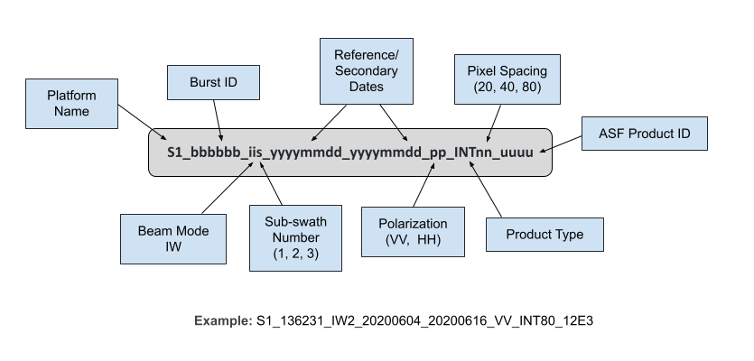




# Sentinel-1 Burst InSAR Product Guide

This document is a guide for users of Sentinel-1 Burst Interferometric Synthetic Aperture Radar (InSAR) products generated by the Alaska Satellite Facility (ASF). 

!!! tip "Burst-based InSAR available for Sentinel-1"

    Users are now able to process burst-based Sentinel-1 InSAR products on demand using ISCE2 software!  

    This functionality is available on [Vertex](https://search.asf.alaska.edu/ "https://search.asf.alaska.edu/" ){target=_blank} as well as through the [HyP3 API](../using/api.md ){target=_blank} and [Python SDK](../using/sdk.md ){target=_blank}.

### Sentinel-1 Bursts

!!! tip "Sentinel-1 bursts are not available for all SLC granules"

    **Burst products only are available for Sentinel-1 granules collected after June 9th, 2023.** 

    ASF is currently only forward-populating burst products, which means that burst products are only available for Sentinel-1 granules collected after June 9th, 2023. If this affects your ability to utilize burst products to perform your analyses, please [Email ASF User Services](mailto:uso@asf.alaska.edu "uso@asf.alaska.edu"), and we will try to populate burst products for your region and time period of interest.

Single Look Complex (SLC) data from the Sentinel-1 mission that is suitable for use in interferometry has historically been packaged into Interferometric Wide (IW) SLC products. These IW SLC products include three sub-swaths, each containing many individual burst SLCs. The framing of the IW SLCs is not consistent through time, so when using IW SLCs as the basis for InSAR, scene pairs do not always fully overlap. 

In contrast, working at the burst level of the Sentinel-1 SLC data provides a couple key benefits: 

**1. Bursts are consistently geolocated through time**  
The coverage of a burst is the same for every orbit of the satellite, so you can be confident that every burst with the same [Full Burst ID](https://storymaps.arcgis.com/stories/88c8fe67933340779eddef212d76b8b8#ref-n-VYIiUe "Sentinel-1 Burst Overview https://arcg.is/zSafi0" ){target=_blank} in a stack of acquisitions will cover the same geographic location. 

**2. Bursts cover a smaller geographic area**  
IW SLC products are extremely large, and, in many cases, only a small portion of the image is of interest. You can process only the bursts that cover your specific area of interest, which significantly decreases the time and cost required to generate InSAR products.

Refer to the [Sentinel-1 Bursts tutorial](https://storymaps.arcgis.com/stories/88c8fe67933340779eddef212d76b8b8 "Sentinel-1 Bursts Tutorial https://arcg.is/zSafi0" ){target=_blank} to learn more about how [ASF extracts burst-level products](https://sentinel1-burst-documentation.asf.alaska.edu/ "ASF Sentinel-1 Burst Documentation" ){target=_blank} from Sentinel-1 IW and EW SLCs.

### Burst InSAR Processing

The Sentinel-1 Burst InSAR products are generated using the Jet Propulsion Laboratory's [ISCE2 software](https://github.com/isce-framework/isce2#readme "https://github.com/isce-framework/isce2" ){target=_blank}. ASF is committed to transparency in product development, and we are pleased to be able to offer an InSAR product that leverages open-source software for processing. 

For those who would prefer to work at the scale of a full IW SLC, our original [On Demand InSAR](insar_product_guide.md){target=_blank} products are still available. These products have a larger footprint, and are generated using [GAMMA software](https://www.gamma-rs.ch/software){target=_blank}.

### Using Sentinel-1 Burst InSAR

Users can request Sentinel-1 Burst InSAR products [On Demand](https://search.asf.alaska.edu/#/?topic=onDemand "https://search.asf.alaska.edu/#/?topic=onDemand" ){target=_blank} in ASF's [Vertex](https://search.asf.alaska.edu/ "https://search.asf.alaska.edu" ){target=_blank} data portal, or make use of our HyP3 [Python SDK](https://hyp3-docs.asf.alaska.edu/using/sdk/ "https://hyp3-docs.asf.alaska.edu/using/sdk" ){target=_blank} or [API](https://hyp3-docs.asf.alaska.edu/using/api/ "https://hyp3-docs.asf.alaska.edu/using/api" ){target=_blank}. Input pair selection in Vertex uses either the [Baseline Tool](https://docs.asf.alaska.edu/vertex/baseline/ "https://docs.asf.alaska.edu/vertex/baseline/" ){target=_blank} or the [SBAS Tool](https://docs.asf.alaska.edu/vertex/sbas/ "https://docs.asf.alaska.edu/vertex/sbas" ){target=_blank} search interfaces. 

Users can also merge multiple Sentinel-1 Burst InSAR products together if their area of interest covers more than one burst. Please read the section on [Merging Sentinel-1 Burst InSAR Products](#merging-sentinel-1-burst-insar-products "Jump to the merge section of this document") for more information. 

Users are cautioned to read the sections on [limitations](#limitations "Jump to the Limitations section of this document") and [error sources](#error-sources "Jump to the Error Sources section of this document") in InSAR products before attempting to use InSAR data. For a more complete description of the properties of SAR, see our [Introduction to SAR](../guides/introduction_to_sar.md "https://hyp3-docs.asf.alaska.edu/guides/introduction_to_sar" ){target=_blank} guide. 




### Processing Options

There are several options users can set when ordering Burst InSAR On Demand products:

1. The **number of looks** drives the resolution and pixel spacing of the output products:

    | Looks | Resolution | Pixel Spacing |
    |-------|------------|---------------|
    | 20x4  | 160 m      | 80 m          |
    | 10x2  | 80 m       | 40 m          |
    | 5x1   | 40 m       | 20 m          |

    Products generated with 10x2 looks have a file size roughly 4 times that of 20x4-look products.
    Similarly, 5x1-look products have a file size roughly 4 times that of 10x2-look products
    (or 16 times that of 20x4-look products).

    The default is 20x4 looks.

2. There is an option to apply a **water mask**. This mask includes coastal waters and large inland waterbodies. Masking waterbodies can have a significant impact during phase unwrapping, as water can sometimes exhibit enough coherence between acquisitions to allow for unwrapping to occur over waterbodies, which is invalid. A GeoTIFF of the water mask is always included with the InSAR product package, but when this option is selected, the conditional water mask will be applied before the phase unwrapping process. Water masking is turned off by default. Visit our [InSAR Water Masking Tutorial](https://storymaps.arcgis.com/stories/485916be1b1d46889aa436794b5633cb "InSAR Water Masking StoryMap" ){target=_blank} for more information.




## Burst InSAR Workflow

The Burst InSAR workflow used in HyP3 was developed by ASF using ISCE2 software. The steps include pre-processing, interferogram preparation, and product creation. Once these steps are performed, an output product package is created. See [product packaging](#product-packaging "Jump to Product Packaging section of this document") for details on the individual files included in the package.

### Pre-Processing

Pre-processing steps prepare the SAR images to be used in interferometry.
The pre-processing steps include downloading the burst granules,
downloading the DEM file,
and downloading the orbit and auxiliary data files.

#### Download Bursts

The Burst InSAR workflow accepts as input two
[Interferometric Wide swath Single Look Complex](https://sentinel.esa.int/web/sentinel/user-guides/sentinel-1-sar/acquisition-modes/interferometric-wide-swath "https://sentinel.esa.int/web/sentinel/user-guides/sentinel-1-sar/acquisition-modes/interferometric-wide-swath" ){target=_blank}
(IW SLC) burst granules with the same burst ID.
The bursts are downloaded using ASF's
[Sentinel-1 Burst Extractor](https://sentinel1-burst-documentation.asf.alaska.edu/ "https://sentinel1-burst-documentation.asf.alaska.edu/" ){target=_blank}.

#### Download the DEM File

In order to create differential InSAR products that show motion on the ground,
one must subtract the topographic phase from the interferogram.
The topographic phase, in this case, is replicated by using an
[existing DEM](../dems.md "HyP3 DEM Documentation" ){target=_blank}
to calculate the actual topographic phase.
This phase is then removed from the interferogram leaving just the motion or deformation signal
(plus atmospheric delays and noise).

The DEM that is used for HyP3 InSAR processing is the
[2022 Release of the Copernicus GLO-30 Public DEM](https://spacedata.copernicus.eu/collections/copernicus-digital-elevation-model "Copernicus DEM" ){target=_blank}
dataset
[publicly available on AWS](https://registry.opendata.aws/copernicus-dem/ "https://registry.opendata.aws/copernicus-dem" ){target=_blank},
which provides global coverage at 30-m pixel spacing (except for an area over Armenia and Azerbaijan, which only has 90-m coverage).
For more information about the 2022 updates, see the 'Releases' section of
[this article](https://spacedata.copernicus.eu/collections/copernicus-digital-elevation-model "Copernicus DEM" ){target=_blank}.

The portion of the DEM that covers the input bursts is downloaded.

#### Download Orbit Files and Calibration Auxiliary Data Files

For Sentinel-1 InSAR processing, ISCE2 requires additional satellite orbit and calibration metadata files. The orbit files are downloaded from the
[Copernicus Data Space Ecosystem](https://documentation.dataspace.copernicus.eu/Data/Sentinel1.html#sentinel-1-precise-orbit-determination-pod-products "Copernicus Data Space Ecosystem" ){target=_blank}. The calibration auxiliary data files are downloaded from the
[Sentinel-1 Mission Performance Center](https://sar-mpc.eu/ "Sentinel-1 Mission Performance Center" ){target=_blank}.

### InSAR Processing

The ISCE2 InSAR processing this product uses follows the workflow in [topsApp.py](https://github.com/isce-framework/isce2/blob/main/applications/topsApp.py#L982){target=_blank} from steps `startup` through `geocode`. These steps perform the following processing:

1. Extract the orbits, Instrument Processing Facility (IPF) version, burst data, and antenna pattern if it is necessary.
1. Calculate the perpendicular and parallel baselines.
1. Map the DEM into the radar coordinates of the reference image. This generates the longitude, latitude, height and LOS angles on a pixel by pixel grid for each burst.
1. Estimate the azimuth offsets between the input SLC bursts. The Enhanced Spectral Diversity (ESD) method is *not* used.
1. Estimate the range offsets between the input SLC bursts.
1. Co-register the secondary SLC burst by applying the estimated range and azimuth offsets.
1. Produce the wrapped phase interferogram.
1. Apply the [Goldstein-Werner](https://doi.org/10.1029/1998GL900033){target=_blank} power spectral filter with a dampening factor of 0.5.
1. Unwrap the wrapped phase interferogram using [SNAPHU](http://web.stanford.edu/group/radar/softwareandlinks/sw/snaphu/){target=_blank}'s minimum cost flow (MCF) unwrapping algorithm to produce the unwrapped phase interferogram.
1. Geocode the output products.

### Post-Processing

#### Apply Water Mask
A water mask identifying coastal waters and major inland waterbodies is generated using the [Global Self-consistent,
Hierarchical, High-resolution Geography Database (GSHHG)](http://www.soest.hawaii.edu/wessel/gshhg "http://www.soest.hawaii.edu/wessel/gshhg" ){target=_blank} dataset. This water mask raster is always included with the Burst InSAR products for reference, but is not applied to the interferometry products by default.

Users can optionally choose to apply the water mask before phase unwrapping. When processing scenes with extensive coverage by coastal waters or large inland waterbodies, there can be erroneous deformation signals or phase jumps introduced if unwrapping proceeds over water as if it were land. In such cases, choosing the option to apply the water mask can improve the results. Visit our [InSAR Water Masking Tutorial](https://storymaps.arcgis.com/stories/485916be1b1d46889aa436794b5633cb "InSAR Water Masking StoryMap" ){target=_blank} for more information.

#### Product Creation
Image files are exported into the widely-used GeoTIFF format in a Universal Transverse Mercator (UTM) Zone projection. Images
are resampled to a pixel size that reflects the resolution of output image based on the requested number of looks: 80 meters
for 20x4 looks, 40 meters for 10x2 looks, and 20 meters for 5x1 looks.

Supporting metadata files are created, as well as a quick-look browse image.




## Product Packaging

HyP3 Burst InSAR output is a zip file containing various files, including GeoTIFFs, a PNG browse image, a metadata file, and a README file.

### Naming Convention

The Burst InSAR product names are packed with information pertaining to the processing of the data, presented in the following order, as illustrated in Figure 3. 

- The imaging platform name, always S1 for Sentinel-1.
- Relative burst ID values assigned by ESA. Each value identifies a consistent burst footprint; relative burst ID values differ from one sub-swath to the next.
- The imaging mode, currently only IW is supported.
- The swath number, either 1, 2, or 3, indicating which sub-swath the burst is located in.
- The acquisition dates of the reference (older) scene and the secondary (newer) scene
- The polarizations for the pair, either HH or VV.
- The product type (always INT for InSAR) and the pixel spacing, which will be either 80, 40, or 20, based upon the number of looks selected when the job was submitted for processing
- The filename ends with the ASF product ID, a 4 digit hexadecimal number



*Figure 3: Breakdown of ASF Burst InSAR naming scheme.*

### Image Files

All of the main InSAR product files are 32-bit floating-point single-band GeoTIFFs. The exceptions to this are the connected components and the water mask files, which are both 8-bit unsigned-integer single-band GeoTIFFs.

- The *coherence* file pixel values range from 0.0 to 1.0, with 0.0 being completely non-coherent and 1.0 being perfectly coherent. 
- The *unwrapped phase* file shows the results of the phase unwrapping process. Negative values indicate movement towards the sensor, and positive values indicate movement away from the sensor. This is the main interferogram output.
- The *wrapped phase* file indicates the interferogram phase after applying the adaptive filter immediately before unwrapping. Values range from negative pi to positive pi.
- The *connected components* file delineates regions unwrapped as contiguous units by the SNAPHU unwrapping algorithm.
- The *look vectors* theta (θ) and phi (φ) describe the elevation and orientation angles of the look vector in radians. The look vectors refer to the look direction back towards the sensor. 
    - The *lv_theta* (θ) file indicates the SAR look vector elevation angle (in radians) at each pixel, ranging from -π/2 (down) to π/2 (up). The look vector elevation angle is defined as the angle between the horizontal surface and the look vector with positive angles indicating sensor positions above the surface. 
    - The *lv_phi* (φ) file indicates the SAR look vector orientation angle (in radians) at each pixel. The look vector orientation angle is defined as the angle between the East direction and the projection of the look vector on the horizontal surface plane. The orientation angle increases towards north, with the North direction corresponding to π/2 (and south to -π/2). The orientation angle range is -π to π.
- The *DEM* file gives the local terrain heights in meters, with a geoid correction applied.
- The *water mask* file indicates coastal waters and large inland waterbodies. Pixel values of 1 indicate land and 0 indicate water. This file is in 8-bit unsigned integer format.

If the **water mask** option is selected, the water mask is applied before phase unwrapping to exclude potentially invalid pixels from the unwrapping process. The water mask is generated using the [GSHHG](http://www.soest.hawaii.edu/wessel/gshhg "http://www.soest.hawaii.edu/wessel/gshhg" ){target=_blank} dataset. To compile the reference shapefile, the full-resolution L1 dataset (boundary between land and ocean) and L5 dataset (boundary between Antarctic ice and ocean) were combined. The L3 dataset (boundary between islands and the lakes they are within) was removed from the L2 dataset (boundary between lakes and land), and this combined dataset was removed from the combined L1/L5 dataset. The GSHHG dataset was last updated in 2017, so there may be discrepancies where shorelines have changed.

There are also four non-geocoded images that remain in their native range-doppler coordinates. These four images compose the image data needed to merge Burst InSAR products together. These images include a range-doppler version of the wrapped interferogram, a two-band range-doppler look vector image in the native ISCE2 format, and latitude/longitude images that provide the information necessary to map range-doppler images into the geocoded domain.

A **browse image** is included for the unwrapped (unw_phase) phase file, which is in PNG format and is 2048 pixels wide.

The tags and extensions used and example file names for each raster are listed in Table 2 below. 



| Extension              | Description                         | Example                               |
|------------------------|-------------------------------------|---------------------------------------|
| _conncomp.tif          | Connected Components                | {{ base_name }}_conncomp.tif          |
| _corr.tif              | Normalized coherence file           | {{ base_name }}_corr.tif              |
| _unw_phase.tif         | Unwrapped geocoded interferogram    | {{ base_name }}_unw_phase.tif         |
| _wrapped_phase.tif     | Wrapped geocoded interferogram      | {{ base_name }}_wrapped_phase.tif     |
| _lv_phi.tif            | Look vector φ (orientation)         | {{ base_name }}_lv_phi.tif            |
| _lv_theta.tif          | Look vector θ (elevation)           | {{ base_name }}_lv_theta.tif          |
| _dem.tif               | Digital elevation model             | {{ base_name }}_dem.tif               |
| _water_mask.tif        | Water mask                          | {{ base_name }}_water_mask.tif        |
| _lat_rdr.tif           | Range-Doppler latitude coordinates  | {{ base_name }}_lat_rdr.tif           |
| _lon_rdr.tif           | Range-Doppler longitude coordinates | {{ base_name }}_lon_rdr.tif           |
| _los_rdr.tif           | Range-Doppler look vectors          | {{ base_name }}_los_rdr.tif           |
| _wrapped_phase_rdr.tif | Wrapped Range-Doppler interferogram | {{ base_name }}_wrapped_phase_rdr.tif |
| _unw_phase.png         | Unwrapped phase browse image        | {{ base_name }}_unw_phase.png         |

*Table 2: Image files in product package*

### Metadata Files

The product package also includes a number of metadata files.

| Extension      | Description                                     | Example                                 |
|----------------|-------------------------------------------------|-----------------------------------------|
| .README.md.txt | Main README file for Burst InSAR products       | {{ base_name }}.README.md.txt           |
| .txt           | Parameters and metadata for the InSAR pair      | {{ base_name }}.txt                     |

*Table 3: Metadata files in product package*

#### README File
The text file with extension .README.md.txt explains the files included in the folder, and is customized to reflect that particular product. Users unfamiliar with InSAR products should start by reading this README file, which will give some background on each of the files included in the product folder.

#### InSAR Parameter File
The text file with extension .txt includes processing parameters used to generate the InSAR product as well as metadata attributes for the InSAR pair.  These are detailed in Table 4.  

| Name                             | Description                                                                                             | Possible Value                                                       |
|----------------------------------|---------------------------------------------------------------------------------------------------------|----------------------------------------------------------------------|
| Reference Granule                | Granule name for reference burst (of the two scenes in the pair, the dataset with the oldest timestamp) | S1<wbr>_136231<wbr>_IW2<wbr>_20200604T022312<wbr>_VV<wbr>_7C85-BURST |
| Secondary Granule                | Granule name for secondary burst (of the two scenes in the pair, the dataset with the newest timestamp) | S1<wbr>_136231<wbr>_IW2<wbr>_20200616T022313<wbr>_VV<wbr>_5D11-BURST |
| Reference Pass Direction         | Orbit direction of the reference scene                                                                  | DESCENDING                                                           |
| Reference Orbit Number           | Absolute orbit number of the reference scene                                                            | 30741                                                                |
| Secondary Pass Direction         | Orbit direction of the reference scene                                                                  | DESCENDING                                                           |
| Secondary Orbit Number           | Absolute orbit number of the secondary scene                                                            | 31091                                                                |
| Baseline                         | Perpendicular baseline in meters                                                                        | 58.3898                                                              | 
| UTCTime                          | Time in the UTC time zone in seconds                                                                    | 12360.691361                                                         |
| Heading                          | Spacecraft heading measured in degrees clockwise from north                                             | 193.2939317                                                          |
| Spacecraft height                | Height in meters of the spacecraft above nadir point                                                    | 700618.6318999995                                                    | 
| Earth radius at nadir            | Ellipsoidal earth radius in meters at the point directly below the satellite                            | 6370250.0667                                                         |
| Slant range near                 | Distance in meters from satellite to nearest point imaged                                               | 799517.4338                                                          | 
| Slant range center               | Distance in meters from satellite to the center point imaged                                            | 879794.1404                                                          | 
| Slant range far                  | Distance in meters from satellite to farthest point imaged                                              | 960070.8469                                                          |
| Range looks                      | Number of looks taken in the range direction                                                            | 20                                                                   | 
| Azimuth looks                    | Number of looks taken in the azimuth direction                                                          | 4                                                                    |
| InSAR phase filter               | Was an InSAR phase filter used                                                                          | yes                                                                  | 
| Phase filter parameter           | Dampening factor                                                                                        | 0.5                                                                  |
| Range bandpass filter            | Range bandpass filter applied                                                                           | no                                                                   |
| Azimuth bandpass filter          | Azimuth bandpass filter applied                                                                         | no                                                                   |
| DEM source                       | DEM used in processing                                                                                  | GLO-30                                                               |
| DEM resolution                   | Pixel spacing in meters for DEM used to process this scene                                              | 30                                                                   |
| Unwrapping type                  | Phase unwrapping algorithm used                                                                         | snaphu_mcf                                                           |
| Speckle filter                   | Speckle filter applied                                                                                  | yes                                                                  |
| Water mask                       | Was a water mask used                                                                                   | yes                                                                  |
| Radar n lines                    | Number of lines (y coordinate) in range-doppler                                                         | 377                                                                  |
| Radar n samples                  | Number of samples (x coordinate) in range-doppler                                                       | 1272                                                                 |
| Radar first valid line           | First line in range-doppler SLC containing valid data                                                   | 8                                                                    |
| Radar n valid lines              | Number of lines in range-doppler SLC containing valid data                                              | 363                                                                  |
| Radar first valid sample         | First sample in range-doppler SLC containing valid data                                                | 9                                                                    |
| Radar n valid samples            | Number of samples in range-doppler SLC containing valid data                                            | 1220                                                                 |
| Multilook Azimuth Time Interval  | Time-based spacing of range-doppler SLC lines after multilooking in seconds                             | 0.0082222252                                                         |
| Multilook Range Pixel Size       | Distance-based spacing of range-doppler SLC samples after multilooking in meters                        | 46.59124229430646                                                    |
| Radar sensing stop               | Last date and time for data collection                                                                  | 2020-06-04T02:23:16.030988                                           |


*Table 4: List of InSAR parameters included in the parameter text file*

### Merging Sentinel-1 Burst InSAR Products

Burst InSAR products created using the `insar_tops_burst` workflow can be merged together using the `merge_tops_burst` workflow. This can be useful when the area of interest you'd like to observe spans multiple bursts. Merging is done using underlying ISCE2 functionality, and steps 8-10 of InSAR processing (filtering, unwrapping, and geocoding) found in the [InSAR Processing](#insar-processing "Jump to the InSAR Processing section of this document") section are repeated for the merged products to ensure consistent results. Check out the [Merge Processing](#merge-processing "Jump to the Merge Processing section of this document") section below for more details. Assuming that you have already installed the [HyP3-ISCE2 plugin]( https://github.com/ASFHyP3/hyp3-isce2 "HyP3-ISCE2 Plugin" ){target=_blank} on your local machine, merging can be performed using the following syntax:

```bash
python -m hyp3_isce2 ++process merge_tops_bursts PATH_TO_UNZIPPED_PRODUCTS
```

Where `PATH_TO_UNZIPPED_PRODUCTS` is the path to a directory containing **unzipped** Burst InSAR products. For example:

```
PATH_TO_UNZIPPED_PRODUCTS
├─ S1_136232_IW2_20200604_20200616_VV_INT80_663F
├─ S1_136231_IW2_20200604_20200616_VV_INT80_529D
```

In order to be merging eligible, all burst products must:

- Have the same reference and secondary dates
- Have the same polarization
- Have the same multilooking
- Be from the same relative orbit
- Be contiguous

The workflow should throw an error if any of these conditions are not met.

#### Merge Processing
During normal ISCE2 InSAR processing, initial interferograms are formed on a burst-by-burst basis. These range-doppler burst interferograms are combined during an ISCE2 step called `mergebursts`, then the remaining steps (filtering, unwrapping and geocoding) are conducted on the merged results.

By including select range-doppler data (wrapped interferogram, geolocation information, and line-of-sight information) as well as select metadata in our standard Burst InSAR products, we are able to restart ISCE2 processing from the `mergebursts` step, then proceed with the following steps as if it were a standard ISCE2 InSAR processing run.

The steps of the workflow are as follows:

1.	Recreate a pre-`mergebursts` ISCE2 InSAR processing state using the input Burst InSAR products.
2.	Run a modified version of ISCE2’s `mergebursts` step.
3.	Apply the Goldstein-Werner power spectral filter with a dampening factor of 0.5.
4.	Unwrap the wrapped phase interferogram using [SNAPHU](http://web.stanford.edu/group/radar/softwareandlinks/sw/snaphu/){target=_blank}'s minimum cost flow (MCF) unwrapping algorithm to produce the unwrapped phase interferogram.
5.	Geocode the output products.

As mentioned above, this workflow uses underlying ISCE2 functionality to perform these steps so the results of this workflow should be identical to the results obtained by performing a standard multi-burst ISCE2 InSAR run (assuming that the Enhanced Spectral Diversity technique is not used for co-registration).

#### Merge Processing Options

The processing options available for the merging are the same as those available for standard Burst InSAR products. Check out the [Processing Options](#processing-options "Jump to the Processing Options section of this document") section for more details.

To learn about the command line argument syntax for this workflow, look at the help documentation using:
```bash
python -m hyp3_isce2 ++process merge_tops_bursts --help
```

#### Product Packaging
The product packaging of merged Burst InSAR products follows the same conventions outlined in the [Product Packaging](#product-packaging "Jump to the Product Packaging section of this document") section above with two exceptions. First, the four range-doppler images are not included since the products have already been merged. Second, the product name is slightly modified; the burst ID is swapped for the zero-padded relative orbit number, and the swath number is removed. The resulting format is:
```
S1_rrr__yyymmdd_yyymmdd_pp_INTn_uuuu
```




### Line-of-Sight Measurements
When looking at a single interferogram, the deformation measurements in the line-of-sight orientation of the sensor indicate relative motion towards or away from the sensor. InSAR is not sensitive to motion in the azimuth direction of the satellite, so motion that occurs in the same direction as the satellite's direction of travel will not be detected.

A single interferogram cannot be used to determine the relative contributions of vertical and horizontal movement to the line-of-sight displacement measurement. To determine how much of the signal is driven by vertical vs. horizontal movement, you must either use a time series of interferograms, or use reference measurements with known vertical and horizontal components (such as GNSS measurements from the region of deformation) to deconstruct the line-of-sight displacement.




### Phase Unwrapping Reference Point
The reference point for phase unwrapping is set automatically by the topsApp.py script. It may not be an ideal location to use as a reference point for phase unwrapping. If it is located in an area undergoing deformation, or in an area with low coherence, the unwrapping may be of lower quality than if the reference point was in a more suitable location.

Even when there are no phase unwrapping errors introduced by phase discontinuities, it is important to be aware that unwrapped phase differences are calculated relative to the reference point. The phase difference value of the reference point is set to 0 during phase unwrapping, so any displacement values will be relative to that benchmark.

If you are interested in the amount of displacement in a particular area, you may wish to choose your own reference point. The ideal reference point would be in an area of high coherence beyond where deformation has occurred. The unwrapped phase measurements can be adjusted to be relative to this new reference point. To adjust the values in the unwrapped phase GeoTIFF, simply select a reference point that is optimal for your use case and subtract the unwrapped phase value of that reference point from each pixel in the unwrapped phase raster:

**ΔΨ<sup>&ast;</sup>** = **ΔΨ** - Δψ<sub>ref</sub>

where **ΔΨ<sup>&ast;</sup>** is the adjusted unwrapped phase, **ΔΨ** is the original unwrapped phase, and Δψ<sub>ref</sub> is the unwrapped phase value at the new reference point.

#### Displacement Values from a Single Interferogram
In general, calculating displacement values from a single interferogram is not recommended. It will be more robust to use a time series approach to more accurately determine the pattern of movement. When using SAR time-series software such as [MintPy](https://mintpy.readthedocs.io/en/latest/ "https://mintpy.readthedocs.io/en/latest" ){target=_blank}, you have the option to select a specific reference point, and the values of the input rasters will be adjusted accordingly.

