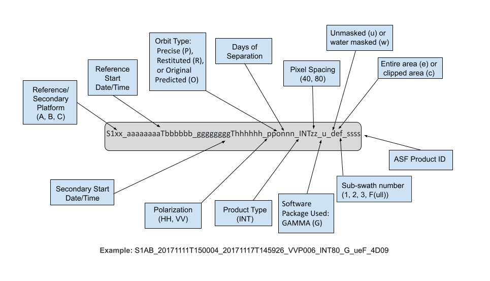




# Sentinel-1 Burst InSAR Product Guide

TODO



## InSAR Workflow
TODO




## Product Packaging

HyP3 Burst InSAR output is a zip file containing various files, including GeoTIFFs, PNG browse images with geolocation information, Google Earth KMZ files, a metadata file, and a README file.

### Naming Convention

The Burst InSAR product names are packed with information pertaining to the processing of the data, presented in the following order, as illustrated in Figure 4. 

- The platform names, either Sentinel-1A or Sentinel-1B, are abbreviated "A" or "B", indicating the reference and secondary granule's imaging platform
- Relative burst ID values assigned by ESA. Each value identifies a consistent burst footprint; relative burst ID values differ from one subswath to the next.
- The reference start date and time and the secondary start dates, t.
- The polarizations for the pair, either HH or VV.
- The product type (always INT for InSAR) and the pixel spacing, which will be either 80 or 40, based upon the number of looks selected when the job was submitted for processing
- The filename ends with the ASF product ID, a 4 digit hexadecimal number

# TODO: Make a new version of this figure for burst insar products.

*Figure 4: Breakdown of ASF Burst InSAR naming scheme.*

### Image Files

All of the main InSAR product files are 32-bit floating-point single-band GeoTIFFs. To learn more about the rasters included in the product package, refer to the [Exploring Sentinel-1 InSAR StoryMap](https://storymaps.arcgis.com/stories/8be186e4125741518118d0102e6835e5 "Exploring Sentinel-1 InSAR StoryMap https://arcg.is/11DaW90" ){target=_blank} tutorial.

- The *coherence* file pixel values range from 0.0 to 1.0, with 0.0 being completely non-coherent and 1.0 being perfectly coherent. 
- The *unwrapped phase* file shows the results of the phase unwrapping process. Negative values indicate movement towards the sensor, and positive values indicate movement away from the sensor. This is the main interferogram output.
- The *wrapped phase* file indicates the interferogram phase after applying the adaptive filter immediately before unwrapping. Values range from negative pi to positive pi. *(optional)*
- The *look vectors* theta (θ) and phi (φ) describe the elevation and orientation angles of the sensor's look direction. *(optional)*
- The *DEM* file gives the local terrain heights in meters, with a geoid correction applied. *(optional)*
- The *water mask* file indicates coastal waters and large inland waterbodies. Pixel values of 1 indicate land and 0 indicate water. This file is in 8-bit unsigned integer format.

# TODO: Is this still true for burst products?
If the **water mask** option is selected, the water mask is applied prior to phase unwrapping to exclude water pixels from the process. The water mask is generated using the [GSHHG](http://www.soest.hawaii.edu/wessel/gshhg "http://www.soest.hawaii.edu/wessel/gshhg/land" ){target=_blank} dataset. To compile the reference shapefile, the full-resolution L1 dataset (boundary between land and ocean) and L5 dataset (boundary between Antarctic ice and ocean) were combined. The L3 dataset (boundary between islands and the lakes they are within) was removed from the L2 dataset (boundary between lakes and land), and this combined dataset was removed from the combined L1/L5 dataset. The portion of the shapefile covering the scene is converted to a raster for inclusion in the phase unwrapping mask during InSAR processing. The GSHHG dataset was last updated in 2017, so there may be discrepancies where shorelines have changed. Visit our [InSAR Water Masking Tutorial](https://storymaps.arcgis.com/stories/485916be1b1d46889aa436794b5633cb "InSAR Water Masking StoryMap" ){target=_blank} for more information about water masking.

**A browse image** is included for the unwrapped (unw_phase) phase file, which is in PNG format and is 2048 pixels wide. The browse image is displayed using a cyclic color ramp to generate fringes. Each fringe in the browse image represents a phase difference of 6 pi. Because each 2-pi difference is equivalent to half the wavelength of the sensor, each 6-pi fringe represents about 8.3 cm of line-of-sight displacement for these Sentinel-1 products.

The tags and extensions used and example file names for each raster are listed in Table 2 below. 



| Extension          | Description                      | Example                           |
|--------------------|----------------------------------|-----------------------------------|
| _conncomp.tif      | Connected Components             | {{ base_name }}_conncomp.tif      |
| _corr.tif          | Normalized coherence file         | {{ base_name }}_corr.tif          |
| _unw_phase.tif     | Unwrapped geocoded interferogram | {{ base_name }}_unw_phase.tif     |
| _wrapped_phase.tif | Wrapped geocoded interferogram   | {{ base_name }}_wrapped_phase.tif |
| _lv_phi.tif        | Look vector φ (orientation)      | {{ base_name }}_lv_phi.tif        |
| _lv_theta.tif      | Look vector θ (elevation)        | {{ base_name }}_lv_theta.tif      |
| _dem.tif           | Digital elevation model          | {{ base_name }}_dem.tif           |
| _water_mask.tif    | Water mask                       | {{ base_name }}_water_mask.tif    |
| _unw_phase.png     | Unwrapped phase browse image     | {{ base_name }}_unw_phase.png     |

*Table 2: Image files in product package*

### Metadata Files

The product package also includes a number of metadata files.

| Extension      | Description                                     | Example                                 |
|----------------|-------------------------------------------------|-----------------------------------------|
| .README.md.txt | Main README file for Burst InSAR                 | {{ base_name }}.README.md.txt           |
| .txt           | Parameters and metadata for the InSAR pair      | {{ base_name }}.txt                     |

*Table 3: Metadata files in product package*

#### README File
The text file with extension .README.md.txt explains the files included in the folder, and is customized to reflect that particular product. Users unfamiliar with InSAR products should start by reading this README file, which will give some background on each of the files included in the product folder.

#### InSAR Parameter File
The text file with extension .txt includes processing parameters used to generate the InSAR product as well as metadata attributes for the InSAR pair.  These are detailed in Table 4.  

| Name                                                      | Description                                                                                                 | Possible Value                                                                    |
|-----------------------------------------------------------|-------------------------------------------------------------------------------------------------------------|-----------------------------------------------------------------------------------|
| Reference Granule                                         | ESA granule name for reference scene (of the two scenes in the pair, the dataset with the oldest timestamp) | S1<wbr>_136231<wbr>_IW2<wbr>_20200604T022312<wbr>_VV<wbr>_7C85<wbr>-BURST<wbr>    |
| Secondary Granule                                         | ESA granule name for secondary scene (of the two scenes in the pair, the dataset with the newest timestamp) | S1<wbr>_136231<wbr>_IW2<wbr>_20200616T022313<wbr>_VV<wbr>_5D11<wbr>-BURST<wbr>    |
| Reference Pass Direction                                  | Orbit direction of the reference scene                                                                      | DESCENDING                                                                        |
| Reference Orbit Number                                    | Absolute orbit number of the reference scene                                                                | 32861                                                                             |
| Secondary Pass Direction                                  | Orbit direction of the reference scene                                                                      | DESCENDING                                                                        |
| Secondary Orbit Number                                    | Absolute orbit number of the secondary scene                                                                | 33036                                                                             |
| Baseline                                                  | Perpendicular baseline in meters                                                                            | -65.89383411403055                                                                | 
| UTCTime                                                   | Time in the UTC time zone in seconds                                                                        | 1493.625425                                                                       |
| Heading                                                   | Spacecraft heading measured in degrees clockwise from north                                                 | -167.4428091316586                                                                |
| Spacecraft height                                         | Height in meters of the spacecraft above nadir point                                                        | 693000.0                                                                          | 
| Earth radius at nadir                                     | Ellipsoidal earth radius in meters at the point directly below the satellite                                | 6337286.638938101                                                                 |
| Slant range near                                          | Distance in meters from satellite to nearest point imaged                                                   | 845859.2465505999                                                                 | 
| Slant range center                                        | Distance in meters from satellite to the center point imaged                                                | 875499.4301171803                                                                 | 
| Slant range far                                           | Distance in meters from satellite to farthest point imaged                                                  | 905139.6136837607                                                                 |
| Range looks                                               | Number of looks taken in the range direction                                                                | 20                                                                                | 
| Azimuth looks                                             | Number of looks taken in the azimuth direction                                                              | 4                                                                                 |
| InSAR phase filter                                         | Name of the phase filter used                                                                                | adf                                                                               | 
| Phase filter parameter                                     | Dampening factor                                                                                            | 0.5                                                                               |
| Resolution of output (m)                                  | Pixel spacing in meters for output products                                                                 | 80                                                                                | 
| Range bandpass filter                                      | Range bandpass filter applied                                                                                | no                                                                                |
| Azimuth bandpass filter                                    | Azimuth bandpass filter applied                                                                              | no                                                                                |
| DEM source                                                | DEM used in processing                                                                                      | GLO-30                                                                            |
| DEM resolution                                            | Pixel spacing in meters for DEM used to process this scene                                                  | 30                                                                                |
| Unwrapping type                                           | Phase unwrapping algorithm used                                                                             | snaphu_mcf                                                                        |
| Speckle filter                                             | Speckle filter applied                                                                                       | no                                                                                |

*Table 4: List of InSAR parameters included in the parameter text file*


