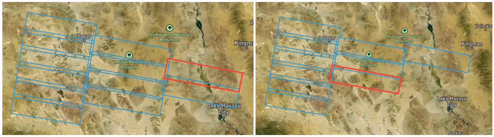
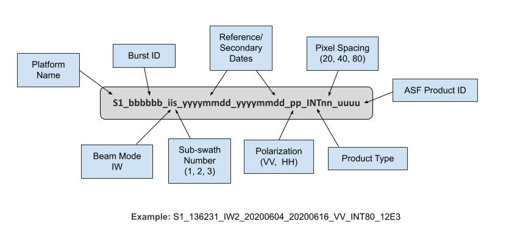




# Sentinel-1 Burst InSAR Product Guide

This document is a guide for users of Sentinel-1 Burst Interferometric Synthetic Aperture Radar (InSAR) products generated by the Alaska Satellite Facility (ASF).

InSAR jobs can be processed on the basis of individual 
[Sentinel-1 burst SLCs](#sentinel-1-bursts "Jump to the Sentinel-1 Bursts section of this document") 
that comprise the Sentinel-1 SLC products, and users can select up to fifteen contiguous 
along-path bursts to merge together into a single interferogram.

## Burst InSAR Software

The Sentinel-1 Burst InSAR products are generated using the Jet Propulsion Laboratory's 
[ISCE2 software](https://github.com/isce-framework/isce2#readme "https://github.com/isce-framework/isce2Farget=_blank}. 
ASF is committed to transparency in product development, and we are pleased to be able to offer an InSAR product 
that leverages open-source software for processing.

For those who would prefer to work at the scale of a full IW SLC, our original 
[On Demand InSAR](insar_product_guide.md){target=_blank} products are still available. These products have a larger 
footprint, and are generated using [GAMMA software](https://www.gamma-rs.ch/software){target=_blank}.

!!! warning "Sentinel-1C acquisitions not yet supported" 

    ISCE2 software does not currently support processing Sentinel-1C acquisitions. Until the software package is 
    updated, users will only be able to submit granules acquired by Sentinel-1A or Sentinel-1B for Burst InSAR 
    processing. 

    Users can submit full IW Sentinel-1C granules for processing to InSAR using the 
    [On Demand InSAR](insar_product_guide.md "Sentinel-1 InSAR Product Guide") option, which leverages 
    GAMMA software rather than ISCE2. 

## Burst InSAR Job Types

There are currently two different [burst-based](#sentinel-1-bursts "Jump to the Sentinel-1 Bursts section of this document") 
InSAR jobs available. The ISCE2 InSAR workflow processes input SLC data on a burst-by-burst basis to generate wrapped 
interferograms, regardless of how many bursts are included in the reference and secondary input files. 

If there are multiple bursts included in the input files, the wrapped interferograms are then merged together for the 
final processing steps, so the output is a single interferogram regardless of the number of bursts included in the 
input files.

### Single-Burst InSAR
ASF's original burst-based InSAR job type, `INSAR_ISCE_BURST`, only accepts a single pair of burst SLCs. This job type 
is supported in [Vertex](https://search.asf.alaska.edu/ "https://search.asf.alaska.edu" ){target=_blank} as well as the 
[HyP3 API](../using/api.md ){target=_blank} and [Python SDK](../using/sdk.md ){target=_blank}.

All single-burst InSAR jobs cost the same number of 
[credits](../using/credits.md#credit-cost-table "Credit Cost Table" ){target=_blank}, regardless of the processing 
options selected. 

!!! tip "Deprecation of the INSAR_ISCE_BURST job type"

    The original `INSAR_ISCE_BURST` job type will be deprecated once support for `INSAR_ISCE_MULTI_BURST` jobs is available in [Vertex](https://search.asf.alaska.edu/ "https://search.asf.alaska.edu" ){target=_blank}. For now, only single-burst interferograms are available through the [Vertex](https://search.asf.alaska.edu/ "https://search.asf.alaska.edu" ){target=_blank} interface, but support for multi-burst interferograms is coming soon!

### Multi-Burst InSAR
The `INSAR_ISCE_MULTI_BURST` job type accepts sets of burst SLCs. The output is a single merged interferogram over the 
full extent of the input bursts. This job type is not yet supported in Vertex, but can be submitted using the 
[HyP3 API](../using/api.md ){target=_blank} and [Python SDK](../using/sdk.md ){target=_blank}. 

This job type supports pairings of 1 to 15 contiguous along-track bursts (refer to the 
[Considerations for Selecting Input Bursts](#considerations-for-selecting-input-bursts "Jump to the Considerations for Selecting Input Bursts section of this document") 
section for details). The number of bursts processed impacts the number of credits consumed. Refer to the 
[Credit Cost Table](../using/credits.md#credit-cost-table "Credit Cost Table" ){target=_blank} for more details.

## Sentinel-1 Bursts

[Single Look Complex](https://sentiwiki.copernicus.eu/web/s1-processing#S1-Processing-Single-Look-Complex "https://sentiwiki.copernicus.eu/web/s1-processing#S1-Processing-Single-Look-Complex" ){target=_blank} 
(SLC) data is required to generate interferograms from Sentinel-1 data. The European Space Agency (ESA) packages this 
type of data into Interferometric Wide (IW) SLC products, which are available for download from ASF. These IW SLC 
products include three sub-swaths, each containing many individual burst SLCs.

Historically, most InSAR processing has been performed using the full IW SLC scene, but ASF has developed a method of 
[extracting the individual SLC bursts](https://sentinel1-burst-documentation.asf.alaska.edu/ "https://sentinel1-burst-documentation.asf.alaska.edu/" ){target=_blank} 
from IW SLC products, which facilitates burst-based processing workflows.

Refer to the 
[Sentinel-1 Bursts tutorial](https://storymaps.arcgis.com/stories/88c8fe67933340779eddef212d76b8b8 "Sentinel-1 Bursts Tutorial https://arcg.is/zSafi0" ){target=_blank} 
to learn more about how [ASF extracts burst-level products](https://sentinel1-burst-documentation.asf.alaska.edu/ "ASF Sentinel-1 Burst Documentation" ){target=_blank} from Sentinel-1 IW and EW SLCs.

### Benefits of Bursts

Working at the burst level of the Sentinel-1 SLC data provides some key benefits:

**1. Bursts are consistently geolocated through time.**
The coverage of a burst is the same for every orbit of the satellite, so you can be confident that every burst with the 
same 
[Full Burst ID](https://storymaps.arcgis.com/stories/88c8fe67933340779eddef212d76b8b8#ref-n-VYIiUe "Sentinel-1 Burst Overview https://arcg.is/zSafi0" ){target=_blank} 
in a stack of acquisitions will cover the same geographic location. In contrast, the framing of the IW SLCs is not 
consistent through time, so when using IW SLCs as the basis for InSAR, scene pairs do not always fully overlap.

**2. Bursts cover a smaller geographic area.**
IW SLC products are extremely large. In many cases, only a small portion of the IW footprint is of interest. 
Burst-based processing allows you to process only the bursts that cover your specific area of interest, which 
significantly decreases the time and cost required to generate and analyze InSAR products.

**3. Bursts provide AOI customization.**
When using the `INSAR_ISCE_MULTI_BURST` job type, you can select multiple reference and secondary bursts from along an 
orbit path. This allows you to compose a custom area of interest (AOI) and create an InSAR product that spans IW SLC 
boundaries. We currently support InSAR jobs that include up to 15 contiguous burst footprints.

### Using Sentinel-1 Burst InSAR

Users can request Sentinel-1 Burst InSAR products 
[On Demand](https://search.asf.alaska.edu/#/?topic=onDemand "https://search.asf.alaska.edu/#/?topic=onDemand" ){target=_blank} 
in ASF's 
[Vertex](https://search.asf.alaska.edu/ "https://search.asf.alaska.edu" ){target=_blank} 
data portal, or make use of our HyP3 
[Python SDK](https://hyp3-docs.asf.alaska.edu/using/sdk/ "https://hyp3-docs.asf.alaska.edu/using/sdk" ){target=_blank} 
or [API](https://hyp3-docs.asf.alaska.edu/using/api/ "https://hyp3-docs.asf.alaska.edu/using/api" ){target=_blank}. 
Input pair selection in Vertex uses either the 
[Baseline Tool](https://docs.asf.alaska.edu/vertex/baseline/ "https://docs.asf.alaska.edu/vertex/baseline/" ){target=_blank} 
or the [SBAS Tool](https://docs.asf.alaska.edu/vertex/sbas/ "https://docs.asf.alaska.edu/vertex/sbas" ){target=_blank} 
search interfaces.

!!! warning "Only single-pair Burst InSAR processing is currently supported in Vertex"

    We are transitioning from the `INSAR_ISCE_BURST` to the `INSAR_ISCE_MULTI_BURST` 
    HyP3 job type to support multi-burst AOIs.

    `INSAR_ISCE_MULTI_BURST` job support is currently only available via our API and Python SDK, so 
    [Vertex](https://search.asf.alaska.edu/ "https://search.asf.alaska.edu" ){target=_blank} 
    users will not be able to submit multi-burst jobs for processing. 

    Burst InSAR jobs submitted in Vertex are currently limited to single-burst pairs, but we plan to add Vertex 
    support for `INSAR_ISCE_MULTI_BURST` jobs in the coming months.

On Demand InSAR products only include co-polarized interferograms (VV or HH). 
Cross-polarized interferograms (VH or HV) are not available using this service.

Users are cautioned to read the sections on [limitations](#limitations "Jump to the Limitations section of this document") and [error sources](#error-sources "Jump to the Error Sources section of this document") in InSAR products 
before attempting to use InSAR data. For a more complete description of the properties of SAR, see our 
[Introduction to SAR](../guides/introduction_to_sar.md "https://hyp3-docs.asf.alaska.edu/guides/introduction_to_sar" ){target=_blank} 
guide.




### Processing Options

There are several options users can set when ordering Burst InSAR On Demand products:

1. The **number of looks** drives the resolution and pixel spacing of the output products:

    | Looks | Resolution | Pixel Spacing |
    |-------|------------|---------------|
    | 20x4  | 160 m      | 80 m          |
    | 10x2  | 80 m       | 40 m          |
    | 5x1   | 40 m       | 20 m          |

    Products generated with 10x2 looks have a file size roughly 4 times that of 20x4-look products. 
    Similarly, 5x1-look products have a file size roughly 4 times that of 10x2-look products 
    (or 16 times that of 20x4-look products).

    The default is 20x4 looks.

2. There is an option to apply a **water mask**. This mask includes coastal waters and most inland waterbodies. 
Masking waterbodies can have a significant impact during phase unwrapping, as water can sometimes exhibit enough 
coherence between acquisitions to allow for unwrapping to occur over waterbodies, which is invalid. Refer to our 
[InSAR Water Masking tutorial](https://storymaps.arcgis.com/stories/485916be1b1d46889aa436794b5633cb "InSAR Water Masking StoryMap" ){target=_blank} 
for more information. 

    - Water masking is turned off by default.
    - When the water mask option is selected, the conditional water mask will be applied before the phase unwrapping process.
    - For `INSAR_ISCE_BURST` jobs, a GeoTIFF of the water mask is always included with the InSAR product package, even if the water mask option was not selected for application.
    - For `INSAR_ISCE_MULTI_BURST` jobs, the GeoTIFF of the water mask is only included if the water mask option is selected. 




## Burst InSAR Workflow

The Burst InSAR workflow used in HyP3 was developed by ASF using ISCE2 software. The steps include pre-processing, 
interferogram preparation, and product creation. Once these steps are performed, an output product package is created. 
See the [Product Packaging](#product-packaging "Jump to Product Packaging section of this document") section for 
details on the individual files included in the package.

### Pre-Processing

Pre-processing steps prepare the SAR images to be used in interferometry.
The pre-processing steps include downloading the burst SLC data and repackaging it in the SAFE format, 
downloading the DEM file, and downloading the orbit and auxiliary data files.

#### Download Burst Data

The Burst InSAR workflow accepts as input a reference and secondary set of 
[Interferometric Wide swath Single Look Complex](https://sentiwiki.copernicus.eu/web/s1-mission#S1Mission-InterferometricWideSwathS1-Mission-Interferometric-Wide-Swath "https://sentiwiki.copernicus.eu/web/s1-mission#S1Mission-InterferometricWideSwathS1-Mission-Interferometric-Wide-Swath" ){target=_blank} 
(IW SLC) burst granules. Internally, each set of bursts must share the same polarization (VV or HH), and be 
contiguous along a single Sentinel-1 orbit path. See 
[Considerations for Selecting Input Bursts](#considerations-for-selecting-input-bursts "Jump to the Considerations for Selecting Input Bursts section in this document") 
for more guidance on constructing valid sets of bursts.

The bursts are downloaded using ASF's
[Sentinel-1 Burst Extractor](https://sentinel1-burst-documentation.asf.alaska.edu/ "https://sentinel1-burst-documentation.asf.alaska.edu/" ){target=_blank} , 
and then repackaged into reference and secondary 
[ESA SAFE](https://sentiwiki.copernicus.eu/web/safe-format "SAFE Format" ){target=_blank} 
files using the 
[`burst2safe`](https://github.com/ASFHyP3/burst2safe "burst2safe Python package" ){target=_blank} package. 
This repackaging allows the sets of reference and secondary bursts to be processed with ISCE2 as if they were a 
pair of full IW SLC files from ESA.

##### Considerations for Selecting Input Bursts

A number of conditions need to be met when selecting the sets of bursts to package into the 
reference and secondary SAFE files: 

- Sets of bursts can contain 1-15 bursts
- There must be the same number of bursts in the secondary set as there are in the reference set
- All bursts in both the reference and secondary sets must have the same polarization
    - Only co-polarized inputs are supported
    - All bursts must be either VV or HH (not VH or HV)
- Pairwise bursts in the reference and secondary sets must have the same burst and relative orbit numbers
- All reference bursts must have been acquired within two minutes of each other
- All secondary bursts must have been acquired within two minutes of each other
- Reference bursts must have been acquired *before* the secondary bursts
- Bursts crossing the antimeridian are not supported

When selecting input bursts that span across sub-swaths in the same relative path, you must also take care not to 
leave gaps. The bursts in neighboring sub-swaths can only be offset along the path by one burst. 

For example, the grouping of bursts shown in the image on the left in Figure 4 can be submitted for processing, 
while the grouping in the image on the right would not be valid.



*Figure 4: Illustration of acceptable maximum offsets for bursts across sub-swaths.*

#### Download the DEM File

In order to create differential InSAR products that show motion on the ground, one must subtract the topographic 
phase from the interferogram. The topographic phase, in this case, is replicated by using an 
[existing DEM](../dems.md "HyP3 DEM Documentation" ){target=_blank} 
to calculate the actual topographic phase. This phase is then removed from the interferogram leaving just the 
motion or deformation signal (plus atmospheric delays and noise).

The DEM that is used for HyP3 InSAR processing is the 
[2022 Release of the Copernicus GLO-30 Public DEM](https://dataspace.copernicus.eu/explore-data/data-collections/copernicus-contributing-missions/collections-description/COP-DEM "Copernicus DEM" ){target=_blank} 
dataset 
[publicly available on AWS](https://registry.opendata.aws/copernicus-dem/ "https://registry.opendata.aws/copernicus-dem" ){target=_blank}, 
which provides global coverage at 30-m pixel spacing (except for an area over Armenia and Azerbaijan, which only 
has 90-m coverage).

The portion of the DEM that covers the extent of the input bursts is downloaded and resampled if necessary 
(for products output at 20-m pixel spacing). An ellipsoid correction is applied. 

#### Download Orbit Files and Calibration Auxiliary Data Files

For Sentinel-1 InSAR processing, ISCE2 requires additional satellite orbit and calibration metadata files. The orbit 
files are downloaded from the 
[Copernicus Data Space Ecosystem](https://documentation.dataspace.copernicus.eu/Data/Sentinel1.html#sentinel-1-precise-orbit-determination-pod-products "Copernicus Data Space Ecosystem" ){target=_blank}. 
The calibration auxiliary data files are downloaded from the 
[Sentinel-1 Mission Performance Center](https://sar-mpc.eu/ "Sentinel-1 Mission Performance Center" ){target=_blank}.

### Burst InSAR Processing

Burst InSAR processing is performed using the outputs from the processes detailed in the 
[Pre-Processing](#pre-processing "Jump to the Pre-Processing section of this document") section. 

The Burst InSAR processing code is contained in the 
[`insar_tops_burst.py`](https://github.com/ASFHyP3/hyp3-isce2/blob/main/src/hyp3_isce2/insar_tops_burst.py ){target=_blank} 
script. This script follows the ISCE2 InSAR workflow in 
[`topsApp.py`](https://github.com/isce-framework/isce2/blob/main/applications/topsApp.py#L982){target=_blank} 
for the steps `startup` through `geocode`. 

If the reference and secondary SAFE files include multiple bursts, processing is performed on a burst-by-burst 
basis for the first seven steps. The resulting burst-based wrapped interferograms are then merged together before 
the remaining functions are applied. 

The`topsApp` steps perform the following processes:

1. Extract the orbits, Instrument Processing Facility (IPF) version, burst data, and antenna pattern if it is necessary.
1. Calculate the perpendicular and parallel baselines.
1. Map the DEM into the radar coordinates of the reference image. This generates the longitude, latitude, height and LOS angles on a pixel by pixel grid for each burst.
1. Estimate the azimuth offsets between the input SLC bursts. The Enhanced Spectral Diversity (ESD) method is *not* used.
1. Estimate the range offsets between the input SLC bursts.
1. Co-register the secondary SLC burst by applying the estimated range and azimuth offsets.
1. Produce the wrapped phase interferogram. 
1. If the reference and secondary files contain more than one burst, the burst-based interferograms are then merged together into one output.
1. Apply the [Goldstein-Werner](https://doi.org/10.1029/1998GL900033){target=_blank} power spectral filter with a dampening factor of 0.5.
1. Optionally apply a water mask to the data.
1. Unwrap the wrapped phase interferogram using [SNAPHU](http://web.stanford.edu/group/radar/softwareandlinks/sw/snaphu/){target=_blank}'s minimum cost flow (MCF) unwrapping algorithm to produce the unwrapped phase interferogram.
1. Geocode the output products.

#### Applying a Water Mask
There is the option to apply a **water mask** to the interferogram. This mask includes coastal waters and most 
inland waterbodies. Masking waterbodies can have a significant impact during phase unwrapping, as water can sometimes 
exhibit enough coherence between acquisitions to allow for unwrapping to occur over waterbodies, which is invalid.

Water masking is turned off by default. When this option is selected, the conditional water mask will be applied 
along with coherence and intensity thresholds during the phase unwrapping process. 

For `INSAR_ISCE_BURST` jobs, a GeoTIFF of the water mask is always included with the InSAR product package, even 
when the water masking option is not applied to the interferogram. For `INSAR_ISCE_MULTI_BURST` jobs, the GeoTIFF of 
the water mask is only included in the product package when the water masking option is applied.

The water mask is generated by ASF using data from 
[OpenStreetMap](https://www.openstreetmap.org/about){target=_blank} 
and/or 
[ESA WorldCover](https://esa-worldcover.org/en/about/about){target=_blank} 
depending on location. Areas within Canada, Alaska, and Russia are primarily covered by ESA WorldCover data, while the rest of the world is covered by OpenStreetMap data. Refer to the 
[Water Masking](../water_masking.md "Water Masking Documentation" ){target=_blank} 
documentation page for more details.

This water mask is available for all longitudes, but data is only available from -85 to 85 degrees latitude. 
All areas between 85 and 90 degrees north latitude are treated as water, and all areas between 85 and 90 degrees 
south latitude are treated as land for the purposes of the water mask.

Water masks were previously generated from the 
[Global Self-consistent, Hierarchical, High-resolution Geography Database (GSHHG)](http://www.soest.hawaii.edu/wessel/gshhg "http://www.soest.hawaii.edu/wessel/gshhg" ){target=_blank} 
dataset, but we transitioned to using the OpenStreetMap/ESA WorldCover datasets in February 2024 to improve 
performance. In addition to being a more recent and accurate dataset, this also allows us to mask most 
inland waterbodies. When using the GSHHG dataset, we only masked large inland waterbodies; with the new mask, all 
but the smallest inland waterbodies are masked.

We originally applied a 3 km buffer on coastlines and a 5 km buffer on the shorelines of inland waterbodies in the 
water mask dataset before using it to mask the interferograms, in an effort to reduce the chance that valid land 
pixels would be excluded from phase unwrapping. It appears, however, that the inclusion of more water pixels is more 
detrimental to phase unwrapping than the exclusion of some land pixels, so as of September 27, 2022, 
the water mask used for this option is no longer buffered.

Visit our 
[InSAR Water Masking tutorial](https://storymaps.arcgis.com/stories/485916be1b1d46889aa436794b5633cb "InSAR Water Masking StoryMap" ){target=_blank} 
for more information about how different water masking approaches can impact the quality of an interferogram.

### Post-Processing

#### Product Creation
Image files are exported into the widely-used GeoTIFF format in a Universal Transverse Mercator (UTM) Zone projection. 
Images are resampled to a pixel size that reflects the resolution of the output image based on the requested number of 
looks: 80 meters for 20x4 looks, 40 meters for 10x2 looks, and 20 meters for 5x1 looks.

Supporting metadata files are created, as well as a quick-look browse image.




## Product Packaging

The Burst InSAR output is a zip file containing various files including GeoTIFFs, a PNG browse image, 
a metadata file, and a README file.

### Naming Convention: INSAR_ISCE_BURST

The Burst InSAR product names are packed with information pertaining to the processing of the data, presented in 
the following order, as illustrated in Figure 3.

- The imaging platform name, always S1 for Sentinel-1.
- Relative burst ID values assigned by ESA. Each value identifies a consistent burst footprint; relative burst ID 
  values differ from one sub-swath to the next.
- The imaging mode, currently only IW is supported.
- The sub-swath number, either 1, 2, or 3, indicating which sub-swath the burst is located in.
- The acquisition dates of the reference (older) scene and the secondary (newer) scene.
- The polarization of the product, either HH or VV.
- The product type (always INT for InSAR) and the pixel spacing in meters, which will be 80, 40, or 20, based upon the 
  [number of looks](#product-creation "Jump to the Product Creation section of this document") selected when the job 
  was submitted for processing.
- The filename ends with the ASF product ID, a 4 digit hexadecimal number.



*Figure 3: Breakdown of ASF Burst InSAR naming scheme.*

### Naming Convention: INSAR_ISCE_MULTI_BURST

The naming scheme for products generated using the `INSAR_ISCE_MULTI_BURST` job type is very different from what was 
used for `INSAR_ISCE_BURST`.

The basename of the multi-burst InSAR files follows this naming convention: 

**S1s_rrr_lonl_f_lal_f_lonu_f_lau_f_yyyymmdd_yyyymmdd_pp_INTzz_cccc**

For example: 

S1A_064_E053_1_N27_3_E054_1_N27_8_20200604_20200616_VV_INT80_7EB5

Table 2 describes the individual components:

| Component    | Description                                                                                                                                                                                                                                                                                           | Example  |
|--------------|-------------------------------------------------------------------------------------------------------------------------------------------------------------------------------------------------------------------------------------------------------------------------------------------------------|----------|
| **S1s**      | SAR Platform. S1 for Sentinel-1, followed by the letter of the sensor that collected the reference image.                                                                                                                                                                                             | S1A      |
| **rrr**      | Relative orbit ID values assigned by ESA. Merged burst InSAR products can contain many relative burst IDs, so the relative orbit ID is used in lieu of relative burst IDs for these products.                                                                                                         | 064      |
| **lonl_f**   | Minimum longitude of the output interferogram. Starts with a letter indicating hemisphere (E or W), followed by longitude to one decimal (000.0) with the decimal replaced by an underscore.                                                                                                          | E053_1   |
| **lal_f**    | Minimum latitude of the output interferogram. Starts with a letter indicating hemisphere (N or S), followed by latitude to one decimal (00.0) with the decimal replaced by an underscore.                                                                                                             | N27_3    |
| **lonu_f**   | Maximum longitude of the output interferogram. Starts with a letter indicating hemisphere (E or W), followed by longitude to one decimal (000.0) with the decimal replaced by an underscore.                                                                                                          | E054_1   |
| **lau_f**    | Maximum latitude of the output interferogram. Starts with a letter indicating hemisphere (N or S), followed by latitude to one decimal (00.0) with the decimal replaced by an underscore.                                                                                                             | N27_8    |
| **yyyymmdd** | Acquisition date of the reference image                                                                                                                                                                                                                                                               | 20200604 |
| **yyyymmdd** | Acquisition date of the secondary image                                                                                                                                                                                                                                                               | 20200616 |
| **pp**       | Two character combination indicating the product polarization. The first character represents the transmit polarization and the second character represents the receive polarization. Note that these products only support co-polarized inputs, so the product polarization will either be VV or HH. | VV       |
| **INT**      | The product type (always INT for InSAR)                                                                                                                                                                                                                                                               | INT      |
| **zz**       | The pixel spacing of the output image                                                                                                                                                                                                                                                                 | 80       |
| **cccc**     | 4-character unique product identifier                                                                                                                                                                                                                                                                 | FD6A     |

*Table 2: Naming scheme for multi-burst InSAR products*

### Image Files

Most of the main InSAR product files are 32-bit floating-point single-band GeoTIFFs. The exceptions to this are the 
connected components and the water mask files, which are both 8-bit unsigned-integer single-band GeoTIFFs.

The following image files are geocoded to the appropriate UTM Zone map projection, based on the location of the 
output product:

- The *normalized coherence* file contains pixel values that range from 0.0 to 1.0, with 0.0 being completely non-coherent and 1.0 being perfectly coherent.
- The *unwrapped geocoded interferogram* file shows the results of the phase unwrapping process. Negative values indicate movement towards the sensor, and positive values indicate movement away from the sensor. This is the main interferogram output.
- The *wrapped geocoded interferogram* file indicates the interferogram phase after applying the adaptive filter immediately before unwrapping. Values range from negative pi to positive pi.
- The *connected components* file delineates regions unwrapped as contiguous units by the SNAPHU unwrapping algorithm.
- The *look vectors* theta (θ) and phi (φ) describe the elevation and orientation angles of the look vector in radians. The look vectors refer to the look direction back towards the sensor.
    - The *lv_theta* (θ) file indicates the SAR look vector elevation angle (in radians) at each pixel, ranging from -π/2 (down) to π/2 (up). The look vector elevation angle is defined as the angle between the horizontal surface and the look vector with positive angles indicating sensor positions above the surface.
    - The *lv_phi* (φ) file indicates the SAR look vector orientation angle (in radians) at each pixel. The look vector orientation angle is defined as the angle between the East direction and the projection of the look vector on the horizontal surface plane. The orientation angle increases towards north, with the North direction corresponding to π/2 (and south to -π/2). The orientation angle range is -π to π.
- The *DEM* file gives the local terrain heights in meters, with a geoid correction applied.
- The *water mask* file indicates coastal waters and large inland waterbodies. Pixel values of 1 indicate land and 0 indicate water. This file is in 8-bit unsigned integer format.

If the **water mask** option is selected, the water mask is applied prior to phase unwrapping to exclude 
water pixels from the process. The water mask is generated using the 
[OpenStreetMap](https://www.openstreetmap.org/about){target=_blank} 
and 
[ESA WorldCover](https://esa-worldcover.org/en/about/about){target=_blank} 
datasets. Refer to the 
[Water Masking Processing Option](#applying-a-water-mask) 
section and our 
[InSAR Water Masking tutorial](https://storymaps.arcgis.com/stories/485916be1b1d46889aa436794b5633cb "InSAR Water Masking StoryMap" ){target=_blank} 
for more information about water masking.

For jobs processed using `INSAR_ISCE_BURST`, there are also four non-geocoded images that remain in their native 
range-doppler coordinates. These four images comprise the image data required if users want to merge output 
Burst InSAR products together, and include:

- a *wrapped Range-Doppler interferogram*, which is a Range-Doppler version of the wrapped interferogram
- a two-band *Range-Doppler look vectors* image in the native ISCE2 format
- *Range-Doppler latitude coordinates* and *Range-Doppler longitude coordinates* images that provide the information necessary to map Range-Doppler images into the geocoded domain

These range-doppler files are not included in products generated using `INSAR_ISCE_MULTI_BURST`, 
as the individual bursts are already merged together.

An *unwrapped phase browse image* is included for the unwrapped (unw_phase) phase file, which is in PNG format 
and is 2048 pixels wide.

The tags and extensions used and example file names for each raster are listed in Table 3 below.





| Extension              | Description                         | Example (single-burst)<br/>⸻<br/>Example (multi-burst)                           |
|------------------------|-------------------------------------|----------------------------------------------------------------------------------|
| _conncomp.tif          | Connected Components                | {{ base_name }}_conncomp.tif<br/>⸻<br/>{{ base_name_mb }}_conncomp.tif           |
| _corr.tif              | Normalized coherence file           | {{ base_name }}_corr.tif<br/>⸻<br/>{{ base_name_mb }}_corr.tif                   |
| _unw_phase.tif         | Unwrapped geocoded interferogram    | {{ base_name }}_unw_phase.tif<br/>⸻<br/>{{ base_name_mb }}_unw_phase.tif         |
| _wrapped_phase.tif     | Wrapped geocoded interferogram      | {{ base_name }}_wrapped_phase.tif<br/>⸻<br/>{{ base_name_mb }}_wrapped_phase.tif |
| _lv_phi.tif            | Look vector φ (orientation)         | {{ base_name }}_lv_phi.tif<br/>⸻<br/>{{ base_name_mb }}_lv_phi.tif               |
| _lv_theta.tif          | Look vector θ (elevation)           | {{ base_name }}_lv_theta.tif<br/>⸻<br/>{{ base_name_mb }}_lv_theta.tif           |
| _dem.tif               | Digital elevation model             | {{ base_name }}_dem.tif<br/>⸻<br/>{{ base_name_mb }}_dem.tif                     |
| _water_mask.tif        | Water mask                          | {{ base_name }}_water_mask.tif<br/>⸻<br/>{{ base_name_mb }}_water_mask.tif       |
| _lat_rdr.tif           | Range-Doppler latitude coordinates  | {{ base_name }}_lat_rdr.tif                                                      |
| _lon_rdr.tif           | Range-Doppler longitude coordinates | {{ base_name }}_lon_rdr.tif                                                      |
| _los_rdr.tif           | Range-Doppler look vectors          | {{ base_name }}_los_rdr.tif                                                      |
| _wrapped_phase_rdr.tif | Wrapped Range-Doppler interferogram | {{ base_name }}_wrapped_phase_rdr.tif                                            |
| _unw_phase.png         | Unwrapped phase browse image        | {{ base_name }}_unw_phase.png<br/>⸻<br/>{{ base_name_mb }}_unw_phase.png         |

*Table 3: Image files in product package*

### Metadata Files

The product package also includes a number of metadata files.

| Extension      | Description                                | Example (single-burst)<br/>⸻<br/>Example (multi-burst)                   |
|----------------|--------------------------------------------|--------------------------------------------------------------------------|
| .README.md.txt | Main README file for Burst InSAR products  | {{ base_name }}.README.md.txt<br/>⸻<br/>{{ base_name_mb }}.README.md.txt |
| .txt           | Parameters and metadata for the InSAR pair | {{ base_name }}.txt<br/>⸻<br/>{{ base_name_mb }}.txt                     |

*Table 4: Metadata files in product package*

#### README File
The text file with extension `.README.md.txt` explains the files included in the folder, and is customized to reflect 
that particular product. Users unfamiliar with InSAR products should start by reading this README file, which will 
give some background on each of the files included in the product folder.

#### InSAR Parameter File
The text file with the base filename followed directly by a `.txt` extension includes processing parameters used to 
generate the InSAR product as well as metadata attributes for the InSAR pair. These are detailed in Table 5.

| Name                            | Description                                                                                             | Possible Value                                                       |
|---------------------------------|---------------------------------------------------------------------------------------------------------|----------------------------------------------------------------------|
| Reference Granule               | Granule name for reference burst (of the two scenes in the pair, the dataset with the oldest timestamp) | S1<wbr>_136231<wbr>_IW2<wbr>_20200604T022312<wbr>_VV<wbr>_7C85-BURST |
| Secondary Granule               | Granule name for secondary burst (of the two scenes in the pair, the dataset with the newest timestamp) | S1<wbr>_136231<wbr>_IW2<wbr>_20200616T022313<wbr>_VV<wbr>_5D11-BURST |
| Reference Pass Direction        | Orbit direction of the reference scene                                                                  | DESCENDING                                                           |
| Reference Orbit Number          | Absolute orbit number of the reference scene                                                            | 30741                                                                |
| Secondary Pass Direction        | Orbit direction of the reference scene                                                                  | DESCENDING                                                           |
| Secondary Orbit Number          | Absolute orbit number of the secondary scene                                                            | 31091                                                                |
| Baseline                        | Perpendicular baseline in meters                                                                        | 58.3898                                                              |
| UTCTime                         | Time in the UTC time zone in seconds                                                                    | 12360.691361                                                         |
| Heading                         | Spacecraft heading measured in degrees clockwise from north                                             | 193.2939317                                                          |
| Spacecraft height               | Height in meters of the spacecraft above nadir point                                                    | 700618.6318999995                                                    |
| Earth radius at nadir           | Ellipsoidal earth radius in meters at the point directly below the satellite                            | 6370250.0667                                                         |
| Slant range near                | Distance in meters from satellite to nearest point imaged                                               | 799517.4338                                                          |
| Slant range center              | Distance in meters from satellite to the center point imaged                                            | 879794.1404                                                          |
| Slant range far                 | Distance in meters from satellite to farthest point imaged                                              | 960070.8469                                                          |
| Range looks                     | Number of looks taken in the range direction                                                            | 20                                                                   |
| Azimuth looks                   | Number of looks taken in the azimuth direction                                                          | 4                                                                    |
| InSAR phase filter              | Was an InSAR phase filter used                                                                          | yes                                                                  |
| Phase filter parameter          | Dampening factor                                                                                        | 0.5                                                                  |
| Range bandpass filter           | Range bandpass filter applied                                                                           | no                                                                   |
| Azimuth bandpass filter         | Azimuth bandpass filter applied                                                                         | no                                                                   |
| DEM source                      | DEM used in processing                                                                                  | GLO-30                                                               |
| DEM resolution                  | Pixel spacing in meters for DEM used to process this scene                                              | 30                                                                   |
| Unwrapping type                 | Phase unwrapping algorithm used                                                                         | snaphu_mcf                                                           |
| Speckle filter                  | Speckle filter applied                                                                                  | yes                                                                  |
| Water mask                      | Was a water mask used                                                                                   | yes                                                                  |

*Table 5: List of InSAR parameters included in the parameter text file for all Burst InSAR products*

For jobs processed using the `INSAR_ISCE_BURST` job type, the parameter file will also include some additional entries, 
as indicated in Table 6. These additional entries are not included in the parameter file for `INSAR_ISCE_MULTI_BURST` 
files. 

| Name                            | Description                                                                                             | Possible Value                                                       |
|---------------------------------|---------------------------------------------------------------------------------------------------------|----------------------------------------------------------------------|
| Radar n lines                   | Number of lines (y coordinate) in range-doppler                                                         | 377                                                                  |
| Radar n samples                 | Number of samples (x coordinate) in range-doppler                                                       | 1272                                                                 |
| Radar first valid line          | First line in range-doppler SLC containing valid data                                                   | 8                                                                    |
| Radar n valid lines             | Number of lines in range-doppler SLC containing valid data                                              | 363                                                                  |
| Radar first valid sample        | First sample in range-doppler SLC containing valid data                                                 | 9                                                                    |
| Radar n valid samples           | Number of samples in range-doppler SLC containing valid data                                            | 1220                                                                 |
| Multilook Azimuth Time Interval | Time-based spacing of range-doppler SLC lines after multilooking in seconds                             | 0.0082222252                                                         |
| Multilook Range Pixel Size      | Distance-based spacing of range-doppler SLC samples after multilooking in meters                        | 46.59124229430646                                                    |
| Radar sensing stop              | Last date and time for data collection                                                                  | 2020-06-04T02:23:16.030988                                           |

*Table 6: List of additional InSAR parameters included in the parameter text file `INSAR_ISCE_BURST` job types.*



Step-by-step instructions for finding and downloading Burst InSAR On Demand products in Vertex are available in the 
[Downloading On Demand Products](https://storymaps.arcgis.com/stories/191bf1b6962c402086807390b3ce63b0#ref-n-4rF6zW "Burst-Based InSAR for Sentinel-1 On Demand StoryMap Tutorial - Downloading On Demand Products"){target=_blank} 
section of the 
[Burst-Based InSAR for Sentinel-1 On Demand](https://storymaps.arcgis.com/stories/191bf1b6962c402086807390b3ce63b0 "Burst-Based InSAR for Sentinel-1 On Demand StoryMap Tutorial" ){target=_blank} interactive StoryMap tutorial.



## Merging Sentinel-1 Single-Burst InSAR Products

Burst InSAR products generated using the `INSAR_ISCE_BURST` job type can be merged together manually using the 
[`merge_tops_burst`](https://github.com/ASFHyP3/hyp3-isce2/blob/main/src/hyp3_isce2/merge_tops_bursts.py ){target=_blank} 
workflow. 

This requires software installation and sufficient compute resources. It is much easier to submit 
[`INSAR_ISCE_MULTI_BURST`](#multi-burst-insar "Jump to the Multi-Burst InSAR section of this document") 
jobs, which do the merging for you, but manual merging is an option if you have a specific use case that is not 
supported by the multi-burst on-demand products.

!!! warning "This workflow is only for products generated using the `INSAR_ISCE_BURST` job type"

    This functionality is not available for products generated using the 
    `INSAR_ISCE_MULTI_BURST` job type, even if the products include only one burst. 

Merging is done using underlying ISCE2 functionality, and steps 9-11 of the InSAR processing workflow 
(filtering, unwrapping, and geocoding) found in the 
[Burst InSAR Processing](#burst-insar-processing "Jump to the Burst InSAR Processing section of this document") 
section are repeated to ensure consistent results. You will need to install the 
[HyP3-ISCE2 plugin]( https://github.com/ASFHyP3/hyp3-isce2 "HyP3-ISCE2 Plugin" ){target=_blank} 
on your local machine, at which point merging can be performed using the following syntax:

```bash
python -m hyp3_isce2 ++process merge_tops_bursts PATH_TO_UNZIPPED_PRODUCTS
```

Where `PATH_TO_UNZIPPED_PRODUCTS` is the path to a directory containing **unzipped** Burst InSAR products generated 
using the `INSAR_ISCE_BURST` job type. For example:

```
PATH_TO_UNZIPPED_PRODUCTS
├─ S1_136232_IW2_20200604_20200616_VV_INT80_663F
├─ S1_136231_IW2_20200604_20200616_VV_INT80_529D
```

In order to be eligible for merging, all burst products must:

- Have the same reference and secondary dates
- Have the same polarization
- Have the same multilooking settings (20x4, 10x2 or 5x1)
- Be from the same relative orbit
- Be contiguous
- Have been generated using the single-burst approach (`INSAR_ISCE_BURST` job type)

The workflow should throw an error if any of these conditions are not met.

### Merge Processing
During normal ISCE2 InSAR processing, initial interferograms are formed on a burst-by-burst basis. These range-doppler 
burst interferograms are combined during an ISCE2 step called `mergebursts`, then the remaining steps 
(filtering, unwrapping and geocoding) are conducted on the merged results.

By including select range-doppler data (wrapped interferogram, geolocation information, and line-of-sight information) 
and select metadata in our standard Burst InSAR products, we are able to restart ISCE2 processing from the 
`mergebursts` step, then proceed with the following steps as if it were a standard ISCE2 InSAR processing run. 

This is essentially what's happening behind the scenes when multi-burst interferograms are generated using the 
`INSAR_ISCE_MULTI_BURST` job type.

The steps of the workflow are as follows:

1.	Recreate a pre-`mergebursts` ISCE2 InSAR processing state using the input Burst InSAR products.
2.	Run a modified version of ISCE2’s `mergebursts` step.
3.	Apply the Goldstein-Werner power spectral filter with a dampening factor of 0.5.
4.	Unwrap the wrapped phase interferogram using [SNAPHU](http://web.stanford.edu/group/radar/softwareandlinks/sw/snaphu/){target=_blank}'s minimum cost flow (MCF) unwrapping algorithm to produce the unwrapped phase interferogram.
5.	Geocode the output products.

As mentioned above, this workflow uses underlying ISCE2 functionality to perform these steps so the results of this 
workflow should be identical to the results obtained by performing a standard multi-burst ISCE2 InSAR run 
(assuming that the Enhanced Spectral Diversity technique is not used for co-registration).

#### Merge Processing Options

The processing options available for the merging are the same as those available for standard Burst InSAR products. 
Check out the [Processing Options](#processing-options "Jump to the Processing Options section of this document") 
section for more details.

To learn about the command line argument syntax for this workflow, look at the help documentation using:
```bash
python -m hyp3_isce2 ++process merge_tops_bursts --help
```

#### Merged Product Packaging
The product packaging of merged Burst InSAR products generated using the `merge_tops_bursts.py` script follows the 
same conventions used for single-burst products (`INSAR_ISCE_BURST` job type) outlined in the 
[Product Packaging](#product-packaging "Jump to the Product Packaging section of this document") section 
with two exceptions:

  - The four range-doppler images are not included since the products have already been merged
  - The product name is slightly modified
    - The burst ID (`bbbbbb`) is swapped for the zero-padded relative orbit number (`rrr`)
    - The sub-swath number is removed 
    - The resulting format is `S1_rrr__yyymmdd_yyymmdd_pp_INTn_uuuu`




### Line-of-Sight Measurements
When looking at a single interferogram, the deformation measurements in the line-of-sight orientation of the sensor 
indicate relative motion towards or away from the sensor. InSAR is not sensitive to motion in the azimuth direction 
of the satellite, so motion that occurs in the same direction as the satellite's direction of travel will not 
be detected.

A single interferogram cannot be used to determine the relative contributions of vertical and horizontal movement 
to the line-of-sight displacement measurement. To determine how much of the signal is driven by vertical vs. horizontal 
movement, you must either use a time series of interferograms, or use reference measurements with known vertical and 
horizontal components (such as GNSS measurements from the region of deformation) to deconstruct the line-of-sight 
displacement.




### Phase Unwrapping Reference Point
The reference point for phase unwrapping is set automatically by the topsApp.py script. It may not be an ideal location 
to use as a reference point for phase unwrapping. If it is located in an area undergoing deformation, or in an area 
with low coherence, the unwrapping may be of lower quality than if the reference point was in a more suitable location.

Even when there are no phase unwrapping errors introduced by phase discontinuities, it is important to be aware that 
unwrapped phase differences are calculated relative to the reference point. The phase difference value of the reference 
point is set to 0 during phase unwrapping, so any displacement values will be relative to that benchmark.

If you are interested in the amount of displacement in a particular area, you may wish to choose your own reference 
point. The ideal reference point would be in an area of high coherence beyond where deformation has occurred. The 
unwrapped phase measurements can be adjusted to be relative to this new reference point. To adjust the values in the 
unwrapped phase GeoTIFF, simply select a reference point that is optimal for your use case and subtract the unwrapped 
phase value of that reference point from each pixel in the unwrapped phase raster:

**ΔΨ<sup>&ast;</sup>** = **ΔΨ** - Δψ<sub>ref</sub>

where **ΔΨ<sup>&ast;</sup>** is the adjusted unwrapped phase, **ΔΨ** is the original unwrapped phase, and 
Δψ<sub>ref</sub> is the unwrapped phase value at the new reference point.

#### Displacement Values from a Single Interferogram
In general, calculating displacement values from a single interferogram is not recommended. It will be more robust to 
use a time series approach to more accurately determine the pattern of movement. When using SAR time-series software 
such as [MintPy](https://mintpy.readthedocs.io/en/latest/ "https://mintpy.readthedocs.io/en/latest" ){target=_blank}, 
you have the option to select a specific reference point, and the values of the input rasters will be adjusted 
accordingly.

