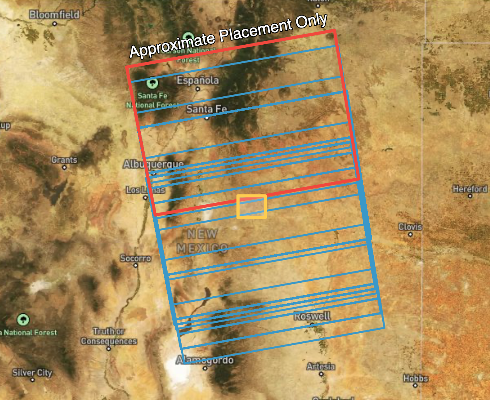

# ARIA Sentinel-1 GUNW Product Guide

This document is a guide for users of 
[ARIA Sentinel-1 Geocoded Unwrapped (GUNW) Interferograms](https://www.earthdata.nasa.gov/data/catalog/asf-aria-s1-gunw-1 "ASF-ARIA-S1-GUNW Products" ){target=_blank}.

The 
[ARIA Sentinel-1 Geocoded Unwrapped Interferogram (ARIA-S1-GUNW)](https://aria.jpl.nasa.gov/products/standard-displacement-products.html "aria.jpl.nasa.gov/products/standard-displacement-products.html" ){target=_blank} 
product is a standardized interferometric SAR (InSAR) dataset that enables rapid analysis of surface deformation 
using Sentinel-1 SAR data. Produced by 
[JPL’s ARIA](https://aria.jpl.nasa.gov/ "aria.jpl.nasa.gov" ){target=_blank} 
project and hosted at the 
[Alaska Satellite Facility (ASF) DAAC](https://www.earthdata.nasa.gov/centers/asf-daac "www.earthdata.nasa.gov/centers/asf-daac" ){target=_blank}, 
it provides CF-compliant NetCDF files at 90-m pixel spacing, containing unwrapped interferometric phase measurements, 
imaging geometry, various correction layers, and metadata. Products are available for VV polarization only.

With over 1.1 million (and growing!) freely available products covering major fault systems, volcanic regions, 
and coastal zones, ARIA-S1-GUNW products facilitate scientific research and disaster response by simplifying access 
to centimeter-scale ground displacement measurements. Generated through an open-source, cloud-based 
[ISCE2 TopsApp processing pipeline](https://github.com/parosen/Geo-SInC/blob/main/EarthScope2024/2.2_TOPS_Data_Processing/topsApp.ipynb "ISCE2 GitHub repository" ){target=_blank}, 
these products support applications such as earthquake impact assessment, volcanic monitoring, and long-term land 
motion studies, with ongoing improvements enhancing their accuracy and usability.

The ARIA project also maintains the 
[ARIA-tools](https://doi.org/10.1029/2020GL090013 "Toward Sustained Monitoring of Subsidence at the Coast Using InSAR and GPS" ){target=_blank} 
software package, which is a suite of open-source tools that allows users to automate the seamless download, 
post-processing manipulation, aggregation, and management of ARIA-S1-GUNW products. Refer to the 
[ARIA-tools GitHub page](https://github.com/aria-tools/ARIA-tools "ARIA-tools GitHub repository" ){target=_blank} 
for a more thorough overview and installation instructions, and 
[tutorials led by EarthScope Consortium](https://www.youtube.com/watch?v=_a9T59VTz7Q&t=12734s "EarthScope Tutorials on YouTube" ){target=_blank}, 
which demonstrate practical applications.

!!! tip "ARIA-S1-GUNW products are not produced globally"

    ARIA-S1-GUNW products are routinely produced only for specific locations, so the ASF archive may not contain 
    products in your area of interest. See the 
    [Ordering On Demand Products section](#ordering-on-demand-products "Jump to Ordering On Demand Products section of this document") 
    for information on ordering ARIA-S1-GUNW products for specific Sentinel-1 acquisitions.

## Archived and On-Demand Products

While there is a large archive of ARIA-S1-GUNW products that have already been generated and are 
[ready for download](#accessing-existing-products "Jump to Accessing Existing Products section of this document"), 
they may not cover your area of interest. In addition, the archived products may not include the full range of 
temporal baseline pairings required for your analysis. If you are interested in ARIA-S1-GUNW products that are not 
already represented in the archive, ASF provides the ability to 
[generate these products using specific Sentinel-1 SLC pairings](#ordering-on-demand-products "Jump to Ordering On Demand Products section of this document"). 

On Demand ARIA-S1-GUNW products are generated using the same code used by the ARIA project, and have been validated 
to ensure that products generated On Demand and those generated by the ARIA team at JPL are fully interoperable. 
Products generated On Demand are automatically added to the ARIA-S1-GUNW archive once processing is complete, where 
they can be found by anyone searching for ARIA-S1-GUNW products. 

## Accessing Existing Products

You can download existing ARIA-S1-GUNW products from the Alaska Satellite Facility’s (ASF) 
[Vertex](https://search.asf.alaska.edu/#/?dataset=SENTINEL-1%20INTERFEROGRAM%20(BETA) "Vertex ARIA-S1-GUNW Search" ){target=_blank} 
search portal by following these steps: 

1. **Access Vertex** – Go to the ASF Vertex website: 
   [https://search.asf.alaska.edu](https://search.asf.alaska.edu "search.asf.alaska.edu" ){target=blank}.
2. **Search for ARIA-S1-GUNW Products** – In the dataset selector, click on “ARIA S1 GUNW” to filter for these 
   specific products. You can refine results by specifying a geographic region, date range, or other criteria 
   using the search filters in the “filters” panel.

3. **Preview and Select Products** – Click on individual results to view metadata, including coverage area and 
   acquisition details.
4. **Download Data** – To download, first add ARIA-S1-GUNW products to your Download Queue using the 
   shopping cart icon next to each product, then download your selected products using the 
   [options available in the Download Queue interface](https://docs.asf.alaska.edu/vertex/manual/#downloads-queue "docs.asf.alaska.edu/vertex/manual/#downloads-queue" ){target=_blank}. 

Search results include both products generated by the ARIA team and products generated by users submitting 
ARIA-S1-GUNW jobs for On Demand processing.

## Ordering On-Demand Products

If the ARIA-S1-GUNW products you need are not available in the archive, you can use ASF's On Demand platform to submit 
custom ARIA-S1-GUNW jobs for processing. Once processing is complete, there are a couple of different approaches for 
[accessing On Demand GUNW products](#data-access "Jump to the Data Access section of this document"):

- You can access them as you would any other 
  [On-Demand](#accessing-products-using-on-demand-interfaces "Jump to the On Demand Interfaces section of this document" ) 
  products from ASF.
    - The download links provided will be active for 14 days.
- Products generated On Demand are also added to the archive and can be accessed by 
  [searching for ARIA S1 GUNW](#accessing-products-in-the-archive "Jump to the Accessing Products in the Archive section of this document" ) 
  products.
    - The links to the archived products never expire. 

!!! warning "Sentinel-1C acquisitions not yet supported" 

    ISCE2 software, which is used for processing ARIA-S1-GUNW products, does not currently support processing 
    SLCs acquired by the newly launched Sentinel-1C platform. Until the software package is updated, users will 
    not be able to submit ARIA-S1-GUNW jobs that include Sentinel-1C acquisitions for On-Demand processing.

### ARIA Frame IDs

Sentinel-1 IW SLC products are not created in a way that ensures that granules for the same relative orbit and 
location always fully overlap over time. This results in inconsistent framing of the Sentinel-1 IW SLCs that can 
make it difficult to create longer series of Sentinel-1 InSAR products.

In the image below, Sentinel-1 footprints acquired over an area of interest are displayed. Over the full period of 
record of the mission, the SLC framing has shifted considerably, resulting in some acquisitions that hardly 
overlap at all. 

To address this issue, the ARIA team defined a standard set of geographic footprints, called frames, that set the 
geographic extent for each ARIA-S1-GUNW product. This is possible because while the Sentinel-1 IW SLC products are 
not consistently framed along the orbit path, the smaller burst SLCs that comprise each Sentinel-1 IW SLC product 
*do* have consistent footprints. 

Each ARIA frame is defined by the extent of a specific collection of these individual burst SLCs. Each ARIA-S1-GUNW 
product is processed to the extent of one of these frames, which results in output products with consistent footprints 
through time. **ARIA-S1-GUNW products containing the same bursts, and thus sharing the same geographic footprint, are 
said to have the same *ARIA Frame ID*.**

To ensure that ARIA-S1-GUNW products are always created using standard footprints, the ARIA Frame ID needs to be 
provided along with the reference and secondary granules that cover this footprint for a given date in order to 
create a new ARIA-S1-GUNW product (see figure below).

#### ARIA Frame ID Maps

The ARIA project provides geojson files indicating the extent of each ARIA Frame ID. These files can be 
downloaded and used for reference. You may find it helpful to extract the polygon for a specific frame 
from the geojson and use the 
[Import AOI functionality in Vertex](https://docs.asf.alaska.edu/vertex/manual/#area-of-interest-options "docs.asf.alaska.edu/vertex/manual/#area-of-interest-options" ){target=_blank} 
to search for Sentinel-1 acquisitions over that frame. 

There are different ARIA Frame ID maps for the ascending and descending orbit directions. Make sure that you are 
using the appropriate geojson file. 

- [Ascending ARIA Frame IDs](https://d3g9emy65n853h.cloudfront.net/ARIA_S1_GUNW/ascending.geojson "ARIA-S1-GUNW Ascending Frame IDs GeoJSON" ){target=_blank} 
- [Descending ARIA Frame IDs](https://d3g9emy65n853h.cloudfront.net/ARIA_S1_GUNW/descending.geojson "ARIA-S1-GUNW Descending Frame IDs GeoJSON" ){target=_blank}

### Search for Sentinel-1 SLC Acquisition Dates for an ARIA Frame ID

The ARIA processing code takes a list of reference and secondary Sentinel-1 IW SLC granules as input, but 
it can be tricky to find all of the necessary granules for a given ARIA Frame ID. To ensure that there is 
full coverage over the desired ARIA Frame, **users will just pass the ARIA Frame ID and the dates of the 
desired primary and secondary passes over that frame into the On-Demand job specification** rather than 
assembling lists of primary and secondary SLCs.

To find suitable primary and secondary acquisition dates to use for a specific ARIA Frame ID, use a 
[Geographic Search](https://docs.asf.alaska.edu/vertex/manual/#geographic-search-options "Vertex Manual: Geographic Search Options" ){target=_blank} 
for Sentinel-1 SLC IW products in 
[Vertex](https://search.asf.alaska.edu/#/ "search.asf.alaska.edu" ){target=_blank}, 
setting the Area of Interest to the desired ARIA Frame ID, as delineated in the 
[ARIA Frame ID maps](#aria-frame-id-maps "Jump to the ARIA Frame ID Maps section of this document"). 

Applying appropriate filters to the 
[Geographic Search](https://search.asf.alaska.edu/#/ "search.asf.alaska.edu" ){target=_blank} 
will help ensure that you find results that match the desired [ARIA Frame ID](#aria-frame-id-maps "Jump to the ARIA Frame ID Maps section of this document"):

- **Area of Interest**: use the extent of the desired ARIA Frame from the reference geojson, or drop a point 
  in the middle of the ARIA Frame location
- **Start Date** / **End Date**: restrict the date range as desired
- **File type**: `L1 Single Look Complex (SLC)`
- **Beam Mode**: `IW`
- **Polarization**: select both `VV+VH` and `VV` (HH ARIA S1 GUNW products are not supported)
    - Note that only the VV polarization will be processed, but this will include VV SLCs acquired in both 
      dual-pol and single-pol modes in the search results
- **Direction**: match the orbit direction of the [ARIA Frame ID reference geojson](#aria-frame-id-maps "Jump to the ARIA Frame ID Maps section of this document") 
  used to select the desired ARIA Frame (or reference the `dir` attribute from the ARIA Frame ID geojson file)
- **Subtype**: select both `SA` and `SB` (ARIA S1 GUNW products from Sentinel-1C acquisitions are not currently
  supported)
- **Path Start** / **Path End**: path of the desired ARIA Frame (`path` attribute from the ARIA Frame ID geojson file)

Select an acquisition that intersects the ARIA Frame ID for a date you want to include in your InSAR pair, then use the 
[Baseline](https://docs.asf.alaska.edu/vertex/baseline/ "docs.asf.alaska.edu/vertex/baseline" ){target=_blank} or 
[SBAS](https://docs.asf.alaska.edu/vertex/sbas/ "docs.asf.alaska.edu/vertex/sbas" ){target=_blank} 
tool to find an appropriate date to pair with it.

Common area covered by the selected reference and secondary scenes must cover at least 90% of the ARIA Frame. If 
the SLCs available for the submitted dates do not meet this coverage constraint, the job will fail to process.

### Submit On-Demand ARIA-S1-GUNW Jobs

!!! warning "On Demand support not currently available in Vertex for ARIA-S1-GUNW products"

    On-demand ARIA S1 GUNW products cannot currently be submitted directly from Vertex, but we plan to 
    make this feature available in the second half of 2025. 

    Vertex is still very useful for selecting Sentinel-1 SLC acquisition dates to submit for processing, 
    but once you identify reference and secondary dates for the desired ARIA Frame ID, you will need to submit 
    the job for processing using the [HyP3 Python SDK](../using/sdk.md){target=_blank} or 
    [HyP3 API](../using/api.md){target=_blank}.

On-Demand ARIA-S1-GUNW jobs can be submitted using the `ARIA_S1_GUNW` job type via the 
[HyP3 API](../using/api.md#submitting-aria-s1-gunw-jobs "hyp3-docs.asf.alaska.edu/using/api/#submitting-aria-s1-gunw-jobs" ){target=_blank}, 
or via the [HyP3 Python SDK](../using/sdk.md "hyp3-docs.asf.alaska.edu/using/sdk" ){target=_blank} 
using the `submit_aria_s1_gunw_job` method of the `HyP3` class.

Unlike ASF's other On-Demand InSAR workflows, customizable processing options (multilooking, filter strength, etc.) 
are not available for ARIA-S1-GUNW jobs.

To submit an ARIA_S1_GUNW job, all you need is: 

- the ARIA Frame ID number 
- the reference date, which is the **more recent pass** over the ARIA Frame
- the secondary date, which is the **earlier pass** over the ARIA Frame 

The dates must be in YYYY-MM-DD format.

#### Reference and Secondary Dates

ARIA S1 GUNW products use the SLCs from the more recent pass as reference, while secondary scenes are from the 
earlier pass in the date pair. **When submitting a job using the HyP3 API or SDK, the date passed as the reference 
date *must* be more recent than the secondary date. If they are in the opposite order, an error will be raised.**

Note that ***this order is opposite of the other On-Demand InSAR products available from ASF***. Both the 
[InSAR GAMMA](insar_product_guide.md "Jump to InSAR Product Guide") products and the 
[Burst InSAR](burst_insar_product_guide.md "Jump to Burst InSAR Product Guide" ) products use the 
earlier acquisition as reference, and the more recent acquisition as secondary. This means that the ARIA unwrapped 
interferograms have the *opposite* sign from the unwrapped interferograms generated by the other ASF On-Demand InSAR 
workflows. In the ARIA S1 GUNW products, negative phase differences indicate movement away from the sensor and 
positive phase differences indicate movement towards the sensor.

## Product Packaging

### Naming convention

The ARIA-S1-GUNW product names contain detailed information about their acquisition and processing, 
as illustrated in the figure below.

GUNW naming convention includes:

- Satellite orientation. A for ascending or D for descending
- Satellite look direction. L for left-looking or R for right-looking
- Satellite track number (3-digit number)
- Reference and secondary acquisition dates (YYYYMMDD)
- Center time of reference scene(s) in UTC (HHMMSS)
- Longitude and latitude in whole degrees
- Unique product hash
- Standard product version

### Product Elements

The product is packaged as a NetCDF4 file, with its top-level group named `science`. Within the science group, 
there is a `grids` group, which is further divided into three subgroups: `data`, `imagingGeometry`, and `corrections`. 

- The `data` group contains 2D datasets at a resolution of 3 arc-seconds (~90 m).
- The `imagingGeometry` group includes 3D datasets posted laterally at 0.1-degree intervals (~11 km). 
- The `corrections` group provides ionospheric and solid Earth corrections, and if a weather model is available, 
  the corresponding tropospheric correction layer (`HRRR/reference/troposphereWet`) will be included here. 
  
All 2D and 3D datasets are in the EPSG:4326 projection.

The output netCDF file will include the layers listed in the table below.

| Group           | Dataset Name                          | Description                                          | Units    |
|-----------------|---------------------------------------|------------------------------------------------------|----------|
| data            | amplitude                             | 2D Amplitude of IFG                                  | watt     |
|                 | coherence                             | 2D Coherence [0-1] from filtered IFG                 | unitless |
|                 | connectedComponents                   | 2D Connected component file                          | unitless |
|                 | unfilteredCoherence                   | 2D Coherence [0-1] from unfiltered IFG               | unitless |
|                 | unwrappedPhase                        | 2D Filtered unwrapped IFG geocoded                   | rad      |
| corrections     | ionosphere                            | 2D Split spectrum ionospheric delay                  | rad      |
|                 | ionosphereBurstRamps                  | Digital elevation model                              | rad      |
|                 | reference/solidEarthTide              | 2D/3D solid earth tide for reference granule         | rad      |
|                 | secondary/solidEarthTide              | 2D/3D solid earth tide for secondary granule         | rad      |
|                 | HRRR/reference/troposphereWet         | 2D/3D wet troposphere for reference granule          | rad      |
|                 | HRRR/secondary/troposphereWet         | 2D/3D wet troposphere for secondary granule          | rad      |
|                 | HRRR/reference/troposphereHydrostatic | 2D/3D hydrostatic troposphere for reference granule  | rad      |
|                 | HRRR/secondary/troposphereHydrostatic | 2D/3D hydrostatic troposphere for secondary granule  | rad      |
| imagingGeometry | azimuthAngle                          | 3D azimuth angle grid                                | degree   |
|                 | incidenceAngle                        | 3D Incidence angle grid                              | degree   |
|                 | lookAngle                             | 3D look angle grid                                   | degree   |
|                 | parallelBaseline                      | 3D parallel baseline grid                            | meter    |
|                 | perpendicularBaseline                 | 3D perpendicular baseline grid                       | meter    |

### Ionospheric Correction Layer

Although the ionospheric effects for C-band SAR are only about one-sixteenth of those at L-band, the measurement 
accuracy of Sentinel-1 C-band SAR data can still be degraded by long-wavelength ionospheric signals. Utilizing the 
[range-split spectrum methodology](https://doi.org/10.1109/TGRS.2019.2908494 "doi.org/10.1109/TGRS.2019.2908494" ){target=_blank} available within ISCE2, 
ARIA-S1-GUNW products include an ionospheric correction layer packaged as a differential field between the 
secondary and reference input data, which can be directly subtracted from the unwrappedPhase field.

### Solid Earth Tides Correction Layers

[Solid Earth tides](https://doi.org/10.1109/TGRS.2022.3168509 "doi.org/10.1109/TGRS.2022.3168509" ){target=_blank} 
(SET) are periodic deformations of the Earth's crust caused by gravitational forces from the Moon and Sun, 
resulting in surface displacements of up to several centimeters. Correcting for SET in InSAR is crucial to prevent 
these predictable, cyclic motions from being misinterpreted as real ground deformation. ARIA-S1-GUNW products 
include an SET correction layer for both the reference and secondary input data that are created using the 
[PySolid](https://github.com/insarlab/PySolid?tab=readme-ov-file "PySolid GitHub repository" ){target=_blank} 
python package.

### Tropospheric Delay Correction Layers

Tropospheric delay correction is essential for many InSAR applications because atmospheric variations in temperature, 
pressure, and humidity can distort phase measurements, mimicking ground deformation and reducing accuracy. 
ARIA-S1-GUNW products for both the continental U.S. and Alaska also contain a tropospheric delay correction layer 
that is produced via the Raytracing Atmospheric Delay Estimation for RADAR 
([RAiDER](https://github.com/dbekaert/RAiDER "RAiDER GitHub repository" ){target=_blank}) Python package.

RAiDER uses the 
[NOAA High-Resolution Rapid Refresh](https://rapidrefresh.noaa.gov/hrrr/ "rapidrefresh.noaa.gov/hrrr" ){target=blank} 
weather model to calculate the tropospheric delay correction at a spatial resolution of approximately 3 km. If the 
HRRR weather model is not available for a location of interest, (i.e. outside of the continental U.S. and Alaska) the 
tropospheric delay correction layer will not be included in the ARIA-S1-GUNW product. The wet and hydrostatic 
tropospheric delay correction are provided for both the reference and secondary input data.

## Data Access

ARIA S1 GUNW On-Demand products can be accessed like any other On-Demand product, but can also be accessed by 
searching the archive.

### Accessing Products using On Demand Interfaces

Refer to the 
[Downloads](../using/downloading.md "hyp3-docs.asf.alaska.edu/using/downloading") 
page for more information on viewing and downloading ARIA S1 GUNW On Demand products in Vertex or programmatically. 
Once processing is complete, download links for On Demand products are valid for 14 days.

### Accessing Products in the Archive

Once the submitted jobs have been processed, they are added to the archive of ARIA-S1-GUNW products. Use the 
[Geographic Search in Vertex](https://search.asf.alaska.edu/#/?maxResults=1000&dataset=SENTINEL-1%20INTERFEROGRAM%20(BETA) "ASF Search for ARIA S1 GUNW Products" ){target=_blank} 
to find all of the products (both those generated by the ARIA project and those generated On Demand) available for your 
area of interest. The download links for archived ARIA-S1-GUNW products never expire. 

You can also search for ARIA S1 GUNW products programmatically using the 
[asf_search Python Package](https://pypi.org/project/asf-search/ "pypi.org/project/asf-search" ){target=_blank}. 
Again, results will include products generated by the ARIA team along with any On Demand ARIA-S1-GUNW products that 
have completed processing.

## References
Bekaert, David, et al. "The ARIA-S1-GUNW: The ARIA Sentinel-1 Geocoded Unwrapped Phase Product for Open InSAR Science 
and Disaster Response." IGARSS 2023-2023 IEEE International Geoscience and Remote Sensing Symposium. IEEE (2023).

Buzzanga, Brett, et al. "Toward sustained monitoring of subsidence at the coast using InSAR and GPS: An application 
in Hampton Roads, Virginia." Geophysical Research Letters 47.18 (2020): e2020GL090013.

Liang, Cunren, et al. "Ionospheric correction of InSAR time series analysis of C-band Sentinel-1 TOPS data." 
IEEE Transactions on Geoscience and Remote Sensing 57.9 (2019): 6755-6773.

Yunjun, Zhang, et al. "Range geolocation accuracy of C-/L-band SAR and its implications for operational stack 
coregistration." IEEE Transactions on Geoscience and Remote Sensing 60 (2022): 1-19.
