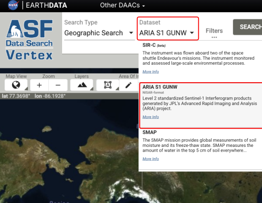
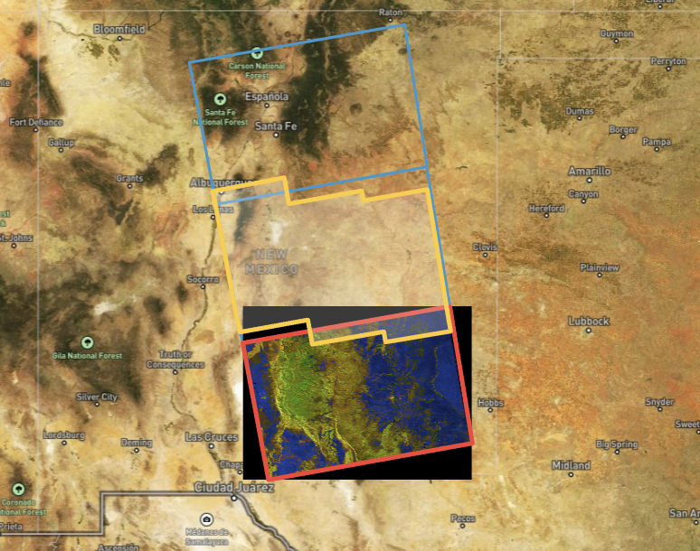
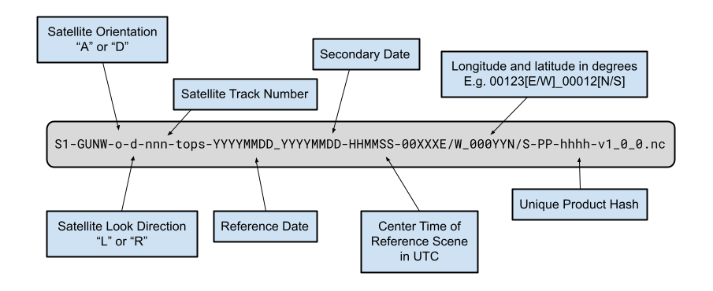




# Sentinel-1 GUNW Product Guide

This document is a guide for users of Sentinel-1 Geocoded Unwrapped (GUNW) Interferometric Synthetic Aperture Radar (InSAR) products.

The ARIA Sentinel-1 Geocoded Unwrapped Phase (ARIA-S1-GUNW) product is a standardized InSAR dataset that enables rapid analysis of surface deformation using Sentinel-1 SAR data. Produced by [JPL’s ARIA](https://aria.jpl.nasa.gov/){target=_blank} project and hosted at the [Alaska Satellite Facility (ASF) DAAC](https://www.earthdata.nasa.gov/centers/asf-daac){target=_blank}, it provides 90-meter resolution, CF-compliant NetCDF files containing unwrapped interferometric phase, imaging geometry, various correction layers, and metadata. 

With over 1.1 million (and growing!) freely available products covering major fault systems, volcanic regions, and coastal zones, ARIA-S1-GUNW products facilitate scientific research and disaster response by simplifying access to centimeter-scale ground displacement measurements. Generated through an open-source, cloud-based [ISCE2 TopsApp processing pipeline](https://github.com/isce-framework/isce2-docs/blob/master/Notebooks/UNAVCO_2020/TOPS/topsApp.ipynb){target=_blank}, these products support applications such as earthquake impact assessment, volcanic monitoring, and long-term land motion studies, with ongoing improvements enhancing their accuracy and usability.

!!! warning "ARIA-S1-GUNW products are not produced globally"

    ARIA-S1-GUNW products are only produced by the ARIA team for key locations, so the ASF archive may not contain the products you're looking for. See the [Ordering On Demand InSAR Products section](#ordering-on-demand-insar-products "Jump to Ordering On Demand InSAR Products section of this document") for information on ordering ARIA-S1-GUNW products for your area of interest.




### Accessing Existing Products

You can download existing ARIA-S1-GUNW products from the Alaska Satellite Facility’s (ASF) [Vertex](https://search.asf.alaska.edu/#/?dataset=SENTINEL-1%20INTERFEROGRAM%20(BETA)){target=_blank} search portal by following these steps: 

1. **Access Vertex** – Go to the ASF Vertex website: [https://search.asf.alaska.edu](https://search.asf.alaska.edu){target=blank}.
2. **Search for ARIA-S1-GUNW Products** – In the dataset selector, click on “ARIA S1 GUNW” to filter for these specific products. You can refine results by specifying a geographic region, date range, or other criteria using the search filters in the “filters” panel.

3. **Preview and Select Products** – Click on individual results to view metadata, including coverage area and acquisition details.
4. **Download Data** – To download, first add ARIA-S1-GUNW products to your download queue using the shopping cart icon next to each product, then download your selected products using the “download” panel.

You can also use the Vertex SBAS tool to download networks of interferograms for a specific location. See [this guide](https://docs.asf.alaska.edu/vertex/sbas/){target=_blank} for more information.




!!! warning "On Demand Vertex support not currently available for ARIA-S1-GUNW products"

    On-demand ARIA S1 GUNW generation via Vertex is not currently available, but we plan to make this feature available in the second half of 2025.



!!! tip "Be aware of the frame interface when requesting ARIA-S1-GUNW products"

    To address the "jittering" of Sentinel-1 SLCs granules, ARIA-S1-GUNW products take an extra frame-id parameter that standardizes the footprint of ARIA-S1-GUNW products. See the [ARIA Frame IDs](#aria-frame-ids "Jump to ARIA Frame IDs section of this document") for more information on submitting ARIA-S1-GUNW jobs



### ARIA Frame IDs
Sentinel-1 SLC products are not created in a way that ensures that granules for the same relative orbit and location but different dates always fully overlap. This results in a frame “jitter” that can make it difficult to create longer series of Sentinel-1 InSAR products.

To address this issue, the ARIA team defined a standard set of geographic footprints (i.e., frames) that set the geographic extent for each ARIA-S1-GUNW product. This is possible because while the Sentinel-1 SLC products exhibit jitter along the orbit, the smaller burst SLCs that each Sentinel-1 SLC product is composed of do have a fixed footprint (e.g., the bursts contained within a given Sentinel-1 SLC product changes based on the acquisition). Thus ARIA-S1-GUNW frames are defined via the specific bursts that each ARIA-S1-GUNW product contains. **ARIA-S1-GUNWs containing the same bursts, and thus sharing the same geographic footprint, are said to have the same ARIA Frame ID.**

To ensure that ARIA-S1-GUNW products are always created using the standard footprints, the ARIA Frame ID along with the reference and secondary granules that intersect this footprint for a given date need to be provided in order to create a new ARIA-S1-GUNW product (see figure below).

It can be tricky to find the appropriate granules for a given ARIA Frame ID, and in the future, we plan to create utilities to simplify this process. For the meantime, a geojson detailing the *ascending* ARIA Frame IDs can be downloaded [here](https://d3g9emy65n853h.cloudfront.net/ARIA_S1_GUNW/ascending.geojson){target=_blank} and a geojson detailing the *descending* ARIA Frame IDs can be downloaded [here](https://d3g9emy65n853h.cloudfront.net/ARIA_S1_GUNW/descending.geojson){target=_blank}.




## Product Packaging

### Naming convention

The ARIA-S1-GUNW product names contain detailed information about their acquisition and processing, as illustrated in the figure below.

GUNW naming convention includes:

- The imaging platform name, which is always S1 for Sentinel-1.
- Dataset name of the product (GUNW)
- Satellite orientation. A for ascending or D for descending
- Satellite look direction. L for left-looking or R for right-looking
- Satellite track (3-digit number)
- Acquisition mode
- Reference and secondary acquisition dates (YYYYMMDD)
- Center time of product in UTC (HHMMSS)
- Decimal latitude of the western edge of the south and northernmost IFG corners (5-digit number with 3 significant digits)
- Precise (P) or restituted (R) orbit precision for reference and secondary acquisition, respectively
- Data system tag (unique hash for each product)
- Standard product version tag

### Product Elements

The product is packaged as a NetCDF4 file, with its top-level group named "science." Within the science group, there is a "grids" group, which is further divided into three subgroups: "data," "imagingGeometry," and "corrections." The "data" group contains 2D datasets at a resolution of 3 arc-seconds (~90 m) and the "imagingGeometry" group includes 3D datasets posted laterally at 0.1-degree intervals (~11 km). The "corrections" group provides ionospheric, tropospheric, and solid Earth corrections, and if a weather model is available, the corresponding weather model file will be included here. All 2D and 3D datasets are in the EPSG:4326 projection.

The output netCDF file will include the layers listed in the table below.

| Group           | Dataset Name             | Description                                  | Units    |
|-----------------|--------------------------|----------------------------------------------|----------|
| data            | amplitude                | 2D Amplitude of IFG                          | watt     |
|                 | coherence                | 2D Coherence [0-1] from filtered IFG         | unitless |
|                 | connectedComponents      | 2D Connected component file                  | unitless |
|                 | unfilteredCoherence      | 2D Coherence [0-1] from unfiltered IFG       | unitless |
|                 | unwrappedPhase           | 2D Filtered unwrapped IFG geocoded           | rad      |
| corrections     | ionosphere               | 2D Split spectrum ionospheric delay          | rad      |
|                 | ionosphereBurstRamps     | Digital elevation model                      | rad      |
|                 | reference/solidEarthTide | 2D/3D solid earth tide for reference granule | rad      |
|                 | secondary/solidEarthTide | 2D/3D solid earth tide for secondary granule | rad      |
| imagingGeometry | azimuthAngle             | 3D azimuth angle grid                        | degree   |
|                 | incidenceAngle           | 3D Incidence angle grid                      | degree   |
|                 | lookAngle                | 3D look angle grid                           | degree   |
|                 | parallelBaseline         | 3D parallel baseline grid                    | meter    |
|                 | perpendicularBaseline    | 3D perpendicular baseline grid               | meter    |

### Ionospheric Correction Layers

Although the ionospheric effects for C-band SAR are only about one-sixteenth of those at L-band, the measurement accuracy of Sentinel-1 C-band SAR data can still be degraded by long-wavelength ionospheric signals. Utilizing the [range-split spectrum methodology](https://doi.org/10.1109/TGRS.2019.2908494){target=_blank} available within ISCE2, ARIA-S1-GUNW products include ionospheric correction layers for both the reference and secondary input data.

### Solid Earth Tides Correction Layers

[Solid Earth tides](https://doi.org/10.1109/TGRS.2022.3168509){target=_blank} (SET) are periodic deformations of the Earth's crust caused by gravitational forces from the Moon and Sun, resulting in surface displacements of up to several centimeters. Correcting for SET in InSAR is crucial to prevent these predictable, cyclic motions from being misinterpreted as real ground deformation. ARIA-S1-GUNW products include an SET correction layer for both the reference and secondary input data that are created using the [PySolid](https://github.com/insarlab/PySolid?tab=readme-ov-file){target=_blank} python package.

### Tropospheric Delay Correction Layers

Tropospheric delay correction is essential for many InSAR applications because atmospheric variations in temperature, pressure, and humidity can distort phase measurements, mimicking ground deformation and reducing accuracy. ARIA-S1-GUNW products for both the continental U.S. and Alaska also contain a tropospheric delay correction layer that is produced via the Raytracing Atmospheric Delay Estimation for RADAR ([RAiDER](https://github.com/dbekaert/RAiDER){target=_blank}) Python package.

RAiDER uses the [NOAA High-Resolution Rapid Refresh](https://rapidrefresh.noaa.gov/hrrr/){target=blank} weather model to calculate the tropospheric delay correction at a spatial resolution of approximately 3 km. If the HRRR weather model is not available for a location of interest, (e.g. outside of the continental U.S. and Alaska) the tropospheric delay correction layer will not be included in the ARIA-S1-GUNW product. The wet and hydrostatic tropospheric delay correction are provided for both the reference and secondary input data.





### References
Bekaert, David, et al. "The ARIA-S1-GUNW: The ARIA Sentinel-1 Geocoded Unwrapped Phase Product for Open InSAR Science and Disaster Response." IGARSS 2023-2023 IEEE International Geoscience and Remote Sensing Symposium. IEEE, 2023\.

Liang, Cunren, et al. "Ionospheric correction of InSAR time series analysis of C-band Sentinel-1 TOPS data." IEEE Transactions on Geoscience and Remote Sensing 57.9 (2019): 6755-6773.

Yunjun, Zhang, et al. "Range geolocation accuracy of C-/L-band SAR and its implications for operational stack coregistration." IEEE Transactions on Geoscience and Remote Sensing 60 (2022): 1-19.


