# ARIA Sentinel-1 GUNW Product Guide

This document is a guide for users of 
[ARIA Sentinel-1 Geocoded Unwrapped (GUNW) Interferograms](https://www.earthdata.nasa.gov/data/catalog/asf-aria-s1-gunw-1 "ASF-ARIA-S1-GUNW Products" ){target=_blank}.

The 
[ARIA Sentinel-1 Geocoded Unwrapped Interferogram (ARIA-S1-GUNW)](https://aria.caltech.edu/products/aria-s1-gunw "aria.caltech.edu/products/aria-s1-gunw" ){target=_blank} 
product is a standardized interferometric SAR (InSAR) dataset that enables rapid analysis of surface deformation 
using Sentinel-1 SAR data. Produced by 
[JPL’s ARIA](https://aria.caltech.edu/ "aria.caltech.edu" ){target=_blank} 
project and hosted at the 
[Alaska Satellite Facility (ASF) DAAC](https://www.earthdata.nasa.gov/centers/asf-daac "www.earthdata.nasa.gov/centers/asf-daac" ){target=_blank}, 
it provides CF-compliant NetCDF files at 90-m pixel spacing, containing unwrapped interferometric phase measurements, 
imaging geometry, various correction layers, and metadata. Products are available for VV polarization only.

With over 1.1 million (and growing!) freely available products covering major fault systems, volcanic regions, 
and coastal zones, ARIA-S1-GUNW products facilitate scientific research and disaster response by simplifying access 
to centimeter-scale ground displacement measurements. Generated through an open-source, cloud-based 
[ISCE2 TopsApp processing pipeline](https://github.com/parosen/Geo-SInC/blob/main/EarthScope2024/2.2_TOPS_Data_Processing/topsApp.ipynb "ISCE2 GitHub repository" ){target=_blank}, 
these products support applications such as earthquake impact assessment, volcanic monitoring, and long-term land 
motion studies, with ongoing improvements enhancing their accuracy and usability.

The ARIA project also maintains the 
[ARIA-tools](https://doi.org/10.1029/2020GL090013 "Toward Sustained Monitoring of Subsidence at the Coast Using InSAR and GPS" ){target=_blank} 
software package, which is a suite of open-source tools that allows users to automate the seamless download, 
post-processing manipulation, aggregation, and management of ARIA-S1-GUNW products. Refer to the 
[ARIA-tools GitHub page](https://github.com/aria-tools/ARIA-tools "ARIA-tools GitHub repository" ){target=_blank} 
for a more thorough overview and installation instructions, and 
[tutorials led by EarthScope Consortium](https://www.youtube.com/watch?v=_a9T59VTz7Q&t=12734s "EarthScope Tutorials on YouTube" ){target=_blank}, 
which demonstrate practical applications.

This work was funded in part by the [Enabling Cloud-Based InSAR Science for an Exploding NASA InSAR Data Archive](https://www.earthdata.nasa.gov/about/competitive-programs/access/cloud-based-insar "https://www.earthdata.nasa.gov/about/competitive-programs/access/cloud-based-insar" ){target=_blank}
project under NASA's [ACCESS](https://www.earthdata.nasa.gov/about/competitive-programs/access "https://www.earthdata.nasa.gov/about/competitive-programs/access" ){target=_blank} program.

!!! tip "ARIA-S1-GUNW products are not produced globally"

    ARIA-S1-GUNW products are routinely produced only for specific locations, so the ASF archive may not contain 
    products in your area of interest. See the 
    [Ordering On Demand Products section](#ordering-on-demand-products "Jump to Ordering On Demand Products section of this document") 
    for information on ordering ARIA-S1-GUNW products for specific Sentinel-1 acquisitions.

## Archived and On Demand Products

While there is a large archive of ARIA-S1-GUNW products that have already been generated and are 
[ready for download](#accessing-existing-products "Jump to Accessing Existing Products section of this document"), 
they may not cover your area of interest. In addition, the archived products may not include the full range of 
temporal baseline pairings required for your analysis. If you are interested in ARIA-S1-GUNW products that are not 
already represented in the archive, ASF provides the ability to 
[generate these products using specific Sentinel-1 SLC pairings](#ordering-on-demand-products "Jump to Ordering On Demand Products section of this document"). 

On Demand ARIA-S1-GUNW products are generated using the same code used by the ARIA project, and have been validated 
to ensure that products generated On Demand and those generated by the ARIA team at JPL are fully interoperable. 
Products generated On Demand are automatically added to the ARIA-S1-GUNW archive once processing is complete, where 
they can be found by anyone searching for ARIA-S1-GUNW products. 

## ARIA Frame IDs

Sentinel-1 IW SLC products are not created in a way that ensures that granules for the same relative orbit and 
location always fully overlap over time. This results in inconsistent framing of the Sentinel-1 IW SLCs that can 
make it difficult to create longer series of Sentinel-1 InSAR products.

In the image below, Sentinel-1 footprints acquired over an area of interest are displayed. Over the full period of 
record of the mission, the SLC framing has shifted considerably, resulting in some acquisitions that hardly 
overlap at all. 

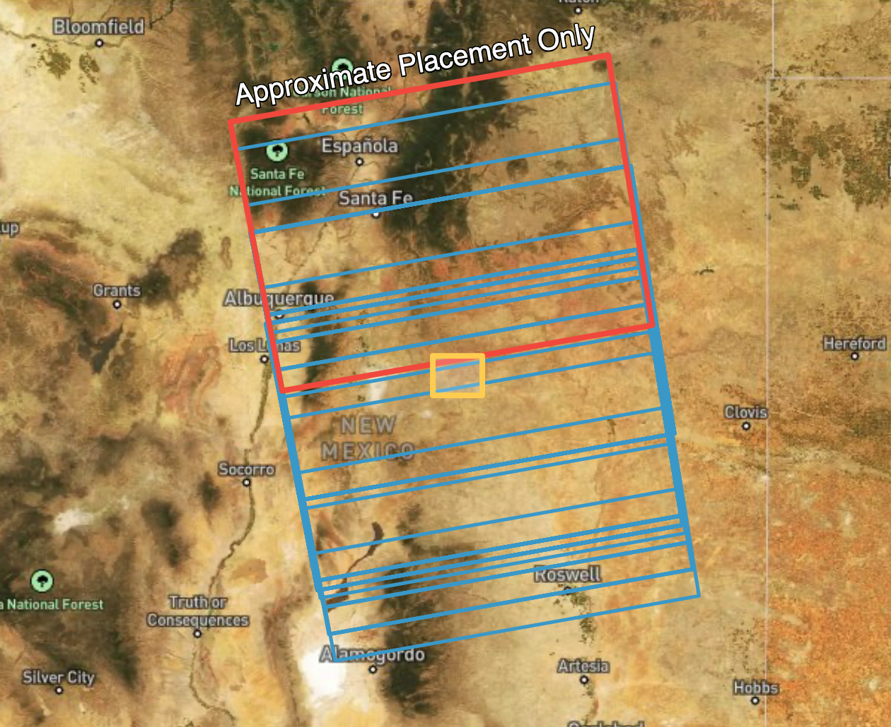

To address this issue, the ARIA team defined a standard set of geographic footprints, called frames, that set the 
geographic extent for each ARIA-S1-GUNW product. This is possible because while the Sentinel-1 IW SLC products are 
not consistently framed along the orbit path, the smaller burst SLCs that comprise each Sentinel-1 IW SLC product 
*do* have consistent footprints. 

Each ARIA frame is defined by the extent of a specific collection of these individual burst SLCs. Each ARIA-S1-GUNW 
product is processed to the extent of one of these frames, which results in output products with consistent footprints 
through time. **ARIA-S1-GUNW products containing the same bursts, and thus sharing the same geographic footprint, are 
said to have the same *ARIA Frame ID*.**

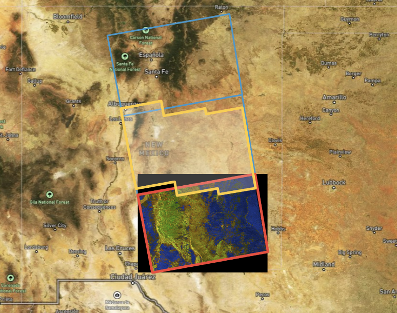

## Accessing Existing Products

You can download existing ARIA-S1-GUNW products from the Alaska Satellite Facility’s (ASF) 
[Vertex](https://search.asf.alaska.edu/#/?dataset=SENTINEL-1%20INTERFEROGRAM%20(BETA) "Vertex ARIA-S1-GUNW Search" ){target=_blank} 
search portal by following these steps: 

1. **Access Vertex** – Go to the ASF Vertex website: 
   [https://search.asf.alaska.edu](https://search.asf.alaska.edu "search.asf.alaska.edu" ){target=blank}.
2. **Search for ARIA-S1-GUNW Products** – In the dataset selector, click on **ARIA S1 GUNW** to filter for these 
   specific products. You can refine results by specifying a geographic region, date range, or other criteria 
   using the search filters in the “filters” panel.
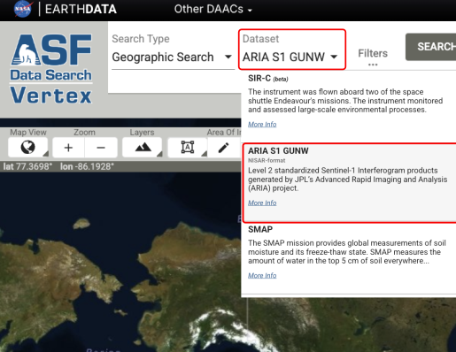
3. **Preview and Select Products** – Click on individual results to view metadata, including coverage area and 
   acquisition details.
4. **Download Data** – To download, first add ARIA-S1-GUNW products to your Download Queue using the 
   shopping cart icon next to each product, then download your selected products using the 
   [options available in the Download Queue interface](https://docs.asf.alaska.edu/vertex/manual/#downloads-queue "docs.asf.alaska.edu/vertex/manual/#downloads-queue" ){target=_blank}. 

Search results include both products generated by the ARIA team and products generated by users submitting 
ARIA-S1-GUNW jobs for On Demand processing.

## Ordering On Demand Products

If the ARIA-S1-GUNW products you need are not available in the archive, you can use ASF's On Demand platform to submit 
custom ARIA-S1-GUNW jobs for processing. 

To order ARIA-S1-GUNW products using 
[Vertex](https://search.asf.alaska.edu/#/?dataset=SENTINEL-1%20INTERFEROGRAM%20(BETA)), 
select **ARIA-S1-GUNW** from the Dataset menu for a **Geographic Search**, and turn on the **On Demand** toggle switch. 

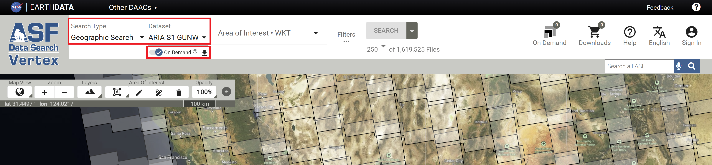

This displays an ARIA Frame ID map, which serves as the interface for selecting input scenes to submit for processing.

### ARIA Frame ID Maps

As described in the [ARIA Frame IDs section](#aria-frame-ids "Jump to the ARIA Frame IDs section"), ARIA-S1-GUNW 
products are processed based on frames that are consistent through time. There is a different set of ARIA Frame IDs 
for each orbit direction (Ascending and Descending). 

#### Flight Direction

By default, Vertex displays frames for the ***Ascending*** orbit direction. To view the frames for the 
***Descending*** orbit direction, click the **Filters** button and set the **Flight Direction** option to the 
desired direction.

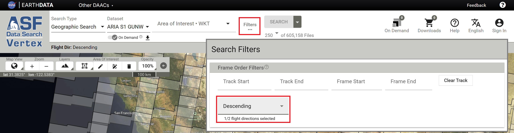

#### ARIA Frame ID GeoJSON

The ARIA project provides a 
[geojson file indicating the extent of each ARIA Frame ID](https://github.com/ASFHyP3/asf-enumeration/blob/develop/src/asf_enumeration/frame_maps/aria_frames.geojson "https://github.com/ASFHyP3/asf-enumeration/blob/develop/src/asf_enumeration/frame_maps/aria_frames.geojson" ){target=_blank}, 
which can be downloaded and used for reference outside of Vertex. When the **On Demand** toggle is activated, a 
download link for this geojson is displayed next to the toggle switch.

### Processing Parameters

While the ARIA processing code takes a list of reference and secondary Sentinel-1 IW SLC granules as input, 
On Demand users do not need to assemble these lists manually. 

To ensure full coverage over the desired ARIA Frame and avoid failures caused by incomplete granule lists, 
the ARIA-S1-GUNW On Demand job specification simply takes the **ARIA Frame ID** and the 
**dates of the desired primary and secondary passes** over that frame. 

### Search for ARIA-S1-GUNW Date Pairs

Vertex provides a good interface for finding suitable primary and secondary acquisition dates for a 
specific ARIA Frame ID. 

1. Perform a Vertex 
[Geographic Search](https://docs.asf.alaska.edu/vertex/manual/#geographic-search-options "Vertex Manual: Geographic Search Options" ){target=_blank} 
for the **ARIA S1 GUNW** Dataset and activate the **On Demand** toggle switch to view the ARIA frames. 

    - Recall that there are different frame maps available for Ascending and Descending orbit directions. Verify that 
      you have [selected the desired orbit direction](#flight-direction "Jump to the Flight Direction Section").
    - To select a different direction, click on the **Filters** button and use the **Direction** filter in the 
      **Additional Filters** section to select Ascending or Descending.

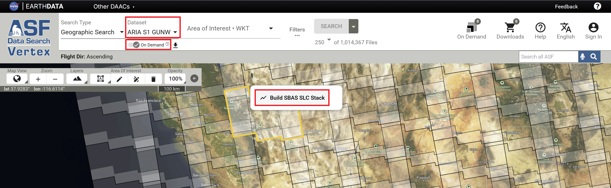

2. Click on the desired frame and click **Build SBAS SLC Stack** to find available date pairings for that frame. 
   This opens the [SBAS Tool](https://docs.asf.alaska.edu/vertex/sbas/) with the necessary parameters already set
   to support ARIA-S1-GUNW jobs: 

    - The tool opens in **Frame Mode**
    - The **Dataset** is set to ARIA-S1-GUNW
    - The **Frame** field is populated with the selected ARIA Frame ID

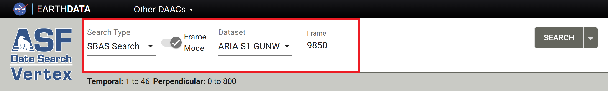

- Only date pairs that have the required 90% minimum coverage of the selected ARIA Frame are included in the results. 

!!! warning "ARIA-S1-GUNW Jobs Require SBAS Frame Mode"

    If ARIA-S1-GUNW jobs are submitted from the SBAS interface _without_ **Frame Mode** turned on, the jobs will fail. 
    
    To avoid potential errors when submitting ARIA-S1-GUNW jobs, it is best to use the ARIA-S1-GUNW 
    Geographic Search interface to launch the SBAS tool, which automatically provides the correct settings to 
    support ARIA-S1-GUNW SBAS stacks. 

    If you do access the SBAS tool using a Sentinel-1 Geographic Search, you will need to activate the **Frame Mode** 
    toggle _AND_ enter a valid ARIA Frame ID instead of a Sentinel-1 Scene name before you can submit 
    ARIA-S1-GUNW jobs for On Demand processing.
    
    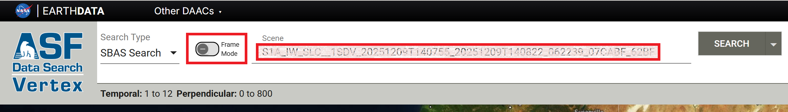{ style="float: center;" }

3. Adjust the SBAS parameters to refine the date pairs displayed in the list of results.

    - Click the **SBAS Filters** button to set or adjust the date range for the listed pairs
    - Use the vertical slider to restrict the results based on [perpendicular baseline](insar_product_guide.md#perpendicular-baseline "Jump to Perpendicular Baseline content") values (distance between the sensor location for the two acquisition dates)
    - Use the horizontal slider to refine [temporal baseline](insar_product_guide.md#temporal-baseline "Jump to Temporal Baseline content") values (the number of days between the two acquisition dates) included in the results

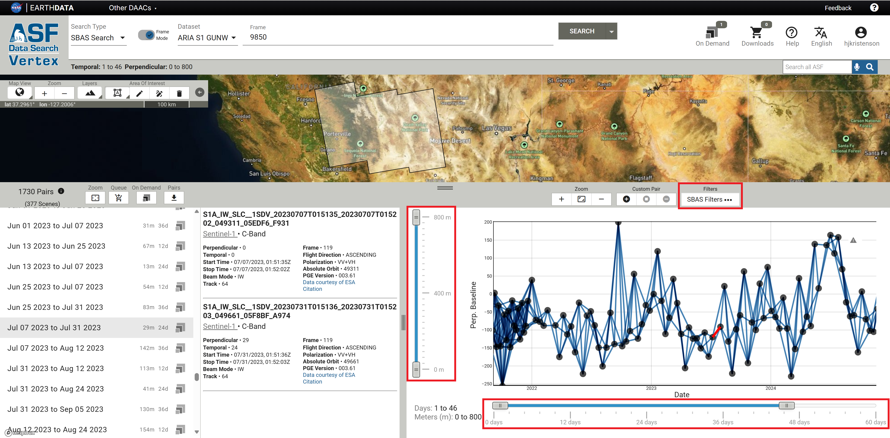

4. Click on the **On Demand** icon for a desired date pair, click the **ARIA_S1_GUNW** job type, and click 
   **Add 1 SLC Pair** to 
   [add it to the On Demand Queue](../using/vertex.md#1-select-your-scenes "Jump to the Using Vertex page of this documentation").

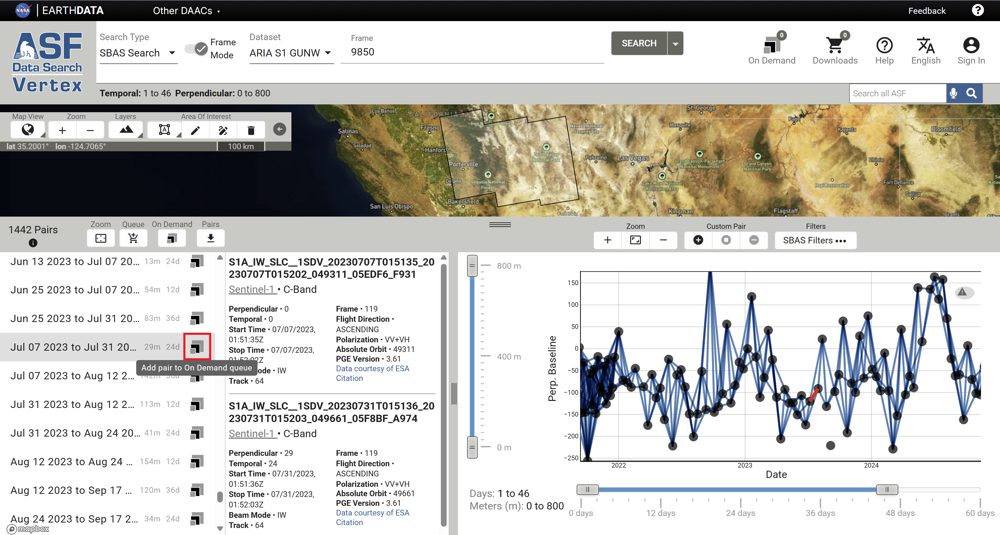

   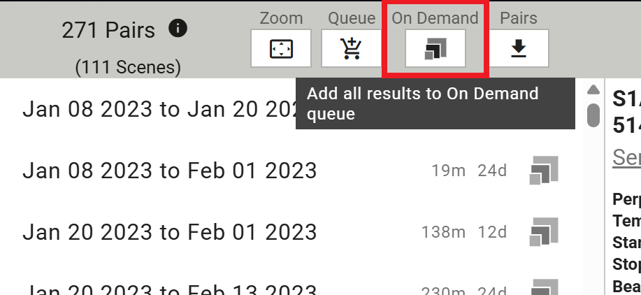{ width="30%"; style="float: right;" margin-left: "1em";}

   - To add all of the date pairs listed in the results to the On Demand Queue, click the **On Demand** button 
     at the top of the results list. Click on the **ARIA_S1_GUNW** job type, then select the option to add all of the 
     SLC pairs to the On Demand Queue.

### Submit On Demand ARIA-S1-GUNW Jobs

On Demand ARIA-S1-GUNW jobs can be submitted for processing using the 
[On Demand Queue in Vertex](#submit-jobs-in-vertex "Submit Jobs in Vertex") or 
[programmatically](#submit-jobs-programmatically "Submit Jobs Programmatically").

Unlike ASF's other On Demand InSAR workflows, customizable processing options (multilooking, filter strength, etc.) 
are not available for ARIA-S1-GUNW jobs.

#### Submit Jobs in Vertex

Once you have added the desired jobs to your [On Demand Queue](#search-for-aria-s1-gunw-date-pairs) in Vertex, 
click the large **On Demand** icon in the top right corner of Vertex and select **On Demand Queue** 
to view your On Demand Queue and 
[submit your processing request](../using/vertex.md#3-submit-your-request "Submit Your Request").

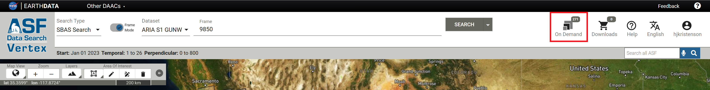

Review the list of jobs in the ARIA_S1_GUNW tab of the queue, then click the **Submit Jobs** button at the 
bottom of the window. You will have the option to enter a Project Name before completing the submission. 

!!! warning "ARIA-S1-GUNW Jobs Require Frame ID"
    
    ARIA-S1-GUNW jobs require a valid ARIA Frame ID when they are submitted for On Demand processing in Vertex. 

    If a Sentinel-1 SLC Scene is referenced for a job listed in the **ARIA-S1-GUNW** tab of the On Demand Queue in 
    Vertex, processing will fail. These jobs must reference an 
    [ARIA Frame ID](#search-for-aria-s1-gunw-date-pairs) 
    rather than a Sentinel-1 Scene.

    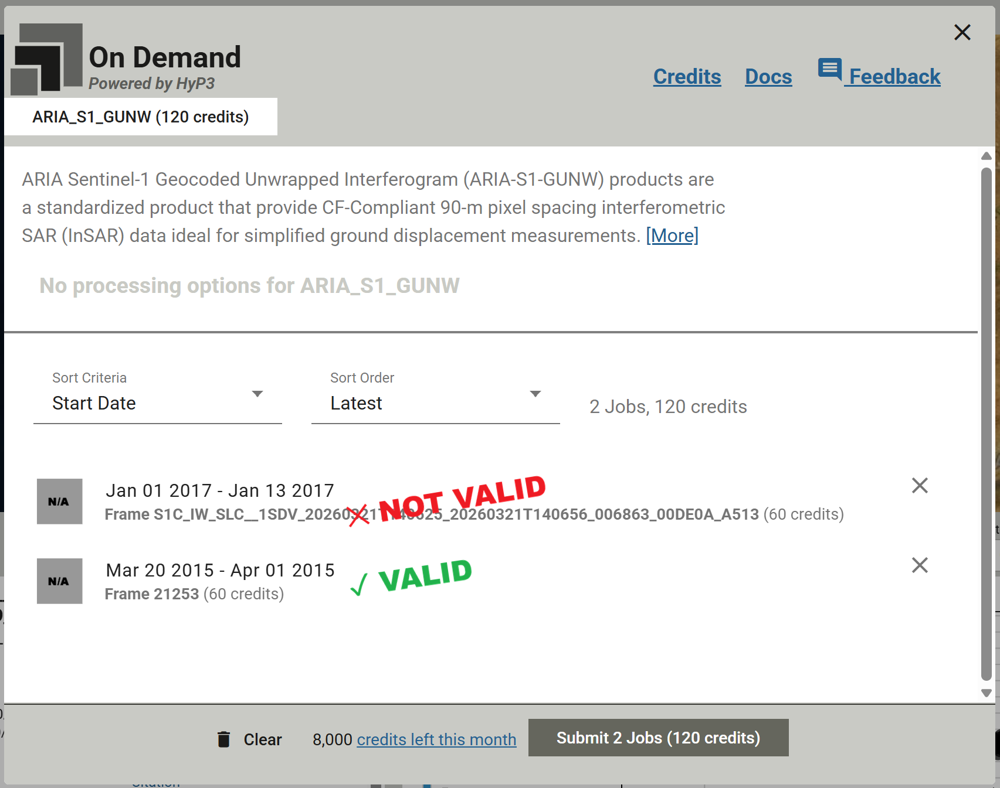{ width="85%"; style="float: center;" }

#### Submit Jobs Programmatically

There are two options for submitting jobs programmatically: 

- Use the `ARIA_S1_GUNW` job type in the 
  [HyP3 API](../using/api.md#submitting-aria-s1-gunw-jobs "hyp3-docs.asf.alaska.edu/using/api/#submitting-aria-s1-gunw-jobs" ){target=_blank}
- Use the `submit_aria_s1_gunw_job` method of the `HyP3` class in the 
  [HyP3 Python SDK](../using/sdk.md "hyp3-docs.asf.alaska.edu/using/sdk" ){target=_blank}

To submit an ARIA-S1-GUNW job using either of these programmatic approaches, the necessary parameters are: 

- the ARIA Frame ID number 
- the reference date, which is the **more recent pass** over the ARIA Frame
- the secondary date, which is the **earlier pass** over the ARIA Frame 

The dates must be in YYYY-MM-DD format.

#### Reference and Secondary Dates

ARIA-S1-GUNW products use the SLCs from the more recent pass as reference, while secondary scenes are from the 
earlier pass in the date pair. When submitting jobs in Vertex, the reference and secondary dates are automatically 
ordered for you based on the date pairs selected from the frame-based SBAS search results. 

**When submitting a job using the HyP3 API or SDK, the date passed as the reference 
date *must* be more recent than the secondary date. If they are in the opposite order, an error will be raised.**

Note that ***this is the opposite order than what is used for all other On Demand InSAR products available from ASF***. 
Both the [InSAR GAMMA](insar_product_guide.md "Jump to InSAR Product Guide") products and the 
[Burst InSAR](burst_insar_product_guide.md "Jump to Burst InSAR Product Guide" ) products use the 
earlier acquisition as reference, and the more recent acquisition as secondary. 

This means that the **ARIA unwrapped interferograms have the *opposite* sign from the unwrapped interferograms 
generated by the other ASF On Demand InSAR workflows**. In the ARIA-S1-GUNW products, negative phase differences 
indicate movement away from the sensor and positive phase differences indicate movement towards the sensor.

## Product Packaging

### Naming convention

The ARIA-S1-GUNW product names contain detailed information about the acquisitions and processing 
workflows used to generate them, including:

- Satellite orientation. A for ascending or D for descending
- Satellite look direction. L for left-looking or R for right-looking
- Satellite track number (3-digit number)
- Reference and secondary acquisition dates (YYYYMMDD)
- Center time of reference scene(s) in UTC (HHMMSS)
- Longitude and latitude in whole degrees
- Unique product hash
- Standard product version

This results in a filename constructed as illustrated in the figure below:

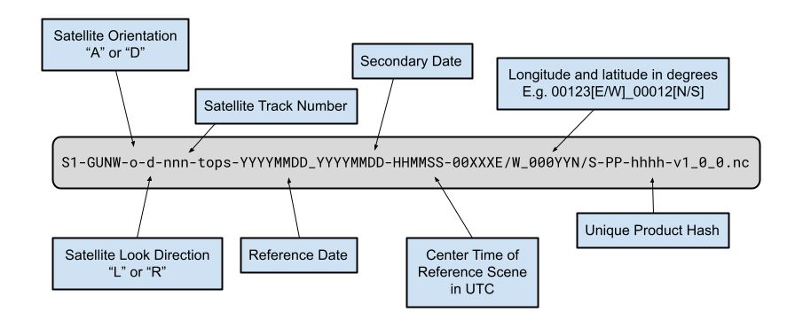

### Product Elements

The product is packaged as a NetCDF4 file, with its top-level group named `science`. Within the science group, 
there is a `grids` group, which is further divided into three subgroups: `data`, `imagingGeometry`, and `corrections`. 

- The `data` group contains 2D datasets at a resolution of 3 arc-seconds (~90 m).
- The `imagingGeometry` group includes 3D datasets posted laterally at 0.1-degree intervals (~11 km). 
- The `corrections` group provides ionospheric and solid Earth corrections, and if a weather model is available, 
  the corresponding tropospheric correction layer (`HRRR/reference/troposphereWet`) will be included here. 
  
All 2D and 3D datasets are in the EPSG:4326 projection.

The output netCDF file will include the layers listed in the table below.

| Group           | Dataset Name                          | Description                                          | Units    |
|-----------------|---------------------------------------|------------------------------------------------------|----------|
| data            | amplitude                             | 2D Amplitude of IFG                                  | watt     |
|                 | coherence                             | 2D Coherence [0-1] from filtered IFG                 | unitless |
|                 | connectedComponents                   | 2D Connected component file                          | unitless |
|                 | unfilteredCoherence                   | 2D Coherence [0-1] from unfiltered IFG               | unitless |
|                 | unwrappedPhase                        | 2D Filtered unwrapped IFG geocoded                   | rad      |
| corrections     | ionosphere                            | 2D Split spectrum ionospheric delay correction       | rad      |
|                 | ionosphereBurstRamps                  | 2D Split spectrum ionospheric burst ramp correction  | rad      |
|                 | reference/solidEarthTide              | 3D solid earth tide for reference granule            | rad      |
|                 | secondary/solidEarthTide              | 3D solid earth tide for secondary granule            | rad      |
|                 | HRRR/reference/troposphereWet         | 3D wet troposphere for reference granule             | rad      |
|                 | HRRR/secondary/troposphereWet         | 3D wet troposphere for secondary granule             | rad      |
|                 | HRRR/reference/troposphereHydrostatic | 3D hydrostatic troposphere for reference granule     | rad      |
|                 | HRRR/secondary/troposphereHydrostatic | 3D hydrostatic troposphere for secondary granule     | rad      |
| imagingGeometry | azimuthAngle                          | 3D azimuth angle grid                                | degree   |
|                 | incidenceAngle                        | 3D Incidence angle grid                              | degree   |
|                 | lookAngle                             | 3D look angle grid                                   | degree   |
|                 | parallelBaseline                      | 3D parallel baseline grid                            | meter    |
|                 | perpendicularBaseline                 | 3D perpendicular baseline grid                       | meter    |

### Ionospheric Correction Layer

Although the ionospheric effects for C-band SAR are only about one-sixteenth of those at L-band, the measurement 
accuracy of Sentinel-1 C-band SAR data can still be degraded by long-wavelength ionospheric signals. Utilizing the 
[range-split spectrum methodology](https://doi.org/10.1109/TGRS.2019.2908494 "doi.org/10.1109/TGRS.2019.2908494" ){target=_blank} 
available within ISCE2, 
ARIA-S1-GUNW products include an ionospheric correction layer packaged as a differential field between the 
secondary and reference input data. Since these layers have smooth variation in space they are downsampled to 
33 arc-seconds (~1 km), and thus have to be interpolated before being subtracted from the unwrappedPhase field, 
which is sampled at 3 arc-seconds (~90 m).

### Solid Earth Tides Correction Layers

[Solid Earth tides](https://doi.org/10.1109/TGRS.2022.3168509 "doi.org/10.1109/TGRS.2022.3168509" ){target=_blank} 
(SET) are periodic deformations of the Earth's crust caused by gravitational forces from the Moon and Sun, 
resulting in surface displacements of up to several centimeters. Correcting for SET in InSAR is crucial to prevent 
these predictable, cyclic motions from being misinterpreted as real ground deformation. ARIA-S1-GUNW products 
include SET correction layers, created using the 
[PySolid](https://github.com/insarlab/PySolid?tab=readme-ov-file "PySolid GitHub repository" ){target=_blank} 
python package, for both the reference and secondary input data. These layers are packaged within the products as 3D 
datasets posted laterally at 0.1-degree intervals (~11 km) and vertically at the following height intervals: 
-1.5 km, 0 km, 3 km, 9 km.

### Tropospheric Delay Correction Layers

Tropospheric delay correction is essential for many InSAR applications because atmospheric variations in temperature, 
pressure, and humidity can distort phase measurements, mimicking ground deformation and reducing accuracy. 
ARIA-S1-GUNW products for both the continental U.S. and Alaska also contain a tropospheric delay correction layer 
that is produced via the Raytracing Atmospheric Delay Estimation for RADAR 
([RAiDER](https://github.com/dbekaert/RAiDER "RAiDER GitHub repository" ){target=_blank}) Python package.

RAiDER uses the 
[NOAA High-Resolution Rapid Refresh](https://rapidrefresh.noaa.gov/hrrr/ "rapidrefresh.noaa.gov/hrrr" ){target=blank} 
weather model to calculate the tropospheric delay correction at a spatial resolution of approximately 3 km. If the 
HRRR weather model is not available for a location of interest, (i.e. outside of the continental U.S. and Alaska) the 
tropospheric delay correction layer will not be included in the ARIA-S1-GUNW product. The wet and hydrostatic 
tropospheric delay correction are provided for both the reference and secondary input data. These layers are packaged within the products as 3D datasets posted laterally at 0.05-degree intervals (~5.5 km) and vertically in 0.5 km increments between -0.5 km and 9 km.

## Data Access

ARIA-S1-GUNW On Demand products can be accessed like any other On Demand product, but can also be accessed by 
searching the archive.

### Accessing Products using On Demand Interfaces

Refer to the 
[Downloads](../using/downloading.md "hyp3-docs.asf.alaska.edu/using/downloading") 
page for more information on viewing and downloading ARIA-S1-GUNW On Demand products in Vertex or programmatically. 
Once processing is complete, download links for On Demand products are valid for 14 days.

### Accessing Products in the Archive

Once On Demand ARIA-S1-GUNW jobs have been processed, they are added to the archive of ARIA-S1-GUNW products. Use the 
[Geographic Search in Vertex](https://search.asf.alaska.edu/#/?maxResults=1000&dataset=SENTINEL-1%20INTERFEROGRAM%20(BETA) "ASF Search for ARIA-S1-GUNW Products" ){target=_blank} 
to find all of the products (both those generated by the ARIA project and those generated On Demand) available for your 
area of interest. The download links for archived ARIA-S1-GUNW products never expire. 

You can also search for ARIA-S1-GUNW products programmatically using the 
[asf_search Python Package](https://pypi.org/project/asf-search/ "pypi.org/project/asf-search" ){target=_blank}. 
Again, results will include products generated by the ARIA team along with any On Demand ARIA-S1-GUNW products that 
have completed processing.

### Accessing and Leveraging Product Layers with ARIA-tools

The [ARIA-tools Python package](https://github.com/aria-tools/ARIA-tools "ARIA-tools GitHub repository" ){target=_blank} supports automated workflows for accessing, subsetting, interpolating, and correcting ARIA-S1-GUNW layers. 

Refer to the [Downloading GUNW products using ariaDownload.py Jupyter Notebook](https://github.com/aria-tools/ARIA-tools-docs/blob/master/JupyterDocs/ariaDownload/ariaDownload_tutorial.ipynb "ariaDownload_tutorial.ipynb" ){target=_blank} to learn how to use ARIA-tools to search for and download ARIA-S1-GUNW products from ASF's archive. 

The [Manipulating Layers of ARIA standard GUNW products Jupyter Notebook](https://github.com/aria-tools/ARIA-tools-docs/blob/master/JupyterDocs/ariaExtract/ariaExtract_tutorial.ipynb "ariaExtract_tutorial.ipynb" ){target=_blank} demonstrates using ARIA-tools to extract and subset ARIA-S1-GUNW layers, and presents workflows for applying the [included correction layers](#product-elements "Jump to the Product Elements section of this documentation") and generating displacement maps.

## References
Bekaert, David, et al. "The ARIA-S1-GUNW: The ARIA Sentinel-1 Geocoded Unwrapped Phase Product for Open InSAR Science 
and Disaster Response." IGARSS 2023-2023 IEEE International Geoscience and Remote Sensing Symposium. IEEE (2023).

Buzzanga, Brett, et al. "Toward sustained monitoring of subsidence at the coast using InSAR and GPS: An application 
in Hampton Roads, Virginia." Geophysical Research Letters 47.18 (2020): e2020GL090013.

Liang, Cunren, et al. "Ionospheric correction of InSAR time series analysis of C-band Sentinel-1 TOPS data." 
IEEE Transactions on Geoscience and Remote Sensing 57.9 (2019): 6755-6773.

Yunjun, Zhang, et al. "Range geolocation accuracy of C-/L-band SAR and its implications for operational stack 
coregistration." IEEE Transactions on Geoscience and Remote Sensing 60 (2022): 1-19.
