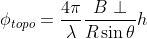
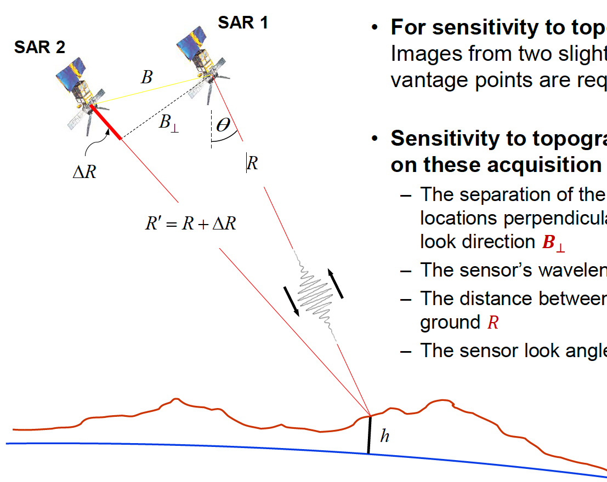

# Sentinel-1 InSAR Product Guide

## Introduction
Interferometric SAR (InSAR) processing uses two SAR images of the same area to determine geometric properties of the surface. With InSAR, Digital elevation models (DEMs) can be routinely created (SRTM, GLO-30). Moreover, two or more pairs of images can be used to extract surface motion or deformation at the millimeter level scale.

### Contents of InSAR guide
The InSAR workflow used to create HyP3 InSAR surface motion products constitutes a large portion of this document.  Users are cautioned to read the sections on limitations and error sources in InSAR products before attempting to use InSAR data. Sections on data sources and application examples are presented as well.  For a more complete description of the properties of SAR, see our *Introduction to SAR* guide. 

### Brief Overview of InSAR
SAR is an active sensor that transmits pulses and listens for echoes. These echoes are recorded in phase and amplitude, with the phase being used to determine the distance from the sensor to the target and the amplitude yeilding information about the roughness and dielectric constant of that target.

*Figure 1: Two passes of an imaging SAR taken at time T0 and T0 + ∆t, will give two distances to the ground, R1 and R2.  A difference between R1 and R2 shows motion on the ground.  In this case, a subsidence makes R2 greater than R1.  Credit: Franz J Meyer*

InSAR expliots the phase difference between two SAR images to create an interferogram that shows where the phase, and, therefore the distance to the target, has changed from one pass to the next as illustrated in figure 1.  There are several factors that influence the interferogram including earth curvature, topographic effects, atmospheric delays, and surface motion.  With the proper processing, InSAR can be used to create topographic maps and to detect millimeter scale changes in the earth's surface. Applications include volcanic deformation, susidence, landslide detection, and earthquake assessment.

### Polarizations
Polarization refers to the direction of travel of an electromagnetic wave.  A horizontal wave is transmitted so that is oscillates in a plane parallel to the surface imaged, while a vertical wave oscillates in a plane perpendicular to the surface imaged. 

Most modern SAR systems can transmit chirps with either a horizontal or vertical polarization.  In addition, some of these sensors can listen for either horizontal of vertical backscatter.  This gives rise to 4 different types of returns HH, HV, VV, and VH. Here the first letter is the transmit method and the second is the recieve method, e.g. VH is a vertically polarized transmit signal with horizontally polarized echoes recorded. 

For InSAR applications, processing is generally performed on the co-pol (VV or HH) data and not on the cross-pol (VH or HV) data.  In addition, each image used in InSAR is required to be the same polarization - two HH images of the same area could form a valid pair, while a single HH with a single VV from the same area would not.

### Baselines

*Figure 2: Geometry of InSAR baselines. Two satellite passes image the same area on the ground from postions S1 and S2, resulting a baseline of B which can be decomposed into normal and perpendiular componenets.  Here Y is the direction of travel or *along-track* and X is the direction perpenducular to motion, referred to as the *cross-track* or *range* direction.   Credit: Franz J Meyer*

In order to determine topography, two slightly different vantage points are required.  The term *baseline* refers to the physical distance between these two vantage points. The baseline is decomcoposed into a normal and a perpendicular components as shown in Figure 2.  Sensitivity to topography depends on the perpendicular baseline, the sensor wavelength, the distance between the satellite and the ground, and the sensor look angle as given in equation 1.  The parameters are diagrammed in Figure 3. 

--------

*Equation 1: Calculation of topographic phase*

--------

*Figure 3: Parameters affecting topographic sensitivity include the perpendicular baseline B&#8869, the wavelength  of the sensor &#955, the distance from the sensor to the ground R, and the sensor look angle &#952. Credit: Franz Meyer*

In contrast to the (physical) baseline, the *temporal baseline* refers to the time separation between imaging passes.  Along-track interferometry measures motion in the millisecond to second range.  This technique can detect ocean currents and rapidly moving objects like boats.  Differential intferometry is the standard method used to detect motion in the days to years range.  This is the type of interferometry is performed by the Sentinel-1 HyP3 InSAR processing alrorithm.  Table one lists different temporal baselines, their common names, and what they can be used to measure.  

|Duration | Known as | Measurement of | 
|---------|----------|----------------|
| ms to sec | along-track | ocean currents, moving object detection, MTI | 
| days | differential | glacier/ice fields/lava flows, surface water extent, hydrology |
| days to years | differential | subsidence, siesmic events, volcanic activity, crustal displacement | 

*Table 1: Temporal Baselines and what they measure. Different geophysical phenomena can be detected based upon the temporal baseline.*

## InSAR Workflow

The InSAR workflow used in HyP3 was developed by ASF using GAMMA software.  The steps include pre-processing steps, interferogram preparation, and product creation  

### Pre-Processing

Pre-processing steps prepare the SAR images to be used in interferometry.  This requires precise co-registation, common bandpass filtering, and a known baseline.

#### Image co-registration

#### Common-band filtering
#### Baseline calculation

### Interferogram Preparation
#### Interferogram creation
#### Ellipsoidal fringe removal (phase flattening)
#### Interferogram filtering
#### Phase unwrapping
### Product Creation
#### Coherence Estimation
### Computation of heights
#### Resampling to map coordinates

## Differential InSAR
### Removal of topographic phase
### Removal of differential phase
## Limitations
## Error Sources
## Data Sources
## Examples
### Surface Deformation 
### Volcanic Deformation
### Subsidence
### Earthquakes
## Data Access

