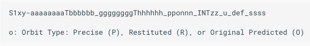
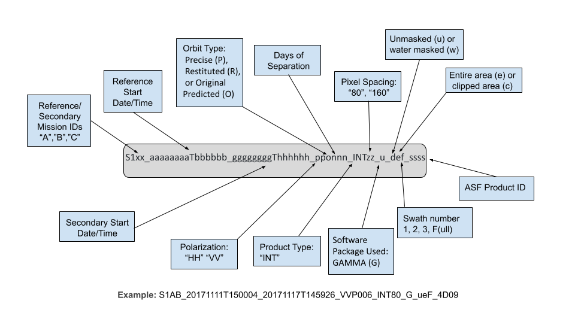




# Sentinel-1 InSAR Product Guide
This document is a guide for users of Interferometric Synthetic Aperture Radar (InSAR) Sentinel-1 products generated by the Alaska Satellite Facility (ASF). Users can request InSAR products [On Demand](https://search.asf.alaska.edu/#/?topic=onDemand "https://search.asf.alaska.edu/#/?topic=onDemand" ){target=_blank} in ASF's [Vertex](https://search.asf.alaska.edu/ "https://search.asf.alaska.edu" ){target=_blank} data portal, or make use of our HyP3 [Python SDK](https://hyp3-docs.asf.alaska.edu/using/sdk/ "https://hyp3-docs.asf.alaska.edu/using/sdk" ){target=_blank} or [API](https://hyp3-docs.asf.alaska.edu/using/api/ "https://hyp3-docs.asf.alaska.edu/using/api" ){target=_blank}. 

This process requires [Sentinel-1 IW SLC products](https://sentinels.copernicus.eu/web/sentinel/technical-guides/sentinel-1-sar/products-algorithms/level-1/single-look-complex/interferometric-wide-swath "https://sentinels.copernicus.eu" ){target=_blank} as input. Input pairs can be selected in [Vertex](https://search.asf.alaska.edu/ "https://search.asf.alaska.edu" ){target=_blank} using either the [Baseline Tool](https://docs.asf.alaska.edu/vertex/baseline/ "https://docs.asf.alaska.edu/vertex/baseline/" ){target=_blank} or the [SBAS Tool](https://docs.asf.alaska.edu/vertex/sbas/ "https://docs.asf.alaska.edu/vertex/sbas" ){target=_blank} search interfaces. 

For a step-by-step tutorial on ordering On-Demand InSAR Products using Vertex, visit our [InSAR On Demand! StoryMap](https://storymaps.arcgis.com/stories/68a8a3253900411185ae9eb6bb5283d3 "InSAR On Demand! https://arcg.is/eiP8G0" ){target=_blank}. To learn more about the files included in the On Demand InSAR product packages and how to work with them, refer to our [Exploring Sentinel-1 InSAR StoryMap](https://storymaps.arcgis.com/stories/8be186e4125741518118d0102e6835e5 "Exploring Sentinel-1 InSAR https://arcg.is/11DaW90" ){target=_blank}.

InSAR processing requires a Digital Elevation Model (DEM) for the removal of topographic phase. We use the [GLO-30 Copernicus DEM](https://spacedata.copernicus.eu/collections/copernicus-digital-elevation-model "Copernicus DEM" ){target=_blank} when processing our On Demand InSAR products. Refer to the [Prepare the DEM File section](#prepare-the-dem-file "Jump to the Prepare the DEM File Section of this document") for more information. 

!!! important "Coverage gaps in Copernicus DEM GLO-30 filled using GLO-90" 

    The Copernicus DEM GLO-30 dataset does not provide coverage over Armenia and Azerbaijan. In the past, we have not supported InSAR product generation over those areas, due to the lack of DEM coverage. We now use the Copernicus DEM GLO-90 to fill those gaps. 

    The GLO-90 dataset has a pixel spacing of 90 meters, which is not as detailed as the 30-m pixel spacing in the GLO-30 DEM, but it does allow us to provide InSAR products in these regions, where they were previously unavailable. 

Users are cautioned to read the sections on [limitations](#limitations "Jump to the Limitations section of this document") and [error sources](#error-sources "Jump to the Error Sources section of this document") in InSAR products before attempting to use InSAR data. For a more complete description of the properties of SAR, see our [Introduction to SAR](../guides/introduction_to_sar.md "https://hyp3-docs.asf.alaska.edu/guides/introduction_to_sar" ){target=_blank} guide. 



### Processing Options

!!! important "New Water Masking Approach"

    InSAR products can be phase unwrapped using a water mask. The option to "Apply water mask" sets pixels over coastal waters and large inland waterbodies as invalid for phase unwrapping. This reduces phase unwrapping errors and outputs a less noisy unwrapped interferogram.

    As of September 27, 2022, the water mask used for this option is no longer buffered. The original water mask had a 3 km buffer on coastlines and a 5 km buffer on the shorelines of inland waterbodies. This was to reduce the chance that valid land pixels would be excluded from phase unwrapping, but it appears that the inclusion of more water pixels is more detrimental to phase unwrapping than the exclusion of some land pixels. Visit our [InSAR Water Masking Tutorial](https://storymaps.arcgis.com/stories/485916be1b1d46889aa436794b5633cb "InSAR Water Masking StoryMap" ){target=_blank} for more information.

!!! important "Change in Displacement Map Options"

    There is now a single option for including displacement maps. Both line-of-sight and vertical displacement maps will only be added to the product package if the option to "Include Displacement Maps" is selected when submitting On-Demand InSAR jobs. Use caution when referencing the values included in the displacement maps, as the values are calculated relative to an arbitrary reference point. Refer to the [Phase Unwrapping Reference Point](#phase-unwrapping-reference-point "Jump to Phase Unwrapping Reference Point part of the Limitations section in this document") section for more information. 

There are several options users can set when ordering InSAR On Demand products. Currently, users can choose the number of looks to take (which drives the resolution and pixel spacing of the products), and which optional products to include in the output package. The options are described below:

1. The **number of looks** drives the resolution and pixel spacing of the output products. Selecting 10x2 looks will yield larger products with 80 m resolution and pixel spacing of 40 m. Selecting 20x4 looks reduces the resolution to 160 m and reduces the size of the products (roughly 1/4 the size of 10x2 look products), with a pixel spacing of 80 m. The default is 20x4 looks.

2. The **look vectors** are stored in two files. The look vector refers the look direction back towards the sensor. The lv_theta (θ) indicates the SAR look vector elevation angle at each pixel, ranging from -π/2 (down) to π/2 (up). The look vector elevation angle is defined as the angle between the horizontal surface and the look vector with positive angles indicating sensor positions above the surface. The lv_phi (φ) map indicates the SAR look vector orientation angle at each pixel, ranging from -π (west) to π (west). The look vector orientation angle is defined as the angle between the East direction and the projection of the look vector on the horizontal surface plane. The orientation angle increases towards north, with the North direction corresponding to π/2 (and south to -π/2). Both angles are expressed in radians. The default is to not include these files in the output product bundle.

3. The **displacement maps** convert the phase difference values from the unwrapped interferogram into measurements of ground displacement in meters. The line-of-sight displacement map indicates the amount of movement away from or towards the sensor. The vertical displacement calculates the vertical component of the line-of-sight displacement, using the assumption that all deformation is in the vertical direction. These files are excluded from the product package by default.

4. The **wrapped phase GeoTIFF** can be included in the output package. The browse version of this GeoTIFF (_color_phase.png) is always included, but the GeoTIFF version is not included by default. The specific color ramp displayed in the png is most valuable for many users, but some may wish to work with the actual wrapped phase values.

5. The **incidence angle maps** indicate the angle of the radar signal. The local incidence angle is defined as the angle between the incident radar signal and the local surface normal, expressed in radians, while the ellipsoid incidence angle indicates the angle between the incident radar beam and the direction perpendicular to the WGS84 ellipsoid model. These files are excluded from the product package by default.

6. A copy of the **DEM** used for processing can optionally be included in the product package. The file has been projected to a UTM Zone coordinate system, and pixel values indicate the elevation in meters. The elevation values will differ from the original [Copernicus DEM GLO-30](https://spacedata.copernicus.eu/collections/copernicus-digital-elevation-model "Copernicus DEM" ){target=_blank} dataset, as a geoid correction has been applied. The source DEM is also downsampled to twice the pixel spacing of the output product to smooth it for use in processing, then resampled again to match the pixel spacing of the InSAR product. The DEM is excluded by default.

7. There is an option to apply a **water mask**. This mask includes coastal waters and large inland waterbodies. Masking waterbodies can have a significant impact during the phase unwrapping, as water can sometimes exhibit enough coherence between acquisitions to allow for unwrapping to occur over waterbodies, which is invalid. A GeoTIFF of the water mask is always included with the InSAR product package, but when this option is selected, the conditional water mask will be applied along with coherence and intensity thresholds during the phase unwrapping process. Water masking is turned off by default. Visit our [InSAR Water Masking Tutorial](https://storymaps.arcgis.com/stories/485916be1b1d46889aa436794b5633cb "InSAR Water Masking StoryMap" ){target=_blank} for more information.



## InSAR Workflow

The InSAR workflow used in HyP3 was developed by ASF using GAMMA software. The steps include pre-processing steps, interferogram preparation, and product creation. Once these steps are performed, an output product package will be created. See [product packaging](#product-packaging "Jump to Product Packaging section of this document") for details on the individual files included in the package.  

### Pre-Processing

Pre-processing steps prepare the SAR images to be used in interferometry. The pre-processing steps include image selection, ingest (including calibration), creation of a suitable DEM, and calculation of the burst overlap.

#### Select an InSAR Pair
Although it is possible to start from RAW data, Sentinel-1 InSAR processing is typically done using [Interferometric Wide swath Single Look Complex](https://sentinel.esa.int/web/sentinel/user-guides/sentinel-1-sar/acquisition-modes/interferometric-wide-swath "https://sentinel.esa.int/web/sentinel/user-guides/sentinel-1-sar/acquisition-modes/interferometric-wide-swath" ){target=_blank} (IW SLC) data as the input.  This means that the data has been formed into an image through SAR processing, but has not been multi-looked.  

The SLC pair is [defined by the user](#ordering-on-demand-insar-products "Jump to Ordering On Demand InSAR Products section of this document"), either through the Vertex interface, or using the HyP3 API or SDK. To ensure consistency, the older SLC image is always used as the reference image, and the younger SLC image is always used as the secondary image. This means that positive values in the resulting unwrapped interferogram represent movement away from the SAR platform and negative values represent movement towards the SAR platform. However, these values are relative to the reference point of the unwrapped interferogram. See the [phase unwrapping section](#reference-point "Jump to Reference Point section of this document") for more details.

#### Ingest SLC data into GAMMA format

Once the InSAR pair has been identified, the selected SLC data are ingested into GAMMA internal format. This is performed by the GAMMA program *par_s1_slc*. GAMMA format has raw data files (only data, no headers or line leaders) with metadata stored in external files with a .par extension.  

During ingest into GAMMA's internal format, the SLC data is calibrated by applying the calibration coefficients that are supplied with each product. This process puts the SAR backscatter into a known scale where the diffuse volume scattering of the Amazon rainforest is a constant -6.5 dB.

Immediately after ingesting the SLC, the state vectors are updated to use the best available state vectors. The state vector types in order of absolute correctness are original predicted (O), restituted (R), and precision (P). In practice, one will never receive an InSAR product that uses the original predicted orbit - only granules for which a restituted or precision orbit is available can be used in HyP3 InSAR processing. The orbit type used for generating the InSAR product is indicated in the product filename, as shown in Figure 3.

*Figure 3: Position of the orbit type in the HyP3 product name.*  

#### Prepare the DEM File

In order to create differential InSAR products that show motion on the ground, one must subtract the topographic phase from the interferogram. The topographic phase, in this case, is replicated by using an [existing DEM](../dems.md "HyP3 DEM Documentation" ){target=_blank} to calculate the actual topographic phase. This phase is then removed from the interferogram leaving just the motion or deformation signal (plus atmospheric delays and noise).

The DEM that is used for HyP3 InSAR processing is the 2022 Release of the [Copernicus GLO-30 Public DEM](https://spacedata.copernicus.eu/collections/copernicus-digital-elevation-model "Copernicus DEM" ){target=_blank} dataset [publicly available on AWS](https://registry.opendata.aws/copernicus-dem/ "https://registry.opendata.aws/copernicus-dem" ){target=_blank}. For more information about the 2022 updates, see the 'Releases' section of [this article](https://spacedata.copernicus.eu/collections/copernicus-digital-elevation-model "Copernicus DEM" ){target=_blank}.

The [Copernicus DEM](https://spacedata.copernicus.eu/collections/copernicus-digital-elevation-model "Copernicus DEM" ){target=_blank} provides higher-quality products over a wider area than the older DEMs (SRTM and NED) previously used to generate ASF's On Demand products. Refer to our [Digital Elevation Model Documentation](../dems.md "HyP3 DEM Documentation" ){target=_blank} for more information. The Copernicus DEM provides global coverage at 30-m pixel spacing, except for [areas over Armenia and Azerbaijan](../dems.md#copernicus-dem "HyP3 Copernicus DEM Documentation" ){target=_blank}. These gaps in coverage are filled with the Copernicus GLO-90 Public DEM, which has 90-m pixel spacing. 

The DEM tiles necessary to cover the input granules for the InSAR product are downloaded. A geoid correction is applied to the DEM, and it is resampled to match the [output resolution](#processing-options "Jump to Processing Options section of this document") of the InSAR product (160 m for 20x4 products, 80 m for 10x2 products) and projected to the appropriate UTM Zone for the granule location.

#### Calculate Overlapping Bursts

The IW SLC Sentinel-1 data comes in three sub-swaths. However, a further subdivision is made in the data, wherein *bursts* occur. Bursts are the fundamental building block for Sentinel-1 imagery. Each one is a portion of the final image, around 1500 lines long and one sub-swath width wide. Thus, the more busts, the longer the file is in length.

Each burst is precisely timed to repeat at a given time interval. This consistent repeat combined with precise velocity control gives rise to the fact that the bursts start at the same time on each pass around the globe. 

For example, a burst images a piece of the Galápagos Islands. The next time that same piece of the island is imaged, the time of day will be the same, to within few milliseconds. Only the frames containing overlapping bursts can be used to perform InSAR processing. This means that **if there is no burst overlap in the pair selected as input, the InSAR process will not run**.

Repeatable burst timing is exploited by HyP3 in order to calculate the bursts that overlap between two scenes.  These overlapping bursts are the only ones used in the rest of the InSAR process. The rest are discarded.

### Interferogram Creation, Co-registration and Refinement

Before the interferogram is created, the lookup table that maps from the SLC image space into a ground range image space is created. At this time, the interferogram of the topography is simulated using the previously prepared DEM.

Once these steps have been performed, the two SLCs are co-registered to within 0.02 pixels. This is done by iteratively using the following steps:

1. Resample the secondary SLC using previously calculated offset polynomial
2. Match the reference and secondary SLC images using intensity cross-correlation
3. Estimate range and azimuth offset polynomial coefficients from results of matching
4. Create a differential interferogram using the co-registered SLCs and the simulated interferogram
5. Update offset polynomial by adding the current estimates

Note that these steps are automatically run 4 times.  At that point, **if the last offset calculated was more than 0.02 pixels, then the procedure will fail to complete**.

Provided the images passed the check for convergence, the next co-registration step employs the *Enhanced Spectral Diversity* (ESD) algorithm to match the two scenes to better than 1/100th of a pixel. This is accomplished by examining the overlap area between subsequent bursts. If there is even a small offset, the phase between the bursts will not match. This phase mismatch is then used to calculate the corresponding azimuth offset.

To finish interferogram processing, steps 1 through 4 are run once again, this time with the offsets from the ESD included. The output of this entire process is a *wrapped interferogram*.

### Phase Unwrapping

All of the phase differences in wrapped interferograms lie between -π and π. Phase unwrapping attempts to assign multiples of 2π to add to each pixel in the interferogram to restrict the number of 2π jumps in the phase to the regions where they may actually occur. These regions are areas of radar layover or areas of deformation exceeding half a wavelength in the sensor's line of sight. Thermal noise and interferometric decorrelation can also result in these 2π phase discontinuities called *residues*. 

The phase unwrapping algorithm used for these products is Minimum Cost Flow (MCF) and Triangulation. Refer to this [Technical Report from GAMMA Remote Sensing](https://www.gamma-rs.ch/uploads/media/2002-5_TR_Phase_Unwrapping.pdf "https://www.gamma-rs.ch/uploads/media/2002-5_TR_Phase_Unwrapping.pdf" ){target=_blank} for more information on the MCF phase unwrapping approach.

#### Filtering
Before the interferogram can be unwrapped, it must be filtered to remove noise. This is accomplished using an adaptive spectral filtering algorithm. This adaptive interferogram filtering aims to reduce phase noise, increase the accuracy of the interferometric phase, and reduce the number of interferogram residues as an aid to phase unwrapping. In this case, residues are points in the interferogram where the sum of the phase differences between pixels around a closed path is not 0.0, which indicates a jump in phase.

#### Masking
Another step before unwrapping is to create a validity mask to guide the phase unwrapping process. This mask is generated by applying thresholds to the coherence and/or amplitude (backscatter intensity) values for an image pair. For On Demand InSAR products, we set the amplitude threshold to be 0.0 (in power scale), so that data is only excluded based on the coherence threshold.

Coherence is estimated from the normalized interferogram. The pixel values in this file range from 0.0 (total decorrelation) to 1.0 (perfectly coherent). Any input pixel with a coherence value less than 0.1 is given a validity mask value of zero and not used during unwrapping.

!!! important "Change to Validity Mask Thresholds"

    In the past, we also used an amplitude threshold of 0.2 (in power scale) when generating the validity mask. While this approach tends to mask out inland waters, providing a less noisy interferogram in some cases, it also masks arid regions that have low amplitude values but reasonably high coherence. As of March 2022, we have set the amplitude threshold to 0.0, so that coherence is the only driver of the validity mask.

When the water masking option is applied, the validity mask is further amended to apply 0 values to any pixels classified as water in the water mask. In some cases, pixels over water may still meet the coherence and amplitude threshold criteria for inclusion, even though they are not valid for use during phase unwrapping. When processing scenes with extensive coverage by coastal waters or large inland waterbodies, there can be erroneous deformation signals or phase jumps introduced if unwrapping proceeds over water as if it were land. In such cases, choosing the option to apply the water mask can improve the results. Visit our [InSAR Water Masking Tutorial](https://storymaps.arcgis.com/stories/485916be1b1d46889aa436794b5633cb "InSAR Water Masking StoryMap" ){target=_blank} for more information.

#### Reference point
In order to perform phase unwrapping, a reference point must be selected. The unwrapping will proceed relative to this reference point; the 2π integer multiples will be applied to the wrapped phase using this pixel as the starting point. The unwrapped phase value is set to 0 at the reference point.

Ideally, the reference point for phase unwrapping would be located in an area with high coherence in a stable region close to an area with surface deformation. Choosing an optimal reference point requires knowledge of the site characteristics and examination of the interferogram, which is not practical in an automated, global workflow. 

By default, ASF's On Demand InSAR products use the location of the pixel with the highest coherence value as the reference point. The coherence map is examined to determine the maximum value, and all pixels with this value are examined using a 9-pixel window. The pixel with the highest sum of values within its 9-pixel window is selected as the reference point. If more than one pixel has the same 9-pixel sum, the pixel closest to the origin pixel (bottom left corner for ascending scenes, top right corner for descending scenes) is selected.

This may be an appropriate reference point location in many cases, as it meets the criteria of having high coherence, and stable areas have higher coherence than areas undergoing significant deformation. If a user wants to set a different location as the phase unwrapping reference point, however, a correction can be applied to the unwrapped interferogram.

For more information on the impact of the phase unwrapping reference point location on unwrapped phase and displacement measurements, refer to the [Limitations](#phase-unwrapping-reference-point "Jump to Phase Unwrapping Reference Point part of the Limitations section in this document") section of this document, which also includes instructions for applying a correction based on a custom reference point. 

### Geocoding and Product Creation

After the phase is unwrapped, the final steps are geocoding and product creation.  

#### Geocoding

Geocoding is the process of reprojecting pixels from SAR slant range space (where all the calculations have been performed) into map-projected ground range space (where analysis of products is simplest). Using the look up table previously computed, this process takes each pixel in the input product and relocates it to the UTM zone of the DEM used in processing. This is accomplished using nearest-neighbor resampling so that original pixel values are preserved.

#### Product Creation

Files are next exported from GAMMA internal format into the widely-used GeoTIFF format, complete with geolocation information. GeoTIFFs are created for amplitude, coherence, and unwrapped phase by default, and a water mask GeoTIFF is also included in the product package. Optionally, GeoTIFFs of wrapped phase, look vectors, displacement maps (line-of-sight and vertical), and incidence angle maps can be included, as can a copy of the DEM used for processing.



## Product Packaging

HyP3 InSAR output is a zip file containing various files, including GeoTIFFs, PNG browse images with geolocation information, Google Earth KMZ files, a metadata file, and a README file.

### Naming Convention

The InSAR product names are packed with information pertaining to the processing of the data, presented in the following order, as illustrated in Figure 4. 

- The platform names, either Sentinel-1A or Sentinel-1B, are abbreviated "A" or "B", indicating the reference and secondary granule's imaging platform
- The reference start date and time and the secondary start date and time, with the date and time separated by the letter T
- The polarizations for the pair, either HH or VV, the orbit type, and the days of separation for the pair
- The product type (always INT for InSAR) and the pixel spacing, which will be either 80 or 40, based upon the number of looks selected when the job was submitted for processing
- The software package used for processing is always GAMMA for GAMMA InSAR products
- User-defined options are denoted by three characters indicating whether the product is water masked (w) or not (u), the scene is clipped (e for entire area, c for clipped), and whether a single sub-swath was processed or the entire granule (either 1, 2, 3, or F for full swath)
    - *Currently, only the water masking is available as a user-selected option; the products always include the full granule extent with all three sub-swaths*
- The filename ends with the ASF product ID, a 4 digit hexadecimal number

*Figure 4: Breakdown of ASF InSAR naming scheme.*

### Image Files

All of the main InSAR product files are 32-bit floating-point single-band GeoTIFFs. To learn more about the rasters included in the product package, refer to the [Exploring Sentinel-1 InSAR StoryMap](https://storymaps.arcgis.com/stories/8be186e4125741518118d0102e6835e5 "Exploring Sentinel-1 InSAR StoryMap https://arcg.is/11DaW90" ){target=_blank} tutorial.

- The *amplitude* image is the calibrated radiometric backscatter from the reference granule in sigma-nought power. The image is terrain corrected using a geometric correction, but not radiometrically corrected. 
- The *coherence* file pixel values range from 0.0 to 1.0, with 0.0 being completely non-coherent and 1.0 being perfectly coherent. 
- The *unwrapped phase* file shows the results of the phase unwrapping process. Negative values indicate movement towards the sensor, and positive values indicate movement away from the sensor. This is the main interferogram output.
- The *wrapped phase* file indicates the interferogram phase after applying the adaptive filter immediately before unwrapping. Values range from negative pi to positive pi. *(optional)*
- The *line-of-sight displacement* file indicates the displacement in meters along the look direction of the sensor. The sign is opposite to that of the unwrapped phase: positive values indicate motion towards the sensor and negative values indicate motion away from the sensor. *(optional)*
- The *vertical displacement* is generated from the line of sight displacement values, and makes the assumption that deformation only occurs in the vertical direction. Note that this assumption may not hold true in cases where the deformation also has a horizontal component. Positive values indicate uplift, and negative values indicate subsidence. *(optional)*
- The *look vectors* theta (θ) and phi (φ) describe the elevation and orientation angles of the sensor's look direction. *(optional)*
- The *incidence angle* maps indicate the angle between the incident signal and the surface normal of either the terrain (local incidence angle) or the ellipsoid (ellipsoid incidence angle). *(optional)*
- The *DEM* file gives the local terrain heights in meters, with a geoid correction applied. *(optional)*
- The *water mask* file indicates coastal waters and large inland waterbodies. Pixel values of 1 indicate land and 0 indicate water. This file is in 8-bit unsigned integer format.

If the **water mask** option is selected, the water mask is applied prior to phase unwrapping to exclude water pixels from the process. The water mask is generated using the [GSHHG](http://www.soest.hawaii.edu/wessel/gshhg "http://www.soest.hawaii.edu/wessel/gshhg/land" ){target=_blank} dataset. To compile the reference shapefile, the full-resolution L1 dataset (boundary between land and ocean) and L5 dataset (boundary between Antarctic ice and ocean) were combined. The L3 dataset (boundary between islands and the lakes they are within) was removed from the L2 dataset (boundary between lakes and land), and this combined dataset was removed from the combined L1/L5 dataset. The portion of the shapefile covering the scene is converted to a raster for inclusion in the phase unwrapping mask during InSAR processing. The GSHHG dataset was last updated in 2017, so there may be discrepancies where shorelines have changed. Visit our [InSAR Water Masking Tutorial](https://storymaps.arcgis.com/stories/485916be1b1d46889aa436794b5633cb "InSAR Water Masking StoryMap" ){target=_blank} for more information about water masking.

**Browse images** are included for the wrapped (color_phase) and unwrapped (unw_phase) phase files, which are in PNG format and are each 2048 pixels wide. The browse images are displayed using a cyclic color ramp to generate fringes. 

- Each fringe in a wrapped (color_phase) browse image represents a 2-pi phase difference, and the line-of-sight displacement for each fringe is equivalent to half the wavelength of the sensor. The wavelength of Sentinel-1 is about 5.6 cm, so each 2-pi fringe represents a line-of-sight displacement of about 2.8 cm.
- Each fringe in an unwrapped (unw_phase) browse image represents a phase difference of 6 pi. Because each 2-pi difference is equivalent to half the wavelength of the sensor, each 6-pi fringe represents about 8.3 cm of line-of-sight displacement for these Sentinel-1 products.

**KMZ files** are included for the wrapped (color_phase) and unwrapped (unw_phase) phase images, which allow users to view the outputs in Google Earth or other platforms that support kmz files. 

The tags and extensions used and example file names for each raster are listed in Table 2 below. 



| Extension          | Description                      | Example                           |
|--------------------|----------------------------------|-----------------------------------|
| _amp.tif           | Amplitude                        | {{ base_name }}_amp.tif           |
| _corr.tif          | Normalized coherence file        | {{ base_name }}_corr.tif          |
| _unw_phase.tif     | Unwrapped geocoded interferogram | {{ base_name }}_unw_phase.tif     |
| _wrapped_phase.tif | Wrapped geocoded interferogram   | {{ base_name }}_wrapped_phase.tif |
| _los_disp.tif      | Line-of-sight displacement       | {{ base_name }}_los_disp.tif      |
| _vert_disp.tif     | Vertical displacement            | {{ base_name }}_vert_disp.tif     |
| _lv_phi.tif        | Look vector φ (orientation)      | {{ base_name }}_lv_phi.tif        |
| _lv_theta.tif      | Look vector θ (elevation)        | {{ base_name }}_lv_theta.tif      |
| _dem.tif           | Digital elevation model          | {{ base_name }}_dem.tif           |
| _inc_map_ell.tif   | Ellipsoid incidence angle        | {{ base_name }}_inc_map_ell.tif   |
| _inc_map.tif       | Local incidence angle            | {{ base_name }}_inc_map.tif       |
| _water_mask.tif    | Water mask                       | {{ base_name }}_water_mask.tif    |
| _color_phase.kmz   | Wrapped phase kmz file           | {{ base_name }}_color_phase.kmz   |
| _unw_phase.kmz     | Unwrapped phase kmz file         | {{ base_name }}_unw_phase.kmz     |
| _color_phase.png   | Wrapped phase browse image       | {{ base_name }}_color_phase.png   |
| _unw_phase.png     | Unwrapped phase browse image     | {{ base_name }}_unw_phase.png     |

*Table 2: Image files in product package*

### Metadata Files

The product package also includes a number of metadata files.

| Extension      | Description                                     | Example                                 |
|----------------|-------------------------------------------------|-----------------------------------------|
| .README.md.txt | Main README file for GAMMA InSAR                | {{ base_name }}.README.md.txt           |
| .txt           | Parameters and metadata for the InSAR pair      | {{ base_name }}.txt                     |
| .tif.xml       | ArcGIS compliant XML metadata for GeoTIFF files | {{ base_name }}_unw_phase.tif.xml       |
| .png.xml       | ArcGIS compliant XML metadata for PNG files     | {{ base_name }}_color_phase.png.xml     |
| .png.aux.xml   | Geolocation information for png browse images   | {{ base_name }}_color_phase.png.aux.xml |

*Table 3: Metadata files in product package*

#### README File
The text file with extension .README.md.txt explains the files included in the folder, and is customized to reflect that particular product. Users unfamiliar with InSAR products should start by reading this README file, which will give some background on each of the files included in the product folder.

#### InSAR Parameter File
The text file with extension .txt includes processing parameters used to generate the InSAR product as well as metadata attributes for the InSAR pair.  These are detailed in Table 4.  

| Name                                                      | Description                                                                                                 | Possible Value                                                                                              |
|-----------------------------------------------------------|-------------------------------------------------------------------------------------------------------------|-------------------------------------------------------------------------------------------------------------|
| Reference Granule                                         | ESA granule name for reference scene (of the two scenes in the pair, the dataset with the oldest timestamp) | S1A<wbr>_IW<wbr>_SLC<wbr>__1SDV<wbr>_20200116T032559<wbr>_20200116T032627<wbr>_030820<wbr>_038928<wbr>_F5DC |
| Secondary Granule                                         | ESA granule name for secondary scene (of the two scenes in the pair, the dataset with the newest timestamp) | S1B<wbr>_IW<wbr>_SLC<wbr>__1SDV<wbr>_20200128T032559<wbr>_20200128T032627<wbr>_030995<wbr>_038F51<wbr>_7D4F |
| Reference Pass Direction                                  | Orbit direction of the reference scene                                                                      | DESCENDING                                                                                                  |
| Reference Orbit Number                                    | Absolute orbit number of the reference scene                                                                | 30741                                                                                                       |
| Secondary Pass Direction                                  | Orbit direction of the reference scene                                                                      | DESCENDING                                                                                                  |
| Secondary Orbit Number                                    | Absolute orbit number of the secondary scene                                                                | 31091                                                                                                       |
| Baseline                                                  | Perpendicular baseline in meters                                                                            | 58.3898                                                                                                     | 
| UTCTime                                                   | Time in the UTC time zone in seconds                                                                        | 12360.691361                                                                                                |
| Heading                                                   | Spacecraft heading measured in degrees clockwise from north                                                 | 193.2939317                                                                                                 |
| Spacecraft height                                         | Height in meters of the spacecraft above nadir point                                                        | 700618.6318999995                                                                                           | 
| Earth radius at nadir                                     | Ellipsoidal earth radius in meters at the point directly below the satellite                                | 6370250.0667                                                                                                |
| Slant range near                                          | Distance in meters from satellite to nearest point imaged                                                   | 799517.4338                                                                                                 | 
| Slant range center                                        | Distance in meters from satellite to the center point imaged                                                | 879794.1404                                                                                                 | 
| Slant range far                                           | Distance in meters from satellite to farthest point imaged                                                  | 960070.8469                                                                                                 |
| Range looks                                               | Number of looks taken in the range direction                                                                | 20                                                                                                          | 
| Azimuth looks                                             | Number of looks taken in the azimuth direction                                                              | 4                                                                                                           |
| InSAR phase filter                                        | Name of the phase filter used                                                                               | adf                                                                                                         | 
| Phase filter parameter                                    | Dampening factor                                                                                            | 0.6                                                                                                         |
| Resolution of output (m)                                  | Pixel spacing in meters for output products                                                                 | 80                                                                                                          | 
| Range bandpass filter                                     | Range bandpass filter applied                                                                               | no                                                                                                          |
| Azimuth bandpass filter                                   | Azimuth bandpass filter applied                                                                             | no                                                                                                          |
| DEM source                                                | DEM used in processing                                                                                      | GLO-30                                                                                                      |
| DEM resolution                                            | Pixel spacing in meters for DEM used to process this scene                                                  | 160                                                                                                         |
| Unwrapping type                                           | Phase unwrapping algorithm used                                                                             | mcf                                                                                                         |
| Phase at Reference Point                                  | Original unwrapped phase value at the reference point (set to 0 in output unwrapped phase raster)           | -4.21967                                                                                                    |
| Azimuth line of the reference point in SAR space          | Row number (in SAR space) of the reference point                                                            | 2737.0                                                                                                      |
| Range pixel of the reference point in SAR space           | Column number (in SAR space) of the reference point                                                         | 739.0                                                                                                       |
| Y coordinate of the reference point in the map projection | Latitude of the reference point in projected coordinates (UTM Zone - meters)                                | 4112453.3223                                                                                                |
| X coordinate of the reference point in the map projection | Longitude of the reference point in projected coordinates (UTM Zone - meters)                               | 589307.6248                                                                                                 |
| Latitude of the reference point (WGS84)                   | Latitude of the reference point in WGS84 Geographic Coordinate System (degrees)                             | 37.1542125                                                                                                  |
| Longitude of the reference point (WGS84)                  | Longitude of the reference point in WGS84 Geographic Coordinate System (degrees)                            | 40.00574707                                                                                                 |
| Unwrapping threshold                                      | Minimum coherence required to unwrap a given pixel                                                          | none                                                                                                        |
| Speckle filter                                            | Speckle filter applied                                                                                      | no                                                                                                          |

*Table 4: List of InSAR parameters included in the parameter text file*

#### ArcGIS-Compatible XML Files
There is an ArcGIS-compatible XML file for each raster in the product folder. When ArcGIS Desktop users view any of the rasters in ArcCatalog or the Catalog window in ArcMap, they can open the Item Description to view the contents of the associated XML file. ArcGIS Pro users can access the information from the Metadata tab. These files will not appear as separate items in ArcCatalog, though if you use Windows Explorer to look at the contents of the folder you will see them listed individually. Because each one is named identically to the product it describes (with the addition of the .xml extension), ArcGIS recognizes the appropriate file as the raster’s associated metadata, and integrates the metadata accordingly.

ArcGIS users should take care not to change these XML files outside of the ArcGIS environment; changing the filename or content directly may render the files unreadable by ArcGIS.

Those not using ArcGIS will still find the contents of these XML files useful, but will have to contend with the XML tagging when viewing the files as text or in a browser.

#### Auxiliary Geolocation Files
Geolocation XML files (aux files) are included for each of the PNG browse images to allow for proper display in GIS platforms.



### Line-of-Sight Measurements
When looking at a single interferogram, the deformation measurements in the line-of-sight orientation of the sensor indicate relative motion towards or away from the sensor. InSAR is not sensitive to motion in the azimuth direction of the satellite, so motion that occurs in the same direction as the satellite's direction of travel will not be detected.

A single interferogram cannot be used to determine the relative contributions of vertical and horizontal movement to the line-of-sight displacement measurement. The vertical displacement map is generated based on the assumption that the movement is entirely in the vertical direction, which may not be realistic for some processes. To determine how much of the signal is driven by vertical vs. horizontal movement, you must either use a time series of interferograms, or use reference measurements with known vertical and horizontal components (such as GNSS measurements from the region of deformation) to deconstruct the line-of-sight displacement.

All displacement values are calculated relative to a [reference point](#phase-unwrapping-reference-point "Jump to Phase Unwrapping Reference Point part of Limitations section in this document"), which may or may not be an appropriate benchmark for measuring particular areas of displacement within the interferogram.



### Phase Unwrapping Reference Point
The reference point for phase unwrapping is set to be the location of the pixel with the highest coherence value. As described in the [phase unwrapping section](#reference-point "Jump to Reference Point section of this document"), this may not always be an ideal location to use as a reference point. If it is located in an area undergoing deformation, or in a patch of coherent pixels that is separated from the area undergoing deformation by a gap of incoherent pixels, the unwrapping may be of lower quality than if the reference point was in a more suitable location.

Even when there are not phase unwrapping errors introduced by phase discontinuities, it is important to be aware that unwrapped phase differences and displacement values are all calculated relative to the reference point. The phase difference value of the reference point is set to 0 during phase unwrapping, so any displacement values will be relative to that benchmark. If the location of the default reference point is in the middle of an area that underwent deformation, displacement values may be different than expected.

If you are interested in the amount of displacement in a particular area, you may wish to choose your own reference point. The ideal reference point would be in an area of high coherence beyond where deformation has occurred. The unwrapped phase measurements can be adjusted to be relative to this new reference point, and displacement values can be recalculated accordingly. To adjust the values in the unwrapped phase GeoTIFF, simply select a reference point that is optimal for your use case and subtract the unwrapped phase value of that reference point from each pixel in the unwrapped phase raster:

**ΔΨ&ast;** = **ΔΨ** - Δψref

where **ΔΨ&ast;** is the adjusted unwrapped phase, **ΔΨ** is the original unwrapped phase, and Δψref is the unwrapped phase value at the new reference point.

#### Impacts on Displacement Measurements
The measurements in the displacement maps are calculated from the unwrapped phase values, so will similarly be impacted by the location of the reference point. You may wish to recalculate the displacement values relative to a new reference point. The approach for correcting the displacement maps will be different for the line-of-sight and vertical measurements.

##### Correcting Line-of-Sight Displacement Maps
If you have already corrected the unwrapped phase raster, you can calculate a new line-of-sight (LOS) displacement map by applying the following calculation on a pixel-by-pixel basis using the unwrapped phase GeoTIFF:

**ΔΩ&ast;** = - **ΔΨ&ast;** λ / 4π

where **ΔΩ&ast;** is the adjusted line-of-sight displacement in meters, **ΔΨ&ast;** is the [adjusted unwrapped phase](#phase-unwrapping-reference-point "Jump to Phase Unwrapping Reference Point part of Limitations section in this document"), and λ is the wavelength of the sensor in meters (0.055465763 for Sentinel-1).

Setting the **ΔΨ&ast;** value to be negative reverses the sign so that the difference is relative to the earth rather than the sensor. A positive phase difference value indicates subsidence, which is unintuitive when thinking about movement on the earth's surface. Applying the negative will return positive displacement values for uplift and negative values for subsidence.

If you are not interested in adjusted unwrapped phase values, you can also directly correct the LOS Displacement map included optionally in the InSAR product package:

**ΔΩ&ast;** = **ΔΩ** - Δωref

where **ΔΩ&ast;** is the adjusted line-of-sight displacement in meters, **ΔΩ** is the original line-of-sight displacement in meters, and Δωref is the line-of-sight displacement value at the new reference point.

##### Correcting Vertical Displacement Maps
Vertical displacement maps cannot be adjusted directly, and must be recalculated from the adjusted unwrapped phase image. You will also need the θ look vector map (lv_theta GeoTIFF) for this calculation. The look vector maps are not included in the InSAR product package by default; the option to Include Look Vectors must be selected when ordering the product.

To calculate an adjusted vertical displacement raster, calculate the [adjusted unwrapped phase](#phase-unwrapping-reference-point "Jump to Phase Unwrapping Reference Point part of Limitations section in this document"), then apply the following:

**Δϒ&ast;** = - **ΔΨ&ast;** λ cos(½π - ***LV*θ**) / 4π

where **Δϒ&ast;** is the adjusted vertical displacement in meters, **ΔΨ&ast;** is the adjusted unwrapped phase, λ is the wavelength of the sensor in meters (0.055465763 for Sentinel-1), and ***LV*θ** is the theta look vector (from the lv_theta GeoTIFF).

As with the LOS Displacement maps, setting the **ΔΨ&ast;** value to be negative reverses the sign so that the difference is relative to the earth rather than the sensor. Applying the negative will return positive displacement values for uplift and negative values for subsidence.

#### Displacement Values from a Single Interferogram

In general, calculating displacement values from a single interferogram is not recommended. While the displacement rasters provided with ASF's On Demand InSAR products can be helpful in visualizing changes, we do not recommend that you rely on a single interferogram when coming to conclusions about surface displacement, even if you apply a correction based on a manually selected reference point. It will be more robust to use a time series approach to more accurately determine the pattern of movement. When using SAR time-series software such as [MintPy](https://mintpy.readthedocs.io/en/latest/ "https://mintpy.readthedocs.io/en/latest" ){target=_blank}, you have the option to select a specific reference point, and the values of the input rasters will be adjusted accordingly.
