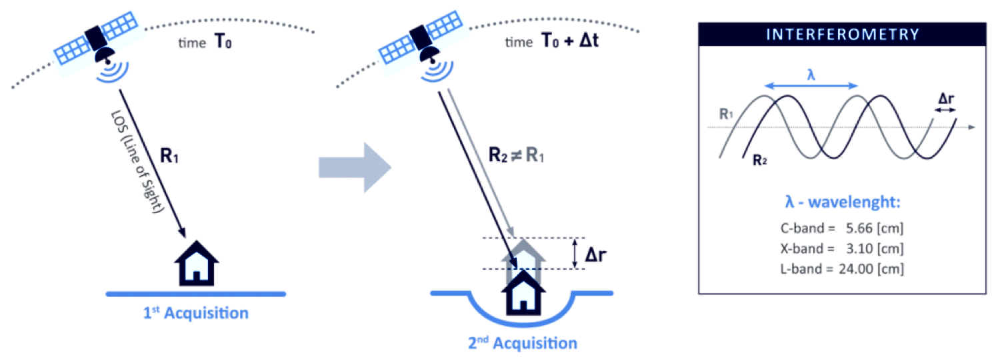
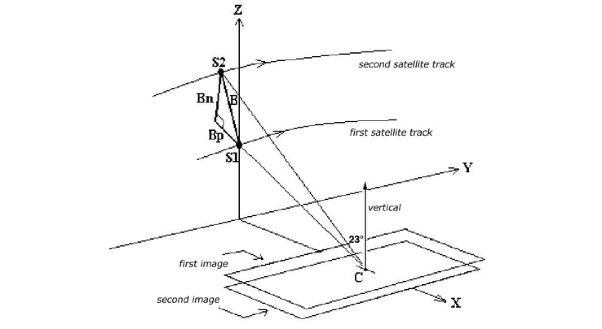

# Sentinel-1 InSAR Product Guide
This document is a guide for users of Interferometric Synthetic Aperture Radar (InSAR) Sentinel-1 products generated by the Alaska Satellite Facility (ASF). Users can request InSAR products [On Demand](https://search.asf.alaska.edu/#/?topic=onDemand) in ASF's [Vertex](https://search.asf.alaska.edu/#/) data portal, or make use of our [Python SDK](https://hyp3-docs.asf.alaska.edu/using/sdk/) or [API](https://hyp3-docs.asf.alaska.edu/using/api/). Input pair selection in Vertex uses the [SBAS Tool](https://docs.asf.alaska.edu/vertex/sbas/). 

For a step-by-step tutorial on ordering On-Demand InSAR Products using Vertex, visit our [InSAR On Demand story map](https://storymaps.arcgis.com/stories/68a8a3253900411185ae9eb6bb5283d3).

Users are cautioned to read the sections on [limitations](#limitations) and [error sources](#error-sources) in InSAR products before attempting to use InSAR data. For a more complete description of the properties of SAR, see our [Introduction to SAR](../guides/sar_intro.md) guide. 

## Introduction
Interferometric Synthetic Aperture Radar (InSAR) processing uses two SAR images collected over the same area to determine geometric properties of the surface. Missions such as Sentinel-1 are [designed for](https://sentinel.esa.int/web/sentinel/missions/sentinel-1/mission-objectives) monitoring surface deformation using InSAR, which is optimal when acquisitions are made from a consistent location in space ([short perpendicular baseline](#baselines)) over regular time intervals. 

The phase measurements of two SAR images acquired at different times from the same place in orbit are differenced to detect and quantify surface changes, such as deformation caused by earthquakes, volcanoes, or groundwater subsidence.

InSAR can also be used to generate digital elevation models, but the optimal mission for DEM generation has the opposite characteristics of the Sentinel-1 mission. Topography is best mapped when the two acquisitions are obtained as close together as possible in time ([short temporal baseline](#baselines)), but from different vantage points in space (larger perpendicular baseline than would be optimal for deformation mapping). 

### Brief Overview of InSAR
SAR is an active sensor that transmits pulses and listens for echoes. These echoes are recorded in phase and amplitude, with the phase being used to determine the distance from the sensor to the target and the amplitude yielding information about the roughness and dielectric constant of that target.

*Figure 1: Two passes of an imaging SAR taken at time T0 and T0 + ∆t, will give two distances to the ground, R1 and R2.  A difference between R1 and R2 shows motion on the ground.  In this case, a subsidence makes R2 greater than R1.  Credit: Franz J. Meyer*

InSAR exploits the phase difference between two SAR images to create an interferogram that shows where the phase and, therefore, the distance to the target has changed from one pass to the next, as illustrated in Figure 1.  There are several factors that influence the interferogram, including earth curvature, topographic effects, atmospheric delays, surface motion, and noise.  With proper processing, Sentinel-1 InSAR can be used to detect changes in the earth's surface down to the centimeter scale. Applications include volcanic deformation, subsidence, landslide detection, and earthquake assessment.

### Wavelengths
The SAR sensors on the Sentinel-1 satellites transmit C-band signals, with a wavelength of 5.6 cm. The signal wavelength impacts the penetration capability of the signal, so it is important to be aware of the sensor wavelength when working with SAR datasets. C-band SAR will penetrate more deeply into canopy or surfaces than an X-band signal, but not nearly as deep as an L-band SAR signal, which, with a wavelength on the order of 25 cm, is better able to penetrate canopy and return signals from the forest floor. 

Different wavelengths are also sensitive to different levels of deformation. To detect very small changes over relatively short periods of time, you may require a signal with a smaller wavelength (such as X-band). However, signals with shorter wavelengths are also more prone to decorrelation due to small changes in surface conditions such as vegetation growth. 

For slower processes that require a longer time interval to detect movement, longer wavelengths (such as L-band) may be necessary. C-band sits in the middle. It can detect fairly small changes over fairly short periods of time, but is not as sensitive to small changes as X-band or as able to monitor surface dynamics under canopy as L-band.

### Polarizations
Polarization refers to the direction of travel of an electromagnetic wave.  A horizontal wave is transmitted so that it oscillates in a plane parallel to the surface imaged, while a vertical wave oscillates in a plane perpendicular to the surface imaged. 

Most modern SAR systems can transmit chirps with either a horizontal or vertical polarization. In addition, some of these sensors can listen for either horizontal or vertical backscatter. This gives rise to 4 different types of returns: HH, HV, VV, and VH, with the first letter indicating the transmit method and the second the receive method. For example, VH is a vertically polarized transmit signal with horizontally polarized echoes recorded. 

For InSAR applications, processing is generally performed on the co-pol (VV or HH) data and not on the cross-pol (VH or HV) data. Also, each image used in an InSAR pair is required to be the same polarization - two HH images of the same area could form a valid pair, while a single HH with a single VV of the same area would not.

### Baselines
#### Perpendicular Baseline
The term *baseline* refers to the physical distance between the two vantage points from which images used as an InSAR pair are acquired. The baseline is decomposed into a normal and a perpendicular component as shown in Figure 2. 

To monitor surface deformation, the perpendicular baseline for the two acquisitions should be very small in order to maximize the coherence of the phase measurements. 

In order to determine topography, two slightly different vantage points are required. Sensitivity to topography depends on the perpendicular baseline, the sensor wavelength, the distance between the satellite and the ground, and the sensor look angle. 

*Figure 2: Geometry of InSAR baselines. Two satellite passes image the same area on the ground from positions S1 and S2, resulting a baseline of B which can be decomposed into normal (Bn) and perpendicular (Bp) components. Here Y is the direction of travel, referred to as the ****along-track**** or ****azimuth**** direction, and X is the direction perpendicular to motion, referred to as the ****cross-track**** or ****range**** direction. Credit: Franz J. Meyer*

#### Temporal Baseline
In contrast to the (physical) baseline, the *temporal baseline* refers to the time separation between imaging passes. Along-track interferometry measures motion in the millisecond to second range. This technique can detect ocean currents and rapidly moving objects like boats. Differential interferometry is the standard method used to detect motion in the range of days to years. This is the type of interferometry that is performed by the Sentinel-1 HyP3 InSAR processing algorithm. Table 1 lists different temporal baselines, their common names, and what they can be used to measure.  

|Duration | Known as | Measurement of | 
|---------|----------|----------------|
| ms to sec | along-track | ocean currents, moving object detection, MTI | 
| days | differential | glacier/ice fields/lava flows, surface water extent, hydrology |
| days to years | differential | subsidence, seismic events, volcanic activity, crustal displacement | 

*Table 1: Temporal baselines and what they measure. Different geophysical phenomena can be detected based upon the temporal baseline. In general, the longer the temporal baseline, the smaller the motion that can be detected.*

## Ordering On Demand InSAR Products
[On Demand InSAR](https://storymaps.arcgis.com/stories/68a8a3253900411185ae9eb6bb5283d3) products are generated using ASF's HyP3 platform. Jobs can be submitted for processing using the [Vertex](https://search.asf.alaska.edu/#/) data portal, the [HyP3 Python SDK](https://hyp3-docs.asf.alaska.edu/using/sdk/) or the [HyP3 API](https://hyp3-docs.asf.alaska.edu/using/api/). 

### Vertex 
InSAR pairs are selected in [Vertex](https://search.asf.alaska.edu/#/) using either the [Baseline Search](https://docs.asf.alaska.edu/vertex/baseline/) or the [SBAS Search](https://docs.asf.alaska.edu/vertex/sbas/) interface. 

The [Baseline](https://docs.asf.alaska.edu/vertex/baseline/) tool is the best option for selecting a specific single InSAR pair. Use the [Geographic Search](https://docs.asf.alaska.edu/vertex/manual/#geographic-search-options) to find an image that covers your time and area of interest, select that item in the results, and click the Baseline button in the center panel. The Baseline tool then displays all of the scenes that could be used to generate an interferogram using the selected image. Scroll through the results to find pairs to add to the On Demand queue, or click on items displayed in the plot to highlight that particular image pair. 

The [SBAS](https://docs.asf.alaska.edu/vertex/sbas/) tool is designed for generating time series of InSAR pairs. As with the Baseline search, you can launch the SBAS search from the center panel of a [Geographic Search](https://docs.asf.alaska.edu/vertex/manual/#geographic-search-options) result. It will display all of the valid InSAR pairs through time based on the acquisition location of the input scene. This functionality is designed for processing a series of short-baseline interferograms to be used in SBAS analysis. The results can be adjusted based on baseline criteria (both perpendicular and temporal), and restricted to specific periods of time. Once the list is refined, you have the option to add all of the InSAR pairs displayed in the results to the On Demand queue.

### HyP3 SDK and API
The [HyP3 SDK](https://hyp3-docs.asf.alaska.edu/using/sdk/) provides support for processing nearest-neighbor interferograms for a selected granule. Specifying nearest-neighbor processing will find the next appropriate scene back in time to use as the reference granule for generating an interferogram with the selected granule. You can specify up to 2 nearest neighbors, which will pair the scene closest in time and next-closest in time to the selected granule for generating InSAR products, as demonstrated in this [sample HyP3 SDK Jupyter Notebook](https://nbviewer.jupyter.org/github/ASFHyP3/hyp3-sdk/blob/main/docs/sdk_example.ipynb#Submitting-Sentinel-1-InSAR-jobs).

You may still find the Geographic, Baseline and SBAS searches in Vertex useful for finding reference scenes or picking specific pairs to use when submitting InSAR jobs via the [SDK](https://hyp3-docs.asf.alaska.edu/using/sdk/) or [API](https://hyp3-docs.asf.alaska.edu/using/api/). 

### Considerations for Selecting an InSAR Pair
When selecting an InSAR pair, observe the following required conditions:

1. Images from an identical orbit direction (either ascending or descending)
2. Images with identical incidence angles and beam mode
3. Images with identical resolution and wavelength (usually from the same sensor)
4. Images with the same viewing geometry (same path and frame)
5. Images with identical polarizations (both HH or VV)

In addition, the following suggestions may be helpful:

1. Use images from similar seasons/growth/weather conditions
2. For deformation mapping: limited spatial separation of acquisition locations (small physical baseline)
3. For topographic mapping: limited time separation between images (small temporal baseline) 

To analyze deformation caused by a single discrete event, such as an earthquake, select images that bracket the event as closely in time as possible. Keeping the window narrowly focused on the time of the event will reduce the impacts of other processes that may mask the signal of the event of interest.

------
> **Aside: Critical Baseline**
>
> Large baselines are better than small for topographic mapping. However, as the baseline increases, coherence decreases. As some point, it is impossible to create an interferogram because of baseline decorrelation. The maximum viable baseline per platform, referred to as the *critical baseline*, is a function of the distance to the ground, the wavelength, and the viewing geometry of the platform. For Sentinel-1 this critical baseline is about 5 km. In practice, if the perpendicular baseline between images is more than 3/4 of the critical baseline, interferogram creation will be problematic due to the level of noise. 
> 
> For deformation mapping, it is best to minimize the perpendicular baseline whenever possible, but there may be tradeoffs in terms of finding suitable temporal baselines. In most cases, however, pairs selected for deformation mapping will have perpendicular baselines *much* smaller than the critical baseline.

------ 

### Processing Options 

There are several options offered with the InSAR products.  Currently, these are (1) the number of looks to take, (2) inclusion of look vectors, (3) inclusion of the line of sight displacement file, and (4) inclusion of the incidence angle map.

1. The **number of looks** drives the resolution and pixel spacing of the output products. Selecting 10x2 looks will yield larger products with 80 m resolution and pixel spacing of 40 m. Selecting 20x4 looks reduces the resolution to 160 m and reduces the size of the products (roughly 1/4 the size of 10x2 look products), with a pixel spacing of 80 m. The default is 20x4 looks.

2. The **look vectors** are stored in two files. The lv_theta indicates the SAR look vector elevation angle at each pixel, ranging from -&#960/2 (down) to &#960/2 (up). The look vector elevation angle is defined as the angle between the horizontal surface and the look vector with positive angles indicating sensor positions above the surface. The lv_phi map indicates the SAR look vector orientation angle at each pixel, ranging from 0 (east) to &#960/2 (north). The look vector orientation angle is defined as the angle between the East direction and the projection of the look vector on the horizontal surface plan. The orientation angle increases towards north, with the North direction corresponding to &#960/2 (and south to -&#960/2). Both angles are expressed in radians. The default is to not include these files in the output product bundle.

3. The **line-of-sight displacement** is the ground movement away from or towards the platform. It is used to create the vertical displacement map during the final steps of InSAR processing. In order to have this file included in the output zip file, this option must be selected.  The default is to not include the line-of-sight data file.

4. The **local incidence angle** is defined as the angle between the incident radar signal and the local surface normal, expressed in radians. The default is to not include the incidence angle data file.

## InSAR Workflow

The InSAR workflow used in HyP3 was developed by ASF using GAMMA software.  The steps include pre-processing steps, interferogram preparation, and product creation.  Once these steps are performed, an output product package will be created.  See [product packaging](#product-packaging) for details on the individual files included in the package.  

### Pre-Processing

Pre-processing steps prepare the SAR images to be used in interferometry.  The pre-processing steps include image selection, ingest (including calibration), creation of a suitable DEM, and calculation of the burst overlap.

#### Select an InSAR Pair
Although it is possible to start from RAW data, Sentinel-1 InSAR processing is typically done using [Interferometric Wide swath Single Look Complex](https://sentinel.esa.int/web/sentinel/user-guides/sentinel-1-sar/acquisition-modes/interferometric-wide-swath "Link to ESA IW SLC description") (IW SLC) data as the input.  This means that the data has been formed into an image through SAR processing, but has not been multi-looked.  

The SLC pair is [defined by the user](#ordering-on-demand-insar-products), either through the Vertex interface, or using the HyP3 API or SDK. 

#### Ingest SLC data into GAMMA format

Once the InSAR pair has been identified, the selected SLC data are ingested into GAMMA internal format. This is performed by the GAMMA program *par_s1_slc*. GAMMA format has raw data files (only data, no headers or line leaders) with metadata stored in external files with a .par extension.  

During ingest into GAMMA's internal format, the SLC data is calibrated by applying the calibration coefficients that are supplied with each product. This process puts the SAR backscatter into a known scale where the diffuse volume scattering of the Amazon rainforest is a constant -6.5 dB.

Immediately after ingesting the SLC, the state vectors are updated to use the best available state vectors. The state vector types in order of absolute correctness are original predicted (O), restituted (R), and precision (P). In practice, one will never receive an InSAR product that uses the original predicted orbit - only granules for which a restituted or precision orbit is available can be used in HyP3 InSAR processing. The orbit type used for generating the InSAR product is indicated in the product filename, as shown in Figure 3.

*Figure 3: Position of the orbit type in the HyP3 product name.*  

#### Prepare the DEM File

In order to create differential InSAR products that show motion on the ground, one must subtract the topographic phase from the interferogram. The topographic phase, in this case, is replicated by using an [existing DEM](docs/dems.md) to calculate the actual topographic phase. This phase is then removed from the interferogram leaving just the motion or deformation signal (plus atmospheric delays and noise).  

The DEM that is used for HyP3 InSAR is the [Copernicus GLO-30 Public DEM](https://registry.opendata.aws/copernicus-dem/). This DEM provides global coverage at 30-m pixel spacing, and provides higher-quality products over a wider area than the older DEMs (SRTM and NED) previously used to generate ASF's On Demand products.

The DEM tiles necessary to cover the input granules for the InSAR product are downloaded. A geoid correction applied to the DEM, and it is resampled to match the [output resolution](#processing-options) of the InSAR product (160 m for 20x4 products, 80 m for 10x2 products) and projected to the appropriate UTM Zone for the granule location.

#### Calculate Overlapping Bursts

The IW SLC Sentinel-1 data comes in three swaths. However, a further subdivision is made in the data, wherein *bursts* occur. Bursts are the fundamental building block for Sentinel-1 imagery. Each one is a portion of the final image, around 1500 lines long and one swath width wide. Thus, the more busts, the longer the file is in length.

Each burst is precisely timed to repeat at a given time interval. This consistent repeat combined with precise velocity control gives rise to the fact that the bursts start at the same time on each pass around the globe. 

For example: a burst images a piece of the Galápagos Islands. The next time that same piece of the island is imaged, the time of day will be the same, to within few milliseconds. Only the frames containing overlapping bursts can be used to perform InSAR processing. This means that **if there is no burst overlap in the pair selected as input, the InSAR process will not run**.

Repeatable burst timing is exploited by HyP3 in order to calculate the bursts that overlap between two scenes.  These overlapping bursts are the only ones used in the rest of the InSAR process. The rest are discarded.

### Interferogram Creation, Co-registration and Refinement

Before the interferogram is created, the lookup table that maps from the SLC image space into a ground range image space is created. At this time, the interferogram of the topography is simulated using the previously prepared DEM.

Once these steps have been performed, the two SLCs are co-registered to within 0.02 pixels. This is done by iteratively using the following steps:

1. Resample the secondary SLC using previously calculated offset polynomial
2. Match the reference and secondary SLC images using intensity cross-correlation
3. Estimate range and azimuth offset polynomial coefficients from results of matching
4. Create differential interferogram using the co-registered SLCs and the simulated interferogram
5. Update offset polynomial by adding the current estimates

Note that these steps are automatically run 4 times.  At that point, **if the last offset calculated was more than 0.02 pixels, then the procedure will fail to complete**.

Provided the images passed the check for convergence, the next co-registration step employs the *Enhanced Spectral Diversity* (ESD) algorithm to match the two scenes to better than 1/100th of a pixel. This is accomplished by examining the overlap area between subsequent bursts. If there is even a small offset, the phase between the bursts will not match. This phase mismatch is then used to calculate the corresponding azimuth offset.

To finish interferogram processing, steps 1 through 4 are run once again, this time with the offsets from the ESD included. The output of this entire process is a *wrapped interferogram*.

### Phase Unwrapping

All of the phase differences in a wrapped interferograms lie between -&#960 and &#960. Phase unwrapping attempts to assign multiples of 2&#960 to add to each pixel in the interferogram to restrict the number of 2&#960 jumps in the phase to the regions where they may actually occur. These regions  are areas of radar layover or areas of deformation exceeding half a wavelength in the line of sight. Thermal noise and interferometric decorrelation can also result in these 2&#960 phase discontinuities called *residues*.   

Before the interferogram can be unwrapped, it must be filtered to remove noise. This is accomplished using an adaptive spectral filtering algorithm. This adaptive interferogram filtering aims to reduce phase noise, increase the accuracy of the interferometric phase, and reduce the number of interferogram residues as an aid to phase unwrapping. In this case, residues are points in the interferogram where the sum of the phase differences between pixels around a closed path is not 0.0, which indicates a jump in phase.

Another step before unwrapping is to create a coherence mask to guide the phase unwrapping process. The coherence is estimated from the normalized interferogram and the co-registered intensity images using an MLI estimator with rectangular weighting with a 5x5 moving window. This file has values from 0.0 (total decorrelation) to 1.0 (perfectly coherent).  The coherence is then turned into a mask wherein all pixels are either 0 (don't unwrap) or 1 (unwrap). Any input pixel with a coherence less than 0.1 or an intensity below 0.2 are set to zero and not used during unwrapping.

### Geocoding and Product Creation

After the phase is unwrapped, the final steps are geocoding and product creation.  

#### Geocoding

Geocoding is the process of reprojecting pixels from SAR slant range space (where all the calculations have been performed) into map projected ground range space (where analysis of products is simplest). Using the look up table previously computed, this process takes each pixel in the input product and relocates it to the UTM zone of the DEM used in processing. This is accomplished using nearest-neighbor resampling so that original pixel values are preserved.

#### Product Creation

Files are next exported from GAMMA internal format into the widely-used GeoTIFF format, complete with geolocation information. GeoTIFFs are created for amplitude, coherence, unwrapped phase, and vertical displacement by default. Optionally, GeoTIFFs of look vectors, line-of-sight displacement, incidence angle, and a water mask can also be requested.  
 
## Product Packaging

HyP3 InSAR output is a zip file containing a variety of files including GeoTIFFs, PNG browse images with geolocation information, Google Earth KMZ files, a metadata file, and a README file.

### Naming Convention

The InSAR product names are packed with information pertaining to the processing of the data, presented in the following order, as illustrated in Figure 4. 

- The platform names, either Sentinel-1A or Sentinel-1B, are abbreviated "A" or "B", indicating the reference and secondary granule's imaging platform
- The reference start date and time and the secondary start date and time, with the date and time separated by the letter T
- The polarizations for the pair, either HH or VV, the orbit type, and the days of separation for the pair
- The product type (always INT for InSAR) and the pixel spacing, which will be either 80 or 40, based upon the number of looks selected when the job was submitted for processing
- The software package used for processing is always GAMMA for GAMMA InSAR products
- User-defined options are denoted by three characters indicating whether the product is water masked (w) or not (u), the scene is clipped (e for entire area, c for clipped), and whether a single subswath was processed or the entire granule (either 1, 2, 3, or F for full swath)
    - *Currently only the water masking is available as a user-selected option; the products always include the full granule extent with all three subswaths*
- The filename ends with the ASF product ID, a 4 digit hexadecimal number

*Figure 4: Breakdown of ASF InSAR naming scheme.*

### Image Files

All of the main InSAR product files are 32-bit floating-point single-band GeoTIFFs.

- The amplitude image is the calibrated radiometric backscatter from the reference granule in sigma-nought power. The image is terrain corrected using a geometric correction, but not radiometrically corrected. 
- The coherence file contains values from 0.0 to 1.0, with 0.0 being completely non-coherent and 1.0 being perfectly coherent. 
- The unwrapped phase file shows the results of the phase unwrapping process. This is the main interferogram output. 
- The line-of-sight displacement file indicates the displacement in meters along the look direction of the sensor (perpendicular to the direction of movement of the satellite).
- The vertical displacement is generated from the line of sight displacement values and the DEM, and makes assumptions that likely do not hold true for most deformation processes that are impacted by horizontal motion as well as vertical motion.
- The look vectors &#966 and &#952 describe the elevation and orientation angles of the sensor's look direction. 
- The DEM file gives the local terrain heights in meters, with a geoid correction applied.
- The water mask image has pixels with a value of 0 for water and 1 for land.
- The incidence angle map gives the local incidence angle of the terrain.
- The KMZ files are Google Earth formatted files provided for simple viewing on that platform.  

Browse images are included for the wrapped (color_phase) and unwrapped (unw_phase) phase files, which are in PNG format and are each 2048 pixels wide. 

The tags and extensions used and example file names for each raster are listed in Table 2 below. 

| Extension | Description | Example |
|---|---|---|
| _amp.tif      | Amplitude | S1AB_20171111T150004_20171117T145926_VVP006_INT80_G_ueF_4D09_amp.tif |
| _corr.tif      | Normalized coherence file | S1AB_20171111T150004_20171117T145926_VVP006_INT80_G_ueF_4D09_corr.tif |
| _unw_phase.tif | Unwrapped geocoded interferogram | S1AB_20171111T150004_20171117T145926_VVP006_INT80_G_ueF_4D09_unw_phase.tif |
| _los__disp.tif | Line-of-sight displacement | S1AB_20171111T150004_20171117T145926_VVP006_INT80_G_ueF_4D09_los_disp.tif |
| _vert_disp.tif | Vertical displacement | S1AB_20171111T150004_20171117T145926_VVP006_INT80_G_ueF_4D09_vert_disp.tif |
| _lv_phi.tif    | Look vector &#966 | S1AB_20171111T150004_20171117T145926_VVP006_INT80_G_ueF_4D09_lv_phi.tif |
| _lv_theta.tif  | Look vector &#952 | S1AB_20171111T150004_20171117T145926_VVP006_INT80_G_ueF_4D09_lv_theta.tif |
| _dem.tif       | Digital elevation model | S1AB_20171111T150004_20171117T145926_VVP006_INT80_G_ueF_4D09_dem.tif |
| _mask.tif       | Water mask | S1AB_20171111T150004_20171117T145926_VVP006_INT80_G_ueF_4D09_mask.tif |
| _inc_map.tif  | Incidence angle  | S1AB_20171111T150004_20171117T145926_VVP006_INT80_G_ueF_4D09_inc_map.tif |
| .kmz | Zipped Google Earth image | S1AB_20171111T150004_20171117T145926_VVP006_INT80_G_ueF_4D09_unw_phase.kmz |
| _color_phase.png | Wrapped phase browse image | S1AB_20171111T150004_20171117T145926_VVP006_INT80_G_ueF_4D09_color_phase.png |
| _unw_phase.png | Unwrapped phase browse image | S1AB_20171111T150004_20171117T145926_VVP006_INT80_G_ueF_4D09_unw_phase.png |

*Table 2: Image files in product package*

### Metadata Files

Along with the image files, there are currently two text files - the main readme and an important InSAR parameters file. Beyond this, there are two auxiliary xml format metadata files, one for each of the PNG browse images. These are all identified by their extensions, as shown in Table 3.

| Extension | Description | Example |
|-----------|-------------|---------|
| png.aux.xml | Geolocation information for png browse images | S1AB_20171111T150004_20171117T145926_VVP006_INT80_G_ueF_4D09_color_phase.png.aux.xml |
| .txt | Useful metadata fields for the InSAR pair | S1AB_20171111T150004_20171117T145926_VVP006_INT80_G_ueF_4D09.txt |
| .README.md.txt | Main README file for GAMMA InSAR | S1AB_20171111T150004_20171117T145926_VVP006_INT80_G_ueF_4D09.README.md.txt |

*Table 3: Metadata files in product package*

## Limitations
### Baseline Calculation
The baseline is defined as the difference of the platform positions when a given area is imaged. HyP3 baselines are calculated using the best state vectors available. If precise orbits are not yet available for the input granules, restituted orbits will be used. The original predicted orbits are not used for InSAR processing in HyP3. **If no restituted or precise state vectors are available, the process will not run.**

### Coherence
The phase measurements in the two images used in InSAR must be coherent in order to detect change. Random changes in phase from one acquisition to the next can mask actual surface deformation. Vegetation is a common driver of decorrelation, as changes can easily take place in the interval between two acquisitions due to growth, seasonal changes, or wind effects. It will be difficult to generate valid interferograms with C-band data in heavily vegetated regions due to lack of coherence even with fairly short time intervals. 

Consider seasonality when selecting image pairs. Decorrelation can be particularly high when comparing phase from different seasons. Changes in the condition of vegetation (especially deciduous canopies), snow, moisture, or freeze/thaw state can impact phase measurements. In cases where a temporal baseline is required that spans seasons, it may be better to use an annual interferogram if possible so that the images are more comparable in terms of seasonality.

### Line-of-sight Measurements
When looking at a single interferogram, the only reliable deformation measurements are in the line-of-sight orientation of the sensor. InSAR is not sensitive to motion in the azimuth direction of the satellite, so motion that occurs in the same direction as the satellite's direction of travel will not be detected. 

In addition, a single interferogram cannot be used to determine the relative contributions of vertical and horizontal movement to the line-of-sight displacement measurement. The vertical displacement map is generated based on the assumption that the movement is entirely in the vertical direction. For many processes, that may not actually be the case. 

## Error Sources
On Demand InSAR products do not currently correct for some common sources of error in interferometry, such as atmospheric effects. Further processing or time series analysis can be performed by the user to identify or reduce the impact of some of these errors when using On Demand InSAR products for analysis.

### Atmospheric Delay
While SAR signals can penetrate clouds, atmospheric conditions can delay the transmission of the signal. This results in phase differences that can look like surface deformation signals, but are actually driven by differences in the atmospheric conditions between the pair of acquisitions used to generate the interferogram. 

In some cases, atmospheric errors can be corrected by using an atmospheric model to remove the impacts of the turbulent delay from the interferogram. Another approach is to use time series analysis to identify outliers.

***Always doubt your interferogram first!*** View the interferogram critically, and consider if fringe patterns could potentially be driven by atmospheric effects. 

#### Turbulent Delay
These delays are generally caused by differences in water vapor distribution from one image to the next. They often manifest as wobbly or sausage-shaped fringes, and can potentially mask the signal of a small earthquake. 

#### Stratified Delay
This type of delay is driven mostly by pressure and temperature differences or gradients through the atmospheric column, and often correlates with topography. This atmospheric signature can be confused with movement caused by volcanic activity. If there are multiple volcanoes in an image and they all exhibit similar patterns, it is likely being driven by this type of atmospheric delay. 

### DEM Errors
A DEM is used to remove topographic phase impacts, but if there are inaccuracies in the DEM, residual impacts of those errors can remain in the interferogram. 

### Orbit Uncertainties
This is generally not an issue for Sentinel-1 data, as the orbits are very precise and generally reliable. On Demand InSAR products are only processed once restituted or precise orbits are available. Orbit uncertainties were more problematic in datasets from older missions.

## Data Sources

## Examples
### Surface Deformation 
### Volcanic Deformation
### Subsidence
### Earthquakes

## Data Access

