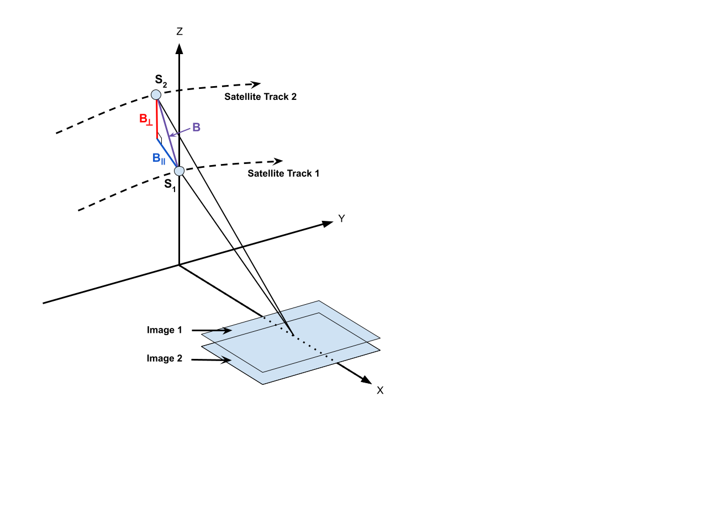
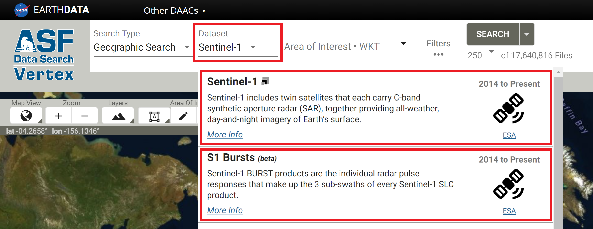



## Introduction
Interferometric Synthetic Aperture Radar (InSAR) processing uses two SAR images collected over the same area to determine geometric properties of the surface. Missions such as Sentinel-1 are [designed for](https://sentinel.esa.int/web/sentinel/missions/sentinel-1/mission-objectives "https://sentinel.esa.int/web/sentinel/missions/sentinel-1/mission-objectives" ){target=_blank} monitoring surface deformation using InSAR, which is optimal when acquisitions are made from a consistent location in space ([short perpendicular baseline](#baselines "Jump to Baselines section of this document")) over regular time intervals.

The phase measurements of two SAR images acquired at different times from the same place in orbit are differenced to detect and quantify surface changes, such as deformation caused by earthquakes, volcanoes, or groundwater subsidence.

InSAR can also be used to generate digital elevation models, but the optimal mission for DEM generation has the opposite characteristics of the Sentinel-1 mission. Topography is best mapped when the two acquisitions are obtained as close together as possible in time ([short temporal baseline](#baselines "Jump to Baselines section of this document")), but from different vantage points in space (larger perpendicular baseline than would be optimal for deformation mapping).

### Brief Overview of InSAR
SAR is an active sensor that transmits pulses and listens for echoes. These echoes are recorded in phase and amplitude, with the phase being used to determine the distance from the sensor to the target and the amplitude yielding information about the roughness and dielectric constant of that target.

*Figure 1: Two passes of an imaging SAR taken at time T0 and T0 + ∆t, will give two distances to the ground, R1 and R2.  A difference between R1 and R2 shows motion on the ground.  In this case, a subsidence makes R2 greater than R1.  Credit: [TRE ALTAMIRA](https://site.tre-altamira.com/insar/ "https://site.tre-altamira.com/insar" ){target=_blank}*

InSAR exploits the phase difference between two SAR images to create an interferogram that shows where the phase and, therefore, the distance to the target has changed from one pass to the next, as illustrated in Figure 1.  There are several factors that influence the interferogram, including earth curvature, topographic effects, atmospheric delays, surface motion, and noise.  With proper processing, Sentinel-1 InSAR can be used to detect changes in the earth's surface down to the centimeter scale. Applications include volcanic deformation, subsidence, landslide detection, and earthquake assessment.

### Wavelengths
The SAR sensors on the Sentinel-1 satellites transmit C-band signals, with a wavelength of 5.6 cm. The signal wavelength impacts the penetration capability of the signal, so it is important to be aware of the sensor wavelength when working with SAR datasets. C-band SAR will penetrate more deeply into canopy or surfaces than an X-band signal, but not nearly as deep as an L-band SAR signal, which, with a wavelength on the order of 25 cm, is better able to penetrate canopy and return signals from the forest floor.

Different wavelengths are also sensitive to different levels of deformation. To detect very small changes over relatively short periods of time, you may require a signal with a smaller wavelength (such as X-band). However, signals with shorter wavelengths are also more prone to decorrelation due to small changes in surface conditions such as vegetation growth.

For slower processes that require a longer time interval to detect movement, longer wavelengths (such as L-band) may be necessary. C-band sits in the middle. It can detect fairly small changes over fairly short periods of time, but is not as sensitive to small changes as X-band or as able to monitor surface dynamics under canopy as L-band.

### Polarizations
Polarization refers to the direction of travel of an electromagnetic wave.  A horizontal wave is transmitted so that it oscillates in a plane parallel to the surface imaged, while a vertical wave oscillates in a plane perpendicular to the surface imaged.

Most modern SAR systems can transmit chirps with either a horizontal or vertical polarization. In addition, some of these sensors can listen for either horizontal or vertical backscatter. This gives rise to 4 different types of returns: HH, HV, VV, and VH, with the first letter indicating the transmission method and the second the receive method. For example, VH is a vertically polarized transmit signal with horizontally polarized echoes recorded.

For InSAR applications, processing is generally performed on the co-pol (VV or HH) data and not on the cross-pol (VH or HV) data. Also, each image used in an InSAR pair is required to be the same polarization - two HH images of the same area could form a valid pair, while a single HH with a single VV of the same area would not.

### Baselines
#### Perpendicular Baseline
The term *baseline* refers to the physical distance between the two vantage points from which images used as an InSAR pair are acquired. The baseline is decomposed into perpendicular (also called normal) and parallel components, as shown in Figure 2.

To monitor surface deformation, the perpendicular baseline for the two acquisitions should be very small in order to maximize the coherence of the phase measurements.

In order to determine topography, two slightly different vantage points are required. Sensitivity to topography depends on the perpendicular baseline, the sensor wavelength, the distance between the satellite and the ground, and the sensor look angle.

*Figure 2: Geometry of InSAR baselines. Two satellite passes image the same area on the ground from positions S1 and S2 , resulting in a baseline of B, which can be decomposed into ****perpendicular**** (B⟂ ) and ****parallel**** (B∥ ) components. Here Y is the direction of travel, referred to as the ****along-track**** or ****azimuth**** direction, and X is the direction perpendicular to motion, referred to as the ****cross-track**** or ****range**** direction. Credit: ASF*

#### Temporal Baseline
In contrast to the (physical) baseline, the *temporal baseline* refers to the time separation between imaging passes. Along-track interferometry measures motion in the millisecond to second range. This technique can detect ocean currents and rapidly moving objects like boats. Differential interferometry is the standard method used to detect motion in the range of days to years. This is the type of interferometry that is performed by the Sentinel-1 HyP3 InSAR processing algorithm. Table 1 lists different temporal baselines, their common names, and what they can be used to measure.

| Duration      | Known as     | Measurement of                                                      | 
|---------------|--------------|---------------------------------------------------------------------|
| ms to sec     | along-track  | ocean currents, moving object detection, MTI                        | 
| days          | differential | glacier/ice fields/lava flows, surface water extent, hydrology      |
| days to years | differential | subsidence, seismic events, volcanic activity, crustal displacement | 

*Table 1: Temporal baselines and what they measure. Different geophysical phenomena can be detected based upon the temporal baseline. In general, the longer the temporal baseline, the smaller the motion that can be detected.*

#### Critical Baseline
Large baselines are better than small for topographic mapping. However, as the baseline increases, coherence decreases. At some point, it is impossible to create an interferogram because of baseline decorrelation. The maximum viable baseline per platform, referred to as the *critical baseline*, is a function of the distance to the ground, the wavelength, and the viewing geometry of the platform.

For Sentinel-1, this critical baseline is about 5 km. In practice, if the perpendicular baseline between images is more than 3/4 of the critical baseline, interferogram creation will be problematic due to the level of noise.

For deformation mapping, it is best to minimize the perpendicular baseline whenever possible, but there may be tradeoffs in terms of finding suitable temporal baselines. In most cases, however, pairs selected for deformation mapping will have perpendicular baselines *much* smaller than the critical baseline.

## Ordering On Demand InSAR Products
All of ASF's On Demand InSAR products are generated using ASF's HyP3 platform. Jobs can be submitted for processing using the [Vertex](https://search.asf.alaska.edu/ "https://search.asf.alaska.edu" ){target=_blank} data portal, the [HyP3 Python SDK](https://hyp3-docs.asf.alaska.edu/using/sdk/ "https://hyp3-docs.asf.alaska.edu/using/sdk" ){target=_blank} or the [HyP3 API](https://hyp3-docs.asf.alaska.edu/using/api/ "https://hyp3-docs.asf.alaska.edu/using/api" ){target=_blank}.

### Vertex
InSAR pairs are selected in [Vertex](https://search.asf.alaska.edu/#/ "https://search.asf.alaska.edu" ){target=_blank} using either the [Baseline Search](https://docs.asf.alaska.edu/vertex/baseline/ "https://docs.asf.alaska.edu/vertex/baseline" ){target=_blank} or the [SBAS Search](https://docs.asf.alaska.edu/vertex/sbas/ "https://docs.asf.alaska.edu/vertex/sbas" ){target=_blank} interface. The process of selecting pairs is the same for both IW SLC products and individual SLC bursts, but you will need to select the appropriate dataset when searching for content. As illustrated below, select the **Sentinel-1** option in the Dataset menu to search for IW SLC products, and select the **S1 Bursts** option to search for individual SLC bursts. 

The [Baseline](https://docs.asf.alaska.edu/vertex/baseline/ "https://docs.asf.alaska.edu/vertex/baseline" ){target=_blank} tool is the best option for selecting specific InSAR pairs. Use the [Geographic Search](https://docs.asf.alaska.edu/vertex/manual/#geographic-search-options "https://docs.asf.alaska.edu/vertex/manual/#geographic-search-options" ){target=_blank} to find an image that covers your time and area of interest, select that item in the results, and click the Baseline button in the center panel. The Baseline tool then displays all of the scenes that could be used to generate an interferogram using the selected image. Scroll through the results to find pairs to add to the On Demand queue, or click on items displayed in the plot to highlight that particular image pair.

The [SBAS](https://docs.asf.alaska.edu/vertex/sbas/ "https://docs.asf.alaska.edu/vertex/sbas" ){target=_blank} tool is designed for generating time series of InSAR pairs. As with the Baseline search, you can launch the SBAS search from the center panel of a [Geographic Search](https://docs.asf.alaska.edu/vertex/manual/#geographic-search-options "https://docs.asf.alaska.edu/vertex/manual/#geographic-search-options" ){target=_blank} result. It will display all of the valid InSAR pairs through time based on the acquisition location of the input scene. This functionality is designed for processing a series of interferograms to be used in SBAS (Small BAseline Subset) analysis. The results can be adjusted based on baseline criteria (both perpendicular and temporal), and restricted to specific periods of time. Once the list is refined, you have the option to add all of the InSAR pairs displayed in the results to the On Demand queue.

### HyP3 SDK and API
The [HyP3 SDK](https://hyp3-docs.asf.alaska.edu/using/sdk/ "https://hyp3-docs.asf.alaska.edu/using/sdk" ){target=_blank} and [API](https://hyp3-docs.asf.alaska.edu/using/api/ "https://hyp3-docs.asf.alaska.edu/using/api" ){target=_blank} provide support for creating interferograms based on a pair of selected granules. To identify granules you'd like to process, we suggest using the Geographic, Baseline and SBAS search tools in [Vertex](https://search.asf.alaska.edu/ "https://search.asf.alaska.edu" ){target=_blank}. If you'd prefer to request interferogram processing programmatically, we suggest using Vertex's companion Python package: [`asf_search`](https://docs.asf.alaska.edu/asf_search/basics/ "https://docs.asf.alaska.edu/asf_search/basics" ){target=_blank}. [This HyP3 SDK Jupyter Notebook](https://nbviewer.jupyter.org/github/ASFHyP3/hyp3-sdk/blob/main/docs/sdk_example.ipynb#Submitting-Sentinel-1-InSAR-jobs "https://nbviewer.jupyter.org/github/ASFHyP3/hyp3-sdk/blob/main/docs/sdk_example.ipynb#Submitting-Sentinel-1-InSAR-jobs" ){target=_blank} provides you with an example of how you can use the `asf_search` and `hyp3_sdk` packages together to identify and create stacks of InSAR products.

### Considerations for Selecting an InSAR Pair
When selecting an InSAR pair, observe the following required conditions:

1. Images from an identical orbit direction (either ascending or descending)
2. Images with identical incidence angles and beam mode
3. Images with identical resolution and wavelength (usually from the same sensor)
4. Images with the same viewing geometry (same path and frame)
5. Images with identical polarizations (both HH or VV)

In addition, the following suggestions may be helpful:

1. Use images from similar seasons/growth/weather conditions
2. For deformation mapping: limited spatial separation of acquisition locations (small physical baseline)
3. For topographic mapping: limited time separation between images (small temporal baseline)

To analyze deformation caused by a single discrete event, such as an earthquake, select images that bracket the event as closely in time as possible. Keeping the window narrowly focused on the time of the event will reduce the impacts of other processes that may mask the signal of the event of interest.







## Limitations
### Baseline Calculation
The baseline is defined as the difference of the platform positions when a given area is imaged. HyP3 baselines are calculated using the best state vectors available. If precise orbits are not yet available for the input granules, restituted orbits will be used. The original predicted orbits are not used for InSAR processing in HyP3. **If no restituted or precise state vectors are available, the process will not run.**

### Coherence
The phase measurements in the two images used in InSAR must be coherent in order to detect change. Random changes in phase from one acquisition to the next can mask actual surface deformation. Vegetation is a common driver of decorrelation, as changes can easily take place in the interval between two acquisitions due to growth, seasonal changes, or wind effects. It will be difficult to generate valid interferograms with C-band data in heavily vegetated regions due to lack of coherence even with fairly short time intervals.

Consider seasonality when selecting image pairs. Decorrelation can be particularly high when comparing phase from different seasons. Changes in the condition of vegetation (especially deciduous canopies), snow, moisture, or freeze/thaw state can impact phase measurements. In cases where a temporal baseline is required that spans seasons, it may be better to use an annual interferogram if possible so that the images are more comparable in terms of seasonality.





## Error Sources
On Demand InSAR products do not currently correct for some common sources of error in interferometry, such as atmospheric effects. Further processing or time series analysis can be performed by the user to identify or reduce the impact of some of these errors when using On Demand InSAR products for analysis.

### Atmospheric Delay
While SAR signals can penetrate clouds, atmospheric conditions can delay the transmission of the signal. This results in phase differences that can look like surface deformation signals but are actually driven by differences in the atmospheric conditions between the pair of acquisitions used to generate the interferogram.

In some cases, atmospheric errors can be corrected by using an atmospheric model to remove the impacts of the turbulent delay from the interferogram. Another approach is to use time series analysis to identify outliers.

***Always doubt your interferogram first!*** View the interferogram critically, and consider if fringe patterns could potentially be driven by atmospheric effects. In general, it is best to avoid drawing conclusions from the outcome of a single interferogram.

Tropospheric phase may be less impactful when considering small-scale deformation. As such, if you are using ASF's [Sentinel-1 Burst InSAR products](burst_insar_product_guide.md "Sentinel-1 Burst InSAR Product Guide" ){target=_blank} to look at deformation signals that are smaller than 1 km&sup2;, you should consider using methods other than the typical atmospheric model-based corrections to remove the effects of atmospheric delay. Potential methods in this case include applying band-pass or high-pass spatial filters, or spatial averaging filters such as the approach outlined in [Bekaert et al., 2020](https://doi.org/10.1016/j.rse.2020.111983 "https://doi.org/10.1016/j.rse.2020.111983" ){target=_blank}.

#### Turbulent Delay
These delays are generally caused by differences in water vapor distribution from one image to the next. They often manifest as wobbly or sausage-shaped fringes, and can potentially mask the signal of a small earthquake.

#### Stratified Delay
This type of delay is driven mostly by pressure and temperature differences or gradients through the atmospheric column, and often correlates with topography. This atmospheric signature can be confused with movement caused by volcanic activity. If there are multiple volcanoes in an image, and they all exhibit similar patterns, the signal is likely being driven by this type of atmospheric delay.

### DEM Errors
A DEM is used to remove topographic phase impacts, but if there are inaccuracies in the DEM, residual impacts of those errors can remain in the interferogram.

### Orbit Uncertainties
This is generally not an issue for Sentinel-1 data, as the orbits are very precise and generally reliable. On Demand InSAR products are only processed once [restituted or precise orbits](#baseline-calculation "Jump to Baseline Calculation section of this document") are available. Orbit uncertainties are more problematic when working with datasets from older missions.
