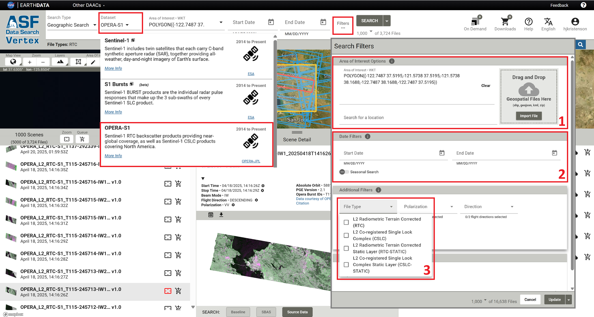
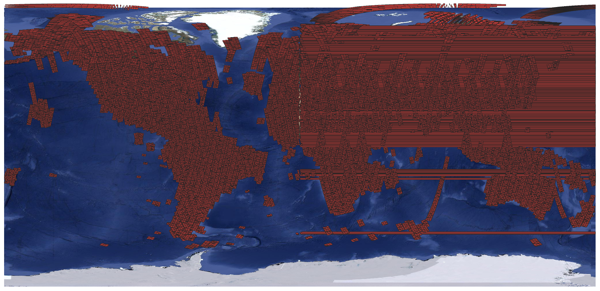
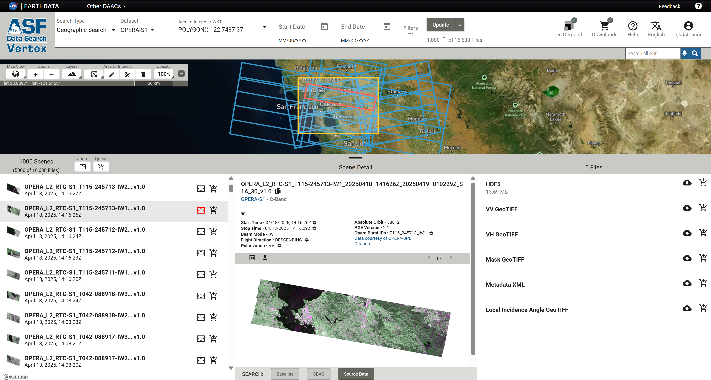
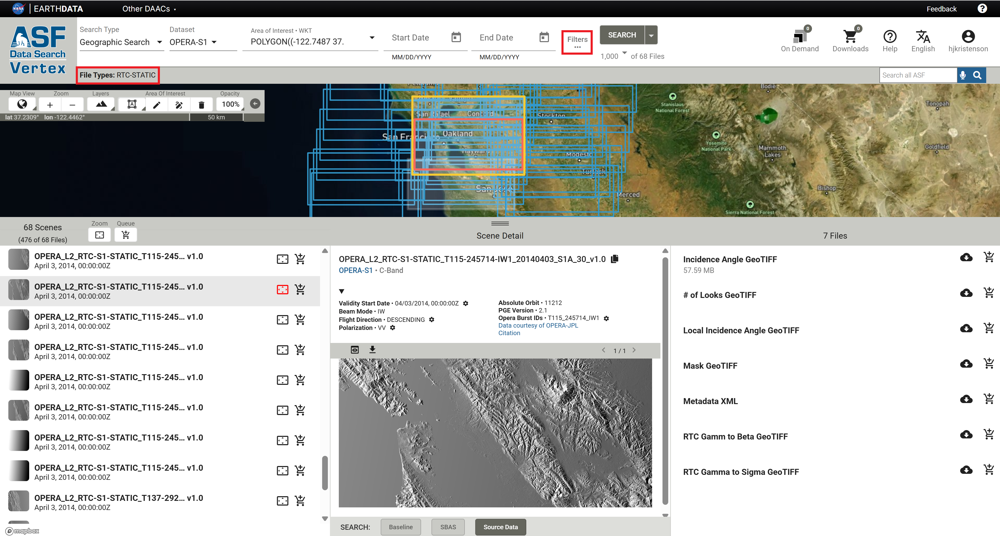
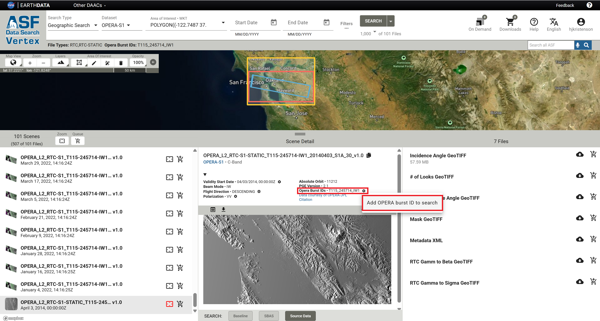
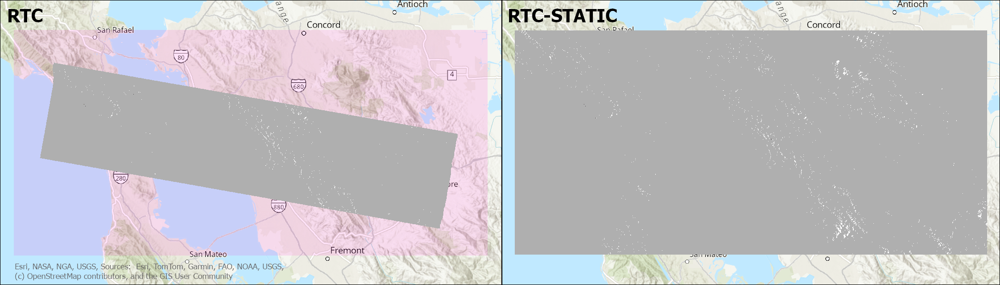
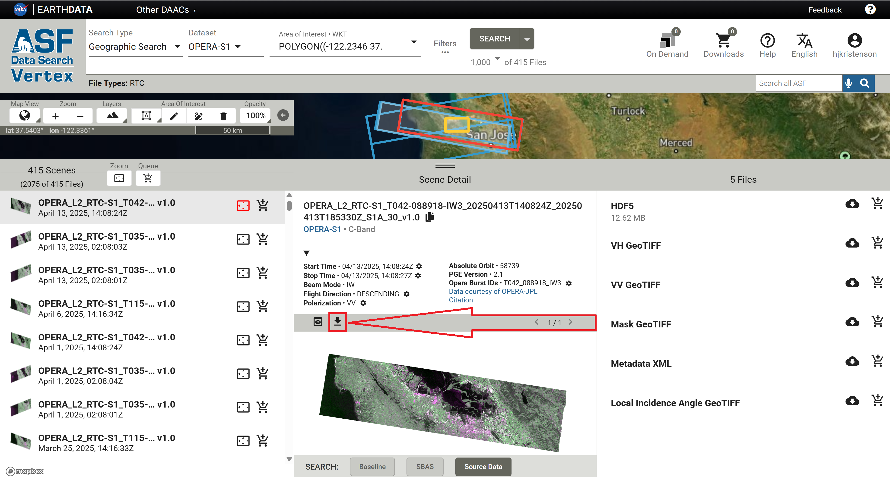

# OPERA RTC for Sentinel-1 (RTC-S1) Product Guide

This document is a guide for users of the 
[OPERA Radiometric Terrain Corrected Backscatter for Sentinel-1 (RTC-S1)](https://www.jpl.nasa.gov/go/opera/products/rtc-product/ "www.jpl.nasa.gov/go/opera/products/rtc-product" ){target=_blank} 
products. These products were developed by the 
[Observational Products for End-Users from Remote Sensing Analysis (OPERA)](https://www.jpl.nasa.gov/go/opera/ "www.jpl.nasa.gov/go/opera" ){target=_blank} 
project at NASA's 
[Jet Propulsion Laboratory](https://www.jpl.nasa.gov/ "www.jpl.nasa.gov/" ){target=_blank} (JPL).

!!! tip "OPERA RTC-S1 Products Now Available On Demand"

    If OPERA RTC-S1 products are not available for your full time range or area of interest, you can now request 
    that they be generated using ASF's On Demand processing platform!

OPERA RTC-S1 products are archived in the 
[OPERA_L2_RTC-S1_V1](https://www.earthdata.nasa.gov/data/catalog/asf-opera-l2-rtc-s1-v1-1 "Earthdata Data Catalog" ){target=_blank} 
collection.

## OPERA RTC-S1 Products

OPERA's 
[Radiometric Terrain Corrected (RTC) Synthetic Aperture Radar (SAR) Backscatter for Sentinel-1 (S1)](https://www.jpl.nasa.gov/go/opera/products/rtc-product/ "https://www.jpl.nasa.gov/go/opera/products/rtc-product/" ){target=_blank} 
product consists of radar backscatter normalized with respect to topography. The RTC algorithm used for the 
OPERA RTC-S1 products was developed by 
[Gustavo Shiroma and others](https://ntrs.nasa.gov/citations/20220000810 "An Efficient Area-Based Algorithm for SAR Radiometric Terrain Correction and Map Projection" ){target=_blank}, 
and is available in the 
[ISCE3 open source software library](https://github.com/isce-framework/isce3 "github.com/isce-framework/isce3" ){target=_blank}.

The RTC-S1 Level-2 products are projected 
into the appropriate UTM Zone or Polar Stereographic coordinate system for the location of each individual product 
and provided in 
[Cloud-Optimized GeoTIFF (COG)](https://cogeo.org/ "https://cogeo.org/" ){target=_blank} 
format. The pixel values of the products represent gamma-0 power. The pixel spacing is 30 meters, and no 
speckle filter has been applied.

RTC products provide users with imagery of the earth's surface regardless of atmospheric conditions. This allows 
users to monitor surface processes during natural disasters, such as hurricanes or wildfires, or in areas that are 
prone to frequent cloud cover. Backscatter values can be used to determine surface water extent, soil moisture 
trends, surface roughness, and vegetation conditions.

#### Digital Elevation Model (DEM)

Radiometric Terrain Correction requires the use of a Digital Elevation Model (DEM) both for 
[correcting distortions caused by topography](https://storymaps.arcgis.com/stories/dc2807b444924fc3a76c117a2c909f8b#ref-n-uKhHbd "OPERA Sentinel-1 RTC StoryMap Tutorial" ){target=_blank}
and for geocoding the output product. The OPERA RTC-S1 products are processed using the 
[Copernicus GLO-30 DEM](https://dataspace.copernicus.eu/explore-data/data-collections/copernicus-contributing-missions/collections-description/COP-DEM "Copernicus DEM" ){target=_blank}.

#### Polarization

Most Sentinel-1 acquisitions are collected in two 
[polarizations](introduction_to_sar.md#polarizations), 
and the OPERA project generates RTC-S1 products for all available polarizations. 

Sentinel-1 acquisitions over land generally have a vertical primary polarization, meaning that the SAR signal is sent out in 
a vertical orientation, but both the co-polarized returns (also vertically polarized) and the cross-polarized returns 
(horizontally polarized) are measured. This results in both VV and VH RTC-S1 products. 

In some areas, particularly remote islands and regions close to the Arctic Ocean, acquisitions are collected with a 
horizontal primary polarization. This results in HH and HV RTC-S1 products. 

Different polarizations are sensitive to different surface characteristics, with VV being more sensitive to surface 
roughness, VH or HV being more sensitive to volume scatterers such as vegetation, and HH being more sensitive to 
double-bounce scattering from objects that stand perpendicular to the ground. 

### Archived OPERA RTC-S1 Products

The OPERA project has generated RTC-S1 products in all available polarizations for all Sentinel-1 acquisitions 
over landmasses (except Antarctica) since January 1, 2022. As new Sentinel-1 SLCs are acquired and added to 
ASF's archive, the OPERA project continues to process them to RTC-S1 products. New RTC-S1 products 
are generally available well within 12 hours of the Sentinel-1 SLC acquisition.

RTC-S1 products generated by the OPERA project are all archived by ASF and can be accessed using a number of methods: 

  - ASF's [Vertex Data Search](https://search.asf.alaska.edu/#/?dataset=OPERA-S1&productTypes=RTC "search.asf.alaska.edu" ){target=_blank}, 
    which is a user-friendly and map-centric interface specialized for search and discover of ASF's SAR holdings
  - Programmatically using the [asf_search Python package](https://docs.asf.alaska.edu/asf_search/basics/ "docs.asf.alaska.edu" ){target=_blank}
  - NASA's [Earthdata Search](https://search.earthdata.nasa.gov/search/granules?p=C2777436413-ASF "search.earthdata.nasa.gov" ){target=_blank} 
    interface, which provides access to all of NASA's Earth Science datasets

For more information on options for accessing archived OPERA RTC-S1 products, refer to ASF's 
[OPERA Sentinel-1 RTC Tutorial](https://storymaps.arcgis.com/stories/dc2807b444924fc3a76c117a2c909f8b "OPERA Sentinel-1 RTC StoryMap Tutorial" ){target=_blank}. 
For more information on the technical specifications of the OPERA RTC-S1 products, refer to JPL's 
[RTC Product Documentation](https://www.jpl.nasa.gov/go/opera/products/rtc-product/ "OPERA RTC Product" ){target=_blank}.

### OPERA RTC-S1 Products On Demand

You can also order OPERA RTC-S1 products from ASF On Demand. This is particularly useful if you need a time 
series of RTC-S1 products that extends beyond the start of the archive. On-Demand processing is available for any 
Sentinel-1 burst with the same burst ID (footprint) as an existing OPERA RTC-S1 product. 

On-Demand RTC-S1 products are generated using the same code that is used by the OPERA project, but are processed 
using ASF's 
[HyP3](https://hyp3-docs.asf.alaska.edu/){target=_blank} 
cloud-native processing platform instead of JPL's 
[OPERA Science Data System (SDS)](https://software.nasa.gov/software/NPO-52101-1){target=_blank} 
processing management software. 

Archived and On-Demand RTC-S1 products can be used interchangeably in a time series analysis.

## Searching for Archived OPERA RTC-S1 Products

To search for existing OPERA RTC-S1 products in 
[Vertex](https://search.asf.alaska.edu/#/?dataset=OPERA-S1&productTypes=RTC "search.asf.alaska.edu" ){target=_blank}, 
select `OPERA-S1` from the `Dataset` drop-down menu. 

Because the OPERA RTC-S1 footprints are so small, there are millions of files in the archive. It is important to 
make use of the available search filters to find the products you want.

1. Set an Area of Interest
2. Set a date range
3. In the Search Filters menu, select the `L2 Radiometric Terrain Corrected (RTC)` File Type

For step-by-step guidance on searching for OPERA RTC-S1 products using 
[Vertex](https://search.asf.alaska.edu/#/?dataset=OPERA-S1&productTypes=RTC "search.asf.alaska.edu" ){target=_blank} 
or the 
[asf_search Python package](https://docs.asf.alaska.edu/asf_search/basics/ "docs.asf.alaska.edu" ){target=_blank}, 
refer to the 
[ASF Data Search](https://storymaps.arcgis.com/stories/dc2807b444924fc3a76c117a2c909f8b#ref-n-r602VT "OPERA Sentinel-1 RTC: ASF Data Search" ){target=_blank} 
section of the 
[OPERA Sentinel-1 RTC StoryMap tutorial](https://storymaps.arcgis.com/stories/dc2807b444924fc3a76c117a2c909f8b "OPERA Sentinel-1 RTC StoryMap Tutorial" ){target=_blank}.

For more information about using 
[Earthdata Search](https://search.earthdata.nasa.gov/search/granules?p=C2777436413-ASF&q=opera%20rtc&tl=1701400109!3!!&lat=37.29921784409428&long=-123.9521484375&zoom=7 "Earthdata Search for OPERA RTC-S1"){target=-blank} 
to access OPERA RTC-S1 products, refer to the 
[Earthdata Search](https://storymaps.arcgis.com/stories/dc2807b444924fc3a76c117a2c909f8b#ref-n-pe7EfH "OPERA Sentinel-1 RTC: Earthdata Search" ){target=_blank} 
section of the 
[OPERA Sentinel-1 RTC StoryMap tutorial](https://storymaps.arcgis.com/stories/dc2807b444924fc3a76c117a2c909f8b "OPERA Sentinel-1 RTC StoryMap Tutorial" ){target=_blank}.

## Ordering On-Demand OPERA RTC-S1 Products

On-Demand OPERA RTC-S1 products can be requested for any Sentinel-1 SLC burst acquired on or after April 14, 2016, 
and before January 1, 2022, in the processing area where 
[OPERA RTC-S1 Static Layer Files](#l2-radiometric-terrain-corrected-static-layer-rtc-static-files "Jump to the Static Layer Files section of this document" ) 
are available in the ASF archive.

### Submitting On-Demand OPERA RTC-S1 Jobs

!!! tip "OPERA RTC-S1 On Demand not yet available in Vertex"

    OPERA RTC-S1 On Demand jobs can be submitted using the [HyP3 Python SDK](../using/sdk.md){target=_blank} 
    or [HyP3 API](../using/api.md){target=_blank}. Support in Vertex is coming soon!

To order an On-Demand OPERA RTC-S1 product, a user must pass a **Sentinel-1 Burst SLC granule for the co-polarized 
return** (either VV or HH) as input to either the 
[HyP3 Python SDK](../using/sdk.md){target=_blank} 
or 
[HyP3 API](../using/api.md){target=_blank}. If a cross-pol burst is passed as input, an error will be returned.

The output product will include RTC-S1 rasters for all available polarizations (generally VV and VH or HH and HV), 
so requiring users to pass a co-polarized burst as input ensures that there will not be accidental duplication of 
processing effort if both the co-pol and cross-pol inputs for the same Sentinel-1 burst are submitted for processing. 

To ensure successful processing, review the 
[date range](#date-range-for-on-demand-opera-rtc-s1-products "Jump to Date Range section in this document" ) and 
[spatial coverage](#spatial-coverage-for-on-demand-opera-rtc-s1-products "Jump to Spatial Extent section in this document" ) 
limitations below. 

#### Date Range for On-Demand OPERA RTC-S1 Products

The OPERA RTC-S1 code requires that input Sentinel-1 SLCs were processed using ESA's Sentinel-1 Instrument Processing 
Facility (IPF) version 2.70, implemented April 13, 2016, or newer. As such, **we do not support On-Demand processing 
for Sentinel-1 acquisitions prior to April 14, 2016**. Jobs submitted for earlier bursts will return an error. 

All supported Sentinel-1 acquisitions since January 1, 2022, have been processed to OPERA RTC-S1 products by the OPERA 
project and are already available for download from ASF's archive. Any on-demand jobs submitted for acquisitions on 
or after that date will also return an error. 

#### Spatial Coverage for On-Demand OPERA RTC-S1 Products

On-Demand OPERA RTC-S1 Products can only be ordered for bursts that have associated 
[OPERA RTC-S1 Static Layer Files](#l2-radiometric-terrain-corrected-static-layer-rtc-static-files "Jump to the Static Layer Files section of this document" ) 
available in ASF's archive. The OPERA project supports processing over all global landmasses except for Antarctica. 
Only bursts from 
[Sentinel-1 IW SLC](https://sentiwiki.copernicus.eu/web/s1-products "Sentinel-1 Products" ){target=_blank} 
products are supported as input. 

Any jobs submitted where the Sentinel-1 burst is from an EW SLC or does not have associated static layers available 
will return an error. 

!!! warning "OPERA RTC-S1 On-Demand coverage not available in some arctic regions"

    The static layers used to process acquisitions over some parts of Greenland and Arctic Canada are currently 
    unavailable in ASF's archive. On-Demand jobs submitted for these areas will return an error, as the static 
    layers are required for processing the OPERA RTC-S1 products. We are working with the OPERA team to add these 
    files to the ASF archive.

    This graphic illustrates the current coverage of OPERA RTC-S1 Static Layers.
    

## Accessing On-Demand OPERA RTC-S1 Products

On-Demand OPERA RTC-S1 products can be accessed programmatically using the 
[HyP3 API](../using/api.md "Using HyP3 API") 
or 
[Python SDK](../using/sdk.md "Using HyP3 Python SDK").

Users can also access the products using the 
[On Demand Search](https://docs.asf.alaska.edu/vertex/manual/#on-demand-products-search-options "Vertex Manual" ){target=_blank}
interface in 
[Vertex](https://search.asf.alaska.edu/#/?maxResults=1000&searchType=On%20Demand "Vertex On Demand Search" ){target=_blank}. 

<!--[#TODO: Add Vertex screen shot and any appropriate hints once interface is available]-->

**As with other On-Demand products available from ASF, these products are only available for 14 days once 
processing is complete, so make sure that you download the files within that two-week window.**

We plan to support adding standard OPERA RTC-S1 products generated On Demand to the OPERA_L2_RTC-S1_V1 collection, 
expanding the archive based on user needs. Stay tuned for that functionality!

## Product Packaging

The products generated by the OPERA SDS are available for download as individual files associated with the 
OPERA_L2_RTC-S1_V1 record corresponding to the Sentinel-1 burst used as input for the product.

Products generated On Demand using ASF's HyP3 platform are delivered as zip files that include all the files 
available for the products generated by the OPERA SDS. The zip file also includes the color browse image (which is 
not georeferenced) used for displaying archived OPERA RTC-S1 products in Vertex. 

The naming convention for OPERA RTC-S1 products generated On Demand using ASF's HyP3 platform is the same as for 
the OPERA RTC-S1 products generated by the OPERA SDS.

### L2 Radiometric Terrain Corrected (RTC) Files

OPERA RTC-S1 products are available as a collection of files associated with a source Sentinel-1 burst. If you search 
for OPERA-S1 products in Vertex, the results for each Sentinel-1 burst provide access to a number of files. If you 
click on an item in the left panel of the search results, the associated files are listed in the right panel. 

The files available for download include: 

- HDF5 file containing product metadata, specifically orbit position and velocity (no actual RTC images are 
  included in this file)
- A single-band 32-bit float Cloud-Optimized GeoTIFF (COG) file for each available polarization containing the 
  RTC values (most commonly VV and VH, but HH and HV in some areas)
- [Mask](#validity-mask) COG file indicating pixels in the RTC products that contain valid data and indicating 
  which pixels are impacted by layover and/or shadow
- Metadata XML file containing information about the product in ISO format
- [Local Incidence Angle](#local-incidence-angle) COG file 

### L2 Radiometric Terrain Corrected Static Layer (RTC-STATIC) Files

There are some ancillary products required for RTC processing that change very little through time. Instead of 
re-generating these reference products for each Sentinel-1 burst acquisition, they are generated once for each 
Sentinel-1 burst ID used for OPERA processing, and archived as `Static Layer` files. 

Refer to OPERA's 
[Product Specification Document for the OPERA Radiometric Terrain Corrected SAR Backscatter from Sentinel-1 Static Layers](https://d2pn8kiwq2w21t.cloudfront.net/documents/ProductSpec_RTC-S1-STATIC.pdf "ProductSpec_RTC-S1-STATIC.pdf" ){target=_blank} 
for more information on these files.

These `RTC-STATIC` products include the following COG files: 

- [local incidence angle](#local-incidence-angle)
- incidence angle
- [mask](#validity-mask) (layover/shadow validity mask)
- number of looks
- RTC Area Normalization Factor (ANF) gamma0 to beta0
- RTC ANF gamma0 to sigma0

You can access the RTC-STATIC files the same way that you would the RTC-S1 files. Applying a `File Type` filter of 
`L2 Radiometric Terrain Corrected Static Layer (RTC-STATIC)` in Vertex will restrict search results to just the 
static layers. Click the `Filters...` button to access the `File Type` drop-down menu.

If you want to find the static layers that correspond to a specific RTC footprint, you can filter your RTC-STATIC 
search results using the OPERA Burst ID. 

  - In Vertex, search for both `RTC` and `RTC-STATIC` file types for your area of interest. 
  - Because the static layers all have an acquisition date set to `04/03/2014, 00:00:00Z`, the static 
    files may not be included in the results if a date range has been applied to the search. 
  - Select an RTC product from the results list that has the desired footprint, and click on the icon button
    next to the Opera Burst ID.
  - Select the option to `Add OPERA Burst ID to Search` and click the Search button again.
  - Make sure to clear any date range filters that do not include April 3, 2014.
  - The search results will include only the products that have the designated burst ID. If there are too many 
    results for the RTC-STATIC products to be included in the search results, open the Search Filters panel again and 
    select only the RTC-STATIC product type to return only the static layers that correspond to that RTC footprint.

### Duplicate layer names

There are **Local Incidence Angle** and **Mask** files listed in association with both the `RTC` search results 
and the `RTC-STATIC` search results. 

#### Local Incidence Angle

The Local Incidence Angle file can be downloaded using either link, but it is the same file. It is always named with 
this pattern: 
`OPERA_L2_RTC-S1-STATIC_Txxx-xxxxxx-IWx_20140403_S1A_30_v1.0_local_incidence_angle.tif`

The download URL behind the local incidence angle listings in both the `RTC` and `RTC-STATIC` results 
reference the same source file.

#### Validity Mask

There is a file called `Mask` listed with both the `RTC` and the `RTC-STATIC` search results. Unlike the 
local incidence angle file, these two mask files are NOT the same. Both are validity masks with the same pixel 
value categories: 

| Pixel Value | Description                                    |
|-------------|------------------------------------------------|
| 0           | Valid sample not affected by layover or shadow |
| 1           | Valid sample affected by shadow                |
| 2           | Valid sample affected by layover               |
| 3           | Valid sample affected by layover and shadow    |
| 255         | Invalid sample (fill value)                    |

The main difference between the two files is that the data extent matches the other associated files. The 
`RTC-STATIC` files have a larger extent than the `RTC` files, as data is included for the full raster footprint, 
including the NoData pixels that are present around the edges of the RTC data products.

The mask file in the map on the left is the mask linked to the `RTC` search results.

- `OPERA_L2_RTC-S1_T115-245714-IW1_20250418T141628Z_20250419T010229Z_S1A_30_v1.0_mask.tif`

The extent of NoData padding around the area that has valid radar data for that particular burst is displayed with a 
transparent pink color in this illustration, but would normally appear transparent. The mask values are only applied 
to the pixels with valid radiometry within the radar burst.

The mask file in the map on the right is the mask linked to the `RTC-STATIC` search results.

- `OPERA_L2_RTC-S1-STATIC_T115-245714-IW1_20140403_S1A_30_v1.0_mask.tif`

It includes validity mask values for the full extent of the burst footprint, including the NoData padding around the 
pixels with valid radiometry within the radar burst. All of the static layers include data for this entire area.

There may, however, also be differences in the actual pixel values when comparing an RTC-STATIC validity mask to 
the validity mask included with a specific RTC product. Because orbits can shift slightly, the layover 
or shadow conditions for any given pixel may be different from one pass to another.

For investigating the layover/shadow impacts for a specific RTC product, users will generally be better served by 
using the validity mask delivered with that product rather than the mask available as a static layer.

### Naming Convention

The file names of OPERA RTC-S1 products are designed to be unique and descriptive. 

The following file-naming convention is used:

`OPERA_L2_RTC-S1_[BurstID]_[StartDateTime]_[ProductGenerationDateTime] _[Sensor]_[PixelSpacing]_[ProductVersion]_[LayerName].Ext`

For example: OPERA_L2_RTC-S1_T115-245714-IW1_20250418T141628Z_20250419T010229Z_S1A_30_v1.0_VV.tif

Table 1 describes the dynamic elements in the naming scheme.

| Element                   | Description                                                                                                                                                                | Example          |
|---------------------------|----------------------------------------------------------------------------------------------------------------------------------------------------------------------------|------------------|
| BurstID                   | Unique burst identification string consistent with ESA burst map convention in the form of T[TrackNumber]-[ID]-[SubSwath]                                                  | T115-245714-IW1  |
| StartDateTime             | The acquisition start date and time in UTC of the S1 SAFE file that was used as an input for processing (i.e. burst SLC) in the format YYYYMMDDTHHMMSSZ                    | 20250418T141628Z |
| ProductGenerationDateTime | The date and time (UTC) at which the product was generated by OPERA in the format YYYYMMDDTHHMMSSZ                                                                         | 20250419T010229Z |
| Sensor                    | The input product sensor, including the specific Sentinel-1 platform                                                                                                       | S1A              |
| PixelSpacing              | Product pixel spacing in meters                                                                                                                                            | 30               |
| ProductVersion            | OPERA RTC-S1 product version number with four characters, including the letter “v” and two digits indicating the major and minor versions, which are delimited by a period | v1.0             |
| LayerName                 | Name of the RTC-S1 product layer, if applicable                                                                                                                            | VV               |
| Ext                       | File extension: “tif”, “h5”, or “png”                                                                                                                                      | tif              |

Example file names for each of the files associated with OPERA RTC-S1 products:

OPERA_L2_RTC-S1_T069-147170-IW1_20210205T163901Z_20220101T140222Z_S1A_30_v1.0.h5

OPERA_L2_RTC-S1_T069-147170-IW1_20210205T163901Z_20220101T140222Z_S1A_30_v1.0_VV.tif

OPERA_L2_RTC-S1_T069-147170-IW1_20210205T163901Z_20220101T140222Z_S1A_30_v1.0_VH.tif

OPERA_L2_RTC-S1_T069-147170-IW1_20210205T163901Z_20220101T140222Z_S1A_30_v1.0_mask.tif

## On-Demand RTC Product Options from ASF

In addition to OPERA RTC-S1 products, which use an RTC algorithm available in JPL's open-source 
[ISCE3 software](https://github.com/isce-framework/isce3 "github.com/isce-framework/isce3" ){target=_blank} 
to perform radiometric terrain correction, ASF also offers 
[On-Demand RTC products](rtc_product_guide.md "Sentinel-1 RTC Product Guide" ){target=_blank} 
generated using commercial [GAMMA](https://gamma-rs.ch/gamma-software "gamma-rs.ch/gamma-software" ){target=_blank} 
SAR processing software. 

These products are both high-quality Sentinel-1 RTC options, and you can use either with confidence for any given 
RTC-based analysis workflow. However, because ISCE3 and GAMMA use different algorithms for RTC processing, 
a time-series analysis will be more consistent if you don't mix and match OPERA RTC-S1 products and ASF's RTC GAMMA 
products. 

There are some key characteristics that differ between the two products, which may help you decide which would be 
most appropriate for your particular application. 

### Spatial Extent

OPERA RTC-S1 products are processed on the basis of an individual 
[radar burst](https://storymaps.arcgis.com/stories/88c8fe67933340779eddef212d76b8b8 "Sentinel-1 Bursts StoryMap Tutorial" ){target=_blank} 
extracted from a Sentinel-1 
Interferometric Wide-Swath (IW) Single Look Complex (SLC) file, while ASF's RTC GAMMA On Demand products are 
generated using the Sentinel-1 Level 1 IW SLC or Ground Range Detected (GRD) file.

Advantages of burst-based products:

  - **RTC footprint is much smaller.** Each IW SLC contains many individual bursts (most often about 27), and you 
    may not need such extensive spatial coverage for your analysis. If you have a fairly small area of interest, 
    you can download and mosaic only the bursts you need.
  - **File sizes are smaller.** This is particularly important for users with limited internet access. Each OPERA 
    RTC-S1 GeoTIFF file is on the order of 8 MB, and you download each polarization separately. In contrast, ASF's 
    RTC GAMMA products are delivered as a zip file, which includes all available polarizations. These zip 
    files are generally upwards of 500 MB for products at 30-m pixel spacing, which can be challenging to download 
    successfully over slower connections.
  - **Footprints are consistent.** The individual Sentinel-1 bursts always have the same extent from one 
    acquisition to the next, which makes it very easy to generate time series over an area of interest. The framing of
    the full Sentinel-1 IW Level 1 products can shift over time, so there is no guarantee the acquisitions with the 
    same frame number will cover the same extent. This is particularly impactful when the area of interest is near 
    the top or bottom of the Sentinel-1 IW Level 1 scene.

If your area of interest is large, and is well-covered by a full Sentinel-1 IW scene (or requires several full 
scenes to cover the entire area), you may find it easier to work with the full-scene RTC GAMMA products, as there 
would be fewer individual files to manage. 

### Processing Options

**On-Demand processing of OPERA RTC-S1 products is currently confined to the default settings of the archived 
products.** OPERA RTC-S1 products are output in gamma-0 power with 30-m pixel spacing. While we expect to offer 
some customization options in the future, the only method currently available for ordering products with a different 
radiometry, scale, or pixel spacing is to order ASF's [On-Demand Sentinel-1 RTC products](rtc_product_guide.md) 
processed using GAMMA software. 

Learn more about the options available for processing full-scene Sentinel-1 RTC GAMMA products and why you might 
find them useful in the 
[Processing Options section](https://storymaps.arcgis.com/stories/2ead3222d2294d1fae1d11d3f98d7c35#ref-n-ycU3H8){target=_blank} 
of the 
[RTC On Demand! tutorial](https://storymaps.arcgis.com/stories/2ead3222d2294d1fae1d11d3f98d7c35 "RTC On Demand!" ){target=_blank}. 

### RGB Decomposition

It can be helpful to combine co-polarized and cross-polarized RTC values into a false-color image. There are a 
number of methods for combining VV and VH or HH and HV into the red, green, and blue channels, which is commonly 
called RGB Decomposition. 

The RGB Decomposition approach used by the OPERA team for the RTC-S1 products is very different from the approach 
ASF uses for the Sentinel-1 RTC On Demand products processed using GAMMA.

#### OPERA RTC-S1 RGB Decomposition

The OPERA project uses a simple approach to combining polarizations to generate a color browse image, which is 
displayed in Vertex when you search for OPERA RTC-S1 products. This RGB Decomposition assigns co-pol values
(VV or HH) to both the red and blue bands, the co-pol values (VH or HV) to the green band, and applies a scalar to 
balance the color range. 

In these color images, water generally appears black, areas with vegetation appear more green, and other areas 
appear pink.

You can download these browse images from the Vertex interface by selecting an RTC-S1 product from the list of 
search results and clicking the download icon above the image preview in the center panel, as shown in Figure 1. 
Note that these browse images are not georeferenced, though you can use the individual RTC GeoTIFFs as a 
reference for manually georeferencing the browse images. 

This approach is also used to generate the imagery tiles for OPERA RTC-S1 that will be displayed in NASA's 
[Worldview](https://worldview.earthdata.nasa.gov/ "worldview.earthdata.nasa.gov/" ){target=_blank}
platform. 

You can also create your own OPERA RTC-S1 RGB Decompositions using GIS software. 
  - In ArcGIS, use the 
    [Composite Bands geoprocessing tool](https://pro.arcgis.com/en/pro-app/latest/tool-reference/data-management/composite-bands.htm){target=_blank} 
    or 
    [raster function template](https://pro.arcgis.com/en/pro-app/latest/help/analysis/raster-functions/composite-bands-function.htm){target=_blank} 
    to assign the VV and VH layers to the desired color channels. 
  - In QGIS, use the 
    [Build Virtual Raster](https://docs.qgis.org/3.40/en/docs/training_manual/rasters/data_manipulation.html){target=_blank} 
    algorithm. 

#### RTC GAMMA RGB Decomposition

The Sentinel-1 RTC On Demand products processed using GAMMA software include a georeferenced RGB Decomposition 
browse image in the product package. You also have the 
[option to include a full-resolution RGB Decomposition GeoTIFF](https://storymaps.arcgis.com/stories/2ead3222d2294d1fae1d11d3f98d7c35#ref-n-AYvRBH "RGB Decomposition Option" ){target=_blank} 
in the output package when submitting the RTC job for processing. 

The algorithm used to generate the RGB Decomposition images included in the product package is very different from 
the approach used by the OPERA team. It uses a series of thresholds to determine which values to attribute to the 
different color bands. Pixels with very low values in both the co- and cross-pol RTC products are assigned to the 
blue channel. Pixels with high cross-pol values are assigned to the green channel. Pixels with high co-pol values but 
low cross-pol values are assigned to the red channel. 

In these images, water generally appears blue, vegetated areas look green, and other regions (urban areas, agricultural 
fields, sparsely vegetated areas) are yellow or orange. 

A full description of the approach ASF uses for generating RGB Decomposition products is available 
[here](https://github.com/ASFHyP3/hyp3-lib/blob/main/docs/rgb_decomposition.md){target=_blank}.

If you want to generate a full-resolution RGB image from an RTC GAMMA product but neglected to select the option 
to include it in the product package, you can also use the RGB Decomposition Tool in 
[ASF's ArcGIS Toolbox](https://www.earthdata.nasa.gov/data/tools/asf-arcgis-toolbox){target=_blank}.

## Sentinel-1 Mission

The 
[Sentinel-1 mission](https://sentiwiki.copernicus.eu/web/s1-mission "https://sentiwiki.copernicus.eu/web/s1-mission" ){target=_blank} 
collects C-band band SAR from a pair of polar-orbiting satellites launched by the European Space Agency (ESA) as part 
of the 
[Copernicus program](https://www.esa.int/Applications/Observing_the_Earth/Copernicus/The_Sentinel_missions "https://www.esa.int/Applications/Observing_the_Earth/Copernicus/The_Sentinel_missions" ){target=_blank}. 
The Sentinel-1A satellite was launched April 3, 2014, Sentinel-1B was launched April 25, 2016, and Sentinel-1C was 
launched December 5, 2024. 

Sentinel-1A is still collecting data, but 
[Sentinel-1B ended its mission](https://www.esa.int/Applications/Observing_the_Earth/Copernicus/Sentinel-1/Mission_ends_for_Copernicus_Sentinel-1B_satellite "https://www.esa.int/Applications/Observing_the_Earth/Copernicus/Sentinel-1/Mission_ends_for_Copernicus_Sentinel-1B_satellite" ){target=_blank} 
on December 23, 2021. Sentinel-1C has now replaced Sentinel-1B in the constellation, returning the Sentinel-1 
mission to full observation capacity [as of March 26, 2025](https://dataspace.copernicus.eu/news/2025-3-25-sentinel-1c-user-data-opening-26th-march "https://dataspace.copernicus.eu/news/2025-3-25-sentinel-1c-user-data-opening-26th-march" ){target=_blank}. 

The Sentinel-1 satellites each have a 12-day repeat cycle, but when there are two functioning satellites, their orbits 
are offset 180 degrees so that one or the other will pass over the same location on earth every 6 days. Under this 
scenario, select areas of interest are imaged with a 6-day interval, as described in the 
[mission observation scenario](https://sentinel.esa.int/web/sentinel/copernicus/sentinel-1/observation-scenario "https://sentinel.esa.int/web/sentinel/copernicus/sentinel-1/observation-scenario" ){target=_blank}, 
while most landmasses are imaged on a 12-day repeat cycle.

For the time period between when Sentinel-1B stopped acquiring data and Sentinel-1C started acquiring data, 
coverage was more sparse. Some areas did not have any imagery acquired between December 2021 and April 2025. 
Depending on your area of interest, you may have limited data available during that time. For more information, 
visit our [Sentinel-1 Mission page](../sentinel1.md).

Because this is a polar-orbiting satellite constellation, areas near the poles may have overlapping orbits, 
resulting in more frequent acquisitions than indicated by the observation scenario. 
