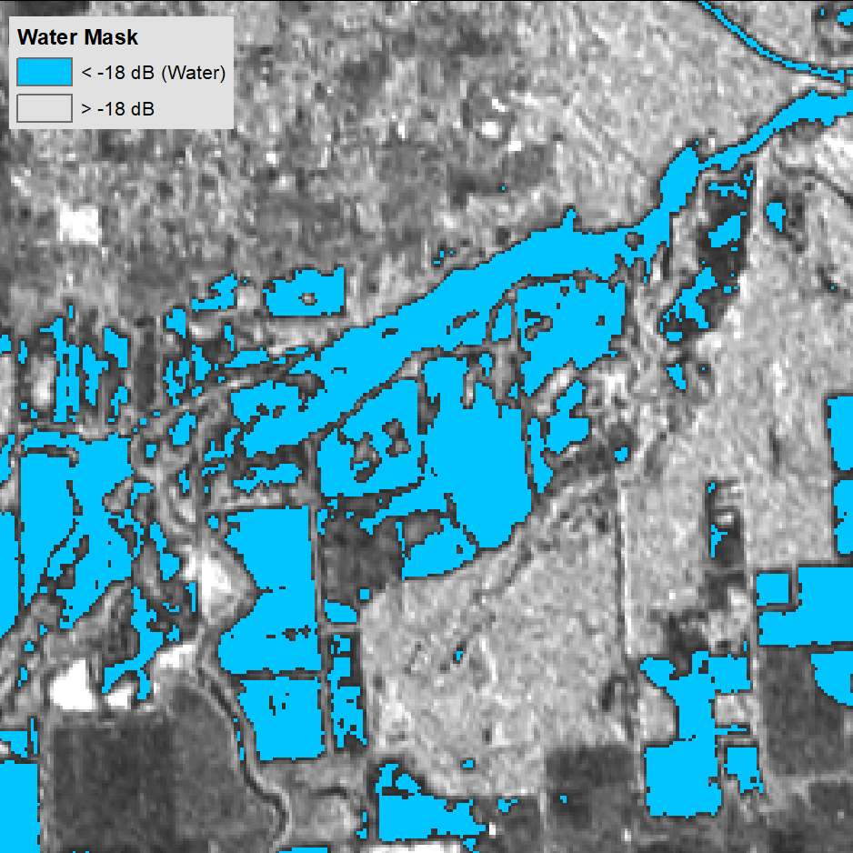
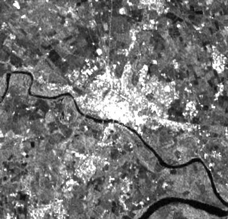

# Sentinel-1 RTC Product Guide
This document is a guide for users of Radiometrically Terrain Corrected (RTC) Sentinel-1 products generated by the Alaska Satellite Facility (ASF). Users can request RTC products [On Demand](https://search.asf.alaska.edu/#/?topic=onDemand "Vertex On Demand Tutorial" ){target=_blank} in ASF's [Vertex](https://search.asf.alaska.edu/ "https://search.asf.alaska.edu" ){target=_blank} data portal, or make use of our [Python SDK](https://hyp3-docs.asf.alaska.edu/using/sdk/ "HyP3 Python SDK Documentation" ){target=_blank} or [API](https://hyp3-docs.asf.alaska.edu/using/api/ "HyP3 API Documentation" ){target=_blank}.

SAR datasets inherently contain [geometric and radiometric distortions](#sar-distortions "Jump to SAR Distortions section of document") due to terrain being imaged by a side-looking instrument. [Radiometric terrain correction](#radiometric-terrain-correction-workflow "Jump to RTC Workflow section of document") corrects these distortions and creates analysis-ready data suitable for use in GIS applications or time-series analysis. RTC processing is a required first step for many amplitude-based SAR applications.

ASF's [Sentinel-1 On-Demand RTC](https://search.asf.alaska.edu/#/?topic=onDemand "Vertex On Demand Tutorial" ){target=_blank} products are generated using [GAMMA Software](https://gamma-rs.ch/ "https://gamma-rs.ch" ){target=_blank}. Products are distributed as GeoTIFFs (one for each available polarization) projected to the appropriate UTM Zone for the location of the scene.

A Digital Elevation Model (DEM) is required for radiometric terrain correction. The [GLO-30 Copernicus DEM](https://spacedata.copernicus.eu/collections/copernicus-digital-elevation-model "Copernicus DEM" ){target=_blank} is the default DEM used for processing RTC On Demand products. Refer to the [Digital Elevation Model section](#digital-elevation-models "Jump to the DEM Section of this document" ) for more information. 

!!! important "Coverage gaps in Copernicus DEM GLO-30 filled using GLO-90" 

    The Copernicus DEM GLO-30 dataset does not provide coverage over Armenia and Azerbaijan. In the past, we have not supported On Demand product generation over those areas using the Copernicus DEM option. We now use the Copernicus DEM GLO-90 to fill those gaps. 

    Users should be aware that the GLO-90 dataset has a pixel spacing of 90 meters, which is not as detailed as the 30-m pixel spacing in the GLO-30 DEM. 

For a step-by-step tutorial on ordering On-Demand RTC Products using Vertex, visit our [RTC On Demand! StoryMap](https://storymaps.arcgis.com/stories/2ead3222d2294d1fae1d11d3f98d7c35 "RTC On Demand! StoryMap" ){target=_blank}, which also includes links to sample workflows using Sentinel-1 RTC products for GIS applications.

!!! important "New RTC Pixel Spacing Option Available"

    On Demand Sentinel-1 RTC products can now be processed at [20-m pixel spacing](#pixel-spacing "RTC Pixel Spacing Documentation" ){target=_blank}. Refer to the [Processing Options](#processing-options-and-optional-files "Jump to Processing Options section in document") section for more information.

## Introduction

### Sentinel-1 Mission
The [Sentinel-1 mission](https://sentinels.copernicus.eu/web/sentinel/missions/sentinel-1 "https://sentinels.copernicus.eu/web/sentinel/missions/sentinel-1" ){target=_blank} collects C-band band SAR from a pair of polar-orbiting satellites launched by the European Space Agency (ESA) as part of the [Copernicus program](https://www.esa.int/Applications/Observing_the_Earth/Copernicus/The_Sentinel_missions "https://www.esa.int/Applications/Observing_the_Earth/Copernicus/The_Sentinel_missions" ){target=_blank}. The Sentinel-1A satellite was launched April 3, 2014, and the Sentinel-1B satellite was launched April 25, 2016. The [Sentinel-1B satellite no longer acquires data](https://www.esa.int/Applications/Observing_the_Earth/Copernicus/Sentinel-1/Mission_ends_for_Copernicus_Sentinel-1B_satellite "https://www.esa.int/Applications/Observing_the_Earth/Copernicus/Sentinel-1/Mission_ends_for_Copernicus_Sentinel-1B_satellite" ){target=_blank} as of December 23, 2021. 

The two Sentinel-1 satellites each have a 12-day repeat cycle, but their orbits are offset 180 degrees so that one or the other will pass over the same location on earth every 6 days. Most areas of the earth will still only have imagery collected every 12 days at best, but while both S1A and S1B were active, Europe and select areas of interest were imaged with a 6-day interval, as described in the [mission observation scenario](https://sentinels.copernicus.eu/web/sentinel/missions/sentinel-1/observation-scenario "https://sentinels.copernicus.eu/web/sentinel/missions/sentinel-1/observation-scenario" ){target=_blank}.

Because this is a polar-orbiting satellite constellation, areas near the poles may have a number of overlapping paths, resulting in even more frequent acquisitions with similar footprints. 

The relatively short interval between acquisitions makes this SAR dataset a very useful tool for monitoring rapid or sudden landscape changes. In addition, SAR can image the earth's surface through cloud or smoke cover and does not require sunlight, so valid imagery can be collected on every pass. This is particularly useful for monitoring conditions during natural disasters such as hurricanes or wildfires, or in areas that are prone to frequent cloud cover.

### SAR Distortions

There are a number of distortions inherent to SAR data due to the side-looking nature of the sensor, and these impacts will be more prevalent in areas with rugged terrain. The process of radiometric terrain correction addresses the geometric distortions that lead to geolocation errors in terrain features, and also normalizes the backscatter values based on the actual area contributing returns. This process generates an image that aligns well with other geospatial data and is suitable for GIS applications or time-series analysis.

The key distortions present in SAR images are foreshortening, layover and shadow (Figure 1). 

*Figure 1: Distortions induced by side-looking SAR. Ground points a, b, c are ‘seen’ by radar as points a’, b’, c’ in the slant range. Credit: Franz J. Meyer*

In the case of **foreshortening**, the backscatter from the front side of the mountain is compressed, with returns from a large area arriving back to the sensor at about the same time. This results in the front slope being displayed as a narrow, bright band. 

When **layover** occurs, returns from the front slope (and potentially even some of the area before the slope starts) are received at the same time as returns from the back slope. Thus, area in the front of the slope is projected onto the back side in the slant range image. In this case, the data from the front slope cannot be extracted from the returns.

Another condition that results in missing data is radar **shadow**. In this case, the angle of the back slope is such that the sensor can not image it at all. These areas with steep back slopes offer no information to the SAR sensor.

When RTC is performed, foreshortened areas are corrected based on the DEM. Areas impacted by layover or shadow, however, do not actually have data returns to correct. In this case, the pixels in the resulting RTC image will have a value of No Data. We do not interpolate missing data; users who would like to fill holes with estimated values will need to do so as appropriate for their particular application.

The RTC product package includes a Layover-Shadow mask (see [Image Files section](#image-files "Jump to Image Files section of document")) If you find that there are No Data pixels in your image, you can refer to that reference raster to see if the missing pixels are due to layover or shadow effects.

## Digital Elevation Models

The quality of the terrain corrections are related to the quality of the digital elevation models (DEMs) used in the process of geometrically and radiometrically correcting the SAR imagery. We use DEMs that are publicly available and have wide-ranging coverage. 

In the past, ASF maintained a collection of DEMs that were pre-processed as appropriate for SAR workflows, and applied a preference hierarchy so that the best available DEM in any given area would be automatically selected for processing. With the public release of the [GLO-30 Copernicus DEM](https://spacedata.copernicus.eu/collections/copernicus-digital-elevation-model "Copernicus DEM" ){target=_blank}, we have changed our default DEM strategy to leverage a cloud-hosted copy of the global Copernicus DEM. This is now the default DEM for processing RTC products, and the only option available for processing [InSAR products](insar_product_guide.md "Sentinel-1 InSAR On Demand Product Guide" ){target=_blank}.

Users still have the option to use the legacy DEMs when processing RTC jobs [On Demand in Vertex](https://search.asf.alaska.edu/#/?topic=onDemand "Vertex On Demand Documentation" ){target=_blank} and when using the [API](https://hyp3-docs.asf.alaska.edu/using/api/ "https://hyp3-docs.asf.alaska.edu/using/api" ){target=_blank} or [SDK](https://hyp3-docs.asf.alaska.edu/using/sdk/ "https://hyp3-docs.asf.alaska.edu/using/sdk" ){target=_blank}, but we recommend using the Copernicus DEM whenever possible.

!!! important "Deprecation of Legacy DEMs for RTC Processing"

    We are considering eliminating the option to use our legacy DEM dataset (NED/SRTM) as a HyP3 processing option for RTC. We would value your feedback as we decide if we will make this change. How would you be impacted if the NED/SRTM DEM option was no longer available? Would it affect your current workflows? 

    Please send your feedback to [uso@asf.alaska.edu](mailto:uso@asf.alaska.edu).

We use the 2022 Release of the [Copernicus GLO-30 Public DEM](https://spacedata.copernicus.eu/collections/copernicus-digital-elevation-model "Copernicus DEM" ){target=_blank}, [available on AWS](https://registry.opendata.aws/copernicus-dem/ "Registry of Open Data on AWS - Copernicus DEM" ){target=_blank}. For more information, see the 'Releases' section of [this article](https://spacedata.copernicus.eu/collections/copernicus-digital-elevation-model "Copernicus DEM" ){target=_blank}.

!!! important "Coverage gaps in Copernicus DEM GLO-30 filled using GLO-90" 

    The Copernicus DEM GLO-30 dataset does not provide coverage over Armenia and Azerbaijan. In the past, we have not supported On Demand product generation over those areas using the Copernicus DEM option. We now use the Copernicus DEM GLO-90 to fill those gaps. 

    Users should be aware that the GLO-90 dataset has a pixel spacing of 90 meters, which is not as detailed as the 30-m pixel spacing in the GLO-30 DEM. 

Table 1 summarizes ASF's DEM sources. Note that in each case, the DEM is resampled to RTC spacing and reprojected to a UTM Zone (WGS84), and a geoid correction is applied before being used for RTC processing.

| Resolution | DEM     | Vertical Datum | Area                           | Posting         | Priority |
|------------|---------|----------------|--------------------------------|-----------------|----------|
| Medium     | GLO-30  | EGM2008        | Global                         | 1 arc second    | Default  |
| High       | NED13   | NAVD88         | CONUS, Hawaii, parts of Alaska | 1/3 arc seconds | 1        |
| Medium     | SRTMGL1 | EGM96          | 60 N to 57 S latitude          | 1 arc second    | 2        |
| Medium     | NED1    | NAVD88         | Canada                         | 1 arc second    | 3        |
| Low        | NED2    | NAVD88         | Parts of Alaska                | 2 arc seconds   | 4        |

*Table 1: DEMs used for RTC processing. Note that the Copernicus 30 m DEM is the default, while the other four DEMs are only used if the legacy option is invoked.*

When ordering On-Demand RTC products, you can choose to [include a copy of the DEM used for RTC processing](#dem "Jump to Optional Files - DEM section in document") in the RTC product package. This DEM copy is converted to 16-bit signed integer format, but is otherwise the same as the DEM used in the RTC process. Pixel values indicate the elevation in meters. Note that the elevation values will differ from the original source DEM in all cases, due to the geoid correction applied to prepare the DEM for use in RTC processing.

### Copernicus DEM

The [GLO-30 Copernicus DEM](https://spacedata.copernicus.eu/collections/copernicus-digital-elevation-model "Copernicus DEM" ){target=_blank} provides global coverage at 30-m pixel spacing (with the current exception of an area covering Armenia and Azerbaijan, see Figure 3). 

When an On Demand RTC job is requested, we download the required DEM tiles from the Copernicus Digital Elevation Model (DEM) GLO-30 Public dataset available in the [Registry of Open Data on AWS](https://registry.opendata.aws/copernicus-dem/ "https://registry.opendata.aws/copernicus-dem" ){target=_blank}, managed by [Sinergise](https://www.sinergise.com/ "https://www.sinergise.com" ){target=_blank}. We mosaic the tiles and reproject them to the appropriate UTM Zone for the location of the SAR granule to be processed, resampling them to match the pixel spacing and alignment of the RTC product. A geoid correction is applied before it is used for RTC processing.

For the area that does not have coverage with the GLO-30 DEM, we use the Copernicus DEM GLO-90 dataset, which provides elevation data at 90-meter pixel spacing. Users ordering products over this area should be aware that a lower-resolution DEM is used for processing.

Figure 2 shows the coverage of the Copernicus DEM GLO-30 Public dataset, and Figure 3 details the land area currently only covered by the GLO-90 DEM at 90-m pixel spacing.

*Figure 2: Copernicus DEM GLO-30 coverage map*

*Figure 3: Detail of area currently not covered by Copernicus DEM GLO-30. On Demand jobs requested over this area will use the Copernicus DEM GLO-90.*

### Legacy DEMs

!!! important "Deprecation of Legacy DEMs for RTC Processing"

    We are considering eliminating the option to use our legacy DEM dataset (NED/SRTM) as a HyP3 processing option for RTC. We would value your feedback as we decide if we will make this change. How would you be impacted if the NED/SRTM DEM option was no longer available? Would it affect your current workflows? 

    Please send your feedback to [uso@asf.alaska.edu](mailto:uso@asf.alaska.edu).

The legacy DEMs were pre-processed by ASF to a consistent raster format (GeoTIFF) from the original source formats: height (\*.hgt), ESRI ArcGrid (\*.adf), etc. Many of the NASA-provided DEMs were provided as orthometric heights with EGM96 vertical datum. These were converted by ASF to ellipsoid heights using the ASF [MapReady](https://asf.alaska.edu/how-to/data-tools/data-tools/#mapready "https://asf.alaska.edu/how-to/data-tools/data-tools/#mapready" ){target=_blank} tool named *geoid_adjust*. The pixel reference varied from the center (pixel as point) to a corner (pixel as area). The GAMMA software used to generate the RTC products uses pixel as area and adjusts DEM coordinates as needed. 

These processed DEM collections are stored by ASF in AWS. When an RTC job is requested, the best-available DEM covering the SAR granule is selected, and the necessary tiles are reprojected to a mosaic in the UTM Zone appropriate for the granule location.

If legacy DEM processing is selected, one of the following DEMs will be used:

1. The [National Elevation Dataset (NED)](https://pubs.er.usgs.gov/publication/70201572 "NED Information" ){target=_blank} ⅓ arc second (about 10 m resolution) DEM covers the continental U.S. (CONUS), Hawaii, and parts of Alaska.
2. [Shuttle Radar Topography Mission (SRTM)](https://www.usgs.gov/centers/eros/science/usgs-eros-archive-digital-elevation-shuttle-radar-topography-mission-srtm-1-arc?qt-science_center_objects=0#qt-science_center_objects "SRTM DEM Information" ){target=_blank} GL1 data at 30 m resolution is used where NED 13 is not available.  
3. 1 arc second NED gives coverage of Canada at about 30 m resolution. 
4. 2 arc second NED (about 60 m) covers the remaining parts of Alaska above 60 degrees northern latitude.

Since more than one DEM may be available in legacy processing, DEMs are selected in priority order as listed in Table 1. DEM coverage of at least 20% from a single DEM source is required for legacy processing to proceed. In no case will the DEM selected be from more than one source; only the single best source of terrain height values is used for a given scene.  

Figure 4 shows the coverage of the various legacy DEM sources. 

*Figure 4: Coverage of the various legacy DEM sources used for terrain correction*

## Pixel Spacing

!!! important "On Demand Sentinel-1 RTC now available at 10-m and 20-m pixel spacing" 

    There are now three pixel spacing options available for On Demand Sentinel-1 RTC products. Users can choose to output the RTC products at a pixel spacing of 30, 20, or 10 meters.

RTC products can be output at 30-meter, 20-meter, or 10-meter pixel spacing. In most cases, the input SAR image has a resolution closer to the 10-m products, while the Copernicus DEM (used by default for RTC processing) has a pixel spacing of 30 m. The 10-m RTC product will be closer to the resolution of the source SAR granule, but the 30-m RTC product has a much smaller file size. 

*Figure 5: Comparison of RTC products generated with different pixel spacing settings*

It is *much* faster to process, download and analyze 30-m RTC products than 10-m products, so it's a good idea to start with the coarser resolution option if possible. If the 30-m pixel spacing is not sufficient for your use case, try the 20-m RTC products. If even more detail is required, the 10-m products may be the best option.

The 20-m product may be a good trade-off between resolution and file size. The amount of detail in the 20-m product is much closer to the 10-m product, but the file size is much closer to the 30-m product. Consider the file sizes for the RTC VV GeoTIFFs displayed in the comparison image:

| Pixel Spacing | File Size |
|---------------|-----------|
| 30 m          | 267 MB    |
| 20 m          | 600 MB    |
| 10 m          | 2350 MB   |

### DEM Resolution

Keep in mind that the same DEM is used for processing the RTC products, regardless of the output pixel spacing. By default, the DEM is the Copernicus Global DEM, which has a pixel spacing of 30 meters. 

When processing 10-m RTC products, the source DEM is resampled to a pixel spacing of 10 meters. This resampled DEM can optionally be included in the product package, and the pixel spacing will align with the output RTC product. The same is true for the 20-m products; the DEM is resampled to a pixel spacing of 20 meters, and the resampled version is optionally included in the product package. 

*The pixel spacing of the output DEM file does __not__ indicate that the source DEM used for the 10-m or 20-m products is of higher resolution.*

## Processing Options and Optional Files

There are a number of options users can set when ordering RTC On Demand products. Some of these options set parameters used in the RTC processing workflow, others allow users to add additional files to the product package that are not included by default. 

Table 2 lists all of the options as displayed in the Vertex user interface and the HyP3 API, and the [Processing Options](#processing-options "Jump to Processing Options section in document") and [Optional Files](#optional-files "Jump to Optional Files section in document") sections provide more information about each option.

| Option Name in Vertex       | Option Name in HyP3 API/SDK | Possible Values             | Default    | Description                                                                                                                                                                         |
|-----------------------------|-----------------------------|-----------------------------|------------|-------------------------------------------------------------------------------------------------------------------------------------------------------------------------------------|
| Radiometry                  | radiometry                  | (gamma0, sigma0)            | gamma0     | Backscatter coefficient normalization, either by ground area (sigma0) or illuminated area projected into the look direction (gamma0)                                                |
| Scale                       | scale                       | (power, decibel, amplitude) | power      | Scale of output backscatter values                                                                                                                                                  |
| Pixel Spacing               | resolution                  | (10.0, 20.0, 30.0)          | 30.0       | Product pixel spacing in meters                                                                                                                                                     |
| DEM Name                    | dem_name                    | (copernicus, legacy)        | copernicus | Name of the DEM to use for processing: _copernicus_ will use the Copernicus GLO-30 Public DEM, _legacy_ will use the DEM with the best coverage from ASF's legacy SRTM/NED datasets |
| Apply DEM Matching          | dem_matching                | (true, false)               | false      | Coregisters SAR data to the DEM, rather than using dead reckoning based on orbit files                                                                                              |
| Apply Speckle Filter        | speckle_filter              | (true, false)               | false      | Apply an Enhanced Lee speckle filter                                                                                                                                                |
| Include DEM                 | include_dem                 | (true, false)               | false      | Include a copy of the DEM used for RTC processing in the product package                                                                                                            |
 | Include Incidence Angle Map | include_inc_map             | (true, false)               | false      | Include the local incidence angle map in the product package                                                                                                                        |
 | Include Scattering Area Map | include_scattering_area     | (true, false)               | false      | Include the scattering area map in the product package                                                                                                                              |
 | Include RGB Decomposition   | include_rgb                 | (true, false)               | false      | Include a false-color RGB decomposition GeoTIFF in the product package                                                                                                              |
 
*Table 2: Processing Options*

### Processing Options

#### Radiometry

The **radiometry** option allows users to set their preferred backscatter coefficient normalization to either gamma-nought (gamma0 or γ0) or sigma-nought (sigma0 or σ0) radiometry. As illustrated in Figure 6, the scattering coefficient gamma0 is normalized by the illuminated area projected into the look direction (Aγ - the yellow area with the red outline in the diagram), and the sigma0 is normalized by the ground area (Aσ - the grey area with the purple outline in the diagram).

*Figure 6:  Normalization areas for SAR backscatter, from David Small, 2011, Flattening Gamma: Radiometric Terrain Correction for SAR Imagery, IEEE TRANSACTIONS ON GEOSCIENCE AND REMOTE SENSING, VOL. 49, NO. 8, AUGUST 2011*

Although both sigma0 and gamma0 backscatter include the impact of local topography, the sensitivity of the impact is different. For applications where topographic impacts are an important consideration, gamma0 is generally the preferred choice.
 
#### Scale

The **scale** option allows users to choose the scale of the output backscatter images from the three commonly used scales for calibrated SAR values: power, amplitude, or decibel (dB). Refer to the [SAR Scale](#sar-scales "Jump to SAR Scales section in document") section for more information.

#### Pixel Spacing

The **resolution** parameter sets the pixel spacing of the output images. Users have the option to set a pixel spacing of 30, 20, or 10 meters. 

- The 30-m product has a much smaller file size, and is easier to work with for large areas of interest. It generally aligns with the native resolution of the DEM used for RTC processing. 
- The 10-m product provides much more detail of surface features, and is closer to the native resolution of the source Sentinel-1 data. The file sizes are also much larger than those of the 30-m products. 
- The 20-m product may be a good compromise between the native resolution of the source SAR imagery and the source DEM. The level of detail in the image is much closer to the 10-m product than the 30-m product, while the file size is much closer to the 30-m product than the 10-m product.

Refer to the [Pixel Spacing](#pixel-spacing "Jump to Pixel Spacing section in document") section for more information. Note that the source Sentinel-1 imagery and the source DEM used for RTC processing are the same regardless of the option selected for the output pixel spacing.

#### DEM Name

The **dem_name** parameter selects the DEM to use for RTC processing. By default, we use the [Copernicus Global 30-m DEM](https://spacedata.copernicus.eu/collections/copernicus-digital-elevation-model "Copernicus DEM" ){target=_blank}, but allow users to select ASF's legacy DEMs (a combination of NED and SRTM) if desired. 

We recommend using the Copernicus DEM, which has more extensive and consistent coverage and more recent measurements. The main reason to select the legacy option is if a user already has a time series of products generated with the legacy DEM and wants to process new acquisitions using the same DEM. Refer to the [Digital Elevation Models](#digital-elevation-models "Jump to DEM section in document") section for more information.

#### DEM Matching

The **dem_matching** option allows users to either try to coregister the SAR image to the DEM file, or simply use the Sentinel-1 orbit files for geocoding the RTC products.

The process of terrain corrected geocoding includes 4 steps:

1. Calculate the initial lookup table and simulated image with the image processing parameters and DEM.
2. (Optional) Measure initial offset between simulated SAR image and actual SAR image. 
3. (Optional) Perform refinement of lookup table by offset measurement with respect to the simulated SAR image. 
4. Produce terrain geocoded SAR image and DEM in SAR range-Doppler coordinates (RDC). 

When DEM matching is applied, the optional steps 2 and 3 are performed. Using this option can improve the quality of the RTC calculations, as the features in the SAR image are matched to the features in the DEM, minimizing the offsets in geometry during the backscatter normalization calculations. Refer to the [Terrain Correction](#terrain-correction "Jump to the Terrain Correction section of document") section for more information.

DEM Matching is not always beneficial, however. If the georeferencing of the DEM doesn't match the georeferencing of the Sentinel-1 imagery, DEM matching can result in variable offsets in the output images from one Sentinel-1 acquisition to the next, making it difficult to overlay images for time series analysis. Coregistration also works best when there are distinct topographic features that allow for reliable matching between the SAR image and the DEM. In areas that lack distinctive topographic features, there may also be substantial and inconsistent image offsets.

The orbit files of the Sentinel-1 data are generally quite accurate, and not applying the DEM matching should output files with consistent geolocation. While it may not optimize the RTC calculations, it may be a better option for time series analysis, where having consistent alignment of images from one acquisition to the next is more important than optimizing the backscatter normalization. 

If you are interested in optimizing the RTC calculations, and are less concerned about consistent geolocation through time, the DEM Matching option is likely a good choice. In cases where consistency is more important than accuracy, consider not applying DEM Matching, or at least testing the outputs to make sure they are suitable for your application.

#### Speckle Filter

When the **speckle_filter** option is selected, an Enhanced Lee filter is applied during RTC processing to remove speckle while preserving edges of features. Speckle occurs due to interference among signal waves, as they interact with different scatterers on the surface of the earth and return to the sensor. It appears as granular noise in the image. Refer to the [Speckle section of our Introduction to SAR](../guides/introduction_to_sar.md#speckle "Speckle section of Introduction to SAR" ){target=_blank} document for more information.

When applied, the filter is set to a dampening factor of 1, with a box size of 7x7 pixels. The number of looks depends on the multilooking treatment for the RTC processing, and is based on the pixel spacing and the input scene type. Refer to the readme file included with the RTC product to determine the number of looks used for the filter, which is the number of looks taken for RTC processing multiplied by 30.

Applying a speckle filter can smooth the appearance of the image, but it comes at a cost to the resolution of the output RTC product. Keep in mind also that there are other speckle filters that may be better suited to a specific application. We do not currently offer any customization of the type of speckle filter used, or the parameters (window size, multilooking, dampening, etc.) used for the filter.

You may also want to try applying other spatial speckle filters with custom settings, which can be accomplished programmatically or using GIS software. Some temporal analyses may also mitigate the impacts of speckle, such as calculating the median or mean pixel values of multiple images collected over a period of time. In both cases, it may be better not to apply a speckle filter during RTC processing.

If you are unsure whether to apply this option, try generating some of your RTC products with and without the speckle filter applied, and check to see which product works best for your particular application. 

### Optional Files

In addition to the processing options, users can choose to add a number of ancillary files to the product package. These files are not included by default, as they increase the size of the product package and may not be of interest to all users. 

In Vertex, check the box in the "Include" section of the options to add these optional files to the product package. When using the HyP3 API or SDK, set the parameter to true.

#### DEM

Set the **include_dem** parameter to true to include a copy of the DEM file used for RTC processing. This DEM is *not* generated from the Sentinel-1 data, but is the reference DEM used for the RTC calculations. Pixel values indicate the elevation in meters. Refer to the [Digital Elevation Models](#digital-elevation-models "Jump to DEM section in document") section for more information on the DEMs we use for RTC processing.

This DEM file is intended as a quick reference to aid in interpretation of the RTC image, and should not be used as a stand-alone DEM product. The DEM used for RTC processing has a geoid correction applied before it is used for RTC, so elevation values in this file will differ from the source DEM. 

The DEM is resampled to match the pixel spacing of the output product, so **the pixel spacing of this file is not a reflection of the resolution of the source DEM.** Refer to the readme file included in the RTC product package for details on the pixel spacing of the included DEM file.

#### Incidence Angle Map

Set the **include_inc_map** parameter to true to include the local incidence angle map in the product package. The cell values in this raster indicate the angle between the incident radar beam and the direction perpendicular to the ground surface, expressed in radians.

#### Scattering Area Map

Set the **include_scattering_area** parameter to true to include the scattering area map in the product package. This map expresses the scattering area for each pixel in the RTC image in square meters. The values are calculated based on the effectively illuminated gamma-0 terrain surface using a digital elevation model, the local incidence angle map, and the layover-shadow map.

This layer can be used to generate composites using the Local Resolution Weighting method, as described in the article [Wide-Area Analysis-Ready Radar Backscatter Composites](https://ieeexplore.ieee.org/stamp/stamp.jsp?arnumber=9352976 "Wide-Area Analysis-Ready Radar Backscatter Composites" ){target=_blank} by David Small et al., 2022.

#### RGB Decomposition

Set the **include_rgb** parameter to true to include a full-resolution GeoTIFF of a false-color RGB Decomposition of the co- and cross-polarized RTC values. A low-resolution false-color browse image in PNG format is included in the product package by default, but selecting this option includes the RGB Decomposition image as a GeoTIFF with the same pixel spacing as the RTC images. 

This option is only available for dual-polarization products, as it uses both the co- and cross-polarized RTC values to determine the RGB values. A full description of the approach ASF uses for generating RGB Decomposition products is available [here](https://github.com/ASFHyP3/hyp3-lib/blob/develop/docs/rgb_decomposition.md "RGB Decomposition from ASF" ){target=_blank}.

In general, blue indicates areas with low backscatter in both co- and cross-polarizations (calm water, dry sand, frozen ground), green indicates high cross-pol values (vegetation or other volume scatterers), and red indicates areas with low cross-pol but relatively high co-pol values (urban areas or sparsely vegetated landscapes). 

## Radiometric Terrain Correction Workflow

### Pre-processing

The first step of pre-processing is the selection of the best DEM for the terrain correction. The DEM tiles are assembled to ensure sufficient coverage for the terrain correction of the Sentinel-1 granule. The application of the calibration parameters and multi-looking are the only pre-processing steps applied to the SAR image.

### Terrain Correction

The terrain correction is performed in slant range geometry. A look-up table is created to map between DEM space and SAR space. The actual mapping of the initial image into projected space is only applied once to mitigate the propagation of any resampling errors. All intermediate steps only update the look-up table used for the mapping.

By default, images are not coregistered to the DEM. While RTC results can be improved by matching imagery to a high-quality DEM, different acquisitions over the same area may not always be matched to the DEM in the same way, due in part to the presence of speckle. This can introduce spatial inconsistencies to the dataset, especially when viewing a time-series of RTC images. For consistency, we use the geolocation from the Sentinel-1 state vectors by default rather than matching the geolocation based on DEM features.

When ordering products On Demand, the [DEM Matching option](#dem-matching "Jump to Processing Options - DEM Matching section in document") is available for selection. When this option is applied, the first step is the co-registration of the SAR image with a simulated SAR image derived from the DEM. An initial offset is first attempted as a single match; if it fails, a larger number of image chips are used to determine an average offset in azimuth and range direction. This initial offset is then refined using strict matching criteria. 

Matching may fail for three different reasons: (1) no match can be found, (2) the magnitude of the residual offset errors is greater than 2 pixels, or (3) the maximum calculated offset is greater than 50 m. In any of these cases, the _dead reckoning_ approach is taken when matching fails. This approach solely relies on the geolocations calculated from state vectors (the same approach used when DEM matching is _not_ selected as an option) - no geolocation refinement is applied.

### Radiometric Correction

During processing, a surface scattering area image for the scene is calculated and saved. This projected area image is used to create the RTC product - the SAR image is multiplied by the ratio of an ellipsoidal scattering image (used during calibration) and this scattering area image. Note that this image is always projected to gamma-nought (γ0). 

### Geocoding

In a final step, the RTC product is geocoded into map-projected space. Thus, radiometric terrain correction results in a geocoded radiometrically calibrated multi-looked image with gamma-nought (γ0) power scale values by default, though there are options to process to sigma-nought (σ0) [radiometry](#radiometry "Jump to Processing Options - Radiometry section in document") and amplitude or decibel (dB) [scale](#scale "Jump to Processing Options - Scale section in document").

### Post-Processing

After the terrain correction is completed, the RTC products are exported to GeoTIFF format. If the scene being processed is dual polarization, users have the option to [add a full-resolution RGB Decomposition GeoTIFF](#rgb-decomposition "Jump to Optional Files - RGB Decomposition section in document") to the RTC product package.  Side products including the [DEM](#dem "Jump to Optional Files - DEM section in document"), layover-shadow map (always included), [scattering area map](#scattering-area-map "Jump to Optional Files - Scattering Area Map section in document"), and [incidence angle map](#incidence-angle-map "Jump to Optional Files - Incidence Angle Map section in document") are converted into GeoTIFF format. In addition, a README text file, browse images, item-specific ArcGIS-compatible XML metadata files, a log file, and a shapefile indicating the data extent are generated for the product.

## Product Packaging

### Naming Convention

The naming convention for the RTC products follows this pattern for its base names:

`S1x_yy_aaaaaaaaTbbbbbb_ppo_RTCzz_u_defklm_ssss`

Example: S1A_IW_20180128T161201_DVP_RTC30_G_gpuned_FD6A

| Element  | Definition                                                                   | Example  |
|----------|------------------------------------------------------------------------------|----------|
| x        | Mission: A or B                                                              | A        |
| yy       | Beam Mode                                                                    | IW       |
| aaaaaaaa | Start Year-Month-Day                                                         | 20180128 |
| bbbbbb   | Start Hour-Minute-Second                                                     | 161201   |
| pp       | Polarization: Dual-pol (D) vs. Single-pol (S), Primary Polarization (H or V) | DV       |
| o        | Orbit Type: Precise (P), Restituted (R), or Original Predicted (O)           | P        |
| zz       | Terrain Correction Pixel Spacing (m)                                         | 30       |
| u        | Software Package Used: GAMMA (G)                                             | G        |
| d        | Gamma-0 (g) or Sigma-0 (s) Output                                            | g        |
| e        | Power (p), Decibel (d), or Amplitude (a) Output                              | p        |
| f        | Unmasked (u) or Water Masked (w)                                             | u        |
| k        | Not Filtered (n) or Filtered (f)                                             | n        |
| l        | Entire Area (e) or Clipped Area (c)                                          | e        |
| m        | Dead Reckoning (d) or DEM Matching (m)                                       | d        |
| ssss     | Product ID                                                                   | FD6A     |

*Table 3: Naming convention for RTC products*

### Image Files

All files are stored in a folder named using the above convention, and the base name for each file matches the folder name. Multiple types of image files are present in this folder, and some of the files are optional. Users can choose to include the RGB Decomposition GeoTIFF, scattering area map, DEM, and incidence angle map rasters when ordering On-Demand RTC products.

| Extension                          | Description                                                                                          | Example                                                    |
|------------------------------------|------------------------------------------------------------------------------------------------------|------------------------------------------------------------|
| _VV.tif, _VH.tif, _HH.tif, _HV.tif | Terrain corrected product stored in separate files for each available polarization in GeoTIFF format | S1A_IW_20180128T161201_DVP_RTC30_G_gpuned_FD6A_VV.tif      |
| .png                               | Grayscale browse image                                                                               | S1A_IW_20180128T161201_DVP_RTC30_G_gpuned_FD6A.png         |
| _rgb.png                           | Color browse image                                                                                   | S1A_IW_20180128T161201_DVP_RTC30_G_gpuned_FD6A_rgb.png     |
| .kmz                               | Zipped Google Earth image                                                                            | S1A_IW_20180128T161201_DVP_RTC30_G_gpuned_FD6A.kmz         |
| _rgb.kmz                           | Zipped Google Earth color image                                                                      | S1A_IW_20180128T161201_DVP_RTC30_G_gpuned_FD6A_rgb.kmz     |
| _rgb.tif                           | Color decomposition in GeoTIFF format (optional)                                                     | S1A_IW_20180128T161201_DVP_RTC30_G_gpuned_FD6A_rgb.tif     |
| _area.tif                          | Scattering area map in GeoTIFF format (optional)                                                     | S1A_IW_20180128T161201_DVP_RTC30_G_gpuned_FD6A_area.tif    |
| _dem.tif                           | DEM used for terrain correction in GeoTIFF format (optional)                                         | S1A_IW_20180128T161201_DVP_RTC30_G_gpuned_FD6A_dem.tif     |
| _inc_map.tif                       | Incidence angle file in GeoTIFF format (optional)                                                    | S1A_IW_20180128T161201_DVP_RTC30_G_gpuned_FD6A_inc_map.tif |
| _ls_map.tif                        | Layover/shadow mask in GeoTIFF format                                                                | S1A_IW_20180128T161201_DVP_RTC30_G_gpuned_FD6A_ls_map.tif  |

*Table 4: Image files in product package*

The RTC products (one for each available polarization) are generated as 32-bit floating-point single-band GeoTIFF files, as are the incidence angle and scattering area maps. The RGB Decomposition is a 3-band unsigned 8-bit GeoTIFF file, the layover/shadow mask is a single-band unsigned 8-bit GeoTIFF, and the DEM is a 16-bit signed integer GeoTIFF. The browse images (both grayscale and color) are generated in PNG format, and are each 2048 pixels wide. Finally, KMZ files suitable for viewing in Google Earth are included. Note that colorized products (RGB Decomposition GeoTIFF or color browse PNG) can only be created for dual-polarization (SDV and SDH) granules, not for single-polarization (SSV or SSH).

### Metadata Files

The product package also includes a number of metadata files.

| Extension      | Description                                     | Example                                                                                           |
|----------------|-------------------------------------------------|---------------------------------------------------------------------------------------------------|
| .README.md.txt | README file                                     | S1A<wbr>_IW<wbr>_20180128T161201<wbr>_DVP<wbr>_RTC30<wbr>_G<wbr>_gpuned<wbr>_FD6A.README.md.txt   |
| .log           | Log file of the processing steps                | S1A<wbr>_IW<wbr>_20180128T161201<wbr>_DVP<wbr>_RTC30<wbr>_G<wbr>_gpuned<wbr>_FD6A.log             |
| .tif.xml       | ArcGIS compliant XML metadata for GeoTIFF files | S1A<wbr>_IW<wbr>_20180128T161201<wbr>_DVP<wbr>_RTC30<wbr>_G<wbr>_gpuned<wbr>_FD6A<wbr>_VV.tif.xml |
| .png.xml       | ArcGIS compliant XML metadata for PNG files     | S1A<wbr>_IW<wbr>_20180128T161201<wbr>_DVP<wbr>_RTC30<wbr>_G<wbr>_gpuned<wbr>_FD6A.png.xml         |
| .png.aux.xml   | Geolocation metadata for PNG browse images      | S1A<wbr>_IW<wbr>_20180128T161201<wbr>_DVP<wbr>_RTC30<wbr>_G<wbr>_gpuned<wbr>_FD6A.png.aux.xml     |

*Table 5: Metadata files and their extensions*

#### README File

The text file with extension .README.md.txt explains the files included in the folder, and is customized to reflect that particular product. Users unfamiliar with RTC products should start by reading this README file, which will give some background on each of the files included in the product folder.

#### ArcGIS-Compatible XML Files

There is an ArcGIS-compatible XML file for each raster in the product folder. When ArcGIS Desktop users view any of the rasters in ArcCatalog or the Catalog window in ArcMap, they can open the Item Description to view the contents of the associated XML file. ArcGIS Pro users can access the information from the Metadata tab. These files will not appear as separate items in ArcCatalog, though if you use Windows Explorer to look at the contents of the folder you will see them listed individually. Because each one is named identically to the product it describes (with the addition of the .xml extension), ArcGIS recognizes the appropriate file as the raster’s associated metadata, and integrates the metadata accordingly.

ArcGIS users should take care not to change these XML files outside of the ArcGIS environment; changing the filename or content directly may render the files unreadable by ArcGIS.

Those not using ArcGIS will still find the contents of these XML files useful, but will have to contend with the XML tagging when viewing the files as text or in a browser.

#### Auxiliary Geolocation Files

Geolocation XML files (aux files) are included for each of the PNG browse images to allow for proper display in GIS platforms.

#### Log File

A log file detailing the processing parameters and outputs is also included for reference.

### Shapefile

A shapefile indicating the extent of the RTC data coverage is included in the package.

| Extension                                   | Description                           | Example                                                  |
|---------------------------------------------|---------------------------------------|----------------------------------------------------------|
| _shape.dbf _shape.prj _shape.shp _shape.shx | Shapefile (.shp) and supporting files | S1A_IW_20180128T161201_DVP_RTC30_G_gpuned_FD6A_shape.shp |

*Table 6: Shapefile files and their extensions*

## SAR Scales

!!! important "On Demand Sentinel-1 RTC Products now available in dB scale"

    Users can now choose to output Sentinel-1 RTC products in decibel (dB) scale. Previously, the only choices for output scale were power and amplitude. The default scale continues to be power.

### Power Scale

Note that the default output of Sentinel-1 RTC products from HyP3 is in power scale. The values in this scale are generally very close to zero, so the dynamic range of the RTC image can be easily skewed by a few bright scatterers in the image. Power scale is appropriate for statistical analysis of the RTC dataset, but may not always be the best option for data visualization.

When viewing an RTC image in power scale in a GIS environment, it may appear mostly or all black, and you may need to adjust the stretch to see features in the image. Often applying a stretch of 2 standard deviations, or setting the Min-Max stretch values to 0 and 0.3, will greatly improve the appearance of the image. You can adjust the stretch as desired to display your image to full advantage. Be aware that this does not change the actual pixel values.

In some cases, it may be desirable to convert the actual pixel values to a different scale. Two other scales commonly used for SAR data are amplitude and decibel (dB).

### Amplitude Scale

Values in the amplitude scale are the square root of the power scale values. This brightens the darker pixels (values <1) and darkens the brighter pixels (values >1), narrowing the dynamic range of the image. 

In many cases, amplitude scale presents a pleasing grayscale display of RTC images. Amplitude scale works well for calculating log difference ratios, as described in the [Change Detection Using RTC Data](#change-detection-using-rtc-data "Jump to Change Detection Using RTC Data section in document") use case example.

### Decibel (dB) Scale

The decibel (dB) scale is calculated by multiplying 10 times the Log10 of the power scale values. This scale allows for better differentiation among very dark pixels. 

This is often a good scale to use for identifying water on the landscape; the water pixels generally remain very dark compared to the much brighter pixels of the surrounding landscape. Refer to the [Identifying Surface Water](#identifying-surface-water "Jump to Identifying Surface Water section in document") use case example for more information.

This scale is not always the best choice for general visualization of RTC products, as it can give a washed-out appearance to terrain features. In addition, because it is a logarithmic scale, dB pixel values are not appropriate for some types of statistical analyses.

## RTC Use Examples

The RTC products are presented as Cloud-Optimized GeoTIFFs (COGs), a user-friendly format that is compatible with GIS software. The products include pre-generated overviews, so users will not need to generate pyramids to display the images efficiently in a GIS or web-mapping environment.

The following sections present examples of how one might use RTC datasets to identify areas of change and integrate RTC datasets into other datasets for enhanced results. We also present a bibliography of some of the scientific literature making use of Sentinel-1 RTC datasets.

### Change Detection Using RTC Data

There are a number of ways that SAR data sets can be used to identify areas of change. Here are two examples of what you can do in a GIS environment.

#### Seasonal Change

Stacking RTC images into a multiband image (Figure 7) allows the user to display different times of the year at the same time, using the color bands to highlight areas that differ in radar backscatter values from one month to the next.

To generate this type of image, choose three images that capture different seasons or months of interest. These can either be individual RTC images from different times of the year, or rasters displaying the monthly median calculated from multiple RTC images collected in the same month.

Combine the three images into a multiband raster and assign each to a different color band. The resulting RGB image highlights areas where there are distinctive differences among the three source image values.

 image")

*Figure 7: Monthly median VH gamma-0 power values for May, July and September, displayed as a multiband RGB (May, July, Sept) image. Contains modified Copernicus Sentinel data 2017, processed by ESA.*

#### Quantifying Change over Time

A simple and informative approach to change detection is the calculation of the log difference between two RTC datasets from different dates. By calculating Log10(date2/date1) and applying a classified symbology, it is easy to identify areas where change occurred, as well as the direction of the change. Negative values indicate a decrease in radar backscatter over time, while positive values indicate an increase in backscatter.

In the example below (Figure 8), RTC images from before and after heavy rains caused a dam breach. The area where the reservoir was located displays a significant increase in backscatter (symbolized in red). This positive change is driven by land that was once covered by standing water, which generally has very low backscatter, now being exposed saturated soil, which generally returns very high backscatter values. In surrounding areas, decreases in radar backscatter (symbolized by blue) are possibly the result of agricultural fields undergoing desiccation/hardening of the surface soil following the heavy rainfall and standing water. Areas with little change in backscatter are displayed in yellow.

*Figure 8: Log Difference Raster with Classified Symbology. Contains modified Copernicus Sentinel data 2020, processed by ESA.*

### Identifying Surface Water

Calm surface water has a very low radar cross section. Because freshwater has a high dielectric constant, most of the signal is reflected off the smooth surface of the water and away from the sensor, resulting in little to no backscatter. As such, surface water can often be delineated using a simple threshold value, where all pixels below the threshold are assumed to be water. It is often best to use datasets in dB scale for this process (refer to the [dB Scale Section](#decibel--db--scale "Jump to dB Scale section in document")).

When using the threshold approach, surface water can be easily visualized by applying a classified symbology with two classes, using the threshold as the break point between the classes. There is no universal threshold value; it will need to be determined based on the surface water characteristics in the RTC image. 

When an RTC image contains significant surface water coverage, there is often a bimodal distribution of pixel values. The first peak in a histogram of the pixel values for the image can be expected to contain mostly water pixels, while the second peak contains all remaining pixels. A good first step in selecting a threshold value is to set the break point between classes at the lowest point between those two peaks, then adjust the value as needed to generate a good water mask for the image (Figure 9).

*Figure 9: Setting the break point to fall between the two peaks of the histogram*

Once you have determined the appropriate threshold (Figure 10), you can reclassify the RTC image to include only those pixels that fall below the threshold value, providing a water mask that can be used for analysis or to overlay with other imagery to show the water extent. 

*Figure 10: Water Mask. Contains modified Copernicus Sentinel data 2020, processed by ESA.*

### Combination of RTC Imagery with other Remote Sensing Data

One of the main advantages of using RTC imagery is that it aligns geographically with other geospatial datasets. This makes it possible to combine SAR data with other remote sensing data, such as optical data. In the example below, the backscatter information of the Sentinel-1 SAR image (Figure 11) is used to enhance the spectral information of the optical Landsat 8 image (Figure 12) in the urban area of Pavia, Italy. 

*Figure 11: Sentinel-1 RTC image.*

 of a Landsat 8 image")

*Figure 12: False color composite (bands 5, 4, 3) of a Landsat 8 image*

Figure 13 shows the image fusion result of an IHS transformation. In this transformation, the color channels red, green and blue (RGB) are first converted into a different color representation: intensity, hue and saturation (IHS). In the second step, the optical intensity is replaced by the SAR image values before IHS is transformed back to RGB.

*Figure 13: Image fusion result of SAR and optical imagery*

The color values for the two rivers in the SAR image are far more similar to each other than in the optical image. The vegetated areas (highlighted in red) show up more uniformly in the data fusion result than in the optical false color composite image. Image fusion uses the complementary nature of the different sources to generate an enhanced product.

## ArcGIS Toolbox

ASF has developed a custom ArcGIS Toolbox for working with RTC datasets in either ArcGIS Desktop or ArcGIS Pro. It includes tools for converting between different SAR scales, calculating the log difference between two images, generating RGB Decomposition (false-color) products, and reclassifying a raster to generate a water mask. For more information and to download the toolbox, visit our website:  [https://asf.alaska.edu/how-to/data-tools/gis-tools/](https://asf.alaska.edu/how-to/data-tools/gis-tools/ "https://asf.alaska.edu/how-to/data-tools/gis-tools" ){target=_blank}.

## Application Examples in the Literature

The following journal articles represent some of the work being done using Radiometric Terrain Corrected Sentinel-1 data sets.

### Crop Monitoring

Clauss, K., Ottinger M. and Kuenzer, C. 2018. Mapping rice areas with Sentinel-1 time series and superpixel segmentation. *International Journal of Remote Sensing*, **39**(5):1399-1420. DOI: [10.1080/01431161.2017.1404162](https://doi.org/10.1080/01431161.2017.1404162 "https://doi.org/10.1080/01431161.2017.1404162" ){target=_blank}

Nguyen, D.B., Gruber A. and Wagner, W. 2016. Mapping rice extent and cropping scheme in the Mekong Delta using Sentinel-1A data. *Remote Sensing Letters*, **7**(12):1209-1218. DOI: [10.1080/2150704X.2016.1225172](https://doi.org/10.1080/2150704X.2016.1225172 "https://doi.org/10.1080/2150704X.2016.1225172" ){target=_blank}

### Disaster Response

Markert, K.N., Chishtie, F., Anderson, E.R., Saah, D., Griffin, R.E. 2018. On the merging of optical and SAR satellite imagery for surface water mapping applications. *Results In Physics*, **9**:275-277. DOI: [10.1016/j.rinp.2018.02.054](https://doi.org/10.1016/j.rinp.2018.02.054 "https://doi.org/10.1016/j.rinp.2018.02.054" ){target=_blank}

Twele, A., Cao, W., Plank, S. and Martinis, S. 2016. Sentinel-1-based flood mapping: a fully automated processing chain. *International Journal of Remote Sensing*, **37**(13):2990-3004. DOI: [10.1080/01431161.2016.1192304](https://doi.org/10.1080/01431161.2016.1192304 "https://doi.org/10.1080/01431161.2016.1192304" ){target=_blank}

### Land Classification and Change Detection

Muro, J., Canty, M., Conradsen, K., Hüttich, C., Nielsen, A.A., Skriver, H., Remy, F., Strauch, A., Thonfeld, F. and Menz, G. 2016. Short-Term change detection in wetlands using Sentinel-1 time series. *Remote Sensing*, **8**(10):795. DOI: [10.3390/rs8100795](https://doi.org/10.3390/rs8100795 "https://doi.org/10.3390/rs8100795" ){target=_blank}

Rüetschi, M., Schaepman, M.E., Small, D. 2018. Using Multitemporal Sentinel-1 C-band backscatter to monitor phenology and classify deciduous and coniferous forests in Northern Switzerland. *Remote Sensing*, **10**(1):55. DOI: [10.3390/rs10010055](https://doi.org/10.3390/rs10010055 "https://doi.org/10.3390/rs10010055" ){target=_blank}

## Data Access

To view or download Sentinel-1 RTC products, please see the links below:

**Vertex:** [https://search.asf.alaska.edu/](https://search.asf.alaska.edu/ "https://search.asf.alaska.edu" ){target=_blank}

**API:** [https://asf.alaska.edu/api/](https://asf.alaska.edu/api/ "https://asf.alaska.edu/api" ){target=_blank}

For details on accessing data, including other SAR datasets, see ASF’s Get Started guide: [https://asf.alaska.edu/getstarted/](https://asf.alaska.edu/getstarted/ "https://asf.alaska.edu/getstarted/" ){target=_blank}

To access data recipes, which are step-by-step tutorials for processing and working with SAR data, see ASF’s tutorials page: [https://asf.alaska.edu/how-to/data-recipes/data-recipe-tutorials/](https://asf.alaska.edu/how-to/data-recipes/data-recipe-tutorials/ "https://asf.alaska.edu/how-to/data-recipes/data-recipe-tutorials" ){target=_blank}
