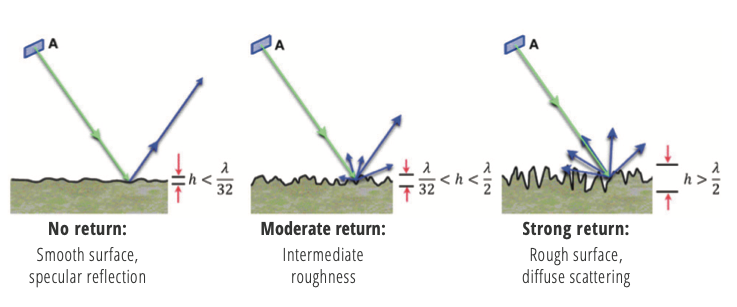

# Introduction to SAR
---------------------

## How SAR Operates

SAR is an active sensor that transmits pulses and listens for echoes, called backscatter. The backscatter is recorded in both phase and amplitude, with phase being used to determine the distance from the sensor to a target and amplitude yeilding information about the roughness, geometry, wetness, and dielectric constant of that target.

### Propagation of EM Waves

At the most fundamental level, SAR transmits an encoded burst, called a chirp, of electro-magnetic energy (figure 1) and then listens for the return signal, called echoes.  The wavelength of this chirp is in the centimeter range, with X-band (~3 cm), C-band (~6 cm), and L-band (~23 cm) all in common use.

")

*Figure 1: The spectrum of electro-magnetic radiation. SAR is imaged using microwave wavelengths (&#955 ≈ 3-23 cm) Credit: Franz J Meyer*

### Polarizations

Polarization refers to the direction of travel of an electromagnetic wave.  A horizontal wave is transmitted so that is oscillates in a plane parralel to the surface imaged, while vertical wave oscillates in a plane perpendicular to the surface imaged.

Some SAR systems can transmit chirps with either a horizontal or vertical polarization.  In addition, some of these sensors can listen for either horizontal of vertical backscatter.  This gives rise to 4 different types of returns HH, HV, VV, and VH. Here the first letter is the transmit method and the second is the recieve method, e.g. VH is a vertically polarized transmit signal with horizontally polarized echoes recorded.  These transmit and recieve methods are displayed in figure 2.

Polarimetry is an emerging field of SAR processing which is used in a number of applications such as measuring vegetation properties and changes of vegetation over time.  Additional applications include oceanography, geology, and disaster response.

*Figure 2: SAR signals are transmitted either vertically (V) or horizontally (H). Likewise, the sensor can listen for both horizontally and vertically returns. This gives rise to four different polarization combinations - VV, VH, HH, and HV.   Credit: Franz J Meyer*

-------

## Backscatter Contributors

Many factors influence the backscatter recieved by the SAR sensor.  The wavelength used by the SAR influences the signal's penetration, and, thus, what is being imaged. Surface roughness will modulate the backscatter returns from nothing up to a strong return, decreasing or increasing the brightness of the resulting pixel. Scattering mechanisms like volume scattering or double bounce can strongly influence the brightness of the SAR image as well, sometimes resulting in total saturation by the received signal.

### Wavelength

The wavelength of the SAR system influences the amount of ground penetration that occurs. As shown in figure 3, X-band has the least penetration, scattering from the top of the canopy in vegetated areas.  All three bands will penetrate dry sand, with stronger returns from both C-band and L-band.  L-band has the most penetration overall, with returns from the ground in vegetated areas, stong returns from substances under dry alluvium, and deep penetration of ice and snow.

*Figure 3: Effects of the SAR band on penetration of surfaces.  The longer the wavelength, the deeper the pentration through most land types. Credit: Franz J Meyer*

### Surface Roughness 

The strength of the return, or backscatter, is partially based upon relative roughness of the surface imaged. The smoother the surface, the more reflection away from the sensor, while rough surfaces give a much stronger return towards the imaging platform. As can be seen in figure 4, if the height of the surface's roughness is less than 1/32 of the wavelength, mostly specular reflection occurs. If the height of the surface's roughness is grater than 1/2 the wavelength used, the echoes are scattered in all directions, giving a strong return back to the sensor.

*Figure 4: The amount of backscatter from a surface depends largely on the surface's roughness, with smooth surfaces getting the least returns and rough surfaces getting the strongest returns. Credit:  Franz J Meyer*

### Types of scattering

*Figure 5: Scattering mechanisms. Rough surfaces give bright returns due to the wide scattering.  Vegetated surfaces cause volumetric scattering, which gives a darker return to the imaging platform.  Double bounce returns, found mostly in urban areas, give the brightest return, as the majority of the energy is re-directed back towards the sensor.*

The resolution of Sentinel-1 SAR images is roughly 10 m.  This means that a square of 10 meters on the ground is represented by a single pixel in the SAR image. The relativate roughness of this patch of ground compared to the wavelength used will effect the backscatter strength (see figure 4).  However, there are additional types of bounce mechanisms beyond specular and diffuse, as shown in figure 5.  In vegetation, *volumetric* scattering occurs when signals bounce around inside the vegetation imaged.  The *double bounce* mechanism which occurs in urban areas and is exploited by corner reflectors, causes chrip to be reflected directly back to the sensor, causing a very strong backscatter.  Double bounce returns are so strong in some places that they cause over saturation of the sensor, resulting in visible sidelobes.  These sidelobes are evidenced by bright crosses surrounding the double bounce target.

------------------------

## SAR Scale

SAR backscatter are recorded in both return strength and phase.  Each pixel in a single-look complex SAR image represents these values as an imaginary number (I,Q).  To create the visible images we are used to looking at, the SAR image is *detected*.  This process calculates the square root of the sum of the squares of the I and Q values found in an SLC image, creating a so called intensity image.  This image is real valued, and, when calbrated, gives the absolute backscatter of the surface imaged.  Detected images can be stored using several different scales, including power, amplitude, and dB.  Note the default scale of Sentinel-1 RTC products from HyP3 is power. However, in some cases, it may be desirable to convert the actual pixel values to a different scale. Two other scales commonly used for SAR data are amplitude and dB.

### Power Scale

The values in this scale are generally very close to zero, so the dynamic range of the SAR image can be easily skewed by a few bright scatterers in the image. Power scale is appropriate for statistical analysis of the SAR dataset, but may not always be the best option for data visualization. 

When viewing a SAR image in power scale in a GIS environment, it may appear mostly or all black, and you may need to adjust the stretch to see features in the image. Often applying a stretch of 2 standard deviations, or setting the Min-Max stretch values to 0 and 0.3, will greatly improve the appearance of the image. You can adjust the stretch as desired to display your image to full advantage. Be aware that this does not change the actual pixel values.

### Amplitude Scale

Amplitude scale is the square root of the power scale values. This brightens the darker pixels and darkens the brighter pixels, narrowing the dynamic range of the image. In many cases, amplitude scale presents a pleasing grayscale display of RTC images. Amplitude scale works well for calculating log difference ratios (see [ASF Sentinel-1 RTC Product Guide](../guides/rtc_product_guide.md/#change-detection-using-rtc-data)).

### dB Scale

The dB scale is calculated by multiplying 10 times the Log10 of the power scale values. This scale brightens the pixels, allowing for better differentiation among very dark pixels. When identifying water on the landscape, this is often a good scale to use; the water pixels generally remain very dark, while the terrestrial pixels are even brighter (see [Identifying Surface Water](#identifying-surface-water)).

This scale is not always the best choice for general visualization of SAR products, as it can give a washed-out appearance, and because it is in a log scale, it is not appropriate for all types of statistical analyses.

------------------------

## Geometric Distortions

There are a number of distortions inherent to SAR data due to the side-looking nature of the sensor, and these impacts will be more prevalent in areas with rugged terrain. The process of radiometric terrain correction addresses the geometric distortions that lead to geolocation errors in terrain features, and also normalizes the backscatter values based on the actual area contributing returns. This process generates an image that aligns well with other geospatial data and is suitable for GIS applications or time-series analysis.

The key distortions present in SAR images are foreshortening, layover and shadow (figure 6).

*Figure 6: Distortions induced by side-looking SAR. Ground points a, b, c are ‘seen’ by radar as points a’, b’, c’ in the slant range. Credit: Franz J. Meyer*

In the case of **foreshortening**, the backscatter from the front side of the mountain is compressed, with returns from a large area arriving back to the sensor at about the same time. This results in the front slope being displayed as a narrow, bright band.

When **layover** occurs, returns from the front slope (and potentially even some of the area before the slope starts) are received at the same time as returns from the back slope. Thus, area in the front of the slope is projected onto the back side in the slant range image. In this case, the data from the front slope cannot be extracted from the returns.

Another condition that results in missing data is radar **shadow**. In this case, the angle of the back slope is such that the sensor can not image it at all. These areas with steep back slopes offer no information to the SAR sensor.

When RTC is performed, foreshortened areas are corrected based on the DEM. Areas impacted by layover or shadow, however, do not actually have data returns to correct. In this case, the pixels in the resulting RTC image will have a value of No Data. We do not interpolate missing data; users who would like to fill holes with estimated values will need to do so as appropriate for their particular application.

## Speckle
  
In most cases, the patch of ground illuminated by the SAR transmitter will not be homegeneous. Instead it will be comprised of many different types of individual scatterers. The scatterers may interfere with each other either strengthening the return or weakening it. This creates a grainy (salt & pepper) appearance in SAR imagery. This a result of the nature of SAR and, thus, occurs in all SAR scenes.  Speckle in SAR images can be mitigated by multi-looking, which, in effect, uses averaging to smooth out the image, resulting in a more homogeneous appearance at the expense of resolution.

## Geocoding
## Acquisition modes
## Product Levels

