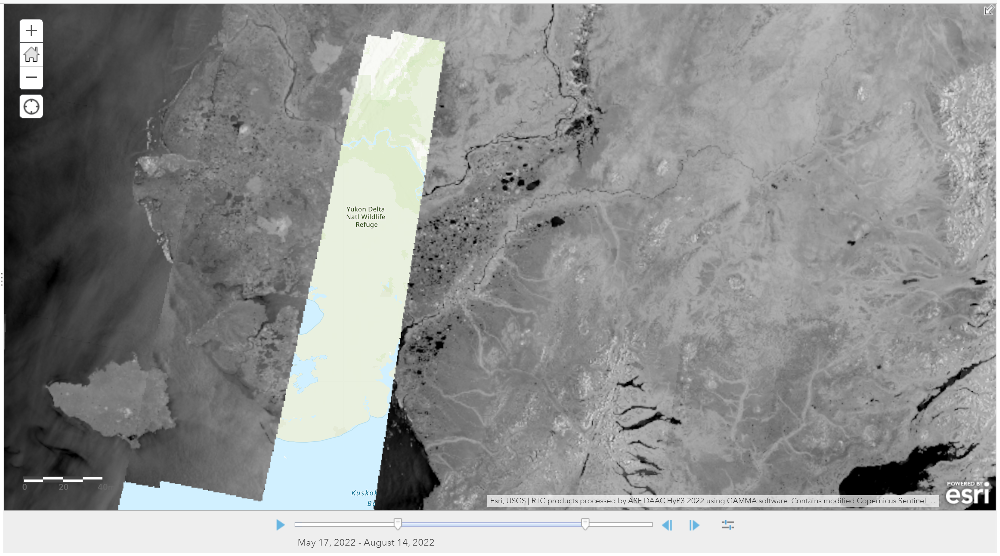

# Sentinel-1 Mission

The Sentinel-1 satellite constellation is part of the Copernicus Earth Observation program, coordinated by the European Space Agency (ESA) on behalf of the European Commission (EC). Sentinel-1 satellites carry C-band Synthetic Aperture Radar (SAR) instruments for global, around-the-clock imagery acquisition, even through cloud cover. 

More information about the mission is available from the [European Space Agency Sentinel-1 Mission website](https://earth.esa.int/web/guest/missions/esa-operational-eo-missions/sentinel-1 "Sentinel-1 Mission" ){target=_blank}.

## The Sentinel-1 Constellation

The Sentinel-1A satellite was launched April 3, 2014, and the Sentinel-1B satellite was launched April 25, 2016. The satellites each have a 12-day repeat cycle and use the same orbit pattern, but are offset 180 degrees to allow repeat passes every 6 days. 

While both satellites were actively imaging, most global landmasses were imaged every 12 days. Some areas of particular interest to the EC, including Europe and areas undergoing rapid changes due to uplift or subsidence activity, were imaged every 6 days. Refer to the [Sentinel-1 Observation Scenario](https://sentinel.esa.int/web/sentinel/missions/sentinel-1/observation-scenario "https://sentinel.esa.int/web/sentinel/missions/sentinel-1/observation-scenario" ){target=_blank} for more information on the acquisition plan used while both satellites were actively acquiring data.

### Mission Ends for Sentinel-1B

!!! important "Sentinel-1B no longer acquiring data"

    **As of December 23, 2021, Sentinel-1B is no longer able to acquire data.** An anomaly related to the power supply cannot be repaired, and the satellite will be decommissioned. Refer to [ESA's documentation of the end of the Sentinel-1B mission](https://www.esa.int/Applications/Observing_the_Earth/Copernicus/Sentinel-1/Mission_ends_for_Copernicus_Sentinel-1B_satellite "Mission Ends for Copernicus Sentinel-1B Satellite" ){target=_blank} for more information.

While Sentinel-1A is still healthy, the loss of Sentinel-1B has resulted in a significant reduction in the spatial and temporal coverage of the Sentinel-1 mission. Refer to [this article by Iain Woodhouse](https://www.earthblox.io/articles/the-impact-of-the-sentinel-1b-failure-and-looking-forward-to-sentinel-1c "The impact of the Sentinel-1B failure and looking forward to Sentinel-1C" ){target=_blank} for an illustration of the global impact of the Sentinel-1B failure. The image below illustrates a hole in the acquisitions over Alaska. This area of the Yukon-Kuskokwim Delta did not have a Sentinel-1 acquisition during the summer of 2022 until August 15.

The good news is that Sentinel-1C is waiting in the wings, and launch is anticipated in 2023. This satellite will replace Sentinel-1B, but until that is in place, there will continue to be reduced coverage. The holes were particularly noticeable the first few months after Sentinel-1B lost power, but there are still some areas with little to no coverage. Keep this in mind as you search for data in your area of interest. If there are fewer results than you would expect, you can [download current acquisition plans for the mission from ESA](https://sentinels.copernicus.eu/web/sentinel/missions/sentinel-1/observation-scenario/acquisition-segments "Sentinel-1 Acquisition Segments" ){target=_blank} to view the acquisition plan for your area and time period of interest.
