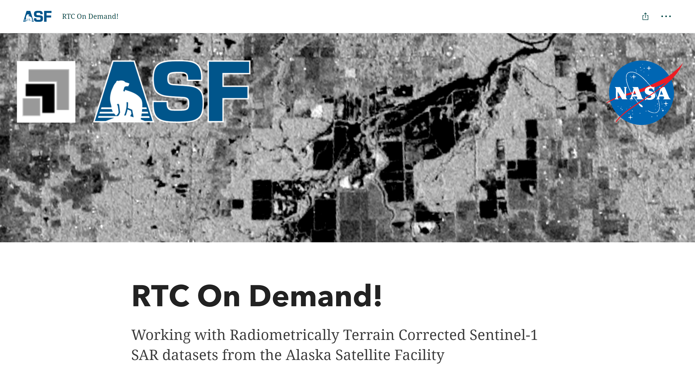

# HyP3 Tutorials

## Jupyter Notebooks

We provide step-by-step tutorials for using HyP3 programmatically via Jupyter Notebooks. 

* [Using the HyP3 Python SDK](https://nbviewer.jupyter.org/github/ASFHyP3/hyp3-sdk/blob/main/docs/sdk_example.ipynb "Using the HyP3 SDK Tutorial" ){target=blank}
  -- This notebook walks through ordering and accessing RTC, InSAR, and autoRIFT products in Python using the HyP3 SDK.
* [Time series analysis with HyP3 and MintPy](https://nbviewer.org/github/ASFHyP3/hyp3-docs/blob/main/docs/tutorials/hyp3_insar_stack_for_ts_analysis.ipynb "Time series analysis with HyP3 and MintPy Tutorial" ){target=blank}
  -- This notebook walks through performing a time-series analysis of the 2019 
  Ridgecrest, CA earthquake with HyP3 On Demand InSAR products and MintPy.

## Story maps

We provide step-by-step tutorials for ordering and accessing
[RTC](https://storymaps.arcgis.com/stories/2ead3222d2294d1fae1d11d3f98d7c35 "RTC On Demand Story Map" ){target=blank}
and [InSAR](https://storymaps.arcgis.com/stories/68a8a3253900411185ae9eb6bb5283d3 "InSAR On Demand Story Map" ){target=blank}
products in Vertex.

{target=blank}
{target=blank}

ASF also provides a variety of Esri Story Map tutorials and resources for using
Synthetic Aperture Radar (SAR) data available from ASF. Check them all out here:

* [Story Map Tutorials](https://asf-daac.maps.arcgis.com/home/index.html "Story Map Tutorials" ){target=blank}
