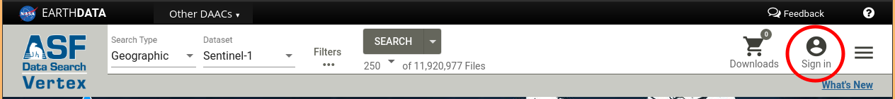

# HyP3 API

The HyP3 API is built on [OpenAPI](https://www.openapis.org/) and [Swagger](https://swagger.io/). A friendly
interface for exploring the API is available at:

#### <https://hyp3-api.asf.alaska.edu/ui/>

!!! warning "Authentication Required"

    If you get a 401 response back you need to [sign in to Vertex](https://search.asf.alaska.edu/#/) to get the `asf-urs` session cookie.
    
    ```json
    {
      "detail": "No authorization token provided",
      "status": 401,
      "title": "Unauthorized",
      "type": "about:blank"
    }
    ```
    
    
