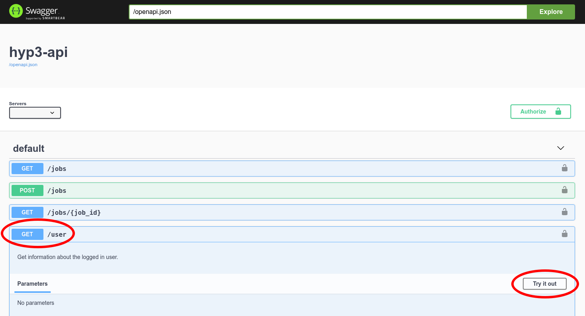

# Using the HyP3 API

The HyP3 API is built on [OpenAPI](https://www.openapis.org/){target=_blank} and [Swagger](https://swagger.io/){target=_blank}.
A friendly interface for exploring the API is available at:

#### <https://hyp3-api.asf.alaska.edu/ui/>{target=_blank}

In order to use the API, you'll need a `asf-urs` session cookie, which you can get
by [signing in to Vertex](https://search.asf.alaska.edu/#/){target=_blank}


### Confirm you are authenticated

To confirm you are authenticated, you can run a `GET` request to our `/user` endpoint.
Select the blue `GET` button next to `/user` and click the `Try it out` button


Then, execute the request and look at the response


If you get a `Code 200` you should see a JSON dictionary of your user information.

!!! warning "Authentication Required"

    If you get a 401 response back you need to [sign in to Vertex](https://search.asf.alaska.edu/#/){target=_blank} to get the `asf-urs` session cookie.
    
    ```json
    {
      "detail": "No authorization token provided",
      "status": 401,
      "title": "Unauthorized",
      "type": "about:blank"
    }
    ```

## Submitting Sentinel-1 RTC jobs

Jobs are submitted through the API by providing a JSON payload with a list of job
definitions.

Sentinel-1 jobs are submitted using [ESA granule IDs](https://sentinel.esa.int/web/sentinel/user-guides/sentinel-1-sar/naming-conventions){target=_blank}.
A minimal job list for a single Sentinel-1 RTC job would look like:

```json
{
  "jobs": [
    {
      "name": "minimal-rtc-example",
      "job_type": "RTC_GAMMA",
      "job_parameters": {
        "granules": [
          "S1A_IW_GRDH_1SDV_20210214T154837_20210214T154901_036588_044C54_032E"
        ]
      }
    }
  ]
}
```

The job list may contain up to 200 job definitions. You can also provide custom RTC options:
```json
{
  "jobs": [
    {
      "name": "custom-rtc-example",
      "job_type": "RTC_GAMMA",
      "job_parameters": {
        "granules": [
          "S1B_IW_GRDH_1SDV_20210210T153157_20210210T153222_025546_030B48_2901"
        ],
        "radiometry": "gamma0",
        "scale": "power",
        "dem_matching": false,
        "include_dem": true,
        "include_inc_map": true,
        "include_scattering_area": false,
        "speckle_filter": false
      }
    },
    {
      "name": "custom-rtc-example",
      "job_type": "RTC_GAMMA",
      "job_parameters": {
        "granules": [
          "S1B_IW_GRDH_1SDV_20210210T153132_20210210T153157_025546_030B48_4E31"
        ],
        "radiometry": "sigma0",
        "scale": "amplitude",
        "dem_matching": false,
        "include_dem": false,
        "include_inc_map": false,
        "include_scattering_area": true,
        "speckle_filter": true
      }
    }
  ]
}
```

## Submitting Sentinel-1 InSAR jobs

You can also submit InSAR jobs for scene pairs using [ESA granule IDs](https://sentinel.esa.int/web/sentinel/user-guides/sentinel-1-sar/naming-conventions){target=_blank}.
```json
{
  "jobs": [
    {
      "name": "minimal-insar-example",
      "job_type": "RTC_GAMMA",
      "job_parameters": {
        "granules": [
          "S1A_IW_SLC__1SDV_20200203T172103_20200203T172122_031091_03929B_3048",
          "S1A_IW_SLC__1SDV_20200110T172104_20200110T172123_030741_03864E_A996"
         ]
      }
    },
    {
      "name": "custom-insar-example",
      "job_type": "RTC_GAMMA",
      "job_parameters": {
        "granules": [
          "S1A_IW_SLC__1SDV_20200527T195012_20200527T195028_032755_03CB56_3D96",
          "S1A_IW_SLC__1SDV_20200515T195012_20200515T195027_032580_03C609_4EBA"
         ],
        "looks": "10x2",
        "include_look_vectors": true,
        "include_los_displacement": true
      }
    }
  ]
}
```

## Submitting autoRIFT jobs

AutoRIFT supports processing Sentinel-1, Sentinel-2, or Landsat-8 Collection 2 pairs.

* Sentinel-1 jobs are submitted using [ESA granule IDs](https://sentinel.esa.int/web/sentinel/user-guides/sentinel-1-sar/naming-conventions){target=_blank}
* Sentinel-2 jobs can be submitted using [ESA granule IDs](https://sentinel.esa.int/web/sentinel/user-guides/sentinel-2-msi/naming-convention){target=_blank}
  or [Element 84 Earth Search IDs](https://registry.opendata.aws/sentinel-2/){target=_blank}
* Landsat-8 Collection 2 jobs are submitted using [USGS scene IDs](https://www.usgs.gov/faqs/what-naming-convention-landsat-collection-2-level-1-and-level-2-scenes?qt-news_science_products=0#qt-news_science_products){target=_blank}

To submit an example set of jobs including all supported missions, you could write a job list like:

```json
{
  "jobs": [
    {
      "name": "autorift-example",
      "job_type": "AUTORIFT",
      "job_parameters": {
        "granules": [
          "S1A_IW_SLC__1SSH_20170221T204710_20170221T204737_015387_0193F6_AB07",
          "S1B_IW_SLC__1SSH_20170227T204628_20170227T204655_004491_007D11_6654"
        ]
      }
    },
    {
      "name": "autorift-example",
      "job_type": "AUTORIFT",
      "job_parameters": {
        "granules": [
          "S2B_MSIL1C_20200612T150759_N0209_R025_T22WEB_20200612T184700",
          "S2A_MSIL1C_20200627T150921_N0209_R025_T22WEB_20200627T170912"
        ]
      }
    },
    {
      "name": "autorift-example",
      "job_type": "AUTORIFT",
      "job_parameters": {
        "granules": [
          "S2B_22WEB_20200612_0_L1C",
          "S2A_22WEB_20200627_0_L1C"
        ]
      }
    }
    {
      "name": "autorift-example",
      "job_type": "AUTORIFT",
      "job_parameters": {
        "granules": [
          "LC08_L1TP_009011_20200703_20200913_02_T1",
          "LC08_L1TP_009011_20200820_20200905_02_T1"
        ]
      }
    }
  ]
}
```

With your JSON jobs definition, you can `POST` to the `/jobs` endpoint to
submit the jobs.

1. click the green `POST` button next to `/jobs`
2. click `Try it out` on the right
3. paste your jobs definition into the `Request body`
4. click `execute`


If your jobs were submitted successfully you should see a `Code 200` and a
JSON response of your job list, with some additional job attributes filled in.

## Querying jobs

You can `GET` job information from the `/jobs` endpoint. You may provide query
parameters to filter which jobs are returned:


For our above examples, you can get the RTC job that was submitted with the default options by
searching for `name=minimal-rtc-example`. If you provide *no* query parameters, you'll get a
JSON response with a jobs list for every job you've submitted.

Within the jobs list, a complete job dictionary will look like:
```JSON
{
  "jobs": [
    {
      "name": "minimal-rtc-example",
      "job_type": "RTC_GAMMA",
      "job_parameters": {
        "granules": [
          "S1A_IW_SLC__1SSV_20150621T120220_20150621T120232_006471_008934_72D8"
        ]
      },
      "job_id": "20c377be-2511-46a8-b908-e015abd3c24e",
      "user_id": "MY_EDL_USERNAME",
      "status_code": "SUCCEEDED",
      "request_time": "2021-02-24T21:30:45+00:00",
      "expiration_time": "2021-03-11T00:00:00+00:00",
      "files": [
        {
          "filename": "S1A_IW_20150621T120220_SVP_RTC30_G_gpuned_0AEA.zip",
          "s3": {
            "bucket": "hyp3-contentbucket-fo259f6r6dn6",
            "key": "20c377be-2511-46a8-b908-e015abd3c24e/S1A_IW_20150621T120220_SVP_RTC30_G_gpuned_0AEA.zip"
          },
          "size": 28676279,
          "url": "https://hyp3-contentbucket-fo259f6r6dn6.s3.us-west-2.amazonaws.com/20c377be-2511-46a8-b908-e015abd3c24e/S1A_IW_20150621T120220_SVP_RTC30_G_gpuned_0AEA.zip"
        }
      ],
      "browse_images": [
        "https://hyp3-contentbucket-fo259f6r6dn6.s3.us-west-2.amazonaws.com/20c377be-2511-46a8-b908-e015abd3c24e/S1A_IW_20150621T120220_SVP_RTC30_G_gpuned_0AEA.png"
      ],      
      "thumbnail_images": [
        "https://hyp3-contentbucket-fo259f6r6dn6.s3.us-west-2.amazonaws.com/20c377be-2511-46a8-b908-e015abd3c24e/S1A_IW_20150621T120220_SVP_RTC30_G_gpuned_0AEA_thumb.png"
      ],
      "logs": [
        "https://hyp3-contentbucket-fo259f6r6dn6.s3.us-west-2.amazonaws.com/20c377be-2511-46a8-b908-e015abd3c24e/20c377be-2511-46a8-b908-e015abd3c24e.log"
      ]
    }
  ]
}
```

Importantly, the `files` block provides download links for the product files.

For large queries results may be truncated. In this case there will be a `next` key in the response that will contain a url to continue the query (this response may be similarly truncated and include a `next` key).
```JSON
{
  "jobs": [
    ...
  ],
  "next": "https://hyp3-api.asf.alaska.edu/jobs?start_token=eyJqb2JfaWQiOiAiYzk1MDUzY2ItYWQzNy00ZGFhLTgxZDItYzA0YmQ4NWZiNDhiIiwgInVzZXJfaWQiOiAiamxyaW5lMiIsICJyZXF1ZXN0X3RpbWUiOiAiMjAyMC0xMC0yOVQxOTo0Mzo0NCswMDowMCJ9"
}
```
