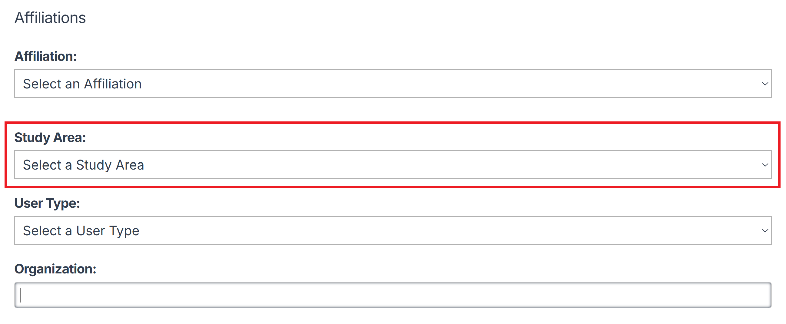
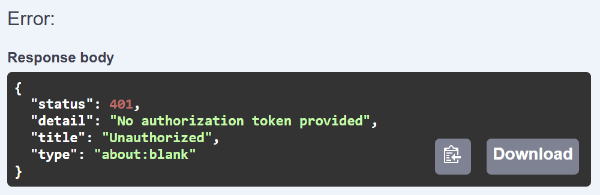
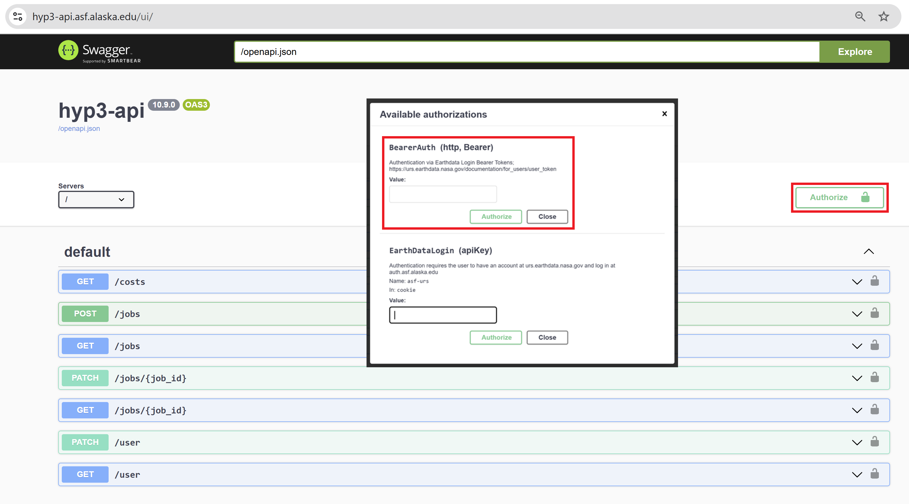

# Authentication with HyP3

Users must authenticate with 
[Earthdata Login](https://urs.earthdata.nasa.gov/ "https://urs.earthdata.nasa.gov/" ){target=_blank} 
credentials before they can submit jobs to [HyP3](../how_it_works.md) for processing or access information 
about the resulting [On Demand products](../products.md "hyp3-docs.asf.alaska.edu/products").

The options available for authentication depend on the interface you are using to interact with HyP3 functionality.

- The [Vertex](https://search.asf.alaska.edu/ "search.asf.alaska.edu" ){target=_blank} search and discovery 
  interface is a map-based web application that allows users to search for Sentinel-1 acquisitions, submit them for 
  processing by HyP3, and access the resulting [On Demand products](../products.md "hyp3-docs.asf.alaska.edu/products").
- Programmatic access to HyP3 functionality and output products is available through:
    - The [HyP3 API](../using/api.md "hyp3-docs.asf.alaska.edu/using/api")
    - The [HyP3 Python SDK](../using/sdk.md "hyp3-docs.asf.alaska.edu/using/sdk")

Authentication is not required when downloading On Demand products generated by HyP3, but you must 
authenticate in order to look up the download URLs for these products.

## Earthdata Login (EDL)

[Earthdata Login](https://urs.earthdata.nasa.gov/ "https://urs.earthdata.nasa.gov/" ){target=_blank} 
(EDL) is the authentication method used across NASA's 
[Earth Observation System Data Information System (EOSDIS)](https://www.earthdata.nasa.gov/about/esdis/eosdis "www.earthdata.nasa.gov/about/esdis/eosdis" ){target=_blank}. 
It allows users to access any of the Earth Science data products served by EOSDIS, regardless of the 
identity of the data curator.

There is no cost to 
[register for EDL credentials](https://urs.earthdata.nasa.gov/users/new "https://urs.earthdata.nasa.gov/users/new" ){target=_blank}, 
and the process is quick and easy. When creating your profile, make sure to select an item in the **Study Area** 
field, as you may encounter access errors if that field is left blank.

### Username and Password

Most authentication workflows involve providing the username and password you set when registering for EDL. You may 
be prompted to enter them into a GUI, such as when you are signing in to Vertex, they may be saved in a .netrc file 
for automatic use with some programmatic interfaces, or you may be prompted to enter them as part of a scripted 
workflow.

### Earthdata Login Token

Earthdata Login also supports the generation of tokens that are valid for 60 days. These user/bearer tokens can be 
used for EDL authentication instead of entering a username and password. The 
[User Token Management](https://urs.earthdata.nasa.gov/documentation/for_users/user_token "urs.earthdata.nasa.gov/documentation/for_users/user_token" ){target=_blank} 
document provides step-by-step guidance for generating an EDL token, which you can do either in the 
[Earthdata Login web interface](https://urs.earthdata.nasa.gov/ "urs.earthdata.nasa.gov/" ){target=_blank} 
or by using the 
[User Tokens API](https://urs.earthdata.nasa.gov/documentation/for_users/user_token#api "urs.earthdata.nasa.gov/documentation/for_users/user_token#api" ){target=_blank}.

## Authentication in Vertex

Click the **Sign In** button in [Vertex](https://search.asf.alaska.edu/ "search.asf.alaska.edu" ){target=_blank}, 
which opens a 
[version of the Earthdata Login GUI](https://urs.earthdata.nasa.gov/oauth/authorize?response_type=code&client_id=BO_n7nTIlMljdvU6kRRB3g&redirect_uri=https://auth.asf.alaska.edu/login "ASF Authorization Login" ){target=_blank} 
customized for ASF applications. Enter your 
[Earthdata Login credentials](#earthdata-login-edl "Jump to the Earthdata Login section of this document") 
to enable access to all functionality in Vertex linked to EDL credentials, including 
[On Demand capabilities](vertex.md "Jump to the On Demand Sentinel-1 Processing in Vertex page").

## Authentication with the HyP3 API

There are a couple of authentication methods available when using the 
[HyP3 API](../using/api.md "hyp3-docs.asf.alaska.edu/using/api"). 
The most common is using an 
[Earthdata Login session cookie](#earthdata-login-session-cookie "Jump to the Earthdata Login Session Cookie section of this document"), 
but you can also use an 
[Earthdata Login bearer token](#earthdata-login-bearer-token "Jump to the Earthdata Login Bearer Token section of this document").

### Earthdata Login Session Cookie

You can authorize the HyP3 API by having a valid ASF Earthdata Login (asf-urs) session cookie in your web environment. 
This cookie is generated when you 
[sign in to Vertex](#authentication-in-vertex "Jump to the Authenticating in Vertex section of this document"). 

If you log in directly to the 
[Earthdata Login GUI](#username-and-password "Jump to the EDL Username and Password section of this document"), 
you will still need to click the **Sign In** button in Vertex to generate the ASF-specific cookie before you can 
use the HyP3 API. If you already have a generic EDL cookie, you will not need to re-enter your credentials
(you will be logged in automatically), but the asf-urs cookie will still be generated.

If you do not have a valid asf-urs session cookie before launching the 
[HyP3 API Swagger UI](https://hyp3-api.asf.alaska.edu/ui/ "hyp3-api.asf.alaska.edu/ui" ){target=_blank}, 
you will see an error response when submitting an API request: 

You may need to refresh the browser window with the HyP3 API Swagger UI after you sign in to Vertex 
before you will be able to submit API requests successfully.

### Earthdata Login Bearer Token

Users can generate an EDL token, as described in the 
[Earthdata Login Token](#earthdata-login-token "Jump to the Earthdata Login Token section of this document") 
section of this document.

Once you have a valid EDL token: 

1. Open the [Swagger UI interface for the HyP3 API](https://hyp3-api.asf.alaska.edu/ui/ "hyp3-api.asf.alaska.edu/ui" ){target=_blank}
2. Click the **Authorize** button at the top of the Swagger UI page
3. Enter or paste your EDL token in the **Value** field of the `BearerAuth` section
4. Click the **Authorize** button in the `Available authorizations` window to apply the token

## Authentication with the HyP3 Python SDK

Authentication to the API occurs during the 
[initialization of the HyP3 object](https://hyp3-docs.asf.alaska.edu/using/sdk_api/#hyp3_sdk.HyP3.__init__ "HyP3 SDK API Reference" ){target=_blank} 
when using the [HyP3 Python SDK](../using/sdk.md "hyp3-docs.asf.alaska.edu/using/sdk").

There are several options for authentication when using this method, including:

- Adding your Earthdata Login (EDL) credentials to your local `.netrc` file
- Entering your EDL [username and password](#username-and-password "Jump to the Username and Password section of this document")
- Entering an [EDL token](#earthdata-login-token "Jump to the Earthdata Login Token section of this document")

Refer to the 
[Authenticate HyP3 in the SDK notebook](https://github.com/ASFHyP3/hyp3-sdk/blob/main/docs/hyp3_authentication.ipynb "Authenticate HyP3 in the SDK notebook" ){target=_blank} 
for guidance on how to implement one of these options using the SDK.
