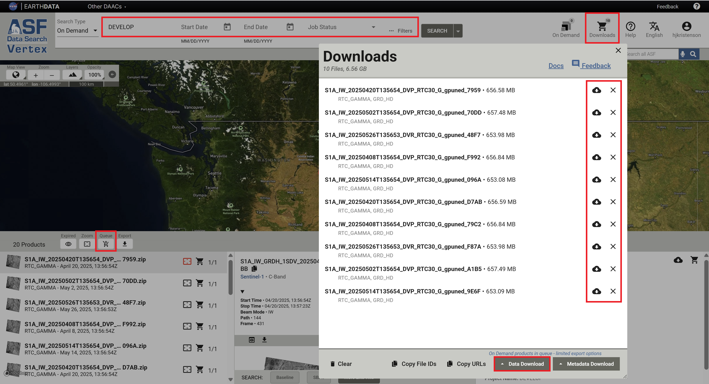

# Downloading HyP3 Products

There are a number of interfaces available for downloading products generated On Demand using the HyP3 platform. 

- [On Demand Search](#on-demand-search-in-vertex) interface in Vertex
- [Programmatically](#programmatic-access) using the HyP3 API or HyP3 Python SDK

## On Demand Search in Vertex

The [On Demand Search](https://search.asf.alaska.edu/#/?maxResults=1000&searchType=On%20Demand "Vertex On Demand Search" ){target=_blank} 
in Vertex allows you to view the status of any job you have submitted for processing and download any product 
that has been successfully processed. You will need to sign in with 
[Earthdata Login credentials](https://urs.earthdata.nasa.gov/ "urs.earthdata.nasa.gov" ){target=_blank} 
before results will display, as described in our 
[Authentication documentation](authentication.md#authentication-in-vertex "Jump to the Authentication in Vertex section of the Authentication page").

Refer to the 
[On Demand Search section of the Vertex User Manual](https://docs.asf.alaska.edu/vertex/manual/#on-demand-products-search-options "docs.asf.alaska.edu" ){target=_blank} 
for more information about On Demand Search functionality. 

### Downloading Individual Products

Click on an item in the search results to view download options. You can add the product to the Download Queue using 
the **cart icon** in either the Search Result (left) or File (right) pane, or launch a direct download in your 
browser window by clicking the **cloud download icon** in the File pane. 


To view the download queue, click the **Downloads** icon in the top right of the Vertex web interface. 
The Download Queue interface provides options for direct download of individual items along with bulk download options.

### Downloading Multiple Products

You can add products to the Download Queue one by one using the cart icon, or you can search your On Demand 
products for a specific set of products and add them all to the Download Queue using the **Queue** button at the 
top of the results list. 



There are a number of options available for filtering your On Demand products, with the most useful being the 
**Project Name** field. You can assign a project name when submitting jobs for processing to easily group items 
together that are used for the same project. 

Once you've added products to the Download Queue, either by using the individual cart icons or the bulk Queue 
button, click the **Downloads** icon in the top right of the Vertex web interface. When you open the Download Queue, 
you have the option to launch direct downloads of individual items in the list, or you can choose to remove 
individual items from the queue. 

To download all of the products listed in the Download Queue, click the **Data Download** button at the bottom of 
the queue window and choose from the available options: 

#### Download Python Script

The most robust approach for downloading very long lists of products is the 
**Download Python Script** option. This downloads a python script that you can launch on your computer. 

- You will be prompted for your Earthdata Login credentials if necessary, then the script will work through the list 
  of download URLs, downloading them one by one until all of the items have been downloaded. 
- If the script is interrupted during the download, you can simply re-run the same script; it will recognize 
  any products that have already been successfully downloaded and continue with the remaining items. 
- To use this option, you must have a Python installation available on your computer. 

#### Download All

Chrome users may find the **Download All** option useful. This option takes advantage of the multi-threading 
capability in Chrome to download several items at a time.

#### Copy URLs
You can also click on **Copy URLs** (located next to the Data Download button) to copy a list of the download URLs 
for the files in your Download Queue, which you can then paste into your own download script or 
[Wget command](#downloading-with-wget "Jump to the Downloading with Wget section of this document"). 

## Programmatic Access

The 
[HyP3 API](#accessing-products-using-the-hyp3-api "Jump to the Accessing Products Using the HyP3 API section of this document") 
and the 
[HyP3 Python SDK](#accessing-products-using-the-hyp3-python-sdk "Jump to the Accessing Products Using the HyP3 Python SDK section of this document") 
provide programmatic access to On Demand products. 

The `name` parameter is referred to as "Project Name" in the Vertex interface, but is often referred to as "Job Name" 
in documentation for the programmatic interfaces. This parameter is helpful in grouping together jobs submitted as 
part of a particular analysis effort. It facilitates management and download of groups of jobs, makes it easier to 
share products with colleagues, and allows users to access their HyP3-generated products using the notebooks available 
on ASF's [OpenSARLab](https://opensarlab-docs.asf.alaska.edu/ "opensarlab-docs.asf.alaska.edu" ){target=_blank}.

The 
[HyP3 API](#accessing-products-using-the-hyp3-api "Jump to the Accessing Products Using the HyP3 API section of this document") 
allows easy access to job URLs through the Swagger UI, but the 
[HyP3 Python SDK](#accessing-products-using-the-hyp3-python-sdk "Jump to the Accessing Products Using the HyP3 Python SDK section of this document") 
is better suited for scripting search and download workflows for On Demand products. 

### Accessing Products Using the HyP3 API

The [HyP3 API](../using/api.md "hyp3-docs.asf.alaska.edu/using/api") 
provides the ability to 
[Query Submitted Jobs](../using/api.md#querying-jobs "hyp3-docs.asf.alaska.edu/using/api/#querying-jobs"). 

#### Authentication

To look up your On Demand jobs, you will need to have a valid Earthdata Login (asf-urs) session cookie, 
which you can get by signing in to 
[Vertex](https://search.asf.alaska.edu/ "search.asf.alaska.edu" ){target=_blank} or 
[Earthdata Login](https://urs.earthdata.nasa.gov/ "urs.earthdata.nasa.gov" ){target=_blank} 
with your Earthdata Login Credentials. You can also authenticate using an 
[Earthdata Login token](authentication.md#earthdata-login-token "Jump to the Earhtdata Login Token section of the Authentication page"). 
Refer to 
[Authentication with HyP3 API](authentication.md#authentication-with-the-hyp3-api "Jump to the Authentication page") 
documentation for more information on the available authentication methods.

#### Entering Search Parameters

Note that the parameter fields in the UI are populated with defaults. You will need to edit or delete any of the 
default values that do not align with your desired search parameters. The start and end date fields reference 
the date/time the jobs were submitted, not the date/time of the acquisitions used to generate the products. 

#### Response JSON

The response from your 
[Get Jobs API request](https://hyp3-api.asf.alaska.edu/ui/#/default/get_jobs "hyp3-api.asf.alaska.edu/ui/#/default/get_jobs" ){target=_blank} 
includes download links for the browse images and thumbnails used to display the product contents in Vertex, 
as well as the link to the complete product package with a `.zip` extension. 

Here is an example of a response JSON:
```
{
  "jobs": [
   {
      "processing_times": [
        836.557
      ],
      "browse_images": [
        "https://d3gm2hf49xd6jj.cloudfront.net/6f917fec-9c2f-42fb-a55c-3c4fe2e0520b/S1A_IW_20250420T135654_DVP_RTC30_G_gpuned_7959.png",
        "https://d3gm2hf49xd6jj.cloudfront.net/6f917fec-9c2f-42fb-a55c-3c4fe2e0520b/S1A_IW_20250420T135654_DVP_RTC30_G_gpuned_7959_rgb.png"
      ],
      "credit_cost": 5,
      "priority": 9960,
      "execution_started": true,
      "job_id": "6f917fec-9c2f-42fb-a55c-3c4fe2e0520b",
      "name": "DEVELOP",
      "thumbnail_images": [
        "https://d3gm2hf49xd6jj.cloudfront.net/6f917fec-9c2f-42fb-a55c-3c4fe2e0520b/S1A_IW_20250420T135654_DVP_RTC30_G_gpuned_7959_thumb.png",
        "https://d3gm2hf49xd6jj.cloudfront.net/6f917fec-9c2f-42fb-a55c-3c4fe2e0520b/S1A_IW_20250420T135654_DVP_RTC30_G_gpuned_7959_rgb_thumb.png"
      ],
      "request_time": "2025-06-10T07:47:28+00:00",
      "logs": [],
      "user_id": "hjkristenson",
      "status_code": "SUCCEEDED",
      "job_parameters": {
        "speckle_filter": false,
        "include_inc_map": false,
        "dem_name": "copernicus",
        "radiometry": "gamma0",
        "granules": [
          "S1A_IW_GRDH_1SDV_20250420T135654_20250420T135723_058841_074ABD_E7BB"
        ],
        "scale": "power",
        "dem_matching": false,
        "resolution": 30,
        "include_rgb": true,
        "include_dem": false,
        "include_scattering_area": false
      },
      "files": [
        {
          "s3": {
            "bucket": "hyp3-edc-prod-contentbucket-1fv14ed36ifj6",
            "key": "6f917fec-9c2f-42fb-a55c-3c4fe2e0520b/S1A_IW_20250420T135654_DVP_RTC30_G_gpuned_7959.zip"
          },
          "filename": "S1A_IW_20250420T135654_DVP_RTC30_G_gpuned_7959.zip",
          "size": 656581903,
          "url": "https://d3gm2hf49xd6jj.cloudfront.net/6f917fec-9c2f-42fb-a55c-3c4fe2e0520b/S1A_IW_20250420T135654_DVP_RTC30_G_gpuned_7959.zip"
        }
      ],
      "expiration_time": "2025-06-25T00:00:00+00:00",
      "job_type": "RTC_GAMMA"
    },
   ],
}   
```

The download URL for the full product package is provided near the end of the response for each job in the `jobs` 
array of the response JSON. The value is paired with the `url` key in the `files` array. 

You can copy and paste each product URL directly into a browser window, or script a workflow to pull all the 
product URLs from the response JSON into a bulk download function or text file. It may be more convenient to use the 
[HyP3 Python SDK](#accessing-products-using-the-hyp3-python-sdk "Jump to the Accessing Products Using the HyP3 Python SDK section of this document") 
to script bulk download functionality.

### Accessing Products using the HyP3 Python SDK

The [HyP3 Python SDK](../using/sdk.md "hyp3-docs.asf.alaska.edu/using/sdk") is a wrapper around the HyP3 API, 
and provides convenient search and download functionality for On Demand products (HyP3 jobs). 
[This example notebook](https://github.com/ASFHyP3/hyp3-sdk/blob/main/docs/sdk_example.ipynb "SDK Example Notebook" ){target=_blank} 
demonstrates how to use the SDK for a range of workflows. 

#### Authentication

To access product information using the SDK, you will need to authenticate using the 
[HyP3 initializer method](https://hyp3-docs.asf.alaska.edu/using/sdk_api/#hyp3_sdk.HyP3.__init__ "HyP3 SDK API Reference" ){target=_blank}. 
You can add Earthdata Login (EDL) credentials to your local `netrc` file, or use a prompt to enter either 
EDL credentials or an EDL token manually. Refer to the 
[Authenticate HyP3 in the SDK notebook](https://github.com/ASFHyP3/hyp3-sdk/blob/main/docs/hyp3_authentication.ipynb "Authenticate HyP3 in the SDK notebook" ){target=_blank} 
for authentication guidance and sample code.

#### Search for Jobs

Use the `find_jobs` method from the `HyP3` class to generate a list of products to download (batch), then use the 
`download_files` method from the `Batch` class to download all the products in the list. Refer to the 
[HyP3 SDK API Reference](https://hyp3-docs.asf.alaska.edu/using/sdk_api/#hyp3_sdk "hyp3-docs.asf.alaska.edu/using/sdk_api/#hyp3_sdk" ){target=_blank} 
for more information. 

## Product Packaging and Extraction

On Demand products from ASF are delivered as zip files. The files contained in the zip archive vary by product type, 
but the zip archive always includes an internal directory containing all the individual files. The directory names 
can be quite long, and some users (particularly those using a Windows operating system) will need to make 
accommodations in order to successfully extract the contents.

### Extracting Product Packages

When extracting the contents of a HyP3-generated zip file, you may need to specify a destination directory to prevent 
the extraction of the internal directory to a directory named with the full zip file name. For many of the products, 
this combination of directories would result in paths that are longer than can be used with Windows operating systems. 

### Downloading Individual Files

Downloading the full zip file ensures that you have all of the data products as well as auxiliary files and 
relevant metadata, but some users may not require all of the files included in the product zip archive. 

The contents of the zip files can all be accessed directly. Simply replace the `.zip` at the end of the download URL 
with the tag for the specific file you want to download. 

For example, for the following download URL for an RTC On Demand product: 

    https://d3gm2hf49xd6jj.cloudfront.net/76b1a849-c826-428a-966c-55f8bb88f814/
    S1A_IW_20250502T135654_DVP_RTC30_G_gpuned_70DD.zip

simply replace the `.zip` with the desired product extension, such as `_VV.tif` for the RTC GeoTIFF in VV polarization: 

    https://d3gm2hf49xd6jj.cloudfront.net/76b1a849-c826-428a-966c-55f8bb88f814/
    S1A_IW_20250502T135654_DVP_RTC30_G_gpuned_70DD_VV.tif

You can then paste that URL into a browser window, or use it in a download script, to download only the designated 
product rather than the full zip archive. 

*The zip archive contains valuable metadata products, including a readme file that provides information 
about the workflow used to generate the product and the files included in the product package.* 
***New users are advised to download the full archive*** *to ensure they have access to this information 
and can determine what individual products are required for their application.* 

## Downloading Products Submitted by Other Users

You can search for On Demand products processed under a different username. This functionality is a convenient 
way to share products when collaborating with others, and can be accessed both in 
[Vertex](#using-vertex "Jump to the Using Vertex section of this document") and the 
[HyP3 Python SDK](#using-the-hyp3-python-sdk "Jump to the Using the HyP3 Python SDK section of this document"). 

### Using Vertex

Click the **Filters** button to open the On Demand Search **Filters** window, and use 
the **User ID** filter to enter the username under which the desired job was submitted. 


If the user who submitted the job also provides you with the **Project Name**, you can apply that search filter, 
as well. The drop-down list in the **Project Name** field only displays the list for the user who is logged in, so you 
will not be able to look up another user's list of Project Names using this interface. 

### Using the HyP3 Python SDK

The HyP3 Python SDK provides the capability to search for products submitted by other users. Refer to 
[this notebook](https://github.com/ASFHyP3/hyp3-sdk/blob/main/docs/search_other_user_jobs.ipynb "Using the HyP3 SDK to search for jobs run by another user" ){target=_blank} 
to learn how.

## Downloading with Wget

While [authentication](authentication.md "Jump to the Authentication page") is required to look up download URLs 
for On Demand products, it is not required for actually using the download URLs. This makes it easy to use any 
method you prefer for downloading the products.

Some users may find the 
[Wget](https://www.gnu.org/software/wget/manual/wget.html "www.gnu.org/software/wget/manual/wget.html" ){target=_blank} 
utility useful for downloading a long list of products.

Create a text file containing a list of download URLs (i.e `urls.txt`). This list can be generated a number of 
ways, including but not limited to: 

- the [Copy URLs](#copy-urls "Jump to the Copy URLs section of this document") functionality in Vertex
- extracting [URLs from an API response JSON](#response-json "Jump to the Response JSON section of this document")
- converting a list of download URLs for 
  [On Demand product zip files](#product-packaging-and-extraction "Jump to the Product Packaging and Extraction section of this document") 
  to a list of 
  [individual file URLs](#downloading-individual-files "Jump to the Downloading Individual Files section of this document")

You can then use the 
[input file](https://www.gnu.org/software/wget/manual/wget.html#index-input_002dfile "Wget Manual: Input File" ){target=_blank} 
option with Wget to reference the text file containing a list of download URLs. 

The command is simply the following:
```
wget -i urls.txt
```
