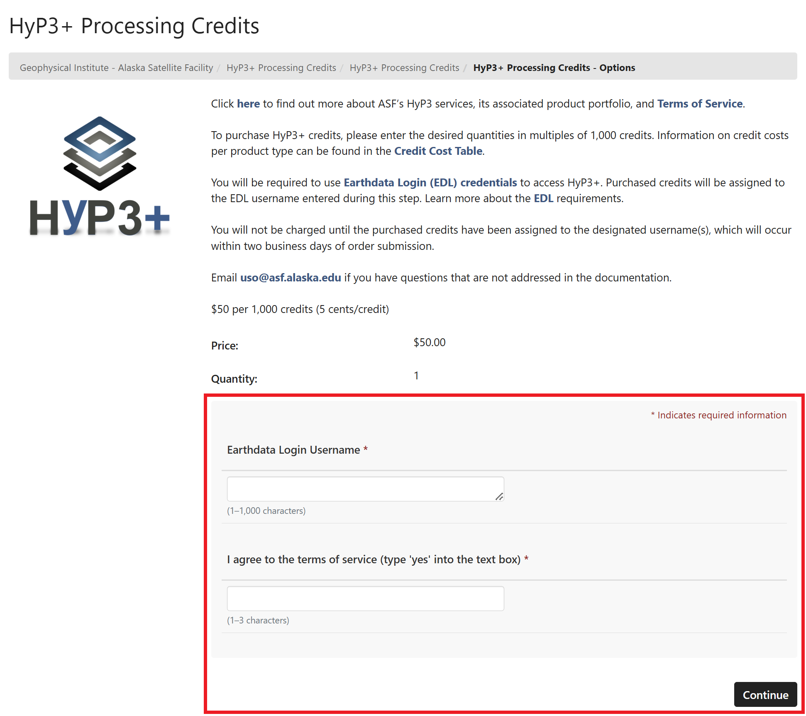

# HyP3+

For users who need to process more
[On Demand products](../products.md "Jump to the Products landing page of the documentation") than their
[credit limit](credits.md "Jump to the Credits page of the documentation")
allows, ASF provides HyP3+, a separate
[HyP3 deployment](../index.md) where users can pay for additional processing.

HyP3+ offers the same
[On Demand products](../products.md "Jump to the Products landing page of the documentation")
as ASF's standard HyP3 deployment, and users access their additional credit limit by logging in with the same
[Earthdata Login Credentials](authentication.md#earthdata-login-edl)
used for ordering free On Demand products.

HyP3+ has a different API Endpoint than the standard HyP3 deployment. Users can interact with HyP3+ using
the same methods as the standard HyP3 deployment, but will need to accommodate the different API URL. Refer to the
[API Endpoint](#api-endpoint "Jump to the API Endpoint section of this document")
section for more information on how to access the HyP3+ API Endpoint using Vertex, the HyP3 API, or the
HyP3 Python SDK.

## Purchasing Credits

Credits can be purchased at
[ASF's Web Store](https://epay.alaska.edu/C21563_ustores/web/store_cat.jsp?STOREID=141&CATID=410&SINGLESTORE=true "https://epay.alaska.edu" ){target=_blank}.
Credit purchases will be processed within two business days, and purchased credits do not expire.

[](https://epay.alaska.edu/C21563_ustores/web/store_cat.jsp?STOREID=141&CATID=410&SINGLESTORE=true "Click to purchase On Demand Processing Credits from epay.alaska.edu" ){target=_blank}

1. Select the quantity of credits you need, and click the **Add to Cart** icon. Refer to the
   [credit cost table](credits.md#credit-cost-table)
   to calculate the number of credits you will need to process the products you require.

2. Enter your
   [Earthdata Login (EDL)](authentication.md#earthdata-login-edl) username,
   then click the **Continue** button. **It is very important to enter your username correctly**,
   as the credits you purchase will be associated with this username.


    - You can purchase credits for multiple EDL usernames in one order. To add additional credits linked to a
      different username, click the **Continue Shopping** button after adding the first credit amount to your cart,
      then add another amount of credits to your cart. You will again be prompted for an EDL username, and you can
      enter a different username.

3. When you are ready to check out, click the **Checkout** button. You do not need to Login on the Checkout page.
   Simply enter your email in the *Contact Information* section, and click the **Checkout as Guest** button.


    - **It is very important to enter an email address at which you can be reached**, as this will be used to send the
      confirmation emails indicating when the order was received and processed, and if there are any issues that
      need to be resolved.

4. Enter your payment information, and click the **Continue** button.

5. Review your order details, and click the **Submit Order** button if everything is correct.

6. An order summary will be displayed, which you can print if desired. It will also be sent to the email you
   entered during checkout.

### Order Confirmation

An email is sent to you when your order is successfully submitted. It includes the details about your purchase,
including the EDL username(s) to which the credits will be assigned. If you notice any errors, send an email to
uso@asf.alaska.edu describing the issue.

### Order Completion

Once we receive your order, we will add the number of purchased credits to the specified username(s). ***This process
will be completed within two business days of the order confirmation.*** You will receive an email confirming that the
credits have been assigned to your username, at which point they are available for use.

Credits do not expire. We do not currently offer a service for automatic credit replenishment, so you will need to
place additional orders as necessary when your credit balance is depleted.

### Refunds

If you purchase credits in error or need to assign purchased credits to a different username, send an email to
uso@asf.alaska.edu and we will work with you to understand and resolve the issue. Any refunds granted will be
credited to the original method of payment.

## API Endpoint

The HyP3+ deployment is accessed using this API endpoint:
[https://hyp3-plus.asf.alaska.edu](https://hyp3-plus.asf.alaska.edu/ "hyp3-plus.asf.alaska.edu")

The standard HyP3 deployment is accessed at
[https://hyp3-api.asf.alaska.edu](https://hyp3-api.asf.alaska.edu/ "hyp3-api.asf.alaska.edu"), and is the default
API endpoint URL used in
[Vertex](vertex.md "Jump to Using HyP3 in Vertex documentation page") and the
[HyP3 Python SDK](sdk.md "Jump to Using the HyP3 Python SDK documentation page")
when submitting jobs for processing and accessing completed jobs.

In order to submit jobs using HyP3+, you will need to direct these jobs to the correct API endpoint.

### Change HyP3 API in Vertex

To change the HyP3 API in Vertex:

1. **[Sign In](authentication.md#authentication-in-vertex "Jump to the Vertex Authentication documentation page")**
   with the
   [Earthdata Login Credentials associated with your purchased credits](#purchasing-credits "Jump to the Purchasing Credits section of this document").

2. Click on your username icon and select **Preferences**.

3. Enter https://hyp3-plus.asf.alaska.edu in the **HyP3 API URL** field.

     - Once you enter the HyP3+ API URL in this field, it will be available as a drop-down menu
       item for future use.
4. Click **Done** to exit the Preferences page.

### HyP3 Python SDK API Endpoint

When calling the standard HyP3 API using the Python SDK, you can simply use the default:
```
import hyp3_sdk as sdk
hyp3 = sdk.HyP3()
```

To access the HyP3+ deployment, you will need to define the API URL for the HyP3 class:
```
import hyp3_sdk as sdk
hyp3_plus = sdk.HyP3('https://hyp3-plus.asf.alaska.edu')
```

## Submitting Jobs

The process of submitting jobs is the same for the HyP3+ deployment as for the standard HyP3 deployment.
You just need to make sure that you have
[set the API endpoint](#api-endpoint "Jump to the API Endpoint section of this document")
to https://hyp3-plus.asf.alaska.edu in
[Vertex](#change-hyp3-api-in-vertex) or the
[HyP3 Python SDK](#hyp3-python-sdk-api-endpoint "Jump to the HyP3 Python SDK API Endpoint section of this document"),
or are using the
[Swagger API UI](sdk_api.md "Jump to the HyP3 API documentation page") at
[https://hyp3-plus.asf.alaska.edu/ui/](https://hyp3-plus.asf.alaska.edu/ui/).

Refer to the individual Product Guides in the
[Products](../products.md "Jump to the Products documentation page")
section for details on submitting jobs for each product type.

As with the standard HyP3 deployment, you can check how many credits are remaining for your username in HyP3+
to determine how many jobs you will be able to submit.

- In Vertex, your On Demand queue in Vertex will display the number of credits you have available for use.
- Use the [Get /user](https://hyp3-plus.asf.alaska.edu/ui/#/default/get_user "https://hyp3-plus.asf.alaska.edu/ui/#/default/get_user") call in the HyP3 API to check your balance of credits.
- Use the [check_credits](https://hyp3-docs.asf.alaska.edu/using/sdk_api/#hyp3_sdk.HyP3.check_credits "hyp3_sdk.HyP3.check_credits function")
  function in the HyP3 Python SDK to check your balance of credits.

## Accessing Products

The process of accessing completed products using HyP3+ is the same as for the standard HyP3
deployment. You just need to make sure that you have
[set the API endpoint](#api-endpoint "Jump to the API Endpoint section of this document")
to https://hyp3-plus.asf.alaska.edu in
[Vertex](#change-hyp3-api-in-vertex) or the
[HyP3 Python SDK](#hyp3-python-sdk-api-endpoint "Jump to the HyP3 Python SDK API Endpoint section of this document"),
or are using the
[Swagger API UI](sdk_api.md "Jump to the HyP3 API documentation page") at
[https://hyp3-plus.asf.alaska.edu/ui/](https://hyp3-plus.asf.alaska.edu/ui/).

Even though the same EDL username can be used to process On Demand products in the standard HyP3 and HyP3+
deployments, you will not be able to search for products across both APIs. If you generate products for a single
project using both the standard HyP3 and HyP3+ deployments, you will need to use two separate searches to access
all of your products, even if the project names are the same.

When using the SDK, you can combine your results into one list using the following approach:
```
import hyp3_sdk as sdk
hyp3 = sdk.HyP3()
hyp3_plus = sdk.HyP3('https://hyp3-plus.asf.alaska.edu')

jobs = hyp3.find_jobs(...)
jobs += hyp3_plus.find_jobs(...)

jobs.download_files()
```

Refer to the [Downloads](downloading.md "Jump to the Downloads documentation page") for more information on the
methods available for downloading products once processing is complete.

## Contact Us

If you have any questions or concerns about using HyP3+, or have any suggestions about how
we might improve this service, send us an email at [uso@asf.alaska.edu](mailto:uso@asf.alaska.edu).
