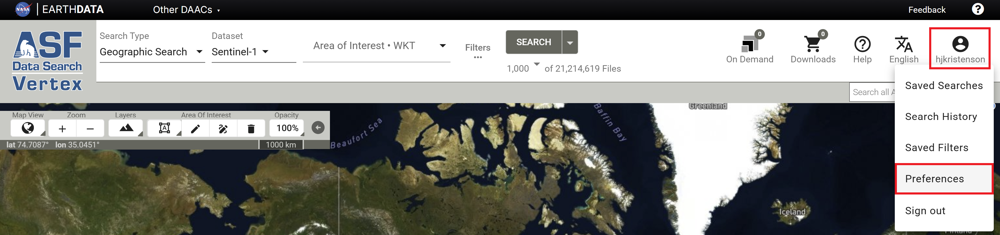
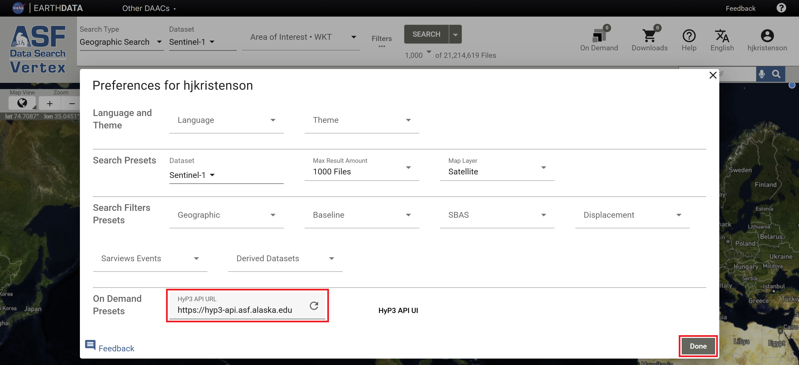

# On Demand Sentinel-1 Processing in Vertex

The Alaska Satellite Facility offers 
[On Demand processing of Sentinel-1 datasets to Radiometric Terrain Correction (RTC) or Interferometric SAR (InSAR) products through Vertex](https://search.asf.alaska.edu/#/?topic=onDemand "Vertex On Demand Documentation" ){target=_blank}, 
ASF's Data Search web portal. You can submit scenes to be processed into higher-level products, avoiding the 
cost and complexity of performing such processing yourself.

{target=_blank}

On Demand products are generated using ASF's 
[HyP3 processing platform](../about.md "Jump to the HyP3 landing page of this documentation"). Refer to the
[Products](../products.md "Jump to the Products page of the documentation") page for more information about the 
various On Demand products ASF offers. 

## Getting Started

To request On Demand products, visit 
[ASF Data Search - Vertex](https://search.asf.alaska.edu "https://search.asf.alaska.edu" ){target=_blank} 
and [Sign In with your Earthdata Login credentials](authentication.md#authentication-in-vertex).

### 0. (Optional) Select your HyP3

Vertex supports requesting On Demand products through both [HyP3 Basic (default)](../about/hyp3_basic.md) and [HyP3+](../about/hyp3_plus.md)
by changing the HyP3 API URL. To change the HyP3 API in Vertex:

1. Click on your username icon and select **Preferences**.
   
2. Enter your desired HyP3 API URL in the **HyP3 API URL** field.
   
       - HyP3 Basic: <https://hyp3-api.asf.alaska.edu>
       - HyP3+: <https://hyp3-plus.asf.alaska.edu>
       - URLs that are entered in this field will be available as a drop-down menu item for future use.
3. Click **Done** to exit the Preferences page.

### 1. Select your scenes

RTC processing is available for Sentinel-1 GRD-H and SLC scenes acquired using the 
[Interferometric Wide Swath (IW)](https://sentiwiki.copernicus.eu/web/s1-products "https://sentiwiki.copernicus.eu/web/s1-products" ){target=_blank} mode. 
InSAR processing requires pairs of IW SLC scenes or bursts. 

Use the [**Geographic Search**](https://docs.asf.alaska.edu/vertex/manual/ "https://docs.asf.alaska.edu/vertex/manual/" ){target=_blank} 
in Vertex to find individual scenes to submit for RTC processing, or to find reference scenes to use for generating 
InSAR pairs. 

 - For InSAR, once 
   you find a reference scene or burst, use either the 
   [Baseline](https://docs.asf.alaska.edu/vertex/baseline/ "Vertex Baseline Documentation" ){target=_blank} 
   or [SBAS](https://docs.asf.alaska.edu/vertex/sbas/ "Vertex SBAS Documentation" ){target=_blank} 
   Search to find SLC pairs to submit for processing. 
 - For burst-based InSAR processing, search for the **Sentinel-1 Bursts** Dataset instead of **Sentinel-1**.
 - To process ARIA S1 GUNW products On Demand, search for the **ARIA S1 GUNW Dataset** instead of **Sentinel-1**, 
   and [activate the On Demand toggle to view the ARIA Frames](../guides/gunw_product_guide.md#aria-frame-id-maps "Jump to the ARIA S1 GUNW Product Guide").

Click the **On Demand icon**
 
displayed next to valid source granules or pairs to select the job type and add them to the On Demand queue.

### 2. Submit your request

After selecting your scenes, access the **On Demand Queue** 
 
to submit your processing requests. There is a separate tab for each job type, which displays available processing 
options.

When you submit jobs for processing, you will have the option to add a Project Name, which makes it easier to search 
for and manage your On Demand products. 

If you have multiple job types in your queue, you can choose which job types to submit for processing under that 
project name. If you deselect any of the job types, they will remain in your queue, but will not be 
submitted for processing.

You may process jobs worth up to a total of {{ CREDITS_PER_MONTH }} 
credits per month. See our [Credits](./credits.md "Jump to the Credits page of this documentation") 
page for more details.

### 3. Monitor your request
The [**On Demand Products**](https://docs.asf.alaska.edu/vertex/manual/#on-demand-products-search-options "Vertex Manual: On Demand Search Options" ){target=_blank} 
Search Type displays your running and completed requests. New requests are typically available for download 
within an hour or two, but wait time will depend on processing load and product type.

### 4. Download your data 
Once On Demand products have been processed, download options will be available in the results of an 
**On Demand Products** search. Products can be downloaded individually through your browser 
 
or by adding them to the **Download Queue** 
.

 - Refer to the
   [Downloads](./downloading.md#on-demand-search-in-vertex "Jump to the On Demand Search in Vertex section of the Downloads page") 
   page for more information about download options. 
 - On Demand products are retained and available to download for two weeks (14 days) after processing.

## Tutorials

Refer to our
[StoryMap Tutorials](https://asf-daac.maps.arcgis.com/home/index.html "https://asf-daac.maps.arcgis.com/home/index.html" ){target=_blank} 
for step-by-step guidance on submitting, downloading, and working with many of the different On Demand products 
available from ASF.

{target=_blank}
