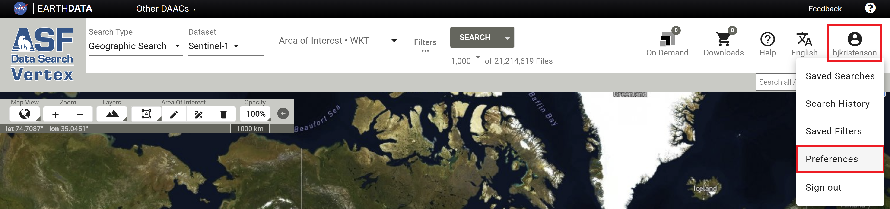
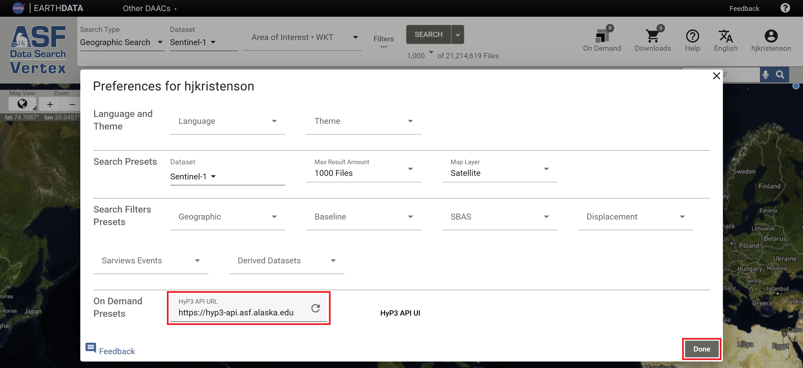

# On Demand Sentinel-1 Processing in Vertex

The Alaska Satellite Facility offers 
[On Demand processing of Sentinel-1 datasets to Radiometric Terrain Correction (RTC) or Interferometric SAR (InSAR) products through Vertex](https://search.asf.alaska.edu/#/?topic=onDemand "Vertex On Demand Documentation" ){target=_blank}, 
ASF's Data Search web portal. You can submit scenes to be processed into higher-level products, avoiding the 
cost and complexity of performing such processing yourself.

On Demand products are generated using ASF's 
[HyP3 processing platform](../about.md "HyP3 Documentation"). Refer to the
[Products](../products.md "Products Documentation") page for more information about the 
various On Demand products ASF offers. 

ASF offers free processing using the [HyP3 Basic](../about/hyp3_basic.md "HyP3 Basic Documentation") platform, 
but for users who need to process more
[On Demand products](../products.md "Products Documentation") than their
[HyP3 Basic credit limit](../using/credits.md "Credits Documentation")
allows, ASF provides [HyP3+](../about/hyp3_plus.md "HyP3+ Documentation"), a separate
[HyP3 deployment](../about.md) where users can purchase additional credits.

## Vertex Deployments

There are two different versions of Vertex that users can leverage, depending on which HyP3 
deployment they are using. 

### Vertex

Users ordering On Demand products leveraging the standard [HyP3 Basic](../about/hyp3_basic.md "HyP3 Basic Documentation") 
deployment can search for, order, and access On Demand products using ASF's standard 
[Vertex](https://search.asf.alaska.edu/ "https://search.asf.alaska.edu" ){target=_blank} Data Search interface. 

{target=_blank}

### Vertex+

[HyP3+](../about/hyp3_plus.md "HyP3+ Documentation") users can leverage 
[Vertex+](https://vertex-plus.asf.alaska.edu/ "https://vertex-plus.asf.alaska.edu" ){target=_blank}, 
which is optimized for use with the [HyP3+](../about/hyp3_plus.md "HyP3+ Documentation") deployment. 

{target=_blank}

## Getting Started

In either version of Vertex, you will need to 
[Sign In with your Earthdata Login](authentication.md#authentication-in-vertex "Authentication in Vertex Documentation") 
credentials in order to order or access On Demand jobs.

### 1. Select your scenes

RTC processing is available for Sentinel-1 GRD-H and SLC scenes acquired using the 
[Interferometric Wide Swath (IW)](https://sentiwiki.copernicus.eu/web/s1-products "https://sentiwiki.copernicus.eu/web/s1-products" ){target=_blank} mode. 
InSAR processing requires pairs of IW SLC scenes or bursts. 

Use the [**Geographic Search**](https://docs.asf.alaska.edu/vertex/manual/ "https://docs.asf.alaska.edu/vertex/manual/" ){target=_blank} 
in Vertex to find individual scenes to submit for [RTC](../guides/rtc_product_guide.md "Sentinel-1 RTC Product Guide") processing, 
or to find reference scenes to use for generating InSAR pairs. 

 - For full-scene [Sentinel-1 InSAR](../guides/insar_product_guide.md "Sentinel-1 InSAR Product Guide"), once 
   you find a reference scene using a Geographic Search for the **Sentinel-1** Dataset, use either the 
   [Baseline](https://docs.asf.alaska.edu/vertex/baseline/ "Vertex Baseline Documentation" ){target=_blank} 
   or [SBAS](https://docs.asf.alaska.edu/vertex/sbas/ "Vertex SBAS Documentation" ){target=_blank} 
   Search to find SLC pairs to submit for processing. 
 - For [Burst-based InSAR](../guides/burst_insar_product_guide.md "Sentinel-1 Burst InSAR Product Guide") 
   processing, search for the **Sentinel-1 Bursts** Dataset instead of Sentinel-1 to find reference images to 
   use with the 
   [Baseline](https://docs.asf.alaska.edu/vertex/baseline/ "Vertex Baseline Documentation" ){target=_blank} 
   or [SBAS](https://docs.asf.alaska.edu/vertex/sbas/ "Vertex SBAS Documentation" ){target=_blank} tools.
 - To process [ARIA S1 GUNW](../guides/gunw_product_guide.md "ARIA Sentinel-1 GUNW Product Guide") 
   products On Demand, search for the **ARIA S1 GUNW** Dataset instead of Sentinel-1, 
   and [activate the On Demand toggle to view the ARIA Frames](../guides/gunw_product_guide.md#ordering-on-demand-products "ARIA S1 GUNW Product Guide: Ordering On Demand Products") to select a reference frame for building a frame-based SBAS stack.

Click the **On Demand icon**
 
displayed next to valid source granules or pairs to select the job type and add them to the On Demand queue.

### 2. Submit your request

After selecting your scenes, access the **On Demand Queue** 
 
to submit your processing requests. There is a separate tab for each job type, which displays available processing 
options.

When you submit jobs for processing, you will have the option to add a Project Name, which makes it easier to search 
for and manage your On Demand products. 

If you have multiple job types in your queue, you can choose which job types to submit for processing under that 
project name. If you deselect any of the job types, they will remain in your queue, but will not be 
submitted for processing.

You may process jobs worth up to a total of {{ CREDITS_PER_MONTH }} 
credits per month. See our [Credits](./credits.md "Credits Documentation") 
page for more details.

### 3. Monitor your request
The [**On Demand Products**](https://docs.asf.alaska.edu/vertex/manual/#on-demand-products-search-options "Vertex Manual: On Demand Search Options" ){target=_blank} 
Search Type displays your running and completed requests. New requests are typically available for download 
within an hour or two, but wait time will depend on processing load and product type.

### 4. Download your data 
Once On Demand products have been processed, download options will be available in the results of an 
**On Demand Products** search. Products can be downloaded individually through your browser 
 
or by adding them to the **Download Queue** 
.

 - Refer to the
   [Downloads](./downloading.md#on-demand-search-in-vertex "Downloading: On Demand Search in Vertex") 
   page for more information about download options. 
 - On Demand products are retained and available to download for two weeks (14 days) after processing.

## Tutorials

Refer to our
[StoryMap Tutorials](https://asf-daac.maps.arcgis.com/home/index.html "https://asf-daac.maps.arcgis.com/home/index.html" ){target=_blank} 
for step-by-step guidance on submitting, downloading, and working with many of the different On Demand products 
available from ASF.

{target=_blank}

## HyP3 API Endpoints

[HyP3 Basic](../about/hyp3_basic.md "About HyP3 Basic") and [HyP3+](../about/hyp3_plus.md "About HyP3+") use 
different API URL endpoints. 

In general, it is more straightforward to use [Vertex](https://search.asf.alaska.edu "https://search.asf.alaska.edu" ){target=_blank} 
to interact with [HyP3 Basic](../about/hyp3_basic.md "About HyP3 Basic") and [Vertex+](https://vertex-plus.asf.alaska.edu/ "https://vertex-plus.asf.alaska.edu" ){target=_blank} to interact 
with [HyP3+](../about/hyp3_plus.md "About HyP3+"). If you use this approach, you don't have to adjust the HyP3 API URL settings at all, as they are set to 
point to the appropriate endpoint.

Users *can* use the same Vertex interface (either Vertex or Vertex+) to access both HyP3 deployments if they prefer. 
To do so, they will need to manually change the HyP3 API URL Endpoint to point to the desired HyP3 deployment.

To change the HyP3 API URL in Vertex or Vertex+:

1. Click on your username icon and select **Preferences**.
   
2. Enter your desired HyP3 API URL in the **HyP3 API URL** field.
   
       - HyP3 Basic: <https://hyp3-api.asf.alaska.edu>{target=_blank}
       - HyP3+: <https://hyp3-plus.asf.alaska.edu>{target=_blank}
       - URLs that are entered in this field will be available as a drop-down menu item for future use.
3. Click **Done** to exit the Preferences page.
