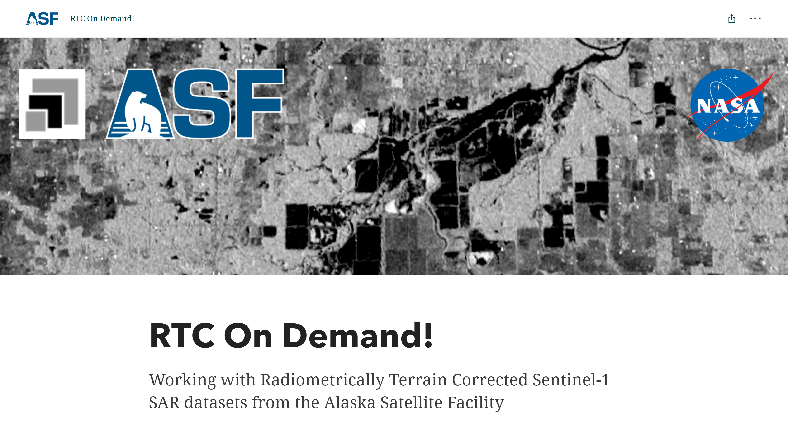

# On Demand Sentinel-1 Processing in Vertex

The Alaska Satellite Facility offers On Demand processing of Sentinel-1 datasets to Radiometric Terrain Correction (RTC) or Interferometric SAR (InSAR) products through [ASF Data Search - Vertex](https://search.asf.alaska.edu/#/?topic=onDemand "Vertex On Demand Documentation" ){target=blank}.  You can submit scenes to be processed into higher-level products, avoiding the cost and complexity of performing such processing yourself.

{target=blank}

On Demand Sentinel-1 products are generated using ASF's HyP3 processing platform, leveraging GAMMA Software. Products are distributed as UTM-projected GeoTIFFs. To learn more, visit the [ASF Sentinel-1 RTC Product Guide](https://asf.alaska.edu/wp-content/uploads/2019/02/Sentinel_RTC_Users_Guide.pdf).

## Getting Started

To request On Demand products, visit [ASF Data Search - Vertex](https://search.asf.alaska.edu).

1. **Select your scenes** - RTC processing is available for Sentinel-1 GRD-H and SLC scenes with a beam mode of IW. InSAR processing requires pairs of IW SLC scenes. Use the Geographic Search in Vertex to find individual scenes to submit for RTC processing, or reference scenes to use for generating InSAR pairs. For InSAR, once you find a reference scene, use either the Baseline or SBAS Search to find scene pairs to submit for processing. 

2. **Submit your request** - After selecting your scenes, access the  *On Demand*  queue to submit your processing request. You may process up to 200 scenes per month.

3. **Monitor your request** - The *On Demand Products* search type displays your running and completed requests. New requests are typically available for download within an hour, but wait time will depend on processing load.

4. **Download your data** - Finished On Demand products can be downloaded after an *On Demand Products* search either directly  or via your download queue . On Demand products are retained and available to download for two weeks after processing.

## Tutorials

Refer to our step-by-step tutorials for ordering and accessing [RTC](https://storymaps.arcgis.com/stories/2ead3222d2294d1fae1d11d3f98d7c35 "RTC On Demand Story Map" ){target=blank} and [InSAR](https://storymaps.arcgis.com/stories/68a8a3253900411185ae9eb6bb5283d3 "InSAR On Demand Story Map" ){target=blank} products in Vertex.

{target=blank} 
{target=blank}

