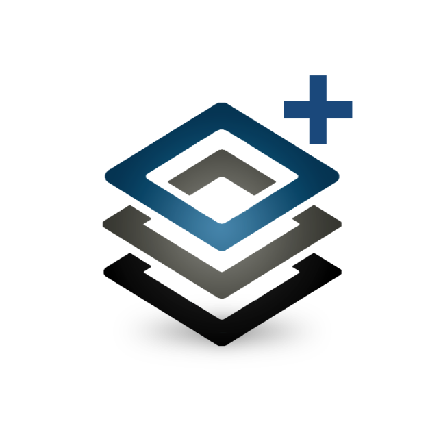

# What's New

## Nov 26, 2025

**Effective December 1st, monthly credit allotments for ASF’s HyP3 On Demand processing service will be reduced to 8,000
credits per user per month.** Due to NASA budget reductions, we have had to reduce our On Demand processing capacity,
and can no longer support the same volume of product generation as we have in the past.

ASF's HyP3 has generated over 12 million analysis-ready Sentinel-1 products since its public debut in October 2020, made
possible through generous funding from NASA. We now generate about half a million products a month on behalf of more
than 1,000 users.

We remain committed to our mission of making remote sensing data accessible. We will continue to balance processing
demand against our available budget and adjust quotas as necessary to ensure that we can support as many users as
possible.

If you are impacted by this reduction in processing capacity, consider these alternatives:

For Sentinel-1 InSAR applications:

- Consider using our [Burst InSAR](https://hyp3-docs.asf.alaska.edu/guides/burst_insar_product_guide/) workflows.
  These allow generation of interferograms over a smaller geographic area than a full Sentinel-1 SLC, with a
  corresponding reduction in the number of processing credits required for a full InSAR time series analysis.
- Consider requesting interferograms at a coarser resolution (20x4 looks), which consumes fewer processing credits than
  finer resolutions (10x2 or 5x1 looks).
- [ARIA Geocoded Unwrapped Interferograms](https://hyp3-docs.asf.alaska.edu/guides/gunw_product_guide/) (GUNW) are
  archived and available for many tectonically active regions, potentially eliminating the need for on-demand
  processing.

For Sentinel-1 RTC applications:

- Consider the [OPERA RTC-S1](https://storymaps.arcgis.com/stories/dc2807b444924fc3a76c117a2c909f8b "OPERA Sentinel-1 RTC StoryMap Tutorial" ){target=_blank} 
  dataset available through ASF. This data product includes near-global coverage from 2016 to present at 30-m pixel 
  spacing, potentially eliminating the need for on-demand processing.
- For applications requiring a finer resolution, consider requesting On Demand RTC products with
  [20-m pixel spacing](https://hyp3-docs.asf.alaska.edu/guides/rtc_product_guide/#pixel-spacing), which consumes fewer
  processing credits than 10-m pixel spacing while still providing much more detail than 30-m products.

For applications requiring more than 8,000 credits worth of processing each month:

- Consider ASF’s recently-launched [HyP3+](https://hyp3-docs.asf.alaska.edu/about/hyp3_plus/) service, which allows
  users to purchase additional processing credits.

If you have questions or concerns about this change, please email [uso@asf.alaska.edu](mailto:uso@asf.alaska.edu).

## Oct 20, 2025

!!! tip "HyP3+ is now available!"
 
    { width="100";  style="float: left;" }

    For users who need more processing than the 10,000 credit limit allows, ASF now hosts 
    [HyP3+](about/hyp3_plus.md "Jump to the HyP3+ Landing Page"), a user-supported 
    version of HyP3 that allows you to purchase as many credits as you need. 

    [Get to know HyP3+!](news/hyp3_plus_introduction.md "Jump to the HyP3+ Introduction")
